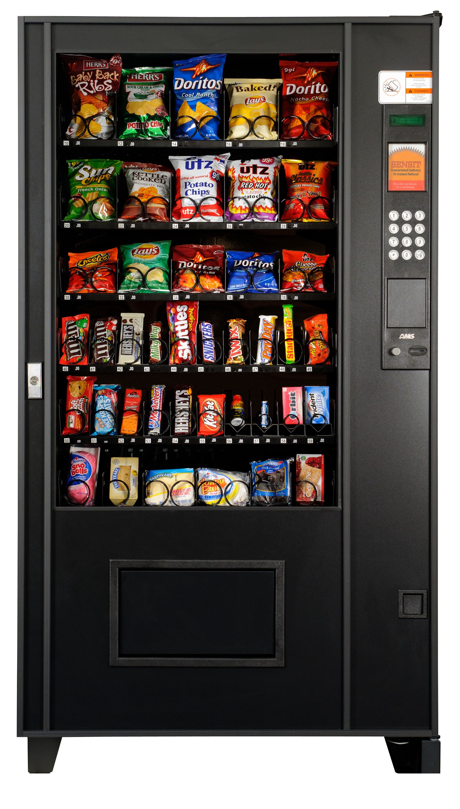

# Máster en Programación FullStack con JavaScript y Node.js
### JS, Node.js, Frontend, Backend, Firebase, Express, Patrones, HTML5_APIs, Asincronía, Websockets, Testing

## Clase 11

### Ejercicios



**Práctica 1** - Diseña un script para gestionar por consola una máquina expendedora

Características:
- Solo los usuarios registrados pueden usar la máquina
- El sistema funciona sin dinero real, en su lugar se usa un sistema de puntos
- Los usuarios disponen de unos puntos para gastar en la máquina que el departamento de personal asigna.
- La maquina no concederá creditos, solo trabaja en base a los puntos disponibles.
- Para agilizar la reposición de lo consumido... la maquina debe controlar en stock

**Paso 1** - Creamos los primeros objetos básicos:
- Maquina Expendedora (Objeto)
- Productos (Array)
- Clientes (Array)

```javascript
	// Máquina expendedora:
	var maquinaExpendedora = {};
	
	// Demo Producto:
	var productos = [];
	
	// Demo Cliente:
	var clientes = [];
```

**Paso 2** - Creamos los primeros perfiles en el Array de clientes:
- Propiedades:
    - Nombre
    - Usuario
    - Contraseña
    - Tipo usuario
    - Presupuesto

```javascript
    // Máquina expendedora:
    var maquinaExpendedora = {};
    
    // Demo Producto:
    var productos = [];
    
    // Demo Cliente:

    var clientes = [{
        // admin
        nombre: "Ulises Gascón",
        usuario: "ulises",
        contraseña: "pass",
        tipo: "admin",
        presupuesto: "1000",
        gasto: []
    }, {
        nombre: "Carlos Perez",
        usuario: "cPerez",
        contraseña: "pass2",
        tipo: "usuario",
        presupuesto: "100",
        gasto: []
    }];
```

**Paso 3** - Creamos varios métodos para gestionar a los clientes y sus necesidades

- Metodos:
    - Consultar saldo de un cliente
        - Devolverá el saldo existente o *-1* en caso de error
        - Comprobaremos la contraseña y el usuario
    - Consultar gastos de un cliente
        - Devolverá un array o *false* en caso de error
        - Comprobaremos la contraseña y el usuario
    - Agregar un cliente
    - Eliminar un cliente

- Caracteristicas:
    - Evitaremos que se registren usuarios que ya existan
    - Evitaremos eliminar usuarios que no existan
    - Evitaremos dar de alta usuarios que no esten debidamente cumplimentados
    - Protegeremos las funciones de gestión de usuarios con la contraseña *ficticiaMola*

```javascript
	// Tu solución
```

**Paso 4** - Creamos varios métodos para gestionar a los productos y sus necesidades

- Creamos 5 productos que estarán disponibles a la venta 

- Métodos:
    - Consumir un producto (cliente)
        - Comprobaremos la contraseña y el usuario
        - Devolverá el producto o *-1* en caso de no existir o estar agotado
        - Actualizaremos el stock
        - Actualizaremos el saldo del cliente
    - Agregar un producto a la máquina (administración)
    - Eliminar un prodcutos de la máquina (administración)

- Caracteristicas:
    - Evitaremos agregar productos que ya existan
    - Evitaremos eliminar productos que no existan
    - Evitaremos agregar productos que no esten debidamente cumplimentados
    - Protegeremos las funciones de agregar y eliminar productos con la contraseña *ficticiaMola*

```javascript
	// Tu solución	// Tu solución
```

**Paso 5** - (`Nivel Medio` :spades:) Ahora podemos agregar los métodos para agregar, retirar y resetear saldo de los usuarios.

- Importante:
	- Los saldos jamas pueden ser negativos.

```javascript
	// Tu solución
```

**Paso 6** - (`Nivel Avanzado` :diamonds:) Ahora podemos agregar el método para saber la disponibilidad de stock

- Importante:
	- Es necesaria clave (adminsitrador)
	- Debemos saber las existencias
	- Debemos saber que productos estan disponibles y cuales no.
	- Debemos incluir el código y el nombre
	- Cuando se imprima el informe... es necesario incluir la fecha.

```javascript
/*
----
Ejemplo de Informe
----

************************
En total tenemos 6 productos
----------------------------
Nombre: Risketos
Código: C1
Stock: 100
Disponibilidad: true
----------------------------
Nombre: KitKat
Código: C2
Stock: 4
Disponibilidad: true
----------------------------
Nombre: Chicles Orbit
Código: C3
Stock: 6
Disponibilidad: true
----------------------------
Nombre: Pipas Solero
Código: C4
Stock: 1
Disponibilidad: true
----------------------------
Nombre: Demonios de Fresa
Código: C5
Stock: 10
Disponibilidad: true
----------------------------
Nombre: Chetos
Código: C6
Stock: 5
Disponibilidad: true
************************

 */
```

```javascript
	// Tu solución
```

