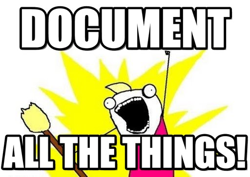
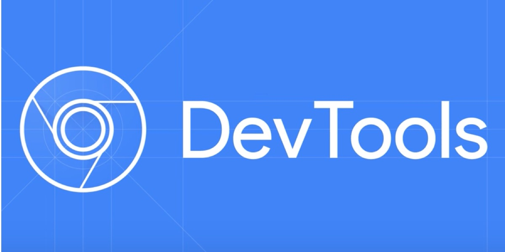

# Máster en Programación FullStack con JavaScript y Node.js
### JS, Node.js, Frontend, Backend, Firebase, Express, Patrones, HTML5_APIs, Asincronía, Websockets, Testing

## Clase 19

### JSDocs



```javascript

/** @namespace */
var app = {};

/**
 * Resuelve la división de a/b
 * @example
 * // retorna 3
 * globalNS.metodo(5, 15);
 * @returns {Number} Retorna el resultado de la operación.
 */
app.metodo = function (a, b) {
    return b / a;
};
```
**Recursos**
- [Jsdoc cheatsheet](https://devhints.io/jsdoc)
- [Documentación oficial](http://usejsdoc.org/tags-example.html)
- [Speaking JavaScript (Axel Rauschmayer) - Chapter 29. JSDoc: Generating API Documentation](http://speakingjs.com/es5/ch29.html)

### Otras herramientas de documentación
- [swagger](https://swagger.io/)
- [jGrouseDoc](http://jster.net/library/jgrousedoc)
- [YUIDoc](http://yui.github.io/yuidoc/)
- [DOCCO](http://ashkenas.com/docco/)

### Guías de estilo

- [idiomatic.js](https://github.com/rwaldron/idiomatic.js/)
- [MDN Coding style](https://developer.mozilla.org/en-US/docs/Mozilla/Developer_guide/Coding_Style#JavaScript_practices)
- [Airbnb JavaScript Style Guide](https://github.com/airbnb/javascript)
- [Google JavaScript Style Guide](https://google.github.io/styleguide/javascriptguide.xml)


> Todo el código en cualquier proyecto debería verse como si una sola persona lo hubiera escrito, sin importar cuánta gente haya contribuído. 
> Idiomatic.js

Desventajas:
- Adopción total del equipo
- Curva de aprendizaje
- Falta de plugins

### Versionamiento Semántico (Semver)


[semver](http://semver.org/lang/es/)


### Rendimiento
- [jsPerf](http://jsperf.com/)
- [benchmark.js](http://benchmarkjs.com/)


### Recursos

- [JS The Right Way](http://jstherightway.org/)
- [JavaScript Clean Coding Best Practices - Node.js at Scale](https://blog.risingstack.com/javascript-clean-coding-best-practices-node-js-at-scale/)
- [Clean Code JavaScript in CSS-TRICKS](https://css-tricks.com/clean-code-javascript/)
- [JavaScript Best Practices](https://www.devbridge.com/articles/javascript-best-practices/)
- [Untangling Spaghetti Code: How to Write Maintainable JavaScript](https://www.sitepoint.com/write-maintainable-javascript/)
- [Uncle Bob’s Clean Code: Irrelevant in the Age of Full-Stack JavaScript?](https://spin.atomicobject.com/2016/12/21/clean-code-full-stack-javascript/)


### Analizar la calidad de tu código
- [Code Climate](https://codeclimate.com/)
- [deepscan.io](https://deepscan.io/home/)
- [codebeat.co](https://codebeat.co/)
- [codacy](https://www.codacy.com/)

### ChromeDevTools: Avanzado



- [:tv: Chrome DevTools 101: Debugging JavaScript](https://www.youtube.com/watch?v=H0XScE08hy8)
- [:tv: Debugging The Web (Chrome Dev Summit 2016)](https://www.youtube.com/watch?v=HF1luRD4Qmk)
- [:tv: Debugging JavaScript - Beginner to Advanced in One Video](https://www.youtube.com/watch?v=-q1z8BPFItw)
- [:tv: Mastering Chrome Developer Tools with Jon Kuperman](https://www.youtube.com/watch?v=ZRr9X-rD3Hc)
- [:tv: Effective Browser JavaScript Debugging](https://www.youtube.com/watch?v=upp0xded4as)
- [:tv: Chrome DevTools Masterclass](https://www.youtube.com/watch?v=KykP5Z5E4kA)
- [:tv: Fast By Default: Modern Loading Best Practices (Chrome Dev Summit 2017)](https://www.youtube.com/watch?v=_srJ7eHS3IM)
- [:tv: Debugging your website with Fiddler and Chrome Developer tools - Robert Boedigheimer](https://www.youtube.com/watch?v=QxKHi1wFBfc)
- [:tv: Debugging The Web](https://www.youtube.com/watch?v=HF1luRD4Qmk)
- [:tv: Become a Javascript Console Power-User](https://www.youtube.com/watch?v=4mf_yNLlgic)
- [:page_facing_up: Comenzar a depurar JavaScript en Chrome DevTools](https://developers.google.com/web/tools/chrome-devtools/javascript/)
- [:page_facing_up: JavaScript Debugging Reference](https://developers.google.com/web/tools/chrome-devtools/javascript/reference)
- [:page_facing_up: Pause Your Code With Breakpoints](https://developers.google.com/web/tools/chrome-devtools/javascript/breakpoints)


### Tiempo para proyecto personal y terminar ejercicios pendientes!

*nota: Si vas muy bien de tiempo, puedes meter estilos y más dinamismo al proyecto: Github | Social Network Project*


