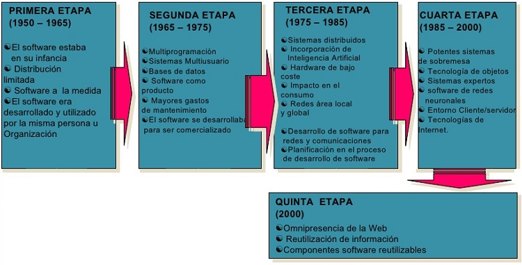
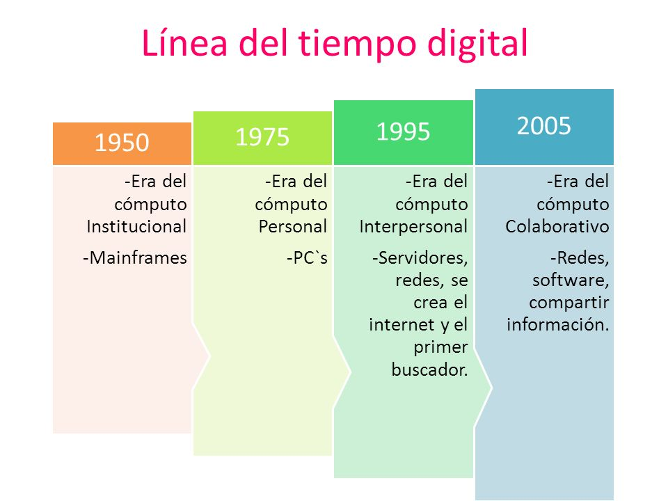
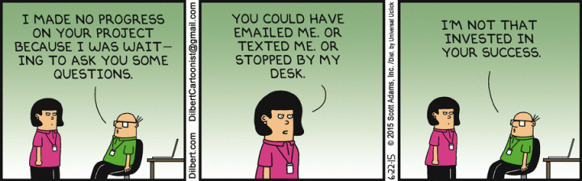

# Máster en Programación FullStack con JavaScript y Node.js
### JS, Node.js, Frontend, Backend, Firebase, Express, Patrones, HTML5_APIs, Asincronía, Websockets, Testing

## Clase 32

### Ya es 2019!!

### Importante

- [ ] Soluciones subidas hasta clase 29
- [ ] Quedan PRs pendientes de revisar... ¡Agrupemos!
- [ ] ¿Qué tal van vuestros nuevos proyectos?
- [ ] ¡Salvemos Memezinga!
- [ ] Reto: Hack The Box
- [ ] Próximos temas y clases...

### Antipatrones

**Recursos**
- [Wikipedia | Antipatrón de diseño](https://es.wikipedia.org/wiki/Antipatr%C3%B3n_de_dise%C3%B1o)
- [Wikipedia | Crisis del software](https://es.wikipedia.org/wiki/Crisis_del_software)
- [Wikipedia | No hay balas de plata](https://es.wikipedia.org/wiki/No_hay_balas_de_plata)
- [Wikipedia | Code Smell (Hediondez del código)](https://es.wikipedia.org/wiki/Hediondez_del_c%C3%B3digo)
- [Anti-patrones: la mejor forma de hacer un pésimo sistema de software](https://sg.com.mx/revista/11/anti-patrones-la-mejor-forma-hacer-un-pesimo-sistema-software)
- [Antipatrones I: Antipatrones de gestión](https://unpocodejava.com/2012/02/27/antipatrones-i-antipatrones-de-gestion/)
- [Antipatrones II: Antipatrones de gestión de proyectos](https://unpocodejava.com/2012/02/28/antipatrones-ii-antipatrones-de-gestion-de-proyectos/)
- [Antipatrones III: Antipatrones generales de diseño de software](https://unpocodejava.com/2012/02/29/antipatrones-iii-antipatrones-generales-de-diseno-de-software/)

### Antipatrones: Cuando las cosas salen mal...

**La destrucción del Mariner I (1962). 18,5 millones de dólares**
> El del Mariner I, una sonda espacial que se dirigía a Venus, se desvió de la trayectoria de vuelo prevista poco después del lanzamiento. Desde control se destruyó la sonda a los 293 segundos del despegue. La causa fue una fórmula manuscrita que se programó incorrectamente. [El blog de Javier Garzas](http://www.javiergarzas.com/2013/05/top-7-de-errores-informaticos.html)

**La catástrofe del Hartford Coliseum (1978). 70 millones de dólares**
> Apenas unas horas después de que miles de aficionados abandonaron el Hartford Coliseum, el techo se derrumbó por el peso de la nieve. La causa: calculo incorrecto introducido en el software CAD utilizado para diseñar el coliseo. [El blog de Javier Garzas](http://www.javiergarzas.com/2013/05/top-7-de-errores-informaticos.html)

**El gusano de Morris (1988). 100 millones de dólares**
> El estudiante de posgrado Robert Tappan Morris fue condenado por el primer ataque con “gusanos” a gran escala en Internet. Los costos de limpiar el desastre se cifran en 100 millones de dólares. Morris, es hoy profesor en MIT. [El blog de Javier Garzas](http://www.javiergarzas.com/2013/05/top-7-de-errores-informaticos.html)

**Error de cálculo de Intel (1994). 475 millones de dólares**
> Un profesor de matemáticas descubrió y difundió que había un fallo en el procesador Pentium de Intel. La sustitución de chips costó a Intel 475 millones. [El blog de Javier Garzas](http://www.javiergarzas.com/2013/05/top-7-de-errores-informaticos.html)

**Explosión del cohete Arian (1996). 500 millones de dólares**
> En el 1996, el cohete Ariane 5 de la Agencia Espacial Europea estalló. El Ariane explotó porque un número real de 64 bits (coma flotante) relacionado con la velocidad se convirtió en un entero de 16 bits. [El blog de Javier Garzas](http://www.javiergarzas.com/2013/05/top-7-de-errores-informaticos.html)

**Mars Climate Orbiterm (1999). 655 millones de dólares**
> En 1999 los ingenieros de la NASA perdieron el contacto con la Mars Climate Orbiter en su intento que orbitase en Marte. La causa, un programa calculaba la distancia en unidades inglesas (pulgadas, pies y libras), mientras que otro utilizó unidades métricas. [El blog de Javier Garzas](http://www.javiergarzas.com/2013/05/top-7-de-errores-informaticos.html)

**El error en los frenos de los Toyota (2010). 3 billones de dólares**
> Toyota retiró más de 400.000 de sus vehículos híbridos en 2010, por un problema software, que provocaba un retraso en el sistema anti-bloqueo de frenos. Se estima entre sustituciones y demandas el error le costó a Toyota 3 billones de dólares. [El blog de Javier Garzas](http://www.javiergarzas.com/2013/05/top-7-de-errores-informaticos.html)

**Las migraciones por el año 2000. 296,7 billones de dólares**
> Se esperaba que el bug Y2K paralizase al mundo a la medianoche del 1 de enero 2000, ya que mucho software no había sido previsto para trabajar con el año 2000. El mundo no se acabó, pero se estima que se gastaron 296,7 billones de dólares para mitigar los daños. [El blog de Javier Garzas](http://www.javiergarzas.com/2013/05/top-7-de-errores-informaticos.html)

**En territorio nacional**
- [El Mundo | Un grave error en el web del Ministerio de Vivienda daba acceso a datos personales](http://www.elmundo.es/elmundo/2010/05/19/navegante/1274273564.html)
- [El Confidencial | La gran "chapuza" informática de LexNet en Justicia que ha costado más de 7 millones](https://www.elconfidencial.com/tecnologia/2017-07-28/lexnet-justicia-informatica-ciberseguridad-rafael-catala_1421916/)
- [Xakata | Qué ha pasado en LexNet y qué implicaciones tiene su grave fallo de seguridad](https://www.xataka.com/servicios/que-ha-pasado-en-lexnet-y-que-implicaciones-tiene-su-grave-fallo-de-seguridad)
- [Europa Press | Un fallo informático causa interrupciones en la red de Salud, Hacienda y Desarrollo Rural](http://www.europapress.es/navarra/noticia-fallo-informatico-causa-interrupciones-red-salud-hacienda-desarrollo-rural-20130218174736.html)

**Más articulos**
- [The RISKS Digest](http://catless.ncl.ac.uk/Risks/)
- [20 Minutos | Los 10 mas grandes errores de la Informática](https://listas.20minutos.es/lista/los-10-mas-grandes-errores-de-la-informatica-337766/)
- [RT | 10 errores informáticos que provocaron catástrofes](https://actualidad.rt.com/actualidad/view/138158-catastrofes-programacion-culpa-software-computadora)
- [20 desastres famosos relacionados con el software](https://www.variablenotfound.com/2008/11/20-desastres-famosos-relacionados-con.html)
- [Jaxenter | The top 10 catastrophes in the history of IT](https://jaxenter.com/top-10-catastrophes-history-113575.html)
- [OpenMind | 5 bugs informáticos que marcaron la historia](https://www.bbvaopenmind.com/5-bugs-informaticos-que-marcaron-la-historia/)

### Antipatrones: Repasando conceptos

**Ciclo de vida del Software**

**Historia de la ingeniería del software**
- [La era pionera](https://es.wikipedia.org/wiki/Historia_de_la_ingenier%C3%ADa_del_software#La_era_pionera)
- [De 1955 a 1965: Los orígenes](https://es.wikipedia.org/wiki/Historia_de_la_ingenier%C3%ADa_del_software#De_1955_a_1965:_Los_or%C3%ADgenes)
- [De 1965 a 1985: La crisis del software](https://es.wikipedia.org/wiki/Historia_de_la_ingenier%C3%ADa_del_software#De_1965_a_1985:_La_crisis_del_software)
- [De 1985 a 1989: No hay balas de plata](https://es.wikipedia.org/wiki/Historia_de_la_ingenier%C3%ADa_del_software#De_1985_a_1989:_No_hay_balas_de_plata)
- [De 1990 a 1999: Prominencia de Internet](https://es.wikipedia.org/wiki/Historia_de_la_ingenier%C3%ADa_del_software#De_1990_a_1999:_Prominencia_de_Internet)
- [De 2000 al presente: Metodologías ligeras](https://es.wikipedia.org/wiki/Historia_de_la_ingenier%C3%ADa_del_software#De_2000_al_presente:_Metodolog%C3%ADas_ligeras)

**La tecnología**

**Las claves de las etapas**

### Antipatrones: Gestión de proyectos
*:pushpin: Nota: Este es un resumen de la entrada en [Wikipedia](https://es.wikipedia.org/wiki/Antipatr%C3%B3n_de_dise%C3%B1o) sobre `Antipatrón de diseño`*

**[Humo y espejos (smoke and mirrors)](https://es.wikipedia.org/wiki/Humo_y_espejos)**
> Mostrar cómo será una funcionalidad antes de que esté implementada.

**Mala gestión (bad management)**
> Gestionar un proyecto sin tener suficientes conocimientos sobre la materia.

**[Software inflado (software bloat)](https://es.wikipedia.org/wiki/Software_inflado)**
> Permitir que las sucesivas versiones de un sistema exijan cada vez más recursos.

### Antipatrones: Diseño de software
*:pushpin: Nota: Este es un resumen de la entrada en [Wikipedia](https://es.wikipedia.org/wiki/Antipatr%C3%B3n_de_dise%C3%B1o) sobre `Antipatrón de diseño`*

**[Gran bola de lodo (big ball of mud)](https://es.wikipedia.org/wiki/Gran_bola_de_lodo)**
> Construir un sistema sin estructura definida.

**[Inversión de abstracción (abstraction inversion)](https://es.wikipedia.org/wiki/Inversi%C3%B3n_de_abstracci%C3%B3n)**
> No exponer las funcionalidades implementadas que los usuarios necesitan, forzando a que se reimplementen a más alto nivel.

**[Entrada chapuza (input kludge)](https://es.wikipedia.org/wiki/Entrada_chapuza)**
> No especificar e implementar el manejo de entradas inválidas.

**[Carrera de obstáculos (race hazard)](https://es.wikipedia.org/wiki/Carrera_de_obst%C3%A1culos)**
> Incapacidad de prever las consecuencias de diferentes sucesiones de eventos.

**[Botón mágico (magic pushbutton)](https://es.wikipedia.org/wiki/Magic_pushbutton)**
> Tender, desarrollando interfaces, a programar la lógica de negocio en los métodos de interacción, implementando los resultados de las acciones del usuario en términos no suficientemente abstractos.

**[Clase Gorda/Objeto todopoderoso](https://es.wikipedia.org/wiki/Objeto_todopoderoso)**
> Dotar a una clase/objeto con demasiados atributos y/o métodos, haciéndola responsable de la mayoría de la lógica de negocio.

**Objeto todopoderoso (god object)**
> Concentrar demasiada funcionalidad en una única parte del diseño (clase).

**[Acoplamiento secuencial (sequential coupling)](https://es.wikipedia.org/wiki/Acoplamiento_secuencial)**
> Construir una clase que necesita que sus métodos se invoquen en un orden determinado.

**Objeto sumidero (object cesspool)**
> Reutilizar objetos no adecuados realmente para el fin que se persigue.

**[Poltergeist](https://es.wikipedia.org/wiki/Poltergeist_(inform%C3%A1tica))**
> Emplear objetos cuyo único propósito es pasar la información a terceros objetos.

**YAFL (yet another fucking layer, y otra maldita capa más) o 'Código Lasagna'**
> Añadir capas innecesarias a un programa, biblioteca o framework.

### Antipatrones: Programación
*:pushpin: Nota: Este es un resumen de la entrada en [Wikipedia](https://es.wikipedia.org/wiki/Antipatr%C3%B3n_de_dise%C3%B1o) sobre `Antipatrón de diseño`*

**Nomenclatura heroica (heroic naming)**
> Identificar los miembros de un programa (interfaces, clases, propiedades, métodos...) con nombres que provocan que el conjunto aparente estandarización con la ingeniería del software pero que en realidad oculta una implementación anárquica.

**Acumular y disparar (accumulate and fire)**
> Establecer una colección de variables globales para ser usadas por un conjunto de subrutinas.

**Ancla del barco (boat anchor)**
> Retener partes del sistema que ya no tienen utilidad.

**[Complejidad no indispensable (accidental complexity)](https://es.wikipedia.org/wiki/Accidental_complexity)**
> Dotar de complejidad innecesaria a una solución.

**[Código espagueti (spaghetti code)](https://es.wikipedia.org/wiki/C%C3%B3digo_espagueti)**
> Construir sistemas cuya estructura es difícilmente comprensible, especialmente debido a la escasa utilización de estructuras de programación.

**Código ravioli (ravioli code)**
> Construir sistemas con multitud de objetos muy débilmente conectados.

**[Confianza ciega (blind faith)](https://es.wikipedia.org/wiki/Confianza_ciega)**
> Descuidar la comprobación de los resultados que produce una subrutina, o bien de la efectividad de un parche o solución a un problema.

**[Lava seca (lava flow)](https://es.wikipedia.org/wiki/Lava_flow)**
> Ocurre cuando un software es entregado antes de ser completado o antes de ser completamente probado y al ser expuesto, ya no es posible cambiar sus características, como cuando un flujo de lava se seca por fuera.

**Lógica super-booleana (superboolean logic)**
> Emplear comparaciones o abstracciones de la lógica booleana innecesarias.

**Momento del código (code momentum)**
> Establecer demasiadas restricciones sobre una parte del sistema debido a la asunción de muchas de sus propiedades desde otros lugares del propio sistema.

**Números mágicos (magic numbers)**
> Incluir en los algoritmos números concretos sin explicación aparente.

**Ocultación de errores (error hiding)**
> Capturar un error antes de que se muestre al usuario, y reemplazarlo por un mensaje sin importancia o ningún mensaje en absoluto.

### Antipatrones: Experiencia y Frameworks
*:pushpin: Nota: Este es un resumen de la entrada en [Wikipedia](https://es.wikipedia.org/wiki/Antipatr%C3%B3n_de_dise%C3%B1o) sobre `Antipatrón de diseño`*

**[Bala de plata (silver bullet)](https://es.wikipedia.org/wiki/Bala_de_plata)**
> Asumir que nuestra solución técnica favorita puede resolver un problema mucho mayor.

**Desarrollo conducido por quien prueba (tester driven development)**
> Permitir que un proyecto software avance a base de extraer sus nuevos requisitos de los informes de errores.

**Desfactorización (de-factoring)**
> Eliminar funcionalidad y reemplazarla con documentación.

**Factor de improbabilidad (improbability factor)**
> Asumir que es improbable que un error conocido cause verdaderos problemas.

**[Martillo de oro (golden hammer)](https://es.wikipedia.org/wiki/Martillo_de_oro)**
> Asumir que nuestra solución favorita es universalmente aplicable, haciendo bueno el refrán a un martillo, todo son clavos.

**[Optimización prematura (premature optimization)](https://es.wikipedia.org/wiki/Premature_optimization)**
> Realizar optimizaciones sin disponer de la información suficiente para hacerlo con garantías, sacrificando decisiones de diseño.

**Programación de copiar y pegar (copy and paste programming)**
> Programar copiando y modificando código existente en lugar de crear soluciones genéricas.

**Programación por permutación (programming by permutation)**
> Tratar de aproximarse a una solución modificando el código una y otra vez para ver si acaba por funcionar.

**[Reinventar la rueda (reinventing the wheel)](https://es.wikipedia.org/wiki/Reinventar_la_rueda)**
> Enfrentarse a las situaciones buscando soluciones desde cero, sin tener en cuenta otras que puedan existir ya para afrontar los mismos problemas.

**Reinventar la rueda cuadrada (reinventing the square wheel)**
> Crear una solución pobre cuando ya existe una buena.

### Antipatrones: Gestión de la configuración
*:pushpin: Nota: Este es un resumen de la entrada en [Wikipedia](https://es.wikipedia.org/wiki/Antipatr%C3%B3n_de_dise%C3%B1o) sobre `Antipatrón de diseño`*

**[Infierno de dependencias (dependency hell)](https://en.wikipedia.org/wiki/Dependency_hell)**
> Escenario de problemas producidos por las versiones de otros productos que se necesitan para hacer funcionar un tercero.

### Antipatrones: Gestión del equipo (Organiación/trabajo)
*:pushpin: Nota: Este es un resumen de la entrada en [Wikipedia](https://es.wikipedia.org/wiki/Antipatr%C3%B3n_de_dise%C3%B1o) sobre `Antipatrón de diseño`*

**[Alcance incremental (scope creep)](https://es.wikipedia.org/wiki/Scope_creep)**
> Permitir que el alcance de un proyecto crezca sin el control adecuado.

**Dependencia de proveedor (vendor lock-in)**
> Construir un sistema que dependa en exceso de un componente proporcionado por un tercero.

**Diseño en comité (design by committee)**
> Contar con muchas opiniones sobre un diseño, pero adolecer de falta de una visión unificada.

**Escalada de compromiso (escalation of commitment)**
> No ser capaz de revocar una decisión a la vista de que no ha sido acertada.

**Funcionalitis creciente (creeping featuritis)**
> Añadir nuevas funcionalidades al sistema en detrimento de su calidad.

**Gestión basada en números (management by numbers)**
> Prestar demasiada atención a criterios de gestión cuantitativos, cuando no son esenciales o difíciles de cumplir.

**Gestión de champiñones (mushroom management)**
> Tratar a los empleados sin miramientos, sin informarles de las decisiones que les afectan (manteniéndolos cubiertos y en la oscuridad, como los champiñones).

**Gestión porque lo digo yo (management by perkele)**
> Aplicar una gestión autoritaria con tolerancia nula ante las disensiones.

**Obsolescencia continua (continuous obsolescence)**
> Destinar desproporcionados esfuerzos a adaptar un sistema a nuevos entornos.

**Organización de cuerda de violín (violin string organization)**
> Mantener una organización afinada y en buen estado, pero sin ninguna flexibilidad.

**[Parálisis por análisis (analysis paralysis)](https://es.wikipedia.org/wiki/Analysis_paralysis)**
> Dedicar esfuerzos desproporcionados a la fase de análisis de un proyecto, eternizando el proceso de diseño iterando sobre la búsqueda de mejores soluciones o variantes.

**Peligro moral (moral hazard)**
> Aislar a quien ha tomado una decisión a raíz de las consecuencias de la misma.

**Sistema de cañerías (stovepipe)**
> Tener una organización estructurada de manera que favorece el flujo de información vertical, pero inhibe la comunicación horizontal.

**Te lo dije (I told you so)**
> Permitir que la atención se centre en que la desoída advertencia de un experto se ha demostrado justificada.

**Gallina de los huevos de oro (cash cow)**
> Pecar de autocomplacencia frente a nuevos productos por disponer de un producto legacy muy lucrativo.

### Antipatrones: Otros muchos clasicos...
*:pushpin: Nota: Este es un resumen de la entrada en [Wikipedia](https://es.wikipedia.org/wiki/Antipatr%C3%B3n_de_dise%C3%B1o) sobre `Antipatrón de diseño`*

**Arrojar al otro lado del muro (thrown over the wall)**
> Cuando un proyecto involucra a varios grupos de trabajo y va pasando secuencialmente de uno a otro, con escasa o nula comunicación entre ellos.

**Billete lobo (wolf ticket)**
> Declarar compatibilidad con un estándar cuando ésta no existe, o bien cuando el estándar solo incluye recomendaciones no obligatorias que, de hecho, no se siguen.

**Fiesta de los bocazas (Blowhard Jamboree)**
> Cuando se intenta que las decisiones técnicas del proyecto sean las basadas en opiniones de expertos publicadas en prensa.

**Callejón sin salida (dead end)**
> Encontrar un problema que impide continuar trabajando, pero la dirección no permite corregir el problema. El equipo queda estancado.

**Caminar por un campo de minas (walking through a mine field)**
> Trabajar con un componente pobremente probado (usualmente inestable), y por tanto poco confiable.

**Chivo expiatorio (scape goat)**
> Ante circunstancias de crisis en un proyecto se toma la decisión de dirigir las culpas a una persona o a un conjunto de personas concretas sin analizar si verdaderamente la naturaleza del problema se encuentra en las mismas.

**Codificación brutal**
> Presionar a los programadores a trabajar sobre una arquitectura sin diseñar y sin requisitos evidentes.

**Comité designado (appointed team)**
> Crear un comité o grupo de trabajo para resolver un problema y no ocuparse de lograr que el grupo funcione.

**Compensación equitativa (egalitarian compensation)**
> Compensar al personal por el trabajo individual hecho.

**[Contenedor mágico (magic container)](https://es.wikipedia.org/wiki/Contenedor_m%C3%A1gico)**
> La implementación de métodos que intentan ser tan flexibles como para adaptar su comportamiento a multitud de circunstancias, sobrepasando el umbral de una mantenibilidad adecuada del mismo.

**Culto al carguero (cargo cult)**
> Consiste en copiar ciertas prácticas que podrían ser consideradas (no siempre) buenas prácticas sin saber muy bien los beneficios o ventajas que proporcionan, provocando esfuerzo innecesario en el proyecto para incorporarlas o problemas.

**Cultura del miedo (fear culture))**
> Ambiente en el que cada empleado tiene miedo de mostrar el resultado de su trabajo por miedo a ser despedido por tener errores.

**Cultura del héroe (hero culture)**
> Se produce cuando una o pocas personas toman la responsabilidad del éxito de todo el equipo o proyecto, a menudo trabajando sobretiempo.

**Decisión aritmética (decision by arithmetic)**
> En lugar de intentar tomar una decisión con los datos disponibles y basado en el conocimiento y experiencia de nuestros colaboradores y el nuestro, se trata de justificar la misma sobre la base de unos factores presuntamente objetivos.

**Desarrollo marcado por las herramientas (autogenerated stovepipe)**
> Preferir una solución generada automáticamente sobre la mejor solución.

**Diseñar por diseñar (design for the sake of design)**
> Realizar un diseño excesivamente complejo sin necesidad real.

**Diseño con arquitectura impuesta (architecture as requirement)**
> Imponer que el diseño considere, obligatoriamente, el uso de herramientas o métodos no necesariamente idóneos.

**Diseñadores empíricos (architects don't code)**
> Incapacidad del grupo de diseño para evaluar la complejidad del objeto diseñado.

**El correo electrónico es peligroso (email is dangerous)**
> Peligro de olvidar que detrás de los emails recibidos hay personas de carne y hueso.

**El traje nuevo del emperador (emperor's new clothes)**
> Temor a señalar los defectos de un producto o proceso que un gerente o manager cree que funciona bien.

**El viejo gran duque de York (the grand old Duke of York)**
> Cuando los arquitectos o analistas no intervienen (uno o los dos), dejando a los programadores (especialistas en la implementación) prácticamente todas las decisiones a nivel e ejecución de las especificaciones del usuario.

**Ellos me entendieron (they understood me)**
> Explicar a programadores o diseñadores junior lo que se espera de ellos muy brevemente, y asumir que entendieron lo que se les pidió.

**Entrenar al entrenador (train the trainer)**
> Contratar una formación sin haber precisado con cierta exactitud la materia sobre la que se desea la misma. Esto puede provocar que la formación no se enfoque de manera adecuada, tratando aspectos que no son necesarios en el proyecto o dejando fuera aspectos fundamentales. Contratar una formación sin tener referencias del formador, ya que lo mismo su nivel de conocimiento no es el adecuado a la naturaleza de la formación a impartir.

**La disputa familiar (the feud)**
> Cuando existiendo un conflicto entre gestores de proyectos no se le busca una solución definitiva al mismo.

**La experiencia mata el diseño (architecture by implication)**
> Descuidar el diseño por confiar excesivamente en la experiencia previa.

**Los clientes son tontos (customers are idiots)**
> Pensar que uno sabe más que el cliente, y por tanto no es necesaria una investigación con el cliente.

**Maníaco del control (control freak)**
> El deseo de control lleva a la microgestión y ésta a su vez a una pérdida importante de la capacidad de autogestión del equipo, ya que todos los pasos se miden milimétricamente.

**[Máquina de Rube Goldberg (Rube Goldberg machine)](https://es.wikipedia.org/wiki/M%C3%A1quina_de_Rube_Goldberg)**
> Realizar implementaciones muy complejas para tareas sencillas.

**[Matar al mensajero (shoot the messenger)](https://es.wikipedia.org/wiki/Matar_al_mensajero)**
> El acto de culpar a una persona que trae malas noticias en vez del autor de las mismas.

**Mazorca de maíz (corn cob)**
> Mantener personas en el proyecto que resultan difíciles, conflictivas o que funcionan de manera absolutamente al margen de lo que es cualquier trabajo en equipo o de un comportamiento solidario y que rompen con la armonía del grupo.

**Mecanismos de recompensa discordantes (discordant reward mechanisms)**
> Un equipo recibe reconocimiento por ser el que más trabajo ejecuta sobre la base de criterios objetivos que no son válidos para medir el nivel de productividad o calidad.

**[Miedo al éxito (fear of success)](https://es.wikipedia.org/wiki/Fear_of_success)**
> Permitir que las únicas razones de que los trabajos no se completen sean de índole social.

**Morir planificando (death by planning)**
> Invertir más esfuerzo (y tiempo) del necesario para establecer un plan que después puede ser destruido por las propias contingencias del proceso de desarrollo, o cuando no se es flexible ante una planificación inicial, conservándose a lo largo del proyecto pese a que se pueda apreciar que resulta absolutamente irreal.

**Navaja suiza (swiss army knife)**
> Intentar crear un producto que solucione varios problemas poco relacionados entre sí.

**No es mi trabajo (Not my job)**
> No solucionar algún problema evidente argumentando que es problema o fallo de otro.

**No inventado aquí (not invented here)**
> Cuando la organización o uno se niega a utilizar soluciones, metodologías, prácticas, herramientas, etc. externas sólo porque no se nos ocurrió previamente.

**Otra reunión más lo resolverá (yet another meeting will solve it)**
> Ante un problema en la planificación del proyecto, se convocan reuniones para intentar dar una solución al problema. En estas reuniones participan los miembros del equipo de proyecto que tendrán que dejar su trabajo habitual, produciéndose nuevos retrasos.

**Programador discordante (net negative producing programmer)**
> Hay proyectos donde el rendimiento de uno o más miembros del equipo es muy inferior al esperado, hasta el punto de ser su productividad neta en el proyecto negativa (el proyecto mejoraría con el simple hecho de prescindir de estas personas, sin necesidad de sustituirlas por otra)

**Proyecto del día de la marmota (ground hog day project)**
> Discutir los mismos temas en todas las reuniones, sólo para llegar a la conclusión de que "algo debe hacerse".

**Prueba incompleta (asynchronous unit testing)**
> Descuidar en la etapa de pruebas, algunas unidades en todos los casos, o todas las unidades en algunos casos.

**Quiero estimaciones ahora (give me estimates now)**
> Dar estimaciones sin tener suficientes datos para hacerlas.

**Requisitos esparcidos por la pared (requirements tossed over the wall)**
> Existe un desorden general en los requisitos: se encuentran en distinto grado de terminación, no hay priorización de los mismos o es muy general como para poder hacer una ordenación adecuada por ese criterio, etc. Esto normalmente es provocado por una colaboración inadecuada por parte del área usuaria.

**Requisitos ocultos (Hidden requirements)**
> El equipo de proyecto conocedor de la dificultad de implementar un determinado requisito lo obvia dentro del catálogo de requisitos, le asigna una prioridad muy baja o lo engloba dentro de un requisito de mayor nivel quedando difuminado en el mismo. El área usuaria no especifica un requisito o no lo especifica de manera adecuada, solicitando explicaciones a posteriori por la no implementación de ese requisito o por su comportamiento incorrecto.

**Somos tontos (we are idiots)**
> Pensar que el conocimiento interno del problema es peligroso (por riesgo de que sea pobre o equivocado), y pedir validación del cliente para cada característica o decisión mayor.

**Tormenta de reproches (blame storming)**
> En un equipo de proyecto se llega a la conclusión de que la mejor forma de analizar las causas de la no consecución de los objetivos es que se discuta quiénes internamente han tenido la culpa.

**Torre de vudú (tower of voodoo)**
> Se tiene un código que se sabe que funciona (aunque generalmente no se sabe muy bien cómo) y se pretende añadir algún tipo de funcionalidad adicional, en ocasiones no muy cohesionada con la ya implementada y se le coloca un envoltorio (wrapper) proporcionando una nueva interfaz de acceso a ese nuevo componente.

**Trampa para osos (bear trap)**
> Invertir mucho en una herramienta poco adaptada o factible, de manera que después es imposible deshacerse de ella.

**Violencia intelectual (intellectual violence)**
> De manera interna en un equipo de trabajo o en una reunión con el cliente y/o con usuarios se utilizan términos, generalmente técnicos, que no son comprendidos o conocidos por la mayoría de los interlocutores.

### Code Smell

**Entropía del software**
> La segunda ley de la termodinámica, en principio, afirma que el desorden de un sistema cerrado no puede reducirse, sólo puede permanecer sin cambios o aumentar. Una medida de este desorden es la entropía. Esta ley también parece plausible para los sistemas de software; Cuando un sistema es modificado, su desorden o entropía, tiende a aumentar. Esto es conocido como entropía del software. [Wikipedia | Entropía del software](https://es.wikipedia.org/wiki/Entrop%C3%ADa_del_software)

**¡Recuerdalo!**
- [Código duplicado](https://es.wikipedia.org/wiki/C%C3%B3digo_duplicado)
- Método/Clase/Objeto/Función grande
- Demasiados parámetros, nunca más de 3
- NO medir [la complejidad ciclomática](https://en.wikipedia.org/wiki/Cyclomatic_complexity): Anidación en exceso, limitarnos a 2 niveles
- Identificadores cortos o muy largos
- Mala gestión de asincronía (cascadas y callback hell)
- Funciones poco especializadas
- Pesima gestión de los retornos (mucha información, poca flexibildiad, etc...)

**Recursos**
- [Droogans/unmaintainable-code](https://github.com/Droogans/unmaintainable-code)
- [Coding Horror | Code Smells](https://blog.codinghorror.com/code-smells/)
- [A Taxonomy for "Bad Code Smells"](https://web.archive.org/web/20120111101436/http://www.soberit.hut.fi/mmantyla/BadCodeSmellsTaxonomy.htm)
- [Code Smell](http://wiki.c2.com/?CodeSmell)
