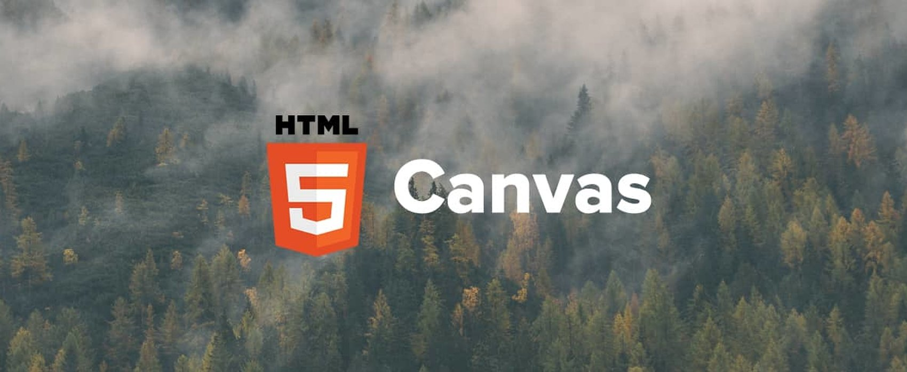
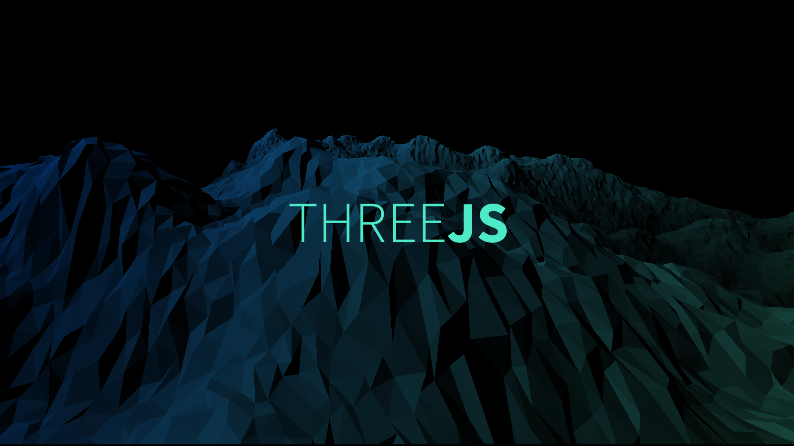
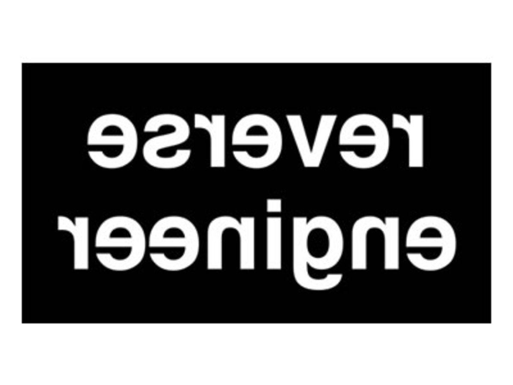
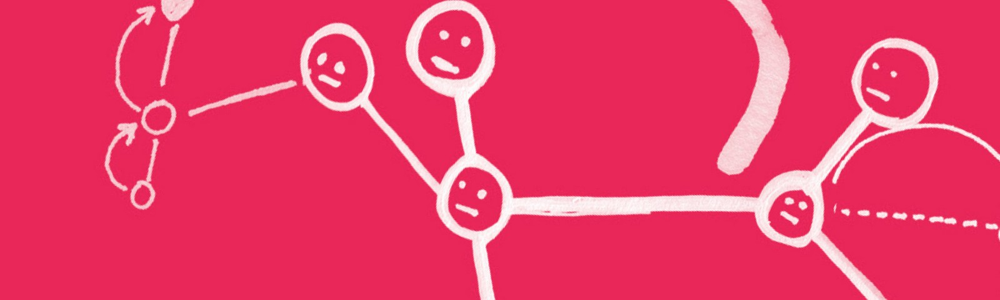

# Máster en Programación FullStack con JavaScript y Node.js
### JS, Node.js, Frontend, Backend, Firebase, Express, Patrones, HTML5_APIs, Asincronía, Websockets, Testing

## Clase 36

### Canvas
**Documentación**
- [Documentación](https://developer.mozilla.org/es/docs/Web/HTML/Canvas)
- [MDN | Canvas tutorial](https://developer.mozilla.org/en-US/docs/Web/API/Canvas_API/Tutorial?redirectlocale=en-US&redirectslug=Canvas_tutorial)

**Recursos**
- [Integrating Canvas into your Web App](https://www.html5rocks.com/en/tutorials/canvas/integrating/)
- [Dive Into HTML5 > Canvas](http://diveintohtml5.info/canvas.html)
- [HTML5 Canvas — the Basics](https://dev.opera.com/articles/html5-canvas-basics/)
- [Tutorial](https://billmill.org/static/canvastutorial/index.html)
- [21 Ridiculously Impressive HTML5 Canvas Experiments](https://code.tutsplus.com/articles/21-ridiculously-impressive-html5-canvas-experiments--net-14210)
- [9 Mind-Blowing Canvas Demos](https://davidwalsh.name/canvas-demos)

**Ejemplos**
- [Codepen | Simple Canvas Animation Example](https://codepen.io/sephhh/pen/OVpELO)
- [Codepen | Canvas Parallax Mountains](https://codepen.io/jackrugile/pen/Apfyn)
- [Codepen | Canvas Particle Animation](https://codepen.io/JulianLaval/pen/KpLXOO)
- [Codepen | html5 canvas loader](https://codepen.io/motorlatitude/pen/Aybmz)
- [Codepen | Interactive Canvas Text](https://codepen.io/tholman/pen/lDLhk)
- [Codepen | Canvas Wave](https://codepen.io/jackrugile/pen/BvLHg)
- [Codepen | Canvas Color Smoke](https://codepen.io/jackrugile/pen/hgdzl)
- [Codepen | Animated Background](https://codepen.io/MarcoGuglielmelli/pen/lLCxy)
- [Codepen | Matrix rain animation using HTML5 canvas and javascript](https://codepen.io/P3R0/pen/MwgoKv)
- [Codepen | Fake Hacking Program](https://codepen.io/chasekaiser/pen/ogXmOK)
- [Codepen | 3D water simulation with 2D canvas](https://codepen.io/MadeByMike/pen/zBrpBL)
- [Codepen | html5 Canvas Traffic Simulation](https://codepen.io/motorlatitude/pen/grdtj)
- [Codepen | Canvas image slider](https://codepen.io/fuzinato/pen/PwLLjB)
- [Codepen | Canvas film grain](https://codepen.io/zadvorsky/pen/PwyoMm)
- [Codepen | mondrian's js canvas](https://codepen.io/leacasas/pen/ZGdNjP)
- [Codepen | Rain](https://codepen.io/MillerTime/pen/oXmgJe)

### Graficas

**Librerías**
- [Chart.js](http://www.chartjs.org/)
- [Chartist.js](http://gionkunz.github.io/chartist-js/)
- [HighCharts.js](https://www.highcharts.com/)
- [Morris.js](http://morrisjs.github.io/morris.js/)
- [NVD3](http://nvd3.org/)
- [Flot](http://www.flotcharts.org/)
- [Google Charts](https://developers.google.com/chart/)
- [plotly.js](https://plot.ly/javascript/)

**Recursos**
- [24 JavaScript Libraries for Creating Beautiful Charts](https://www.sitepoint.com/15-best-javascript-charting-libraries/)
- [9 Best JavaScript Charting Libraries](https://hackernoon.com/9-best-javascript-charting-libraries-46e7f4dc34e6)
- [10 librerías Javascript para mostrar gráficas (charts) en tu aplicación web](http://albertoromeu.com/javascript-charts-webapp/)
- [Genbeta | HighCharts gráficas con JavaScript](https://www.genbetadev.com/javascript/highcharts-graficas-con-javascript)

### D3

**Documentación**
- [Web Oficial](https://d3js.org/)
- [Documentación](https://github.com/d3/d3/wiki)
- [Documentación en Español](https://github.com/abranhe/d3/wiki)
- [Galería de ejemplos](https://github.com/d3/d3/wiki/gallery)
- [Github](https://github.com/d3/d3)

**Recursos**
- [Tutorial de D3 en Español](http://gcoch.github.io/D3-tutorial/)
- [D3.js Tutorial](https://www.tutorialspoint.com/d3js/index.htm)

**Ejemplos**
- [Codepen | Gantt Chart Process](https://codepen.io/jey/pen/jmClJ)
- [Codepen | d3.floorplan](https://codepen.io/nanarth/pen/raarXe)
- [Codepen | D3 Map & GeoIP](https://codepen.io/maggiben/pen/snljd)
- [Codepen | Plotting Points with D3.js](https://codepen.io/laurakelly/pen/aiEmD)
- [Codepen | D3 Donut Pie Chart](https://codepen.io/MeredithU/pen/OVMjjK)
- [Codepen | Bubble Chart with D3](https://codepen.io/girliemac/pen/cDfmb)
- [Codepen | Collapsible Radial Tree in D3](https://codepen.io/fernoftheandes/pen/pcoFz)
- [Codepen | Rotating globe with SVG and D3.js](https://codepen.io/gartempe/pen/onckm)
- [Codepen | D3.js on Mapbox/Leaflet Map](https://codepen.io/alandunning/pen/aOwVON)
- [Codepen | CSS 3D Solar System](https://codepen.io/juliangarnier/pen/idhuG)
- [Codepen | D3 canvas globe with country hover](https://codepen.io/jorin/pen/YNajXZ)
- [Codepen | Airport Distance Map](https://codepen.io/shshaw/pen/vJNMQY)
- [Codepen | D3 World Meteorite Landings](https://codepen.io/codemzy/pen/RRKXEv)
- [Codepen | D3 Real-time Time Series Chart](https://codepen.io/browles/pen/mPMBjw)
- [Codepen | d3- wordsnake](https://codepen.io/talyYang/pen/xXjRzQ)
- [Codepen | Tweet History Visualized with d3.js](https://codepen.io/rossta/pen/Kmeno)
- [Codepen | D3 Donut Chart](https://codepen.io/JFlo/pen/QOMvOp)

### Three.js: Hola, mundo 3D!

**Documentación**
- [Wikipedia](https://es.wikipedia.org/wiki/Three.js)
- [Web oficial](https://threejs.org/)
- [Documentación](https://threejs.org/docs/index.html#manual/introduction/Creating-a-scene)
- [Ejemplos](https://threejs.org/examples/)
- [Slack](https://threejs-slack.herokuapp.com/)
- [NPM](https://www.npmjs.com/package/three)
- [CDNJS](https://cdnjs.com/libraries/three.js/)
- [Github](https://github.com/mrdoob/three.js/)

**Recursos**
- [MDN | Building up a basic demo with Three.js](https://developer.mozilla.org/en-US/docs/Games/Techniques/3D_on_the_web/Building_up_a_basic_demo_with_Three.js)
- [Learning three.js with real world challenges (that have already been solved)](https://bocoup.com/blog/learning-three-js-with-real-world-challenges-that-have-already-been-solved)
- [20 Exceptional Three.js Experiments](https://www.jotform.com/blog/20-exceptional-three-js-experiments-98740/)
- [My first experiment with Three.js](https://blog.squareboat.com/my-first-experiment-with-three-js-d053261be473)
- [Understanding scale and the three.js perspective camera](https://beta.observablehq.com/@grantcuster/understanding-scale-and-the-three-js-perspective-camera)
- [Three.js 101 : Hello World! (Part 1)](https://medium.com/@necsoft/es-three-js-101-hola-mundo-parte-1-e821592823db)
- [Introducción a Three.js, la librería 3D número uno para HTML5](https://www.genbetadev.com/javascript/introduccion-a-three-js-la-libreria-3d-numero-uno-para-html5)
- [Animating scenes with WebGL + Three.js](https://www.august.com.au/blog/animating-scenes-with-webgl-three-js/)
- [Getting started with WebGL using Three.js](https://www.merixstudio.com/blog/getting-started-WebGL-using-threejs/)
- [THREE.JS – Primeros pasos](https://thefiveplanets.org/blog/three-js-pimeros-pasos/)
- [Getting started with Three.js](https://aerotwist.com/tutorials/getting-started-with-three-js/)
- [Intro to WebGL with Three.js](http://davidscottlyons.com/threejs-intro/#slide-0)
- [Introducción a three.js con Jesus Conde](https://www.youtube.com/watch?v=BI0r1jCWC28)
- [Developing with three.js](https://aframe.io/docs/0.8.0/introduction/developing-with-threejs.html)
- [Experimenting with ThreeJS for Virtual Reality and Google Cardboard](https://virtualrealitypop.com/experimenting-with-threejs-for-virtual-reality-and-google-cardboard-86e67ba31b1c)
- [Una Guía del Novato para Three.js](https://webdesign.tutsplus.com/es/tutorials/a-noobs-guide-to-threejs--cms-28639)
- [The Beginner’s Guide to three.js](http://blog.teamtreehouse.com/the-beginners-guide-to-three-js)

**Ejemplos**
- [Codepen | Chill the lion](https://codepen.io/Yakudoo/pen/YXxmYR)
- [Codepen | Sneeze the dragon](https://codepen.io/Yakudoo/pen/yNjRRL)
- [Codepen | 3D cube loop with threejs](https://codepen.io/quentinhocde/pen/qEvvba)
- [Codepen | Cat vs ball of wool](https://codepen.io/Yakudoo/pen/oXJYxy)
- [Codepen | TinyPolyWorld - ThreeJS experiements.](https://codepen.io/Zultan/pen/mwGZBP)
- [Codepen | Three.js Low Poly Self Portrait](https://codepen.io/Zultan/pen/BwdaeW)
- [Codepen | [3 - 4] #Codevember - PalmTree and Sapphire](https://codepen.io/Zultan/pen/zProRL)
- [Codepen | [2] #Codevember - Raining Cake](https://codepen.io/Zultan/pen/OOMJrZ)
- [Codepen | Blood Cells Flow](https://codepen.io/Zultan/pen/gKrYGE)
- [Codepen | Paranoid vs shy birds](https://codepen.io/Yakudoo/pen/LVyJXw)
- [Codepen | Mighty fish](https://codepen.io/Yakudoo/pen/BNNGBq)
- [Codepen | ThreeJS Gradient](https://codepen.io/tr13ze/pen/pbjWwg)
- [Codepen | playing kid — morph and skeletal animation](https://codepen.io/SaschaSigl/pen/gpVKOa)
- [Codepen | threeJS Sphere](https://codepen.io/tr13ze/pen/vKzmgj)
- [Codepen | Black Planet threeJS](https://codepen.io/tr13ze/pen/QpNbNd)
- [Codepen | Cute jumping sheep with three.js](https://codepen.io/elliezen/pen/GWbBrx)

### ¡Ingeniería inversa!

**Videojuegos con HTML5**
- [Simple Games with HTML5 Canvas](http://bencentra.com/2017-07-11-basic-html5-canvas-games.html)
- [2D breakout game using pure JavaScript](https://developer.mozilla.org/en-US/docs/Games/Tutorials/2D_Breakout_game_pure_JavaScript)

**Ejemplos**
- [Juego de la serpiente](https://github.com/JJCLane/Snake)

### Bola Extra: p5js

**Documentación**
- [Processing](https://processing.org/)
- [Web oficial](https://p5js.org/)
- [Punto de partida](https://p5js.org/get-started/)
- [API Referencia](https://p5js.org/reference/)
- [Librerías](https://p5js.org/libraries/)
- [Aprneder](https://p5js.org/learn/)
- [Ejemplos](https://p5js.org/examples/)
- [Libros](https://p5js.org/books/)
- [Forum](https://discourse.processing.org/categories)
- [Github](https://github.com/processing/p5.js)
- [@p5xjs en Twitter](https://twitter.com/p5xjs)

**Librerías CORE**
- [p5.dom](https://p5js.org/reference/#/libraries/p5.dom)
- [p5.sound](https://p5js.org/reference/#/libraries/p5.sound)
- [p5.accessibility](https://github.com/processing/p5.accessibility)

**Librerías de la comunidad**
- [p5.serial](https://github.com/vanevery/p5.serialport)
- [p5.collide2D](https://github.com/bmoren/p5.collide2D)
- [RiTa.js](http://rednoise.org/rita)
- [p5.geolocation](https://github.com/bmoren/p5.geolocation)
- [p5.speech](http://abilitylab.nyu.edu/p5.js-speech/)
- [p5.bots](https://github.com/sarahgp/p5bots)
- [grafica.js](https://github.com/jagracar/grafica.js)
- [p5.play](http://p5play.molleindustria.org/)
- [p5.gui](https://github.com/bitcraftlab/p5.gui)
- [p5.gibber](http://charlie-roberts.com/gibber/p5-gibber/)
- [p5.particle](https://github.com/bobcgausa/cook-js)
- [p5.scribble](https://github.com/generative-light/p5.scribble.js)
- [p5.tiledmap](https://github.com/linux-man/p5.tiledmap)
- [p5.dimensions](https://github.com/Smilebags/p5.dimensions.js)
- [p5.SceneManager](https://github.com/mveteanu/p5.SceneManager)
- [Mappa.js](https://github.com/cvalenzuela/Mappa)
- [p5.func](https://idmnyu.github.io/p5.js-func/)

**Recursos**
- [penance316/p5-matrixrain](https://github.com/penance316/p5-matrixrain)
- [Medium | P5JS](https://medium.com/tag/p5js)
- [Instagram Filters with JavaScript (p5.js)](https://codeburst.io/instagram-filters-with-javascript-p5-js-83f28c9f7fda)
- [Introducción a la librería p5.js](https://programacion.net/articulo/introduccion_a_la_libreria_p5_js_1413)
- [p5.js crash course: recreate art you love](https://blog.kadenze.com/creative-technology/p5-js-crash-course-recreate-art-you-love/)
- [p5.js sketch on Observable: Template](https://beta.observablehq.com/@jeremydouglass/p5-js-sketch-on-observable-template)
- [JavaScript: Unleash Your Inner Jackson Pollock with P5.js](https://thenewstack.io/javascript-unleash-inner-jackson-pollack-p5-js/)
- [Codepen | ASTEROIDS](https://codepen.io/SetupDraw/pen/yoXZbR)
- [Codepen | Opening particles animation with p5.js](https://codepen.io/dghez/pen/BxyzMw)
- [Codepen | Evolving Creatures](https://codepen.io/SetupDraw/pen/qNpkQa)
- [Codepen | Laberinto](https://codepen.io/fpeyret/pen/MrdxxO)
- [Codepen | p5.gui pacman template](https://codepen.io/bitcraftlab/pen/GNKmGg)
- [Codepen | P5 data visualization v3](https://codepen.io/fabax/pen/yNNwYB)
- [Codepen | Angry PacMan p5.js](https://codepen.io/matedemorphy/pen/bREMZJ)
- [Codepen | Starfield (P5.js)](https://codepen.io/flempke/pen/XKLLOo)
- [Codepen | confettis p5.js](https://codepen.io/Gthibaud/pen/ENzXbp)
- [Codepen | ZOMBIE TRIANGLES INVASION (kind off)](https://codepen.io/SetupDraw/pen/GqZXXr)
- [Codepen | Pixel World Map - p5.js](https://codepen.io/TWAIN/pen/dvdQgx)
- [Codepen | daily p5*js sketch | W1D3 | Wonder Woman](https://codepen.io/miffili/pen/MEXZjR)
- [Codepen | daily p5*js sketch | W1D5 | Batman](https://codepen.io/miffili/pen/oGPoLa)

### Ejercicios

**1 -** Sacar una grafica de evolucion de temperatura y humedad basado en la prevision del tiempo usando la API de Open Weather Map

[Solución](../OTROS/grafica-tiempo)