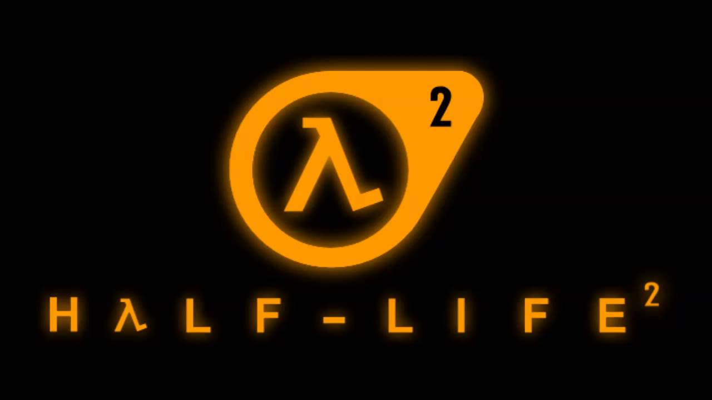
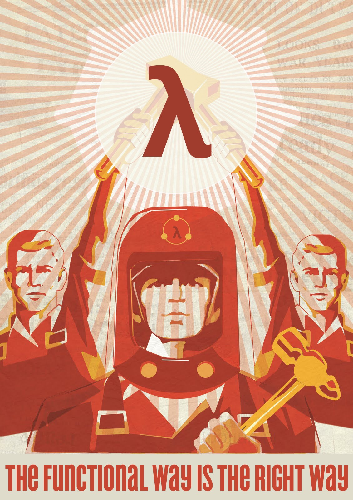
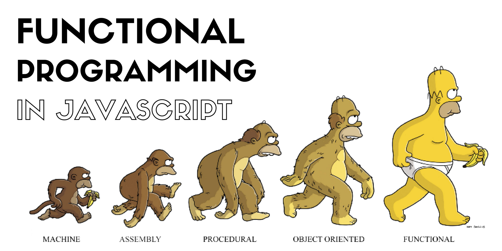
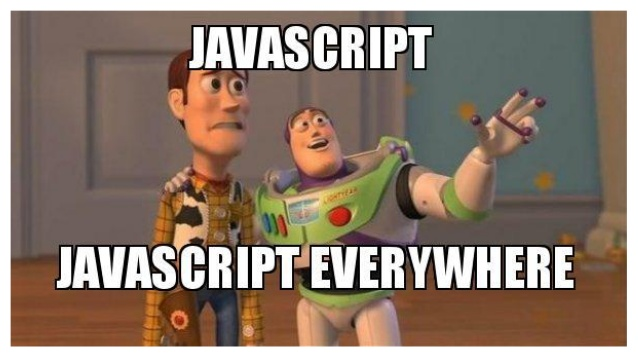

# Máster en Programación FullStack con JavaScript y Node.js
### JS, Node.js, Frontend, Backend, Firebase, Express, Patrones, HTML5_APIs, Asincronía, Websockets, Testing

## Clase 37


### Programación Funcional




> En ciencias de la computación, la programación funcional es un paradigma de programación declarativa basado en el uso de funciones matemáticas, en contraste con la programación imperativa, que enfatiza los cambios de estado mediante la mutación de variables.1​ La programación funcional tiene sus raíces en el cálculo lambda, un sistema formal desarrollado en los años 1930 para investigar la definición de función, la aplicación de las funciones y la recursión. Muchos lenguajes de programación funcionales pueden ser vistos como elaboraciones del cálculo lambda. [Wikipedia](https://es.wikipedia.org/wiki/Programaci%C3%B3n_funcional)

```js
/* Objetivo: Reducir a una dimension, filtrar, modificar, ordenar...
- Punto de partida: [[5,8], [3], [4,2,6,1], [7,9]];
- REDUCIR a una dimension
- FILTRAR los < 5
- MAPEAR los elementos * 10
- ORDENAR de mayor a menor
- Resultado Final: [40,30,20,10]
*/

const matrix = [[5,8], [3], [4,2,6,1], [7,9]];
const lista = matrix;
		.reduce((a,b) => a.concat(b))
		.filter(item => item < 5)
		.map(item => item * 10)
		.sort((a,b) => b - a);

console.log("lista:", lista);
```

### Un universo funcional...



**Lenguajes que lo implementan**
- [Haskell](https://www.haskell.org/)
- [Erlang](http://www.erlang.org/)
- [Elixir](https://elixir-lang.org/)
- [Scala](https://www.scala-lang.org/)
- [Clojure](https://clojure.org/)
- [F#](https://fsharp.org/)

**Conceptos básicos y jerga**
- [Transparencia referencial](https://es.wikipedia.org/wiki/Transparencia_referencial)
- [Efectos colaterales](https://es.wikipedia.org/wiki/Efecto_secundario_(computaci%C3%B3n))
- [Recursividad](https://es.wikipedia.org/wiki/Recursi%C3%B3n_(ciencias_de_computaci%C3%B3n))
- [Funciones puras](http://www.etnassoft.com/2016/06/21/las-funciones-puras-en-javascript-concepto-ejemplos-y-beneficios/)
- [Funciones de orden superior](https://es.wikipedia.org/wiki/Funci%C3%B3n_de_orden_superior)
- [Funciones de primera clase](https://es.wikipedia.org/w/index.php?title=Funciones_de_primera_clase&action=edit&redlink=1)
- Evaluación estricta frente a la no estricta
- [Sistemas de tipos](https://es.wikipedia.org/wiki/Sistema_de_tipos)
- [muchos más...](https://github.com/idcmardelplata/functional-programming-jargon/tree/master)

**Ventajas**
- El código es más conciso y expresivo
- El estado sea inmutable, evita muchos errores (sin efectos colaterales)
- Ideado para sistemas concurrentes (paralelos)
- Entrada y salida; Las funciones reciben parámetros y devuelven un resultado.
- Las funciones puras son muy previsibles y testeables
- Código infinitamente más expresivo
- Proceso de depuración simplificado
- Fomenta mucho la descomposición de las tareas complejas
- Hacemos uso de composiciones partiendo de fragmentos pequeños y especializados
- Métodos encadenados, tuplas y currificación

**Desventajas**
- Falta soporte nativo (tuplas, curry, etc...)
- Es un paradigma menos extendido
- Propensión a los errores, ya que JS no es estrcito con el pardaigma funcional
- El tipado debil puede ser preocupante
- Se acerca mucho a las matemáticas
- Gestión de recursos
- Necesidad de realizar una gran cantidad de abstracciones ad hoc

**Recursos Clave**
- [JavaScript Functional Programming Cookbook (ES6)](https://github.com/js-functional/js-funcional)
- [Programación Funcional En JavaScript con Javier Velez](http://www.javiervelezreyes.com/programacion-funcional-en-javascript/)
- [La programación funcional | That CS guy](https://thatcsharpguy.com/tv/funcional/)
- [el.abismo = de[null] | Serie de Programación funcional](https://elabismodenull.wordpress.com/tag/serie-programacion-funcional/)


**Más Recursos**
- [xgrommx/awesome-functional-programming](https://github.com/xgrommx/awesome-functional-programming)
- [stoeffel/awesome-fp-js](https://github.com/stoeffel/awesome-fp-js)
- [Ebook | Functional Programming in JavaScript: How to improve your JavaScript programs using functional techniques](https://www.manning.com/books/functional-programming-in-javascript)
- [El resurgir de la programación funcional](https://www.genbeta.com/desarrollo/el-resurgir-de-la-programacion-funcional)
- [Aterrizando en la programación funcional](https://www.genbeta.com/desarrollo/aterrizando-en-la-programacion-funcional)
- [Scala.js deja de ser un experimento, no es sólo un compilador de Scala a JavaScript](https://www.genbeta.com/desarrollo/scala-js-deja-de-ser-un-experimento-y-no-es-solo-un-compilador-de-scala-a-javascript)
- [Anjana Vakil: Learning Functional Programming with JavaScript - JSUnconf](https://www.youtube.com/watch?v=e-5obm1G_FY)
- [Programación funcional pura en JavaScript - JSDayES 2016](https://www.youtube.com/watch?v=ZfQKYlGzH2g)
- [Functional programming in JavaScript en Fun Fun Function](https://www.youtube.com/watch?v=BMUiFMZr7vk&list=PL0zVEGEvSaeEd9hlmCXrk5yUyqUag-n84)
- [Introducción a programación funcional en JavaScript—Parte 1](https://medium.com/laboratoria-how-to/introducci%C3%B3n-a-la-programaci%C3%B3n-funcional-en-javascript-parte-1-e0b1d0b2142e)
- [Introducción a la programación funcional en JavaScript](http://lemoncode.net/lemoncode-blog/2017/9/5/introduccion-programacion-funcional-javascript)
- [Qué es la programación funcional y por qué deberías usarla](https://www.paradigmadigital.com/dev/la-programacion-funcional-deberias-usarla/)
- [¿Qué es la programación funcional?](https://thecocktail.engineering/qu%C3%A9-es-la-programaci%C3%B3n-funcional-c91b611b0258)
- [So You Want to be a Functional Programmer (Part 1)](https://medium.com/@cscalfani/so-you-want-to-be-a-functional-programmer-part-1-1f15e387e536)
- [Here’s Why Mapping a Constructed Array in JavaScript Doesn’t Work](https://itnext.io/heres-why-mapping-a-constructed-array-doesn-t-work-in-javascript-f1195138615a)
- [Functional programming paradigms in modern JavaScript: Partial Application](https://hackernoon.com/functional-programming-paradigms-in-modern-javascript-partial-application-fbd6c9c93a0d)
- [Pros and cons of functional programming](https://itnext.io/pros-and-cons-of-functional-programming-32cdf527e1c2)
- [Demystifying functional programming (in a real company)](https://medium.com/building-nubank/demystifying-functional-programming-in-a-real-company-e954a2591504)
- [Two Years of Functional Programming in JavaScript: Lessons Learned](https://hackernoon.com/two-years-of-functional-programming-in-javascript-lessons-learned-1851667c726)
- [Coding Tip: Try to Code Without If-statements](https://medium.com/@samerbuna/coding-tip-try-to-code-without-if-statements-d06799eed231)
- [Javascript and Functional Programming: An Introduction](https://hackernoon.com/functional-programming-in-js-map-filter-reduce-pt-5-308a205fdd5f)
- [How Immutable Data Structures (E.g. Immutable.js) are Optimized](https://hackernoon.com/how-immutable-data-structures-e-g-immutable-js-are-optimized-using-structural-sharing-e4424a866d56)
- [Make your code easier to read with Functional Programming](https://medium.freecodecamp.org/make-your-code-easier-to-read-with-functional-programming-94fb8cc69f9d)
- [Diferencias entre la programación funcional y La programación imperativa (C#)](https://docs.microsoft.com/es-es/dotnet/csharp/programming-guide/concepts/linq/functional-programming-vs-imperative-programming)
- [¿Qué Es La Programación Funcional?](http://www.programando.org/blog/2012/11/que-es-la-programacion-funcional/)
- [dwyl/learn-elm](https://github.com/dwyl/learn-elm)
- [dwyl/learn-elixir](https://github.com/dwyl/learn-elixir)
- [JavaScript promises are just like monads and I can explain both in less than 2 minutes](https://swizec.com/blog/javascript-promises-monads/swizec/7814)

### Programación funcional en JavaScript: ¡Manos a la obra!


> La Programación Funcional se refiere a la evaluación declarativa de funciones puras para crear programas inmutables y así evitar efectos secundarios que son observados externamente. [El abismo de null](https://elabismodenull.wordpress.com/2016/10/12/la-programacion-funcional-en-javascript/)

**Programación declarativa**
- Nos centramos en describir lo que hacer
- Evitamos especificar el flujo y los cambios de estado
- Sistema de cajas negras
```javascript
// Imperativa (COMO hacerlo)
var lista = [0, 1, 2, 3, 4, 5, 6, 7, 8, 9];
for (let i = 0; i < lista.length; i++) {
    lista[i] = lista[i]*lista[i];
}
console.log("Lista:", lista) // [0, 1, 4, 9, 16, 25, 36, 49, 64, 81]

// Declarativa (QUE hacer)
[0, 1, 2, 3, 4, 5, 6, 7, 8, 9].map(num => num*num);
// [0, 1, 4, 9, 16, 25, 36, 49, 64, 81]
```

**Funciones puras (Pure Functions)**
- Mantine las modificaciones en su `scope`
- Solo toma los argumentos como entrada de información
- No modifica el contexto externo, por lo que se retorna la información directamente
- Transparencia referencial
- Inmutabilidad
```javascript
// Función Impura
let numero = 1;
const incremento = () => numero += 1;
incremento(); // 2

//Función Pura
const incremento = n => n + 1;
incremento(1); // 2
```

```javascript
// Función Impura
window.nombre = 'Ulises'
const saludos = () => `Hola, ${window.nombre}`
saludos() // 'Hola, Ulises'

//Función Pura
const saludos = (nombre) => `Hola, ${nombre}`
saludos('Ulises') // 'Hola, Ulises'
```

:warning: Casos especiales:
- modificar el valor de un argumento
- manipulación del DOM, BOM, Cookies, etc...
- Excepciones y gestión de errores
- APIs del navegador


**Funciones de Orden Superior (Higher-order functions - HOF)**
- Funcion que toma una funcion como argumento
- La función puede o no retornar una funcion

```javascript
const sumador = (x, y) => x + y;
const calcular = (fn, x, y) => fn(x, y);
calcular(sumador, 1, 2); // 3

// Filtrado (Filter)
let coches = [
    {id: 'X0001', kilometros: 60000},
    {id: 'X0002', kilometros: 40000},
    {id: 'X0003', kilometros: 90000}
];
const estaViejo = coche => coche.kilometros >= 60000;
coches.filter(estaViejo);
// [{id: "X0001", kilometros: 60000},{id: "X0003", kilometros: 90000}]

```

**Recursividad (Recursion)**
- Evitaremos el uso de bucles
- Utilizaremos funciones que se llaman a si mismas para generar una estructura similar al bucle
```javascript
const cuentaAtras = numero => {
  console.log(numero)
  numero < 1 ? numero : cuentaAtras(numero - 1)
}

cuentaAtras(5);


const factorial = (num) => {
  return num <= 0 ? 1 : num * factorial(num - 1)
}

factorial(5); //120
```

### Programación funcional en JavaScript: Cosas importantes...

**Composición funcional (Compose)**
- Juntamos dos funciones para retornar una función nueva

```javascript
const compositor = (f,g) => x => f(g(x));
const convMayusculas = x => x.toUpperCase();
const contador = x => `${x} [${x.length}]`;
const exclamar = x => `${x}!!!`

const textoContado = compositor(contador, convMayusculas);
const textoContadoExclamado = compositor(exclamar, compositor(contador, convMayusculas));
const textoExclamadoContado = compositor(contador, compositor(exclamar, convMayusculas));

textoContado("Lorem Ipsum");            // "LOREM IPSUM [11]"
textoContadoExclamado("Lorem Ipsum");   // "LOREM IPSUM [11]!!!"
textoExclamadoContado("Lorem Ipsum");   // "LOREM IPSUM!!! [14]"
```

**Currificación (Currying)**
> La currificación es una técnica muy usada en programación funcional. Poder convertir funciones de varios parámetros en una sucesión de funciones con un único parámetro hace que consigamos sistemas más modulares y flexibles, lo que a la larga hará que mantengamos mejor nuestras aplicaciones y reutilicemos componentes. [El abismo de null](https://elabismodenull.wordpress.com/2016/12/08/programacion-funcional-en-javascript-la-currificacion/)

```javascript
const suma = (a, b) => a + b
const cumaCurrificada = (a) => (b) => a + b
cumaCurrificada(40)(2) // 42.
const sumaSegunda = cumaCurrificada(2) // (b) => 2 + b
sumaSegunda(10) // 12
```

**Aridad**
> En el análisis matemático, la aridad de un operador matemático o de una función es el número de argumentos necesarios para que dicho operador o función se pueda calcular. [Wikipedia](https://es.wikipedia.org/wiki/Aridad)
- [Operación nularia](https://es.wikipedia.org/wiki/Operaci%C3%B3n_nularia) significa aridad cero.
- [Operación unaria](https://es.wikipedia.org/wiki/Operaci%C3%B3n_unaria) o [relación unaria](https://es.wikipedia.org/wiki/Relaci%C3%B3n_unaria) significa aridad uno.
- [Operación binaria](https://es.wikipedia.org/wiki/Operaci%C3%B3n_binaria) o [relación binaria](https://es.wikipedia.org/wiki/Relaci%C3%B3n_binaria) significa aridad dos.
- [Operación ternaria](https://es.wikipedia.org/wiki/Operaci%C3%B3n_ternaria) o [relación ternaria](https://es.wikipedia.org/wiki/Relaci%C3%B3n_ternaria) significa aridad tres.
- La función variádica tiene una aridad indefinida, acepta una cantidad de argumentos variable.

```javascript
function fun2 (arg1, arg2) {
    //...
}

function fun3 (arg1, arg2, arg3) {
    //...
}

console.log(fun2.length) // 2 -> Binaria
console.log(fun2.length) // 3 -> Ternaria
```


### Programación funcional en JavaScript: Más allá...

**[Aplicación parcial (Partial Application)](https://github.com/idcmardelplata/functional-programming-jargon/tree/master#aplicaci%C3%B3n-parcial)**
> Aplicar parcialmente una funcion, significa crear una nueva funcion rellenando previamente alguno de los argumentos de la funcion original. [idcmardelplata/functional-programming-jargon](https://github.com/idcmardelplata/functional-programming-jargon/tree/master#aplicaci%C3%B3n-parcial)

**[Continuación (Continuation)](https://github.com/idcmardelplata/functional-programming-jargon/tree/master#continuaci%C3%B3n)**
> En cualquier punto dado de un programa, la parte del codigo que aun esta por ejecutarse se conoce como continuación. [idcmardelplata/functional-programming-jargon](https://github.com/idcmardelplata/functional-programming-jargon/tree/master#continuaci%C3%B3n)

**[Idempotente (Idempotent)](https://github.com/idcmardelplata/functional-programming-jargon/tree/master#idempotente)**
> Una funcion es idempotente si al volver a aplicarla sobre su resultado, no produce resultados diferentes. [idcmardelplata/functional-programming-jargon](https://github.com/idcmardelplata/functional-programming-jargon/tree/master#idempotente)

**Y mucho más...**
* [Aridad](https://github.com/idcmardelplata/functional-programming-jargon/tree/master#aridad)
* [Auto Currying](https://github.com/idcmardelplata/functional-programming-jargon/tree/master#auto-currying)
* [Efectos secundarios](https://github.com/idcmardelplata/functional-programming-jargon/tree/master#efectos-secundarios)
* [Idempotente](https://github.com/idcmardelplata/functional-programming-jargon/tree/master#idempotente)
* [Estilo de punto libre o programación tacita](https://github.com/idcmardelplata/functional-programming-jargon/tree/master#estilo-de-punto-libre-o-programación-tacita)
* [Predicado](https://github.com/idcmardelplata/functional-programming-jargon/tree/master#predicado)
* [Contratos](https://github.com/idcmardelplata/functional-programming-jargon/tree/master#contratos)
* [Funciones guardas](https://github.com/idcmardelplata/functional-programming-jargon/tree/master#funciones-guardas)
* [Categorías](https://github.com/idcmardelplata/functional-programming-jargon/tree/master#categorías)
* [Valor](https://github.com/idcmardelplata/functional-programming-jargon/tree/master#valor)
* [Constante](https://github.com/idcmardelplata/functional-programming-jargon/tree/master#constante)
* [Functor](https://github.com/idcmardelplata/functional-programming-jargon/tree/master#functor)
  * [Preservar la identidad](https://github.com/idcmardelplata/functional-programming-jargon/tree/master#preservar-la-identidad)
  * [Componible](https://github.com/idcmardelplata/functional-programming-jargon/tree/master#componible)
* [Functor apuntado](https://github.com/idcmardelplata/functional-programming-jargon/tree/master#functor-apuntado)
* [Elevar (lift)](https://github.com/idcmardelplata/functional-programming-jargon/tree/master#elevar-lift)
* [Transparencia referencial](https://github.com/idcmardelplata/functional-programming-jargon/tree/master#transparencia-referencial)
* [Razonamiento equacional](https://github.com/idcmardelplata/functional-programming-jargon/tree/master#razonamiento-equacional)
* [Lambda](https://github.com/idcmardelplata/functional-programming-jargon/tree/master#lambda)
* [Cálculo Lambda](https://github.com/idcmardelplata/functional-programming-jargon/tree/master#cálculo-lambda)
* [Evaluación Perezosa](https://github.com/idcmardelplata/functional-programming-jargon/tree/master#evaluación-perezosa)
* [Monoide](https://github.com/idcmardelplata/functional-programming-jargon/tree/master#monoide)
* [Mónada](https://github.com/idcmardelplata/functional-programming-jargon/tree/master#mónada)
* [Co-mónada](https://github.com/idcmardelplata/functional-programming-jargon/tree/master#comónada)
* [Functor Aplicativo](https://github.com/idcmardelplata/functional-programming-jargon/tree/master#functor-aplicativo)
* [Morfismo](https://github.com/idcmardelplata/functional-programming-jargon/tree/master#morfismo)
  * [Endomorfismo](https://github.com/idcmardelplata/functional-programming-jargon/tree/master#endomorfismo)
  * [Isomorfismo](https://github.com/idcmardelplata/functional-programming-jargon/tree/master#isomorfismo)
* [Setoide](https://github.com/idcmardelplata/functional-programming-jargon/tree/master#setoide)
* [Semigrupo](https://github.com/idcmardelplata/functional-programming-jargon/tree/master#semigrupo)
* [Plegable](https://github.com/idcmardelplata/functional-programming-jargon/tree/master#plegable)
* [Traversable](https://github.com/idcmardelplata/functional-programming-jargon/tree/master#traversable)
* [Signatura de tipos](https://github.com/idcmardelplata/functional-programming-jargon/tree/master#signatura-de-tipos)
* [Tipos de unión](https://github.com/idcmardelplata/functional-programming-jargon/tree/master#tipos-de-union)
* [Tipos de producto](https://github.com/idcmardelplata/functional-programming-jargon/tree/master#tipos-de-producto)
* [Opcional](https://github.com/idcmardelplata/functional-programming-jargon/tree/master#opcional)


### Programación funcional en JavaScript: Librerías y frameworks



- [Ramba](https://ramdajs.com/)
- [lodash](https://lodash.com/)
- [monet.js](https://monet.github.io/monet.js/)
- [functional.js](http://functionaljs.com/)
- Y [muchas más...](https://github.com/stoeffel/awesome-fp-js)

