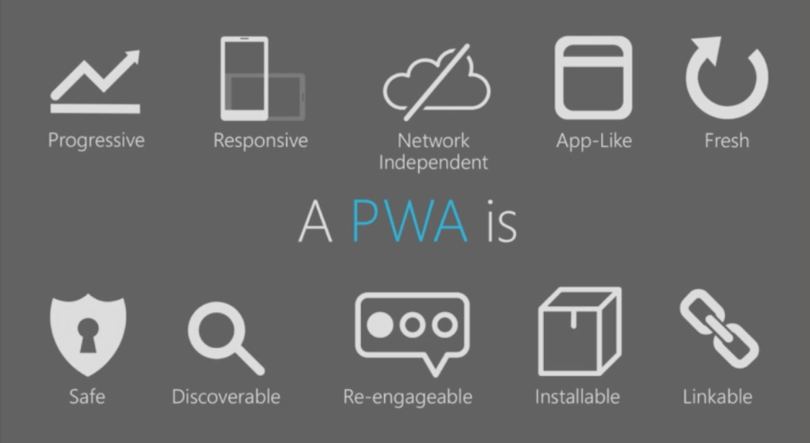

# Máster en Programación FullStack con JavaScript y Node.js
### JS, Node.js, Frontend, Backend, Firebase, Express, Patrones, HTML5_APIs, Asincronía, Websockets, Testing

## Clase 42

### Guias
- [Web Fundamentals: GUIDES ](https://developers.google.com/web/fundamentals/?hl=es)
 
**Arquitectura**
- [El modelo de "shell de app"](https://developers.google.com/web/fundamentals/architecture/app-shell?hl=es)

**Diseñando increíbles expericias de usuario**
- [Aspectos básicos de la experiencia del usuario](https://developers.google.com/web/fundamentals/design-and-ux/ux-basics/?hl=es)
- [¿Qué hace que un sitio para dispositivo móvil sea bueno?](https://developers.google.com/web/fundamentals/design-and-ux/principles/?hl=es)
- [Introduction to variable fonts on the web](https://developers.google.com/web/fundamentals/design-and-ux/typography/variable-fonts/?hl=es)

**Accesibilidad**
- Foco
   - [Foco Intro](https://developers.google.com/web/fundamentals/accessibility/focus/?hl=es)
   - [El orden del DOM es importante](https://developers.google.com/web/fundamentals/accessibility/focus/dom-order-matters?hl=es)
   - [Uso de tabindex](https://developers.google.com/web/fundamentals/accessibility/focus/using-tabindex?hl=es)
- Semantics Built-in
   - [Introducción a Semantics](https://developers.google.com/web/fundamentals/accessibility/semantics-builtin/?hl=es)
   - [El árbol de accesibilidad](https://developers.google.com/web/fundamentals/accessibility/semantics-builtin/the-accessibility-tree?hl=es)
   - [Alternativas de texto para imágenes](https://developers.google.com/web/fundamentals/accessibility/semantics-builtin/text-alternatives-for-images?hl=es)
   - [Semantics y navegación por el contenido](https://developers.google.com/web/fundamentals/accessibility/semantics-builtin/navigating-content?hl=es)
- Semantics and ARIA
   - [Introducción a ARIA](https://developers.google.com/web/fundamentals/accessibility/semantics-aria/?hl=es)
   - [Etiquetas y relaciones de ARIA](https://developers.google.com/web/fundamentals/accessibility/semantics-aria/aria-labels-and-relationships?hl=es)
   - [Cómo ocultar y actualizar contenido](https://developers.google.com/web/fundamentals/accessibility/semantics-aria/hiding-and-updating-content?hl=es)
- [Estilos accesibles](https://developers.google.com/web/fundamentals/accessibility/accessible-styles?hl=es)
- [How To Do an Accessibility Review](https://developers.google.com/web/fundamentals/accessibility/how-to-review?hl=es)
- [Accessibility for teams](https://developers.google.com/web/fundamentals/accessibility/a11y-for-teams?hl=es)

**Animaciones**
- [Animaciones Intro](https://developers.google.com/web/fundamentals/design-and-ux/animations/?hl=es)
- [Animaciones de CSS frente a JavaScript](https://developers.google.com/web/fundamentals/design-and-ux/animations/css-vs-javascript?hl=es)
- [Aspectos básicos de la aceleración](https://developers.google.com/web/fundamentals/design-and-ux/animations/the-basics-of-easing?hl=es)
- [Aceleración personalizada](https://developers.google.com/web/fundamentals/design-and-ux/animations/custom-easing?hl=es)
- [Animaciones entre vistas](https://developers.google.com/web/fundamentals/design-and-ux/animations/animating-between-views?hl=es)
- [Elección de la aceleración adecuada](https://developers.google.com/web/fundamentals/design-and-ux/animations/choosing-the-right-easing?hl=es)
- [Animación de vistas modales](https://developers.google.com/web/fundamentals/design-and-ux/animations/animating-modal-views?hl=es)
- [Sincronización asimétrica de animaciones](https://developers.google.com/web/fundamentals/design-and-ux/animations/asymmetric-animation-timing?hl=es)
- [Animaciones y rendimiento](https://developers.google.com/web/fundamentals/design-and-ux/animations/animations-and-performance?hl=es)

**Responsive Web Design**
- [Aspectos básicos del diseño web adaptable](https://developers.google.com/web/fundamentals/design-and-ux/responsive/?hl=es)
- [Patrones de diseño web adaptables](https://developers.google.com/web/fundamentals/design-and-ux/responsive/patterns?hl=es)
- [Imágenes responsive](https://developers.google.com/web/fundamentals/design-and-ux/responsive/images?hl=es)
- [Contenido para varios dispositivos](https://developers.google.com/web/fundamentals/design-and-ux/responsive/content?hl=es)

### Progressive Web Apps (PWAs)

**Documentación**
- [Progressive Web Apps by Google Developers](https://developers.google.com/web/progressive-web-apps/)

**Recursos**
- [Awesome PWA](https://github.com/hemanth/awesome-pwa)
- [PWA Builder](http://www.pwabuilder.com/generator)
- [Demo PWA completo de Gokulakrishnan Kalaikovan](https://github.com/gokulkrishh/demo-progressive-web-app)
- [PWA Tutorial de IncredibleWeb](https://github.com/IncredibleWeb/pwa-tutorial)
- [Google Lighthouse](https://developers.google.com/web/tools/lighthouse/)
- [Introducing Pokedex.org: a progressive webapp for Pokémon fans](http://www.pocketjavascript.com/blog/2015/11/23/introducing-pokedex-org)
- [Banners de instalación de apps web](https://developers.google.com/web/fundamentals/engage-and-retain/app-install-banners/)
- [Web App Manifest](https://developer.mozilla.org/es/docs/Web/Manifest)
- [Notificaciones push en la web: Oportunas, relevantes y precisas](https://developers.google.com/web/fundamentals/engage-and-retain/push-notifications/)
- [PWA - PROGRESSIVE WEB APP HANDBOOK](https://vaadin.com/progressive-web-applications?utm_term=%2Bpwa&utm_campaign=PWA+search+EU+-+Mar+20,+2018&utm_source=adwords&utm_medium=ppc&hsa_net=adwords&hsa_tgt=kwd-314170956708&hsa_ad=258329622220&hsa_acc=7040932438&hsa_grp=55768637720&hsa_mt=b&hsa_cam=1258602860&hsa_kw=%2Bpwa&hsa_ver=3&hsa_src=g&gclid=CjwKCAjw-8nbBRBnEiwAqWt1zco1cG4_JtA5KMNvK-bBy9G5ToWdsDaP-VkzcOtO8ZmQDz6L5dxIbRoCxgQQAvD_BwE)
- [GitBook | @jdonsan: Desarrolla Progressive Web Apps](https://jdonsan.gitbooks.io/desarrolla-progressive-web-apps/content/)
- [el.abismo = de[null] | Serie PWA](https://elabismodenull.wordpress.com/category/series/serie-pwa/)

### Progressive Web Apps (PWAs): [Checklist](https://developers.google.com/web/progressive-web-apps/checklist)

**Lo básico**
- [ ] Usar HTTPs
- [ ] Es responsive en todos los dispositivos
- [ ] Debe funcionar sin conexión a internet
- [ ] Debe poder añadirse al Home Screen
- [ ] Primera carga rápida incluso en 3G
- [ ] Cross-browser support
- [ ] Respuesta inmediata en transiciones (acciones sobre links, botones, etc...)
- [ ] Cada pagina/vista tiene su propia URL

**Extras**
- [ ] [Indexability & social](https://developers.google.com/web/progressive-web-apps/checklist)
- [ ] [User experience](https://developers.google.com/web/progressive-web-apps/checklist)
- [ ] [Performance](https://developers.google.com/web/progressive-web-apps/checklist)
- [ ] [Caching](https://developers.google.com/web/progressive-web-apps/checklist)
- [ ] [Push notifications](https://developers.google.com/web/progressive-web-apps/checklist)
- [ ] [Payments & Credentials](https://developers.google.com/web/progressive-web-apps/checklist)