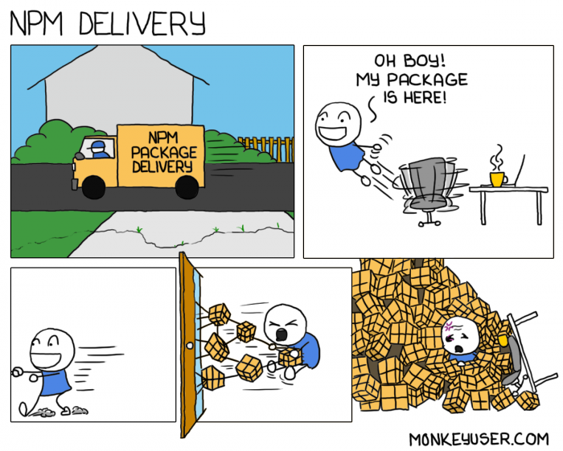
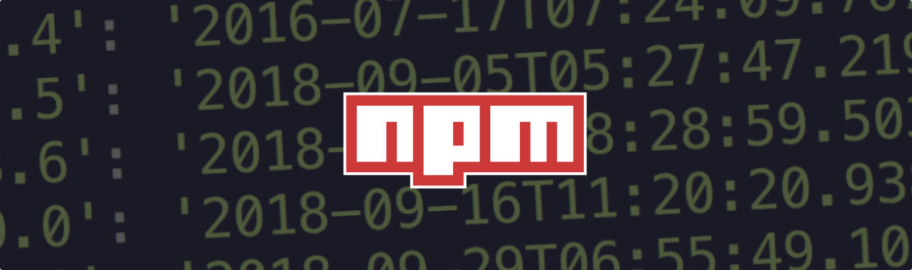
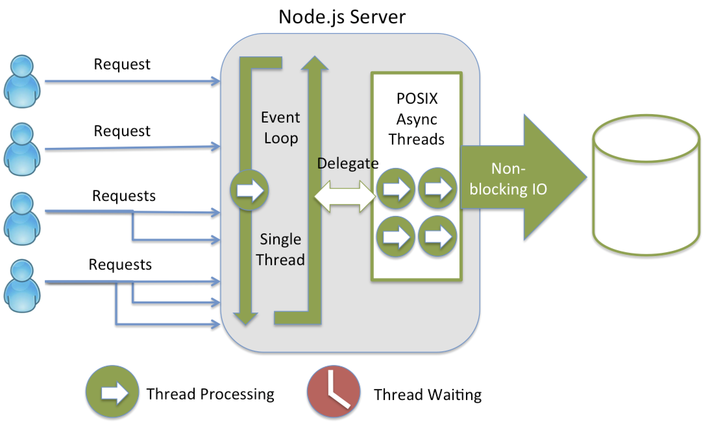
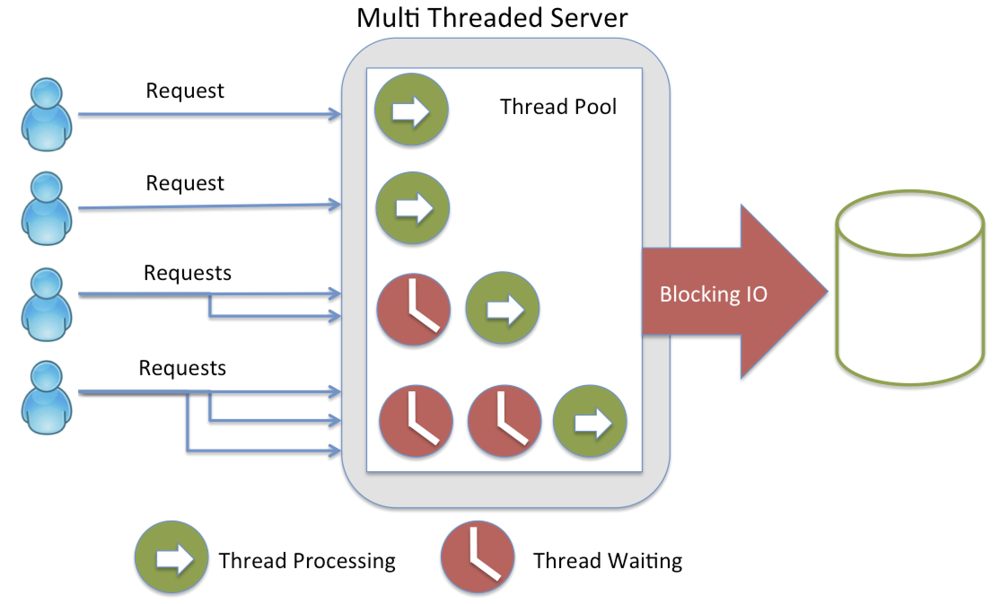

# Máster en Programación FullStack con JavaScript y Node.js
### JS, Node.js, Frontend, Backend, Firebase, Express, Patrones, HTML5_APIs, Asincronía, Websockets, Testing

## Clase 48

### Node.js


> Node.js es un entorno en tiempo de ejecución multiplataforma, de código abierto, para la capa del servidor (pero no limitándose a ello) basado en el lenguaje de programación ECMAScript, asíncrono, con I/O de datos en una arquitectura orientada a eventos y basado en el motor V8 de Google. Fue creado con el enfoque de ser útil en la creación de programas de red altamente escalables, como por ejemplo, servidores web. Fue creado por Ryan Dahl en 2009 y su evolución está apadrinada por la empresa Joyent, que además tiene contratado a Dahl en plantilla - [Wikipedia](https://www.wikiwand.com/es/Node.js)


**Otra manera es posible**


**Puntos Fuertes**
- Asincronía (no bloqueo)
- Backend completo
- NPM (comunidad)
- Single thread (paralelismo)
- Librerías propias
- Utilidades
- Código abierto
- Basado en el V8 (escrito en C++) de Google
- Multiplataforma
- Orientado a Eventos
- **No se limita solo a servidores HTTP**

**Librerías interesantes**
- [awesome Node.js](https://github.com/sindresorhus/awesome-nodejs/)
- [Grunt](http://gruntjs.com/)
- [Gulp](http://gulpjs.com/)
- [Express](http://expressjs.com/es/)
- [Mongoose](http://mongoosejs.com/)
- [Socket.io](http://socket.io/)
- [Apache Cordova](http://cordova.apache.org/)
- [Async](https://www.npmjs.com/package/async)
- [Chalk](https://www.npmjs.com/package/chalk)
- [J5](http://johnny-five.io/)
- [GraphicsMagick](http://aheckmann.github.io/gm/)
- [Marked](https://github.com/chjj/marked)
- [Node-restify](https://github.com/restify/node-restify)
- [Webpack](https://github.com/webpack/webpack)
- [Morgan](https://github.com/expressjs/morgan)
- [Nodemailer](https://github.com/nodemailer/nodemailer)
- [Passportjs](http://passportjs.org/)
- [Cheerio](https://github.com/cheeriojs/cheerio)
- [X-ray](https://github.com/lapwinglabs/x-ray)
- [Bower](https://bower.io/)
- [PM2](http://pm2.keymetrics.io/)
- [Electron](http://electron.atom.io/)
- [Yeoman](http://yeoman.io/)
- [Babel](https://babeljs.io/)
- [Helmet](https://www.npmjs.com/package/helmet)
- [Faker](https://www.npmjs.com/package/faker)
- [Protractor](https://www.npmjs.com/package/protractor)
- [Nightwatch.js](http://nightwatchjs.org/)
- [Cypress.io](https://www.cypress.io/)

### JSDramas

**IO.js**


> io.js has merged with the Node.js project again.
There won't be any further io.js releases. All of the features in io.js are available in Node.js v4 and above.

- [Tiempos turbulentos para la comunidad Node.js, ha nacido io.js](http://www.genbetadev.com/actualidad/tiempos-turbulentos-para-la-comunidad-node-js-ha-nacido-io-js)
- [JavaScript I/O](https://iojs.org/es/)

**Dependencias, dependencias, dependencias... y más dependencias**



```javascript
module.exports = leftpad;

function leftpad (str, len, ch) {
  str = String(str);

  var i = -1;

  if (!ch &amp;&amp; ch !== 0) ch = ' ';

  len = len - str.length;

  while (++i &lt; len) {
    str = ch + str;
  }

  return str;
}
```
- [How one developer just broke Node, Babel and thousands of projects in 11 lines of JavaScript](http://www.theregister.co.uk/2016/03/23/npm_left_pad_chaos/)
- [A discussion about the breaking of the Internet](https://medium.com/@mproberts/a-discussion-about-the-breaking-of-the-internet-3d4d2a83aa4d#.r9oqkkuhb)
- [I’ve Just Liberated My Modules](https://medium.com/@azerbike/i-ve-just-liberated-my-modules-9045c06be67c#.mjp6u93c1)
- [Left-pad en GitHub](https://github.com/camwest/left-pad)
- [Is left-pad Indicative of a Fragile JavaScript Ecosystem?](http://developer.telerik.com/featured/left-pad-indicative-fragile-javascript-ecosystem/)
- [Overcoming JavaScript Fatigue](http://developer.telerik.com/topics/web-development/overcoming-javascript-fatigue/)
- [One developer just broke Node, Babel and thousands of projects in 11 lines of JavaScript](https://laravel-news.com/2016/03/one-developer-just-broke-node-babel-thousands-projects-11-lines-javascript/)
- [How 17 Lines of Code Took Down Silicon Valley’s Hottest Startups](http://www.huffingtonpost.com/ken-mazaika/how-17-lines-of-code-took_b_9532846.html)
- [Npm package author revokes his packages, breaking tons of builds](https://evertpot.com/npm-revoke-breaks-the-build/)
- [¿Y si el software Open Source desapareciera?](http://www.xataka.com/servicios/y-si-el-software-open-source-desapareciera)
- [El programador que borró 11 líneas de código y se cargó Internet](http://www.omicrono.com/2016/04/desaparicion-en-node-js-de-left-pad/)

**EventStream is like functional programming meets IO**



```javascript
var es = require('event-stream')
var inspect = require('util').inspect

process.stdin                        //connect streams together with `pipe`
  .pipe(es.split())                  //split stream to break on newlines
  .pipe(es.map(function (data, cb) { //turn this async function into a stream
    cb(null
      , inspect(JSON.parse(data)))   //render it nicely
  }))
  .pipe(process.stdout)              // pipe it to stdout !
```

- [EventStream | NPM](https://www.npmjs.com/package/event-stream)
- [dominictarr/event-stream | issue:I don't know what to say](https://github.com/dominictarr/event-stream/issues/116)
- [Synk | Malicious code found in npm package event-stream downloaded 8 million times in the past 2.5 months](https://snyk.io/blog/malicious-code-found-in-npm-package-event-stream)
- [Reddit | "I don't know what to say."– Backdoor in popular event-stream NPM repo (github.com)](https://www.reddit.com/r/programming/comments/a0kxmw/i_dont_know_what_to_say_backdoor_in_popular/)
- [Widely used open source software contained bitcoin-stealing backdoor](https://arstechnica.com/information-technology/2018/11/hacker-backdoors-widely-used-open-source-software-to-steal-bitcoin/)
- [Malicious code in npm ‘event-stream’ package targets a bitcoin wallet and causes 8 million downloads in two months](https://hub.packtpub.com/malicious-code-in-npm-event-stream-package-targets-a-bitcoin-wallet-and-causes-8-million-downloads-in-two-months/)
- [event-stream vulnerability explained](https://schneid.io/blog/event-stream-vulnerability-explained/)
- [Check your repos... Crypto-coin-stealing code sneaks into fairly popular NPM lib (2m downloads per week)](https://www.theregister.co.uk/2018/11/26/npm_repo_bitcoin_stealer/)

### C9.io


**Características estrella**
- Code together in real time
- Share your IDE, your workspace, a preview, or your running app
- Replay all edits and see your code at any point in time

**Otras características**
- Preview in any browser
- Built-In Terminal
- Language Tools
- Debugger
- Split View
- Themes
- Run Panel
- Key Bindings Editor
- VIM/Emacs/Sublime Mode
- Built-In Image Editor

**Más**
- [Precios y planes](https://c9.io/pricing/webide)
- [Soporte](https://c9.io/support)
- [c9 en GitHub](https://github.com/c9)


### Terminal UNIX

- [400 comandos que deberias conocer](http://blog.desdelinux.net/mas-de-400-comandos-para-gnulinux-que-deberias-conocer/)
- [Terminal online](http://www.tutorialspoint.com/unix_terminal_online.php)
- [Webminal](http://www.webminal.org/)
- [C9 - Terminal - Documentación](https://docs.c9.io/docs/terminal)


### Nodejs


- Versiones:
  - Pares -> Estables
  - Impares -> inestables

- Versiones LTS:

  
  - [Planes e información](https://github.com/nodejs/LTS)


- Grandes Cambios:
- [De v0.2 a v0.3](https://github.com/nodejs/node/wiki/Migrating-from-v0.2-to-v0.3)
- [De v0.3 a v0.4](https://github.com/nodejs/node/wiki/Migrating-from-v0.2-to-v0.4)
- [De v0.4 a v0.6](https://github.com/nodejs/node/wiki/API-changes-between-v0.4-and-v0.6)
- [De v0.6 a v0.8](https://github.com/nodejs/node/wiki/API-changes-between-v0.6-and-v0.8)
- [De v0.8 a v0.10](https://github.com/nodejs/node/wiki/API-changes-between-v0.8-and-v0.10)
- [De v0.10 a v0.12](https://github.com/nodejs/node/wiki/API-changes-between-v0.10-and-v0.12)
- [De v0.10 a v4](https://github.com/nodejs/node/wiki/API-changes-between-v0.10-and-v4)
- [De v4 a v5](https://github.com/nodejs/node/wiki/Breaking-changes-between-v4-and-v5)
- [De v5 a v6](https://github.com/nodejs/node/wiki/Breaking-changes-between-v5-and-v6)
- [De v6 a v7](https://github.com/nodejs/node/wiki/Breaking-changes-between-v6-and-v7)
- [De v4 LTS a v6 LTS](https://github.com/nodejs/node/wiki/Breaking-changes-between-v4-LTS-and-v6-LTS)
- [io.js](https://github.com/nodejs/node/wiki/Breaking-Changes)


- Comprobar version:
  - Node
```
    node -v
```

  - Npm
```
    npm -v
```


### Hello World

- Hola mundo!:
```javascript
  console.log("Hola Mundo!");
```

- Hola mundo! (retraso):
```javascript
  setTimeout(function() {
    console.log("Hola Futuro...!");
  }, 5000);
```

- Hola mundo! (repetición):
```javascript
  setInterval(function() {
    console.log("Hola Futuro...!");
  }, 1000);
```

### Console

**console.assert(value[, message][, ...])**
```javascript
console.assert(true, 'No me muestro!');
console.assert(false, 'Me muestro');
```

**console.time() y console.timeEnd()**
```javascript
console.time('100-elementos');
for (var i = 0; i < 100; i++) {
  console.log(i);
}
console.timeEnd('100-elementos');
// 100-elementos: 5ms
```

**Sustituciones**

- %d Enteros y coma flotante
```javascript
	console.log("Tenemos %d usuarios conectados", 10);
```
- %s Cadenas
```javascript
	console.log("Tenemos %s usuarios conectados", "muchos");
```
- %j Objetos JSON
```javascript
	console.log("Tenemos %j", {alumnos:{total:15, estado:"conectados"}});
```


### Los conceptos clave

**Loop**

- [The JavaScript Event Loop: Explained](http://blog.carbonfive.com/2013/10/27/the-javascript-event-loop-explained/)


**Arquitecura diferente**


**Single Thread**



**Multi Thread**
