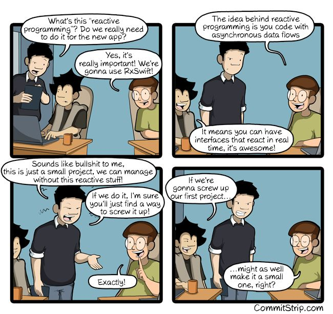
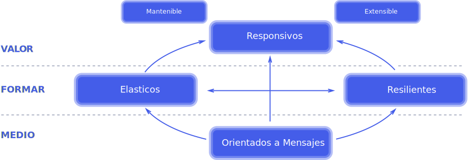
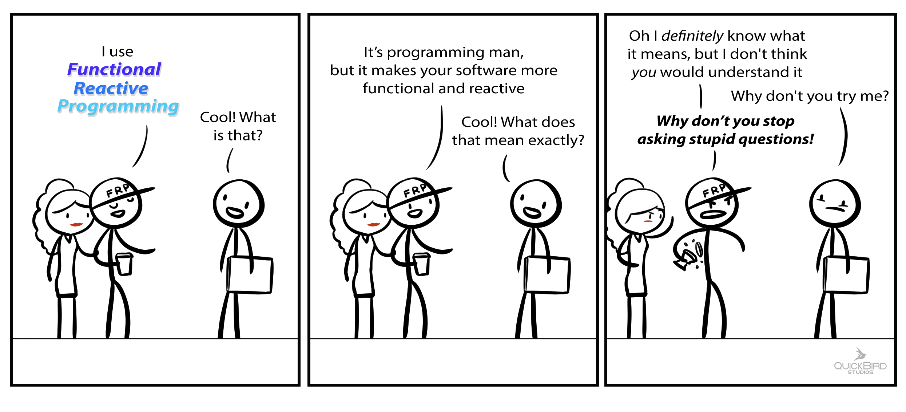
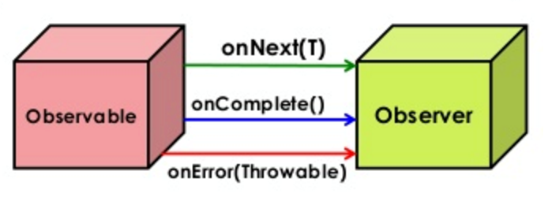
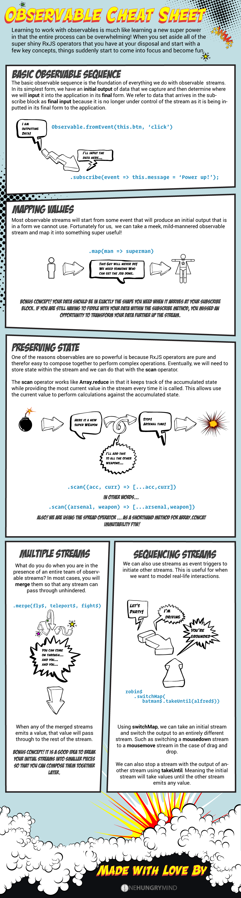

# Máster en Programación FullStack con JavaScript y Node.js
### JS, Node.js, Frontend, Backend, Firebase, Express, Patrones, HTML5_APIs, Asincronía, Websockets, Testing

## Clase 53

### Programación Reactiva (Rx)


**“La programación reactiva es programación con flujos de datos asíncronos”**
> La Programación reactiva o Rx, es un estilo de microarquitectura y paradigma que implica el enrutamiento inteligente y el consumo de eventos, todos combinados, para cambiar el comportamiento de una aplicación [bit.es](https://www.bit.es/knowledge-center/introduccion-a-la-programacion-reactiva-rx/)

**[El Manifiesto Reactivo](https://www.reactivemanifesto.org/es)**

Los Sistemas Reactivos son:
- Responsivos: El sistema responde a tiempo en la medida de lo posible.
- Resilientes: El sistema permanece responsivo frente a fallos.
- Elásticos: El sistema se mantiene responsivo bajo variaciones en la carga de trabajo.
- Orientados a Mensajes: Los Sistemas Reactivos confían en el intercambio de mensajes asíncrono para establecer fronteras entre componentes, lo que asegura bajo acoplamiento, aislamiento y transparencia de ubicación.





**Recursos Destacados**
- [The introduction to Reactive Programming you've been missing](https://gist.github.com/staltz/868e7e9bc2a7b8c1f754)
- [Slides | REACTIVE PROGRAMMING by jonalvarezz](http://jonalvarezz.github.io/presentation-reactive-programming)
- [FCC | A quick introduction to Functional Reactive Programming (FRP)](https://medium.freecodecamp.org/functional-reactive-programming-frp-imperative-vs-declarative-vs-reactive-style-84878272c77f)

**Recursos**
- [Programación reactiva, qué es y por qué ahora](https://www.beeva.com/beeva-view/tecnologia/programacion-reactiva-que-es-y-por-que-ahora/)
- [El paradigma de la programación reactiva: claves para entenderla](https://blog.gft.com/es/2018/03/06/el-paradigma-de-la-programacion-reactiva-claves-para-entenderla/)
- [La programación reactiva](https://thatcsharpguy.com/tv/reactiva/)
- [¿Qué es la Programación Reactiva? Una introducción](https://profile.es/blog/que-es-la-programacion-reactiva-una-introduccion/)


### Programación **Funcional** Reactiva (FRP)



### RxJS (ReactiveX)


**Una API para la programación asíncrona con flujos observables (RxJS es como Lodash para eventos)**
> RxJS es una librería para crear programas asincrónicos y basados en eventos mediante el uso de secuencias observables. Proporciona un tipo de núcleo (core type), el “Observable”, tipos de satélites (satellite types) “Observer, Schedulers, Subjects” y operadores inspirados en Array#extras “map, filter, reduce, every, etc” para permitir el manejo de eventos asíncronos como colecciones. [Jorge Cano](https://medium.com/@jorgeucano/30-d%C3%ADas-con-rxjs-d%C3%ADa-1-e911e68f6063)

**Recursos Destacados**
- [reactivex | Web oficial](http://reactivex.io/)
- [ReactiveX/rxjs](https://github.com/ReactiveX/rxjs)
- [rxjs | Web Oficial](https://rxjs-dev.firebaseapp.com/)
- [En mi local funciona | Programación Reactiva con RxJs](https://enmilocalfunciona.io/programacion-reactiva-con-rxjs/)
- [30 días con RxJS](https://medium.com/@jorgeucano/30-d%C3%ADas-con-rxjs-d%C3%ADa-1-e911e68f6063)


**Recursos**
- [RxJS in Action](https://www.manning.com/books/rxjs-in-action)
- [RxJS: Reactive Extensions For JavaScript](https://github.com/ReactiveX/rxjs)
- [RxJS - What and Why?](https://www.youtube.com/watch?v=T9wOu11uU6U)
- [reactivex.io](http://reactivex.io/)
- [Reactive Programming RX JS Introduction](https://medium.com/@tkssharma/reactive-programming-rx-js-introduction-32bf963eee1b)
- [Introducción a la Programación Reactiva: Rx](https://www.bit.es/knowledge-center/introduccion-a-la-programacion-reactiva-rx/)
- [Programación Reactiva, uso de la librería RxJs](https://www.adictosaltrabajo.com/tutoriales/programacion-reactiva-uso-de-la-libreria-rxjs/)
- [Programación Reactiva con RxJs](http://enmilocalfunciona.io/programacion-reactiva-con-rxjs/)
- [RxJS y la programación reactiva](https://www.arquitecturajava.com/rxjs-la-programacion-reactiva/)
- [Programación Reactiva (RX)](https://medium.com/blog-apside/programaci%C3%B3n-reactiva-rx-c800f35836c)


### RxJS: Conceptos

#### `RX = OBSERVABLE + OBSERVER + SCHEDULERS`



**Observable**
> Los Observables son las secuencias de datos. Observable empaqueta los datos que se pueden pasar de un hilo a otro. Básicamente emiten los datos periódicamente o solo una vez en su ciclo de vida en función de sus configuraciones. [Bit.es](https://www.bit.es/knowledge-center/introduccion-a-la-programacion-reactiva-rx/)

**Observador (Observer)**
> Los observadores consumen la secuencia de datos emitida por el observable. [Bit.es](https://www.bit.es/knowledge-center/introduccion-a-la-programacion-reactiva-rx/)

**Subscription**
> Representa la ejecución de un Observable, es principalmente útil para cancelar la ejecución. [Jorge Cano](https://medium.com/@jorgeucano/30-d%C3%ADas-con-rxjs-d%C3%ADa-1-e911e68f6063)

**Operators**
> Son funciones puras que permiten un estilo de “programación funcional” de tratar con colecciones con operaciones como mapa, filtro, concat, flatMap, etc. [Jorge Cano](https://medium.com/@jorgeucano/30-d%C3%ADas-con-rxjs-d%C3%ADa-1-e911e68f6063)

**Subjects**
> Es el equivalente a un `EventEmitter`, y la única forma de multi-difundir un valor o evento a varios observers. [Jorge Cano](https://medium.com/@jorgeucano/30-d%C3%ADas-con-rxjs-d%C3%ADa-1-e911e68f6063)

**Schedulers**
> Son el componente que le indican a los observables y observadores, en qué hilo deben ejecutarse. [Bit.es](https://www.bit.es/knowledge-center/introduccion-a-la-programacion-reactiva-rx/)

### RxJS: Primeros Pasos

**Sin Reactividad**
```javascript
// @see: https://rxjs-dev.firebaseapp.com/guide/overview 
const button = document.querySelector('button');
button.addEventListener('click', () => console.log('Clicked!'));
```

**Con Rxjs**
```javascript
// @see: https://rxjs-dev.firebaseapp.com/guide/overview
const { fromEvent } = rxjs;

const button = document.querySelector('button');
fromEvent(button, 'click')
  .subscribe(() => console.log('Clicked!'));
```

**Funciones Puras (Purity)**
```javascript
// @see: https://rxjs-dev.firebaseapp.com/guide/overview
// --- Sin RxJS
var count = 0;
var button = document.querySelector('button');
button.addEventListener('click', () => console.log(`Clicked ${++count} times`));

// --- Con RxJS
const { fromEvent } = rxjs;
const { scan } = rxjs.operators;

const button = document.querySelector('button');
fromEvent(button, 'click').pipe(
  scan(count => count + 1, 0)
)
.subscribe(count => console.log(`Clicked ${count} times`));
```

**Control de Flujos (Flow)**
```javascript
// @see: https://rxjs-dev.firebaseapp.com/guide/overview
// --- Sin RxJS
var count = 0;
var rate = 1000;
var lastClick = Date.now() - rate;
var button = document.querySelector('button');
button.addEventListener('click', () => {
  if (Date.now() - lastClick >= rate) {
    console.log(`Clicked ${++count} times`);
    lastClick = Date.now();
  }
});


// --- Con RxJS
const { fromEvent } = rxjs;
const { throttleTime, scan } = rxjs.operators;

const button = document.querySelector('button');
fromEvent(button, 'click').pipe(
  throttleTime(1000),
  scan(count => count + 1, 0)
)
.subscribe(count => console.log(`Clicked ${count} times`));
```

**Transformación de Valores (Values)**
```javascript
// @see: https://rxjs-dev.firebaseapp.com/guide/overview
// --- Sin RxJS
let count = 0;
const rate = 1000;
let lastClick = Date.now() - rate;
const button = document.querySelector('button');
button.addEventListener('click', (event) => {
  if (Date.now() - lastClick >= rate) {
    count += event.clientX;
    console.log(count)
    lastClick = Date.now();
  }
});

// --- Con RxJS
const { fromEvent } = rxjs;
const { throttleTime, map, scan } = rxjs.operators;

const button = document.querySelector('button');
fromEvent(button, 'click').pipe(
  throttleTime(1000),
  map(event => event.clientX),
  scan((count, clientX) => count + clientX, 0)
)
.subscribe(count => console.log(count));
```

### Programación Reactiva: Cheat Sheet




### :warning: El poder multipadigma


**¡Recuerda!**
- Nunca vayas en contra de al naturaleza de JavaScript
- Abraza que JS es un lenguaje multiparadigma
- Crea scripts híbridos donde podamos mezclar lo mejor de cada paradigma