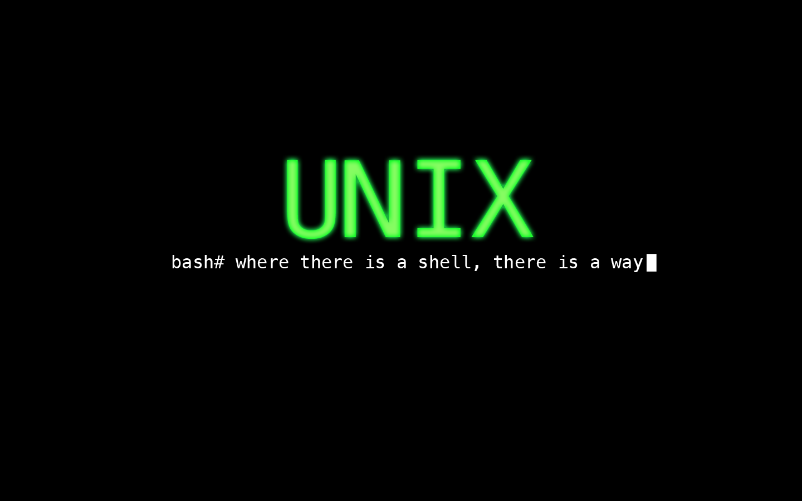

# Máster en Programación FullStack con JavaScript y Node.js
### JS, Node.js, Frontend, Backend, Firebase, Express, Patrones, HTML5_APIs, Asincronía, Websockets, Testing

## Clase 56




### UNIX Shell

> Una Shell de Unix o también shell, es el término usado en informática para referirse a un intérprete de comandos, el cual consiste en la interfaz de usuario tradicional de los sistemas operativos basados en Unix y similares como GNU/Linux.

> Mediante las instrucciones que aporta el intérprete, el usuario puede comunicarse con el núcleo y por extensión, ejecutar dichas órdenes, así como herramientas que le permiten controlar el funcionamiento de la computadora.

> Los comandos que aportan los intérpretes, pueden usarse a modo de guion si se escriben en ficheros ejecutables denominados shell-scripts, de este modo, cuando el usuario necesita hacer uso de varios comandos o combinados de comandos con herramientas, escribe en un fichero de texto marcado como ejecutable, las operaciones que posteriormente, línea por línea, el intérprete traducirá al núcleo para que las realice. Sin ser un shell estrictamente un lenguaje de programación, al proceso de crear scripts de shell se le denomina programación shell o en inglés, shell programming o shell scripting. [Wikipedia](https://es.wikipedia.org/wiki/Shell_de_Unix)

**Terminales más comunes**

- [bash](https://www.gnu.org/software/bash/) - GNU Project's shell (Bourne Again SHell)
- [elvish](https://elv.sh/) - Friendly, expressive shell features like anonymous functions and data structures
- [fish](https://fishshell.com) - Smart and user-friendly command line shell
- [shenv](https://github.com/shenv/shenv) - Simple shell version management
- [xiki](http://xiki.org) - Makes the shell console more friendly and powerful
- [xonsh](https://xonsh.org) - Python-ish, BASHwards-looking shell language and command prompt
- [zsh](http://www.zsh.org) - Powerful shell with scripting language

**Terminales Awesomicas**
- [Awesome Shell](https://github.com/alebcay/awesome-shell/blob/master/README.md)
- [awesome-cli-apps](https://github.com/agarrharr/awesome-cli-apps)
- [awesome-fish](https://github.com/fisherman/awesome-fish-shell)
- [awesome-zsh](https://github.com/unixorn/awesome-zsh-plugins)
- [terminals-are-sexy](https://github.com/k4m4/terminals-are-sexy)

**Recursos**
- [Bash Hackers Wiki](http://wiki.bash-hackers.org/)
- [Greg Wooledge's (aka "greycat") wiki](http://mywiki.wooledge.org).
  Specifically [Bash Guide](http://mywiki.wooledge.org/BashGuide), [Bash FAQ](http://mywiki.wooledge.org/BashFAQ) and [Bash Pitfalls](http://mywiki.wooledge.org/BashPitfalls)
- [Google's Shell Style Guide](https://google.github.io/styleguide/shell.xml)
- [The Linux Documentation Project: Bash Programming - Intro/How-to](http://tldp.org/HOWTO/Bash-Prog-Intro-HOWTO.html#toc)
- [The Linux Documentation Project: Advanced Bash Scripting Guide](http://www.tldp.org/LDP/abs/html/)
- [WikiBooks: Bash Shell Scripting](https://en.wikibooks.org/wiki/Bash_Shell_Scripting)
- [Use the Unofficial Bash Strict Mode (Unless You Looove Debugging)](http://redsymbol.net/articles/unofficial-bash-strict-mode/)
- [The Art of Command Line](https://github.com/jlevy/the-art-of-command-line)
- [Learn Enough Command Line to Be Dangerous](https://www.learnenough.com/command-line-tutorial)
- [A guide to learn bash](https://github.com/Idnan/bash-guide)
- [Bash-Snippets – A Collection Of Useful BASH Scripts For Heavy Commandline Users](https://www.ostechnix.com/collection-useful-bash-scripts-heavy-commandline-users/)

### Lidiando con el sistema

- [400 comandos que deberias conocer](http://blog.desdelinux.net/mas-de-400-comandos-para-gnulinux-que-deberias-conocer/)
- [Terminal online](http://www.tutorialspoint.com/unix_terminal_online.php)
- [Webminal](http://www.webminal.org/)
- [C9 - Terminal - Documentación](https://docs.c9.io/docs/terminal)
- [denysdovhan/bash-handbook](https://github.com/denysdovhan/bash-handbook)
- [Idnan/bash-guide](https://github.com/Idnan/bash-guide)
- [Wiki de bash-hackers](http://wiki.bash-hackers.org/start)

### [Resumen en 5 minutos](https://learnxinyminutes.com/docs/bash/)

### [Guía completa de referencia](https://devhints.io/bash)

## Shell Scripting

### Comentarios

```bash
# En una sola línea...
: '
Comentario
en multiples
líneas...
'
```

### Ejemplo simple

```bash
#!/usr/bin/env bash

nombre="Yo mismo"
echo "Hola $nombre!"
```

### Manejo de Variables

```bash
nombre="Yo mismo"
echo $nombre
echo "$nombre"
echo "${nombre}!"
```


### Diferencia entre tipos de cadenas de texto

- usando `'$nombre'` es literal.
- usando `"$nombre"`

```bash
nombre="Yo mismo"
echo "Hola $nombre"  #=> Hola Yo mismo
echo 'Hola $nombre'  #=> Hola $nombre
```


### Ejecución condicional

```bash
echo "Primero estos..." && "Si todo va bien... saldrá esto después"
git commit || echo "Esto pasa cuando falla lo anterior"
```

### Funciones

```bash
quien_eres() {
  echo "Yo mismo"
}

echo "Tu eres... $(quien_eres)"
```

### Ejecución de Terminal

```bash
echo "Estoy en $(pwd)"
echo "Estoy en `pwd`"
# Same
```


### Expansión de abrazadera (Brace expansion)

```bash
echo {A,B}.js   # A.js B.js
echo {1..5}	    # 1 2 3 4 5
```

### Expansión de parámetros

**Lo básico**

```bash
nombre="Fictizia"
echo ${nombre}
echo ${nombre/i/1}       #=> F1ctizia
echo ${nombre:0:5}       #=> Ficti
echo ${nombre::2}        #=> Fi
length=2
echo ${nombre:0:length}  #=> Fi

STR="/ruta/carpeta/fichero.sh"
echo ${STR%.sh}    # /ruta/carpeta/fichero
echo ${STR%.sh}.hacked  # /ruta/carpeta/fichero.hacked
echo ${STR##*.}     # sh (extension)
echo ${STR##*/}     # fichero.sh (script con extension)
echo ${STR#*/}      # ruta/carpeta/fichero.sh
echo ${STR##*/}     # fichero.sh
echo ${STR/carpeta/folder} # /ruta/folder/fichero.sh
```

**Valores por defecto**

```bash
${DATO:-val}	    # $DATO, o val si no existe
${DATO:=val}	    # Iguala $DATO a val si no existe
${DATO:+val}	    # val si $DATO existe
${DATO:?message}	# Muestra mensaje de error y sale si $DATO NO EXISTE
                    # Muestra "mensaje" como opcional)
```

### Bucles

**For (básico)**
```bash
for i in /etc/rc.*; do
  echo $i
done
```

**Rangos**
```bash
# Continuo
for i in {1..5}; do
    echo "Welcome $i"
done
```

**Rangos con pasos**
```bash
for i in {5..50..5}; do
    echo "Welcome $i"
done
```

**While**
```bash
while true; do
  #···
done
```

**Por cada linea de un fichero**
```bash
cat file.txt | while read line; do
  echo $line
done
```


### Funciones

**Definición de funciones**

```bash
miFuncion() {
    echo "Hola $1"
}

# Otra forma
function miFuncion() {
    echo "Hola $1"
}

miFuncion "Amigo!" #Hola Amigo!
```

**Retorno de valores**
- [Return no es lo que esperas](https://stackoverflow.com/a/17336953)

```bash
miFuncion() {
    local resul='Dato...'
    echo $resul
}
resultado=$(miFuncion) 
echo ${resultado} #Dato...
```

**Lanzamiento de Errores**

```bash
miFuncion() {
  return 1
}
if miFuncion; then
  echo "Éxito"
else
  echo "Fallo"
fi
```

**Argumentos**

```bash
$#	# Numero de Argumentos
$*	# Todos los argumentos
$@	# Todos los argumentos, Empezando por el primero
$1	# Primer Argumento
```

### Condicionales

**Operadores**

```bash
[ -z STRING ]	        # Cadena vacia
[ -n STRING ]	        # Cadena NO vacia
[ NUM -eq NUM ]	        # igual
[ NUM -ne NUM ]	        # desigual
[ NUM -lt NUM ]	        # Menor que
[ NUM -le NUM ]	        # Menor o igual que
[ NUM -gt NUM ]	        # Mayor que
[ NUM -ge NUM ]	        # Mayor o igual que
[[ STRING =~ STRING ]]	# Expresión regular
[ ! EXPR ]	            # Not
[ X ] && [ Y ]	        # And
[ X ] || [ Y ]	        # Or
```

**Operadores de ficheros**

```bash
[ -e ARCHIVO ]	            # Existe
[ -r ARCHIVO ]	            # Leible
[ -h ARCHIVO ]	            # Symlink (Vinculos simbolicos)
[ -d ARCHIVO ]	            # Directorio
[ -w ARCHIVO ]	            # Escribible
[ -s ARCHIVO ]	            # La logitud es mayor de 0 bytes
[ -f ARCHIVO ]	            # Fichro
[ -x ARCHIVO ]	            # Ejecutable
[ ARCHIVO1 -nt ARCHIVO2 ]	    # ARCHIVO1 es más reciente que ARCHIVO2
[ ARCHIVO1 -ot ARCHIVO2 ]	    # ARCHIVO2 es más reciente que ARCHIVO1
[ ARCHIVO1 -ef ARCHIVO2 ]	    # Son lo mismo ARCHIVO1 y ARCHIVO2
```

**Ejemplo cadenas de texto**

```bash
nombre="Yo mismo!"

if [ -z "$nombre" ]; then
  echo '$nombre esta vacio'
elif [ -n "$nombre" ]; then
  echo '$nombre NO esta vacio'
fi
```

**Ejemplo números**
```bash
numero=12
if [ ${numero} -ge 0 ]; then
   echo Número positivo
else
   echo Número negativo
fi
```

**Ejemplo Combinatorios**
```bash
if [ X ] && [ Y ]; then
  ###...
fi
```


**Ejemplo Ficheros**
```bash
if [ -e "fichero.txt" ]; then
  echo "fichero.txt existe"
fi
```

## Arrays

### Definición

```bash
frutas=('Manzana' 'Platano' 'Mnadarina');

lista_nueva[0]="Cohete"
lista_nueva[1]="Astronauta"
lista_nueva[2]="Lanzadera"
```

### Trabajando con Arrays

```bash
frutas=('Manzana' 'Platano' 'Mandarina');

echo Elemento[0]: ${frutas[0]}              # Elemento[0]: Manzana
echo Frutas: ${frutas[@]}                   # Frutas: Manzana Platano Mandarina
echo Longitud: ${#frutas[@]}                # Longitud: 3
echo Nº letras de Manzana: ${#frutas}       # Nº letras de Manzana: 7
echo Nº letras de Mandarina: ${#frutas[2]}  # Nº letras de Mandarina: 0
```

### Iteración

```bash
frutas=('Manzana' 'Platano' 'Mandarina');

for i in "${frutas[@]}"; do
  echo Elemento: $i
done
```

### Operaciones

```bash
frutas=('Manzana' 'Platano' 'Mandarina');
frutas=("${frutas[@]}" "Sandía")        # Push
Fruits=( ${Fruits[@]/Man*/} )           # Eliminar un elemento usando REGEX
unset Fruits[1]                         # Eliminar un elemento en concreto
lines=(`cat "fichero.txt"`)             # Read from file
```

## Otras cosas importantes

### Operaciones aritmeticas

```bash
$((a + 200))      # Añade 200 a $a
$((RANDOM%=200))  # Número al azar entre 0..200
```

### Inspecionando comandos

```bash
command -V cd
#=> cd is a shell builtin
```


### Input del usuario

```bash
echo -n "Proceed? [y/n]: "
read respuesta
echo $respuesta
```

### Terminales secundarios

```bash
(cd somedir; echo "I'm now in $PWD")
# pwd # still in first directory
```

### Redirección

```bash
python hello.py > output.txt   # stdout to (file)
python hello.py >> output.txt  # stdout to (file), append
python hello.py 2> error.log   # stderr to (file)
python hello.py 2>&1           # stderr to stdout
python hello.py 2>/dev/null    # stderr to (null)
python hello.py &>/dev/null    # stdout and stderr to (null)
python hello.py < foo.txt
```

### CRON, Programación de tareas

**Las Claves**
- Nos permite grabar tareas ciclicas (ejecutar scripts) en la maquina
- El tiempo minimo es de un minuto, una repetición al minuto
- Es altamente configurable
- `Cron` es un demonio dle sistema que supervisa los `jobs`
- `jobs` son las tareas que hemos programado en el sistema
- `Crontab` es un fichero de texto plano que guarda la información de los `jobs`
- Necesitas generar un script con `shebang` y permisos de ejecucción

**Esquema de tiempo**


**Agregar tareas**

- `00 19 * * * user_x /carpeta/del/script/ficherito.sh`
- `00 00 1 * * root /carpeta/del/script/algo.js`

**Recursos**
- [How to remove or delete single cron job using linux command?](https://askubuntu.com/questions/408611/how-to-remove-or-delete-single-cron-job-using-linux-command)
- [Linux crontab command](https://www.computerhope.com/unix/ucrontab.htm)
- [Cómo utilizar Cron y Crontab en Linux para programar tareas](https://www.redeszone.net/2017/01/09/utilizar-cron-crontab-linux-programar-tareas/)
- [Cron & crontab, explicados](https://blog.desdelinux.net/cron-crontab-explicados/)
- [How To Add Jobs To cron Under Linux or UNIX](https://www.cyberciti.biz/faq/how-do-i-add-jobs-to-cron-under-linux-or-unix-oses/)

### Ejercicios

**1 -** Katas de Shell en [CMD Challenge](https://cmdchallenge.com/#/hello_world). `¯\_(ツ)_/¯`