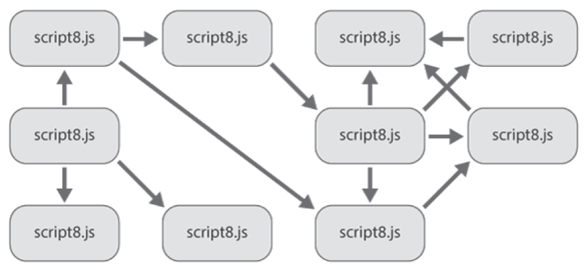
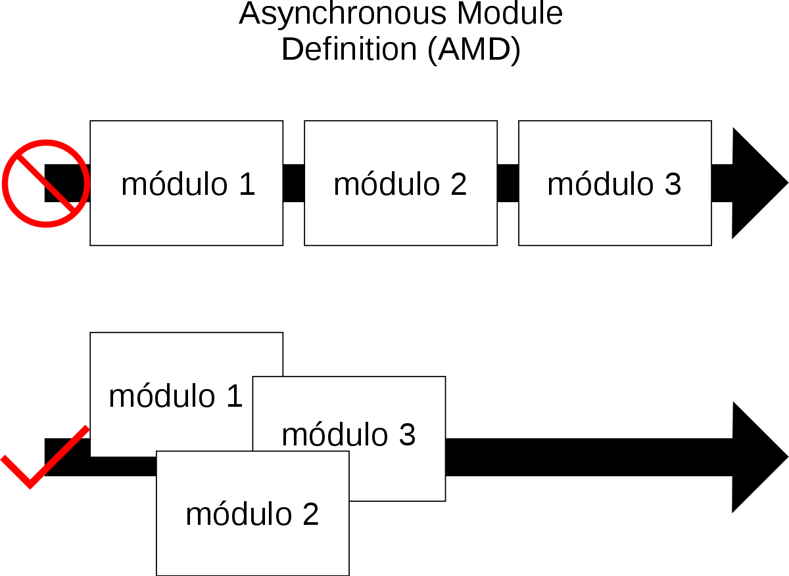

# Máster en Programación FullStack con JavaScript y Node.js
### JS, Node.js, Frontend, Backend, Firebase, Express, Patrones, HTML5_APIs, Asincronía, Websockets, Testing

## Clase 57


### JavaScript Modular
> En programación, un módulo es una porción de un programa de ordenador. De las varias tareas que debe realizar un programa para cumplir con su función u objetivos, un módulo realizará, comúnmente, una de dichas tareas (o varias, en algún caso).

> En general (no necesariamente relacionado con la programación), un módulo recibe como entrada la salida que haya proporcionado otro módulo o los datos de entrada al sistema (programa) si se trata del módulo principal de éste; y proporcionará una salida que, a su vez, podrá ser utilizada como entrada de otro módulo o bien contribuirá directamente a la salida final del sistema (programa), si se retorna al módulo principal.

> Particularmente, en el caso de la programación, los módulos suelen estar (no necesariamente) organizados jerárquicamente en niveles, de forma que hay un módulo principal que realiza las llamadas oportunas a los módulos de nivel inferior.

> Cuando un módulo es convocado, recibe como entrada los datos proporcionados por otro del mismo o superior nivel, el que ha hecho la llamada; luego realiza su tarea. A su vez este módulo convocado puede llamar a otro u otros módulos de nivel inferior si fuera necesario; cuando ellos finalizan sus tareas, devuelven la salida pertinente al módulo inmediato llamador, en secuencia reversa. Finalmente se continúa con la ejecución del módulo principal. [Wikipedia](https://es.wikipedia.org/wiki/M%C3%B3dulo_(inform%C3%A1tica))

**Las claves**
- Los modulos son "pequeños" fragmentos de codigo muy especializados
- Los modulos son "independientes" y remplazables por otros
- Los modulos tienen dependencias entre si, en ocasiones cruzadas
- Los modulos premiten encapsular mucha lógica en forma de cajas negras
- Una buena modularizacón permite subir el nivel de abstraccion de una aplicación
- Existen muchas formas de gestionar la carga y dependencia de modulos en JavaScript

**Las ventajas**
- Desacoplamineto, que nos ayudará con las refactorizaciones futuras
- Extensibildiad del código
- Alta reutilización del código
- División clara del código, lo que facilita la escalabildiad y el mantenimiento
- Es más sencillo que otros sistemas de gestión de dependencias
- Facilemnte automatizable, después de aprender un nuevo workflow

**Las desventajas**
- Necesitamos dependencias nuevas para gestioanr esto
- Necesitamos pensar de forma modular, lo que implica más código y artilugios


**Dependencias y modularidad**


**Recursos**
- [Ebook | Mastering Modular JavaScript by Nicolás Bevacqua](https://ponyfoo.com/books/mastering-modular-javascript#toc)
- [Ebook | Exploring JS | Chapter 16: Modules](http://exploringjs.com/es6/ch_modules.html)
- [Basics of Modular JavaScript](https://medium.com/@crohacz_86666/basics-of-modular-javascript-2395c82dd93a)
- [Everything I know about writing modular JavaScript applications](https://medium.com/dev-bits/everything-i-know-about-writing-modular-javascript-applications-37c125d8eddf)
- [Circular dependencies in JavaScript a.k.a. Coding is not a rock-paper-scissors game](https://medium.com/content-uneditable/circular-dependencies-in-javascript-a-k-a-coding-is-not-a-rock-paper-scissors-game-9c2a9eccd4bc)
- [JavaScript Modules: A Beginner’s Guide](https://medium.freecodecamp.org/javascript-modules-a-beginner-s-guide-783f7d7a5fcc)
- [Writing Modular JavaScript With AMD, CommonJS & ES Harmony](https://addyosmani.com/writing-modular-js/)
- [Understanding JavaScript Modules](https://spring.io/understanding/javascript-modules)
- [Mastering the Module Pattern](https://toddmotto.com/mastering-the-module-pattern/)
- [Writing Modular JavaScript](https://code.tutsplus.com/tutorials/writing-modular-javascript--net-14746)
- [Copying Objects in JavaScript](https://scotch.io/bar-talk/copying-objects-in-javascript)
- [A 10 minute primer to JavaScript modules, module formats, module loaders and module bundlers](https://www.jvandemo.com/a-10-minute-primer-to-javascript-modules-module-formats-module-loaders-and-module-bundlers/)
- [How Do You Structure JavaScript? The Module Pattern Edition](https://css-tricks.com/how-do-you-structure-javascript-the-module-pattern-edition/)
- [Code in JavaScript the smart, modular way](https://www.javaworld.com/article/2109734/html-css-js/code-in-javascript-the-smart-modular-way.html)
- [Dependency injection in JavaScript](http://krasimirtsonev.com/blog/article/Dependency-injection-in-JavaScript)
- [Clonando objetos en JavaScript](https://jherax.wordpress.com/2014/07/20/js-clonando-objetos/)


### JavaScript Modular: Sin esquemas, ni planes...


**¿Te suena esto...?**
```html
<script src="myjavascript1.js"></script>
<script src="myjavascript2.js"></script>
<!-- ... -->
<script src="myjavascript10.js"></script>
```
```
index.html
static/
   js/
     app/
     vendor/
   css/
     app/
     vendor/
```

**Problemas**
- Interdependecias horibles
- Mucho, mucho, mucho... ruido en cada fichero
- Demasiado código para leer y entender que pasa
- Demasiada interconexión, imposible refacorizar
- Un Cambio mediano puede significar volver a empezar el proyecto de cero
- No es posible reutilizar nada
- :trollface: Nuestros datos y lógica de negocio se extienden globlamente por toas partes
- Lentitud de carga en toda la web, demasiadas cosas sincronas tienen que cargar

### JavaScript Modular: Patrones


**Usemos lo que conocemos**
- Namespace Pattern
- Revealing Module Pattern 
- Module Pattern
- Singleton Pattern

**Limitaciones para la implementación directa**
- Poca abstracción en la aplicación
- Mucho código para gestionar cada módulo
- Gestión muy manual y rigida
- La carga asincrona es un reto técnico
- Las dependencias circulares son un tema delicado de gestionar


### JavaScript Modular: CommonJS


**¿Cómo funciona?**
- Fichero `math.js`
```javascript
//@see: http://www.commonjs.org/specs/modules/1.0/
exports.add = function() {
    var sum = 0, i = 0, args = arguments, l = args.length;
    while (i < l) {
        sum += args[i++];
    }
    return sum;
};

//ES6 Version
exports.add = function(...numbers) {
    return numbers.reduce((previous, current) => {
      return previous + current;
    });
};
```

- Fichero `increment.js` 
```javascript
//@see: http://www.commonjs.org/specs/modules/1.0/
var add = require('math').add;
exports.increment = function(val) {
    return add(val, 1);
};
```

- Fichero `program.js`
```javascript
//@see: http://www.commonjs.org/specs/modules/1.0/
var inc = require('increment').increment;
var a = 1;
inc(a); // 2
```

**Las claves**
- Más extendido en el backend, especialmente Node
- Simple y sencillo, no requiere una curva de aprendizaje
- Soporta dependencias circulares
- [Una espeficicación sencilla](http://www.commonjs.org/specs/modules/1.0/)

**Los problemas**
- Un archivo por modulo
- La carga por definición es sincrona, pero existen workarounds (Ajax)
- No se puede implementar sin una librería


**Librerias Específicas**
- [SystemJS](https://github.com/systemjs/systemjs)
- [curl.js](http://github.com/unscriptable/curl)
- [SproutCore 1.1](http://sproutcore.com)
- [PINF](http://github.com/pinf/loader-js)

**Recursos**
- [CommonJS effort sets JavaScript on path for world domination](https://arstechnica.com/information-technology/2009/12/commonjs-effort-sets-javascript-on-path-for-world-domination/)
- [CommonJS | Web Site](http://www.commonjs.org)
- [CommonJS | Spec 1.0](http://www.commonjs.org/specs/modules/1.0/)
- [Thoughts on CommonJS / RequireJS](http://lisperator.net/blog/thoughts-on-commonjs-requirejs/)
- [CommonJS: Why and How](https://0fps.net/2013/01/22/commonjs-why-and-how/)
- [AMD is Not the Answer](https://tomdale.net/2012/01/amd-is-not-the-answer/)
- [Lazy evaluation of CommonJS modules](https://calendar.perfplanet.com/2011/lazy-evaluation-of-commonjs-modules/)
- [JavaScript Growing Up](http://www.slideshare.net/davidpadbury/javascript-growing-up)
- [The RequireJS Notes On CommonJS](http://requirejs.org/docs/commonjs.html)
- [Taking Baby Steps With Node.js And CommonJS - Creating Custom Modules](http://elegantcode.com/2011/02/04/taking-baby-steps-with-node-js-commonjs-and-creating-custom-modules/)
- [Asynchronous CommonJS Modules for the Browser](http://www.sitepen.com/blog/2010/07/16/asynchronous-commonjs-modules-for-the-browser-and-introducing-transporter/)
- [The CommonJS Mailing List](http://groups.google.com/group/commonjs)


### JavaScript Modular: Asynchronous Module Definition (AMD)



**¿Cómo funciona?**
- Fichero `math.js`
```javascript
define("add", function () {
    var sum = 0, i = 0, args = arguments, l = args.length;
    while (i < l) {
        sum += args[i++];
    }
    return sum;
});

//ES6 Version
define("add", (...numbers) => {
    return numbers.reduce((previous, current) => {
      return previous + current;
    });
};
```

- Fichero `increment.js` 
```javascript
define("increment", ["add"], function (add) {
    return add(val, 1);
});
```

- Fichero `program.js`
```javascript
require(['increment'], function ( inc ) {
  var a = 1;
  inc(a); // 2
});
```

**Las claves**
- Historicamente más extendido en el frontend, Angula 1.x, Backbone, etc...
- Creado por developers decontentos con Common.js y su carga síncrona
- Soporta Plugins
- Los modulos pueden romperse en multiples ficheros
- Asincronia de base
- Compatibildiad con `require`y `exports`
- Buen soporte a dependencias circulares

**Los problemas**
- Demasiado verboso, mucha decoración...
- No funciona sin librerias externas

**Librerías**
- [Requirejs](https://requirejs.org/)
- [Dojo](https://dojotoolkit.org/)

**Recursos**
- [The RequireJS Guide To AMD](http://requirejs.org/docs/whyamd.html)
- [What's the fastest way to load AMD modules?](http://unscriptable.com/index.php/2011/09/21/what-is-the-fastest-way-to-load-amd-modules/)
- [AMD vs. CJS, what's the better format?](http://unscriptable.com/index.php/2011/09/30/amd-versus-cjs-whats-the-best-format/)
- [AMD Is Better For The Web Than CommonJS Modules](http://blog.millermedeiros.com/2011/09/amd-is-better-for-the-web-than-commonjs-modules/)
- [AMD No Longer A CommonJS Specification](http://groups.google.com/group/commonjs/browse_thread/thread/96a0963bcb4ca78f/cf73db49ce267ce1?lnk=gst#)
- [On Inventing JavaScript Module Formats And Script Loaders](http://tagneto.blogspot.com/2011/04/on-inventing-js-module-formats-and.html)
- [The AMD Mailing List](http://groups.google.com/group/amd-implement)


### JavaScript Modular: ECMAScript 6 modules (Native JavaScript)

**:warning: IMPORTANTE: Soporte limitado aún :-(**
- [Soporte en browser](https://caniuse.com/#feat=es6-module)
- [El GRAN lastre de IE... ¿Hasta cuando?](https://support.microsoft.com/en-us/help/13853/windows-lifecycle-fact-sheet)
- [En Node 10.9.x sigue siendo experiemntal](https://nodejs.org/api/esm.html)

**¿Cómo sería?**
- Fichero `math.js`
```javascript
export function add(...numbers) {
  return numbers.reduce((previous, current) => {
    return previous + current;
  });
}
```

- Fichero `increment.js` 
```javascript
import {add} from 'math';

export function increment(val) {
    return add(val, 1);
}
```

- Fichero `program.js`
```javascript
import {increment as inc} from 'increment';

const a = 1;
inc(a); // 2
```

**:gift: Bonus: Importación asíncrona**

- Asíncrona (solo un módulo)
```javascript
System.import('modulo')

  .then(modulo => {
      // Uso del módulo importado
  })
  .catch(error => {
      // Gestión de errores
  });
```

- Asíncrona (multiples módulos)
```javascript
Promise.all(
    ['module1', 'module2', 'module3']
    .map(x => System.import(x)))
.then(([module1, module2, module3]) => {
    // Use module1, module2, module3
});
```

**Las claves**
- Sencillo, sencillo, sencillo y mucho más simple
- asincrono y sincrono de igual forma
- Ya viene de fabrica con ES6
- Soporta dependencias circulares

**Los problemas**
- Soporte :-(
- Tenemos que usar babel para transpilarlo

### JavaScript Modular: Bundles


**El problema**
- Tenemos demasiados ficheros con muchas dependencias cruzadas
- A veces la carga es muy lenta y compleja
- Tenemos que descargar muchos focheros distintos en tiempo de ejecucion
- Tenemos limites en cuanto al volumen de ficheros que podemos descargar
- HTTP1.1 tiene muchas limitaciones que rompera http2.0, pero aún no es standard

**La idea**
- Fusionamos los ficheros del mismo tipo en uno solo
- Servivos un único fichero por tipo
- Hacemos una versión smart, quitando todo lo que nos sobra o no se ejecutará
- Minificamos y comprimimos la información todo lo posible

### Bower ha muerto


> BOWER is dead. Only use it for legacy reasons.

**Literatura al respecto**

- [Bower/bower #2298: Consider deprecating Bower](https://github.com/bower/bower/issues/2298#issuecomment-289846310)
- [Bower is dead, long live npm. And Yarn. And webpack in snyk.io/blog by Assaf Hefetz](https://snyk.io/blog/bower-is-dead/)
- [Reddit: Is bower dead? Should we start using other dependency managers?](https://www.reddit.com/r/javascript/comments/5ls30m/is_bower_dead_should_we_start_using_other/)
- [Quora: Is Bower dying?](https://www.quora.com/Is-Bower-dying?utm_medium=organic&utm_source=google_rich_qa&utm_campaign=google_rich_qa)

### La nueva generación

**Paso 1: Tus herramientas son las de siempre**
- [NPM](https://www.npmjs.com/features)
- [YARN](https://yarnpkg.com/en/)
- [webpack](https://webpack.js.org/concepts/)

**Paso 2: Pasar del `bower.json` al `package.json`**

**Paso 3: Deja de usar `wiredep` y empieza a usar solamente `require()`**

_Nota: Esto es al estilo Browserify exclusivamente_

- [wiredep: Wire Bower dependencies to your source code](https://github.com/taptapship/wiredep)
- [browserify: browser-side require() the node.js way](https://github.com/browserify)
- Debes instalar browserify de forma global con `npm install -g browserify`
- Ejemplo de carga de dependencias
  ```javascript
  var $ = require('jquery'),
      _ = require('lodash'),
      angular = require('angular');
  //..
  ```
- Puedes comprimir y unificar todo el JS en un solo comando `browserify app.js -o bundle.js` y en un único fichero `<script src="bundle.js"></script>`
- Si ademas instalas [watchify](https://github.com/substack/watchify) con `watchify app.js -o bundle.js` refescas los cambios en tiempo real.

**Extra 1: Cosas Interesantes**
- [Usar el campo `browser` en el `package.json`](https://github.com/substack/node-browserify#browser-field)

**Extra 2: Un mundo de información te espera**

- [Why We Should Stop Using Bower – And How to Do It](https://gofore.com/stop-using-bower/)
- [Browserify VS Webpack - JS Drama](http://blog.namangoel.com/browserify-vs-webpack-js-drama)
- [npm and front-end packaging](http://blog.npmjs.org/post/101775448305/npm-and-front-end-packaging)
- [The jQuery Module Fallacy](https://www.evernote.com/shard/s93/sh/390d6836-8797-4f0c-a7c2-fc77fbb0a9b8/649f084e90bae42f)

### Browserify


**Caracteristicas**
- solo soporta el patrón CommonJS, usaremos `require()` en el browser
- Genera un fichero bundle con todo el js
- Se puede usar con un fichero de configuración complejo
- Se instala globalmente `npm install browserify -g`


**Recursos**
- [browserify-handbook](https://github.com/browserify/browserify-handbook)
- [Getting Started with Browserify](https://www.sitepoint.com/getting-started-browserify/)
- [Primeros pasos con Browserify con Nazarí González](http://www.nazariglez.com/2015/02/19/primeros-pasos-con-browserify/)
- [Browserify. Desarrollando tu Frontend como en Node.js con Carlos Azaustre](https://carlosazaustre.es/browserify-desarrollando-tu-frontend-como-en-node-js/)
- [Getting Started with Browserify with Kyle](https://www.youtube.com/watch?v=CTAa8IcQh1U)
- [Usa módulos del lado cliente con Browserify! en Cristalab](http://www.cristalab.com/tutoriales/usa-modulos-del-lado-cliente-con-browserify-c114540l/)
- [Building angular app using browserify in Hackernoon](https://hackernoon.com/building-angular-app-using-browserify-704a7947a09e)
- [Hacking Browserify with Krasimir](http://krasimirtsonev.com/blog/article/hacking-browserify)


**Ejemplo**

Nuestro fichero `public/main.js`:
```javascript
var foo = require('./foo.js');
var bar = require('../lib/bar.js');
var gamma = require('gamma');

var elem = document.getElementById('result');
var x = foo(100) + bar('baz');
elem.textContent = gamma(x);
```

Nuestro fichero `public/foo.js`:
```javascript
module.exports = function (n) { return n * 111 }
```

Comando que hace toda la magia:
```bash
browserify main.js > bundle.js
```

Nuestro fichero `public/index.html`
```html
<!doctype html>
<html>
  <head>
    <title>Browserify Playground</title>
  </head>
  <body>
    <script src="/static/js/bundle.js"></script>
  </body>
</html>
```

### Require.js & AMD


**Documentación**
- [Web oficial](https://requirejs.org/)
- [Punto de partida](https://requirejs.org/docs/start.html)
- [Descargar](https://requirejs.org/docs/download.html)
- [API](https://requirejs.org/docs/api.html)
- [Optimization](https://requirejs.org/docs/optimization.html)
- [CommonJS Notes](https://requirejs.org/docs/commonjs.html)
- [FAQs](https://requirejs.org/docs/faq.html)
- [Common Errors](https://requirejs.org/docs/errors.html)
- [Writing Plugins](https://requirejs.org/docs/plugins.html)
- [Why Web Modules](https://requirejs.org/docs/why.html)
- [Why AMD](https://requirejs.org/docs/whyamd.html)
- [Requirements](https://requirejs.org/docs/requirements.html)
- [History](https://requirejs.org/docs/history.html)
- [Get Help](https://stackoverflow.com/questions/tagged/requirejs)
- [Blog](https://jrburke.com/)
- [@jrburke en Twitter](https://twitter.com/jrburke)
- [GitHub](https://github.com/requirejs/requirejs)
- [Contributing](https://requirejs.org/docs/contributing.html)


**Recursos**
- [Qué es y como funciona RequireJS](http://7sabores.com/blog/como-funciona-requirejs)
- [Introducción a Require.js](https://www.adictosaltrabajo.com/tutoriales/introduccionarequirejs/)
- [Gist | Can you help me understand the benefit of require.js?](https://gist.github.com/desandro/4686136)
- [RequireJS Tutorial](https://www.tutorialspoint.com/requirejs/)
- [Understanding RequireJS for Effective JavaScript Module Loading](https://www.sitepoint.com/understanding-requirejs-for-effective-javascript-module-loading/)
- [Introduction to RequireJS](https://javascriptplayground.com/requirejs-amd-tutorial-introduction/)
- [RequireJS API](http://devdocs.io/requirejs/)
- [Understanding AMD & RequireJS](https://www.devbridge.com/articles/understanding-amd-requirejs/)
- [RequireJS Per-Page Modules](https://www.imarc.com/blog/requirejs-page-modules)
- [Organize Your Code with RequireJS](http://blog.teamtreehouse.com/organize-your-code-with-requirejs)
- [Introducción y ejemplo de RequireJS](http://elblogdepicodev.blogspot.com/2013/03/introduccion-y-ejemplo-de-requirejs.html)

### Require.js & AMD: En la práctica...

**Código convencional ([Código espagueti](https://www.wikiwand.com/es/C%C3%B3digo_espagueti))**
 
`index.html`
```html
<!doctype html>
<html lang="en">
<head>
  <meta charset="utf-8">
  <title>Testing Requirejs</title>
</head>
<body>
  <script src="calculadora.js"></script>
</body>
</html>
```

`calculadora.js`
```javascript
function sumar (x, y) {
    return x+y
};

function restar (x, y) {
    return x-y
};

function multiplicar (x, y) {
    return x*y
};


function dividir (x, y) {
    return x/y
};
```


**Solución sencilla: Creando un objeto**

`calculadora.js`
```javascript
var calculadora = {};

calculadora.sumar = function (x,y) {
    return x + y
};
calculadora.restar = function (x, y) {
    return x - y
}
calculadora.multiplicar = function (x, y) {
    return x * y
}
calculadora.divir = function (x, y) {
    return x / y
}
```


**Solución modular: Namespace Pattern**
`index.html`
```html
<script src="sumar.js"></script>
<script src="restar.js"></script>
<script src="divir.js"></script>
<script src="multiplicar.js"></script>
```

`sumar.js`
```javascript
var calculadora = calculadora || {};
calculadora.sumar = function (x,y) {
    return x + y
};
```

`restar.js`
```javascript
var calculadora = calculadora || {};
calculadora.restar = function (x, y) {
    return x - y
}
```

`dividir.js`
```javascript
var calculadora = calculadora || {};
calculadora.divir = function (x, y) {
    return x / y
}
```


`multiplicar.js`
```javascript
var calculadora = calculadora || {};
calculadora.multiplicar = function (x, y) {
    return x * y
}
```


**Usando Require.js**

`index.html`
```html
<!doctype html>
<html lang="en">
<head>
  <meta charset="utf-8">
  <title>Testing Requirejs</title>
</head>
<body>
  <script data-main="calculadora" src="require.js"></script>
</body>
</html>
```

`calculadora.js`
```javascript
require(['calculadora/sumar', 'calculadora/restar', 'calculadora/cuadrado'], function (sum, res, cua) {
  console.info(sum(1,2)); // 1 + 2
  console.info(res(3,1)); // 3 - 1
  console.log(cua(2)); // 2 * 2
});
```

`calculadora/sumar.js`
```javascript
define(function () {
  return function (x, y) {
      return x + y;
  };
});
```

`calculadora/restar.js`
```javascript
define(function () {
  return function (x, y) {
      return x - y;
  };
});
```

`calculadora/multiplicar.js`
```javascript
define(function () {
  return function (x, y) {
      return x * y;
  };
});
```

`calculadora/cuadrado.js`
```javascript
define(['calculadora/multiplicar'], function (multiplicar) {
  return function (x) {
      return multiplicar(x, x);
  };
});
```


### Require.js: Modo Avanzado

**Require.js con dependencias externas**

```javascript
// vendor/jquery.min.js
require(['vendor/jquery'], function($){
    $('#hola').html("<h1>HOLA! Hola!</h1>");
});
```


**Generando varios modulos en el mismo archivo**

`script.js`
```javascript
require(['hola', 'adios'], function(hola, adios){
    $('#hola').html("<h1>"+hola+" y "+adios+"!</h1>");
});
```

`hola.js`
```javascript
define(function() {
    return "Hola";
});

define('adios', function() {
    return "adios";
});
```

**configurando baseUrl**

Estructura del proyecto:
```  
www/
    /assets/
    /css/
    /js/
        /App/
            main.js
    /vendor/
        bootstrap.js
        jquery.js
```

`config.js`
```javascript    
requirejs.config({
    baseUrl: '.assets/js'
});
```

`*.js`
```javascript
require(['vendor/jquery', 'vendor/bootstrap', 'app/main']);
```


**configurando Paths**

Estructura del proyecto:
```  
www/
    /assets/
    /css/
    /js/
        /app/
            main.js
    /vendor/
        bootstrap.js
        jquery.js
```  


`config.js`
```javascript
requirejs.config({
    baseUrl: '.assets/js',
    paths: {
        'jquery': 'vendor/jquery',
        'bootstrap': 'vendor/bootstrap',
        'main': 'app/main'
    }
});
```

`*.js`
```javascript
require(['jquery', 'bootstrap', 'main']);
```


### Ejercicios 

**1 -** Modulariza tu proyecto usando algún sistema de gestión de dependencias (AMD, Common o Harmony)
```javascript
// Tu solución
```