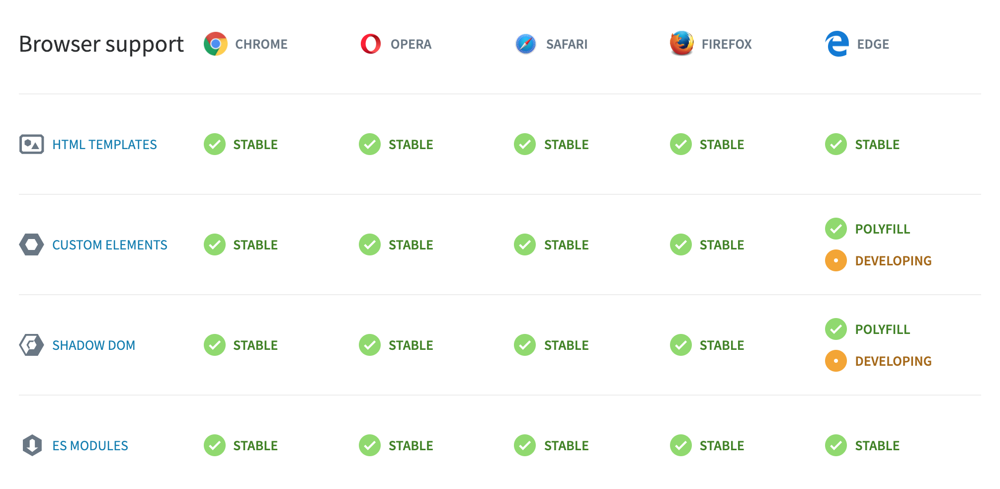
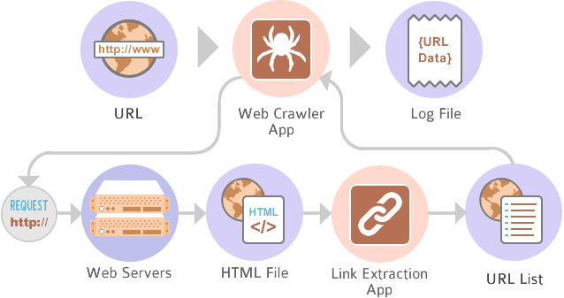
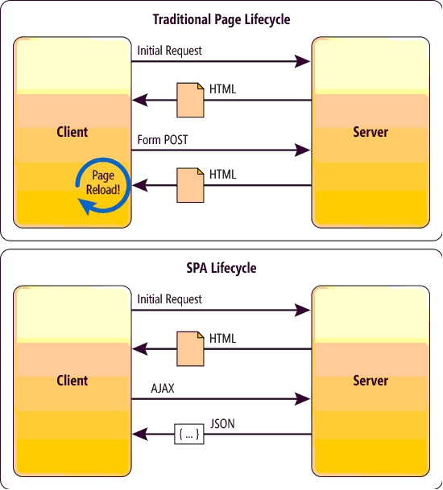
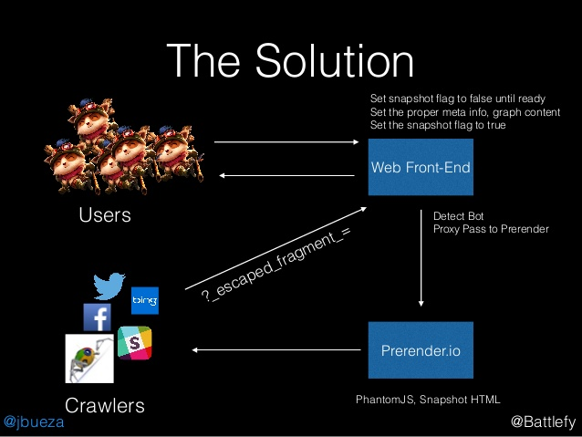

# Máster en Programación FullStack con JavaScript y Node.js
### JS, Node.js, Frontend, Backend, Firebase, Express, Patrones, HTML5_APIs, Asincronía, Websockets, Testing

## Clase 60

### Frameworks

> Un `framework`, `entorno de trabajo` o `marco de trabajo` es un conjunto estandarizado de conceptos, prácticas y criterios para enfocar un tipo de problemática particular que sirve como referencia, para enfrentar y resolver nuevos problemas de índole similar.
> En el desarrollo de software, un entorno de trabajo es una estructura conceptual y tecnológica de asistencia definida, normalmente, con artefactos o módulos concretos de software, que puede servir de base para la organización y desarrollo de software. Típicamente, puede incluir soporte de programas, bibliotecas, y un lenguaje interpretado, entre otras herramientas, para así ayudar a desarrollar y unir los diferentes componentes de un proyecto.
> Representa una arquitectura de software que modela las relaciones generales de las entidades del dominio, y provee una estructura y una especial metodología de trabajo, la cual extiende o utiliza las aplicaciones del dominio.
> [Wikipedia](https://es.wikipedia.org/wiki/Framework)

### JS Frameworks: ¿Por qué existen?


**Razones**
- Es muy complicado mantener la UI sincronizada con el estado de la aplicación
- Los frameworks modernos se basan en componentes que se pueden reutilizar
- Existe una comundiad fuerte que se enfrenta a retos similares
- Existen muchas extensiones y librerias para los frameworks
- Existen publicaciones especificas (blogs, podcasts, tags, libros...) que facilitan la investigación


**Recursos**
- [The deepest reason why modern JavaScript frameworks exist](https://medium.com/dailyjs/the-deepest-reason-why-modern-javascript-frameworks-exist-933b86ebc445)
- [The Magpie Developer](http://blog.codinghorror.com/the-magpie-developer/)


### JS Frameworks: Anatomía

- Bootstrapping y estructura
- Patrones y arquitectura (MV* Pattern)
- Polyfills y transpilación
- Web components
- Templates
- virtual DOM
- Data Binding (One-way, Two-way, etc...)
- Gestión de AJAX y Eventos
- Dependency Injection
- Routing y Vistas
- y más....

### JS Frameworks - Partes: Web components

> Web Components constiste en distintas tecnologías independientes. Puedes pensar en Web Components como en widgets de interfaz de usuario reusables que son creados usando tecnología Web abierta. Son parte del navegador, y por lo tanto no necesitan bibliotecas externas como jQuery o Dojo. Un Web Component puede ser usado sin escribir código, simplemente añadiendo una sentencia para importarlo en una página HTML. Web Components usa capacidades estándar, nuevas o aún en desarrollo, del navegador. [MDN](https://developer.mozilla.org/es/docs/Web/Web_Components)

**Soporte**



**Partes en juego**
- [Custom Elements](https://developer.mozilla.org/en-US/docs/Web/Web_Components/Custom_Elements) *Necesario para agregar nuevos elementos HTML en el DOM*
- [HTML Templates](https://developer.mozilla.org/en-US/docs/Web/HTML/Element/template) *Las reglas sobre cómo crear un DOM único encapsulado con sintaxis HTML*
- [Shadow DOM](https://developer.mozilla.org/en-US/docs/Web/Web_Components/Shadow_DOM) *Permiten importar código HTML y reutilizar sus componentes en otras webs*
- [HTML Imports](https://developer.mozilla.org/en-US/docs/Web/Web_Components/HTML_Imports) *Necesario para escribir código reutilizable y declarar cómo debe verse, aunque es [problemático](https://hacks.mozilla.org/2015/06/the-state-of-web-components/)*


**¿Cómo crear un web component nativo?**

[](https://www.youtube.com/watch?v=8bcfgXePHnk)


**Ciclo de Vida de los componentes (Custom Element Lifecycle)**
- `connectedCallback` *Cuando el elemento se inserta en el DOM*
- `disconnectedCallback` *Cuando el elemento se elimina en el DOM*
- `adoptedCallback` *Cuando el elemento se mueve a otro documento*
- `attributeChangedCallback` *Cuando un atributo que esta siendo observado cambia*

**Ejemplos en Acción**
- [carlosazaustre/webcomponents-example](https://github.com/carlosazaustre/webcomponents-example)
- [PLAIN ES6. Web components and Shadow DOM by Mikko Kämäräinen](https://codepen.io/mikkokam/pen/dopmRb?editors=1010)
- [nuclei/material-input](https://github.com/nuclei/material-input)

**[Frameworks y librerías destacadas](https://www.webcomponents.org/libraries)**
- [Hybrids](https://github.com/hybridsjs/hybrids) *🖍 UI library for creating Web Components with simple and functional API*
- [LitElement](https://github.com/Polymer/lit-element) *A simple base class for creating fast, lightweight web components*
- [Polymer](https://www.polymer-project.org/) *Our original Web Component library*
- [Skate.js](https://skatejs.gitbooks.io/skatejs/content/) *a web component library designed to give you an augmentation of the web component specs focusing on a functional rendering pipeline, clean property / attribute semantics and a small footprint*
- [Slim.js](http://slimjs.com/) *Fast and robust micro-framework and tooling for web components*
- [Stencil.js](https://stenciljs.com/) *A Web Component compiler for building fast, reusable UI components and Progressive Web Apps 💎 Built by the Ionic Framework team*

**Recursos**
- [Building Web Components with Vanilla JavaScript](https://dev.to/aspittel/building-web-components-with-vanilla-javascript--jho)
- [HTML Web Component using Plain JavaScript](https://www.codementor.io/ayushgupta/vanilla-js-web-components-chguq8goz)
- [Web Fundamentals Guides | Custom Elements v1: Componentes web reutilizables](https://developers.google.com/web/fundamentals/web-components/customelements?hl=es)
- [Carlos Azaustre | Cómo crear un WebComponent de forma nativa](https://carlosazaustre.es/como-crear-webcomponent-de-forma-nativa/)
- [MDN | Web components](https://developer.mozilla.org/es/docs/Web/Web_Components)
- [Web components tutorial](https://component.kitchen/tutorial)
- [Intro To Web Components: What They Are & How They Work](https://designmodo.com/web-components/)
- [Stencil.js: crear web components nunca fue tan fácil](https://www.paradigmadigital.com/dev/stencil-js-crear-web-components-nunca-fue-tan-facil/)
- [Web Components in 2018](https://www.sitepen.com/blog/2018/07/06/web-components-in-2018/)
- [The Holy Grail Of Reusable Components: Custom Elements, Shadow DOM, And NPM](https://www.smashingmagazine.com/2018/07/reusable-components-custom-elements-shadow-dom-npm/)
- [Communication between components (universal)](https://hackernoon.com/communication-between-components-7898467ce15b)
- [Front-end microservices with Web Components](https://hackernoon.com/front-end-microservices-with-web-components-597759313393)
- [The Wonderful World of Web Components](https://hackernoon.com/the-wonderful-world-of-web-components-e4c1675c6901)
- [Building a custom tag input with Skate.js](https://hackernoon.com/building-a-custom-tag-input-with-skate-js-fbd4cdf744f)

### JS Frameworks - Partes: virtual dom

> En primer lugar, el DOM virtual no fue inventado por React, pero React lo usa y lo proporciona de forma gratuita.
> 
> El DOM virtual es una abstracción del DOM HTML. Es ligero y separado de los detalles de implementación específicos del navegador. Dado que el propio DOM ya era una abstracción, el DOM virtual es, de hecho, una abstracción de una abstracción.
> [React Kung Fu](https://reactkungfu.com/2015/10/the-difference-between-virtual-dom-and-dom/)

**Concepto**


**Claves**
- Necesitas crear una abstracción del DOM Actual y su estado
- Trabajas contra el DOM Virtual que se encarga de sincronizar los cambios con el DOM Real
- El DOM Virtual se encarga de mantenerse sincronziado con el estado de la aplicación
- El DOM Virtual deber contener un algoritmo que analice las diferencias respecto al DOM y pueda atomizar los cambios
- El DOM Virtual debe gestionar la inclusión y eliminado de nuevos y viejos elementos de forma atomica sin perder la soncronización con el estado


**La guía definitiva**
[](https://www.youtube.com/watch?v=yFE4iWkrI2Y)


**Librerías**
- [Virtual-dom](https://github.com/Matt-Esch/virtual-dom) *A Virtual DOM and diffing algorithm*
- [Snabbdom](https://github.com/snabbdom/snabbdom) *A virtual DOM library with focus on simplicity, modularity, powerful features and performance*
- [Maquette](https://github.com/AFASSoftware/maquette) *Pure and simple virtual DOM library*

**Recursos**
- [Learn the differences between Shadow DOM and Virtual DOM](https://vuejsfeed.com/blog/learn-the-differences-between-shadow-dom-and-virtual-dom)
- [Shadow DOM != Virtual DOM](https://develoger.com/shadow-dom-virtual-dom-889bf78ce701)
- [JSDayES 2018 - Rubén Valseca - "¿Cómo funciona un Virtual DOM?"](https://www.youtube.com/watch?v=yFE4iWkrI2Y)
- [How to write your own Virtual DOM](https://medium.com/@deathmood/how-to-write-your-own-virtual-dom-ee74acc13060)
- [¿Qué es el Virtual DOM y como funciona?](https://www.arquitecturajava.com/que-es-el-virtual-dom-y-como-funciona/)
- [The difference between Virtual DOM and DOM](https://reactkungfu.com/2015/10/the-difference-between-virtual-dom-and-dom/)

### JS Frameworks - Partes: Data Binding

[](https://www.destroyallsoftware.com/talks/wat)

> En la programación de computadoras, el enlace de datos es una técnica general que une los orígenes de datos del proveedor y el consumidor y los sincroniza. Esto generalmente se hace con dos fuentes de datos / información con diferentes idiomas como en el enlace de datos XML. En el enlace de datos de la IU, los objetos de datos e información del mismo lenguaje pero con diferentes funciones lógicas están vinculados entre sí (por ejemplo, los elementos de la IU de Java a los objetos de Java).
> 
> En un proceso de enlace de datos, cada cambio de datos se refleja automáticamente por los elementos que están vinculados a los datos. El término enlace de datos también se usa en los casos en que una representación externa de los datos en un elemento cambia, y los datos subyacentes se actualizan automáticamente para reflejar este cambio.
> [Wikipedia](https://en.wikipedia.org/wiki/Data_binding)


**Concepto: One-way**


**Concepto: Two-way**


**[Ejemplo de Angularjs](https://www.w3schools.com/angular/angular_databinding.asp)**
```html
<div ng-app="myApp" ng-controller="myCtrl">
    <h1 ng-click="changeName()">{{firstname}}</h1>
</div>
```

```js
/*
 https://ajax.googleapis.com/ajax/libs/angularjs/1.6.9/angular.min.js
 @see: https://www.w3schools.com/angular/tryit.asp?filename=try_ng_databinding_controller
*/
var app = angular.module('myApp', []);
app.controller('myCtrl', function($scope) {
    $scope.firstname = "John";
    $scope.changeName = function() {
        $scope.firstname = "Nelly";
    }
});
```

**Ejemplo de Angularjs en RAW es6**
- *[24k lineas de código de distancia (incluyendo comentarios)](https://ajax.googleapis.com/ajax/libs/angularjs/1.6.9/angular.js)*
- Recordemos que el `$scope` de Angularjs tiene [muchas funcionales addicionales](https://docs.angularjs.org/guide/scope)
```html
<div>
    <h1 onclick="changeName()"></h1>
</div>
```

```js
// Sin proxies y mal abstraido
const h1Selector = document.querySelector("h1")
h1Selector.innerText = "John";

function changeName () {
    h1Selector.innerText = "Nelly";
}
```

```js
// Con Proxies (Metaprogramación) y mejor abstraido
const data = {};
const $scope = new Proxy(data, {
   set: function(target, prop, value) {
       console.log(`Ejecutando "set" para propiedad ${prop} en ${value}`);
       target[prop] = value // Materializar el cambio
       updateHTML();        // Actualizamos el HTML
       return target[prop]; // Retornamos el valor como se espera
   }
});

function updateHTML(){
    document.querySelector("h1").innerText = $scope.firstname
}

function changeName () {
    $scope.firstname = "Nelly";
}

$scope.firstname = "John";
```

**Librerías**
- [nx-js | observer-util](https://github.com/nx-js/observer-util) *Transparent reactivity with 100% language coverage. Made with ❤️ and ES6 Proxies.*
- [razilobind](https://github.com/razilo/razilobind) *ES6 JS/HTML binding library for creating dynamic web applications through HTML attribute binding. Pulls in all required parts and configures as RaziloBind*
- [hamsa-es6](https://github.com/soyjavi/hamsa-es6) *A dead simple, data-binding & observable model in EcmaScript 6*
- [GIST | WickyNilliams/bind.js](https://gist.github.com/WickyNilliams/9227916) *Super simple one-way data-binding*

**Recursos**
- [Writing a JavaScript Framework - Data Binding with ES6 Proxies](https://blog.risingstack.com/writing-a-javascript-framework-data-binding-es6-proxy/)
- [Frameworkless JavaScript Part 3: One-Way Data Binding](https://jack.ofspades.com/frameworkless-javascript-part-3-one-way-data-binding/)
- [ES6 in Action: How to Use Proxies](https://www.sitepoint.com/es6-proxies/)
- [JS & DOM data bindings in 2017](https://medium.com/@WebReflection/js-dom-data-bindings-in-2017-1545f38cfdc8)
- [Data-binding Revolutions with Object.observe()](https://www.html5rocks.com/en/tutorials/es7/observe/)
- [:book: ExploringJS | Metaprogramming with proxies](http://exploringjs.com/es6/ch_proxies.html)
- [Metaprogramming in ES6: Part 3 - Proxies](https://www.keithcirkel.co.uk/metaprogramming-in-es6-part-3-proxies/)
- [Mozilla Hacks | ES6 In Depth: Proxies](https://hacks.mozilla.org/2015/07/es6-in-depth-proxies-and-reflect/)

### JS Frameworks - Partes: Hablemos de SEO y Crawlers...


**¿Qué es un Crawler?**


>  Un rastreador web, indexador web, indizador web o araña web es un programa informático que inspecciona las páginas del World Wide Web de forma metódica y automatizada. Uno de los usos más frecuentes que se les da consiste en crear una copia de todas las páginas web visitadas para su procesado posterior por un motor de búsqueda que indexa las páginas proporcionando un sistema de búsquedas rápido. Las arañas web suelen ser bots. - [Wikipedia](https://es.wikipedia.org/wiki/Ara%C3%B1a_web)


**Funcionamineto de `googlebot`**


- [Información sobre el procesamiento en la Búsqueda de Google](https://developers.google.com/search/docs/guides/rendering)
- [Cómo asegurarse de que Google pueda acceder al contenido de carga diferida](https://developers.google.com/search/docs/guides/lazy-loading)
- [Cómo comenzar a usar el procesamiento dinámico](https://developers.google.com/search/docs/guides/dynamic-rendering)
- [Cómo depurar problemas de procesamiento](https://developers.google.com/search/docs/guides/debug-rendering)


**`Robots.txt`**

> Este protocolo es consultivo. Confía en la cooperación de los robots del sitio Web, de modo que marca una o más áreas de un sitio fuera de los límites de búsqueda con el uso de un archivo robots.txt, aunque este no necesariamente garantice aislamiento completo. (...) En algunos casos el incluir un directorio en este archivo le anuncia su presencia a posibles hackers, así ellos pueden determinar fácilmente algunos softwares usados en el sitio mediante buscar "huellas típicas" en el robots.txt. [Wikipedia](https://es.wikipedia.org/wiki/Est%C3%A1ndar_de_exclusi%C3%B3n_de_robots)

```
User-agent: *
Disallow: /cgi-bin/
Disallow: /images/
Disallow: /tmp/
Disallow: /private/
```


**Los problemas de las arañas**


> Actualmente, es difícil procesar contenido en JavaScript y no todos los rastreadores de motores de búsqueda pueden hacerlo de manera correcta o inmediata. Esperamos que se pueda solucionar este problema en el futuro. [Google](https://developers.google.com/search/docs/guides/dynamic-rendering)


**Mitigación con Procesamiento Dinámico**

> Por el momento, recomendamos el procesamiento dinámico como una solución alternativa a este inconveniente. Este tipo de procesamiento implica alternar entre contenido procesado por el cliente y contenido procesado previamente para usuarios-agentes específicos. [Google](https://developers.google.com/search/docs/guides/dynamic-rendering)

En resumen:
- El buscador entiendo que tu web necesita JavaScript para funcionar (SPA), usando `#!` en las rutas o incluyendo `<meta name="fragment" content="!">`
- El buscador se relocaliza a una URL distinta especial para el.
- Retornas el HTML prerenderizado al robot en esa localización.

**Herramientas**
- [prerender.io](https://prerender.io/)
- [rendertron](https://github.com/GoogleChrome/rendertron#installing--deploying)
- [puppeteer](https://developers.google.com/web/tools/puppeteer/get-started)

**recursos**
- [Google: Crawling SPA (Single-Page Application) Isn't Easy But Can Work](https://www.seroundtable.com/google-spa-seo-26059.html)
- [AngularJS SEO: Get your site indexed and to the top of the search results.](https://prerender.io/js-seo/angularjs-seo-get-your-site-indexed-and-to-the-top-of-the-search-results/)
- [SEO-friendly Single Page Applications (AngularJS, Prerender.io) by Battlefy Jaime Bueza](https://www.slideshare.net/Battlefy/seofriendly-single-page-applications-angularjs-prerenderio-by-battlefy-jaime-bueza)
- [Optimizing AngularJS Single-Page Applications for Googlebot Crawlers](https://moz.com/blog/optimizing-angularjs-single-page-applications-googlebot-crawlers)
- [The Benefits of Server Side Rendering Over Client Side Rendering](https://medium.com/walmartlabs/the-benefits-of-server-side-rendering-over-client-side-rendering-5d07ff2cefe8)
- [Headless Chrome: an answer to server-side rendering JS sites](https://developers.google.com/web/tools/puppeteer/articles/ssr)
- [AngularJS - server-side rendering](https://stackoverflow.com/questions/16232631/angularjs-server-side-rendering)
