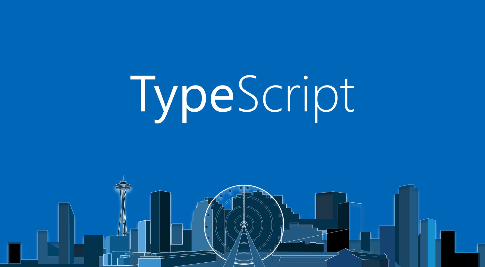
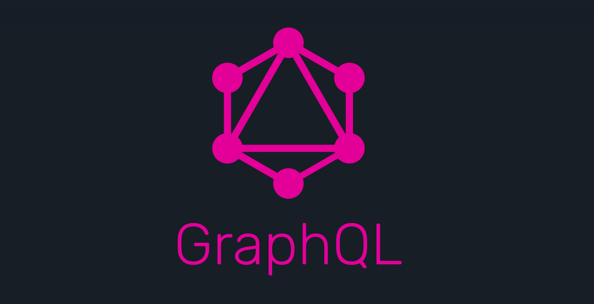
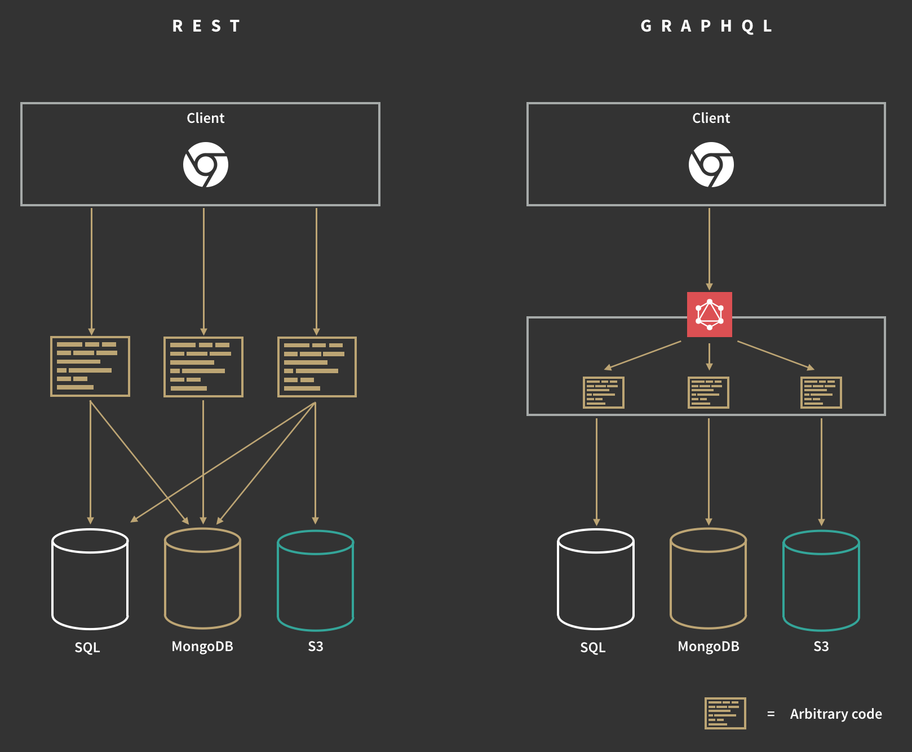
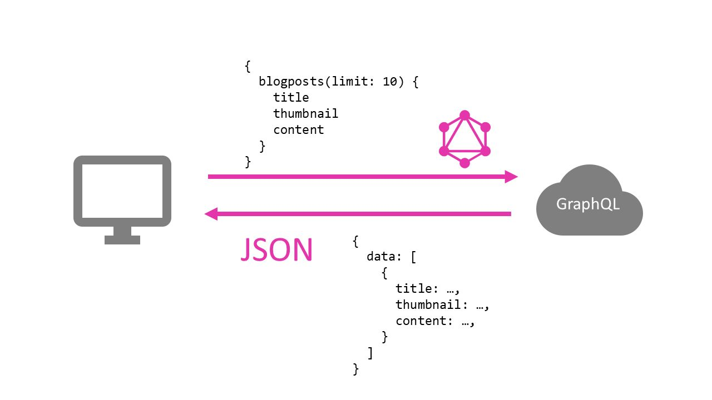
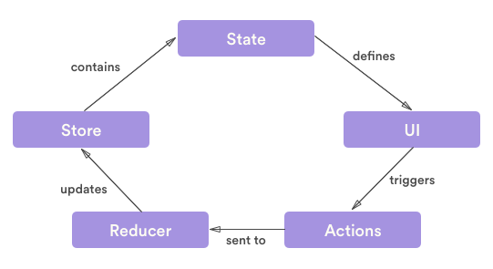
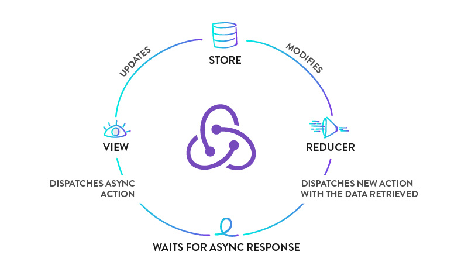
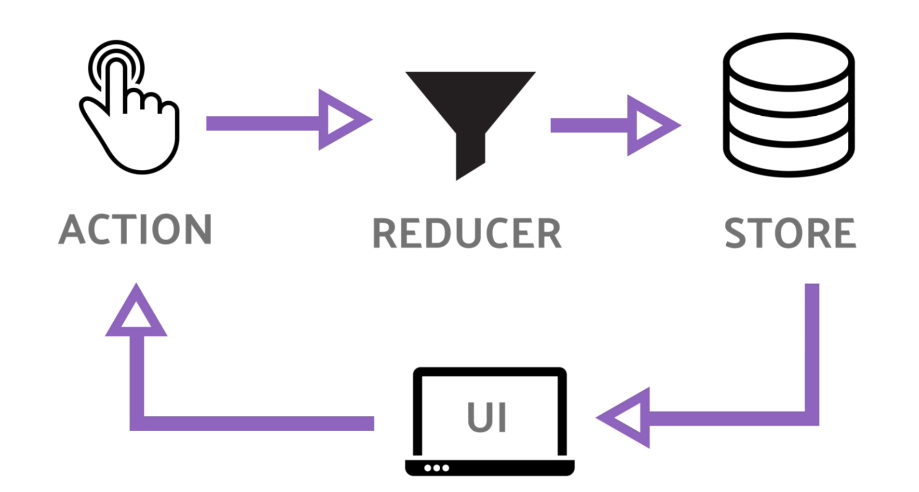

# Máster en Programación FullStack con JavaScript y Node.js
### JS, Node.js, Frontend, Backend, Firebase, Express, Patrones, HTML5_APIs, Asincronía, Websockets, Testing

## Clase 61


### JS Frameworks: Un poco de historia


**Lista de Frameworks y librerías**
- Los tres grandes:
    - [React](https://github.com/facebook/react) *A declarative, efficient, and flexible JavaScript library for building user interfaces*
    - [Angular](https://github.com/angular/angular) *One framework. Mobile & desktop*
    - [Vue](https://github.com/vuejs/vue) *🖖 Vue.js is a progressive, incrementally-adoptable JavaScript framework for building UI on the web*
- Historicamente significativos:
    - [Angular.js](https://github.com/angular/angular.js/) *Superheroic JavaScript MVW Framework* 
    - [Backbone.js](https://github.com/jashkenas/backbone) *Give your JS App some Backbone with Models, Views, Collections, and Events*
    - [Ember.js](https://github.com/emberjs/ember.js/) *A JavaScript framework for creating ambitious web applications* 
- Notables:
    - [Aurelia](https://github.com/aurelia/framework) *The aurelia framework brings together all the required core aurelia libraries into a ready-to-go application-building platform*
    - [Elm](https://elm-lang.org/) *A delightful language for reliable webapps. Generate JavaScript with great performance and no runtime exceptions.*
    - [Inferno](https://github.com/infernojs/inferno) *An extremely fast, React-like JavaScript library for building modern user interfaces*
    - [Polymer](https://github.com/Polymer/polymer) *Our original Web Component library*
    - [Preact](https://github.com/developit/preact) *Fast 3kB React alternative with the same modern API. Components & Virtual DOM*
    - [ReasonML](https://github.com/facebook/reason) *Simple, fast & type safe code that leverages the JavaScript & OCaml ecosystems*
    - [Svelte](https://github.com/sveltejs/svelte) *The magical disappearing UI framework*
    - [Knockout](https://github.com/knockout/knockout) *Knockout makes it easier to create rich, responsive UIs with JavaScript*
- El resto:
    - [AppRun](https://github.com/yysun/apprun) *AppRun is a 3K library for developing high-performance and reliable web applications using the elm inspired architecture, events and components*
    - [Binding.scala](https://github.com/ThoughtWorksInc/Binding.scala) *Reactive data-binding for Scala*
    - [Bobril](https://github.com/Bobris/Bobril) *Component oriented framework with Virtual dom (fast, stable, with tooling)*
    - [Choo](https://github.com/choojs/choo) *🚂🚋 - sturdy 4kb frontend framework*
    - [CxJS](https://github.com/codaxy/cxjs) *Advanced JavaScript UI framework for admin and dashboard applications with ready to use grid, form and chart components*
    - [Cycle.js](https://github.com/cyclejs/cyclejs) *A functional and reactive JavaScript framework for predictable code*
    - [DIO](https://github.com/flutterchina/dio) *A powerful Http client for Dart, which supports Interceptors, FormData, Request Cancellation, File Downloading, Timeout etc*
    - [Dojo Framework](https://github.com/dojo/framework) *A Progressive Framework for Modern Web Apps*
    - [Domvm](https://github.com/domvm/domvm) *DOM ViewModel - A thin, fast, dependency-free vdom view layer*
    - [DoneJS](https://github.com/donejs/donejs) *An open source JavaScript framework that makes it easy to build high performance, real-time web and mobile applications*
    - [Etch](https://github.com/atom/etch) *Builds components using a simple and explicit API around virtual-dom*
    - [glimmer.js](https://github.com/glimmerjs/glimmer.js) *Fast and light-weight UI components for the web. With the attention to detail you've come to expect from Ember*
    - [Hyperapp](https://github.com/jorgebucaran/hyperapp) *1 kB JavaScript micro-framework for building declarative web applications*
    - [Hyperdom](https://github.com/featurist/hyperdom) *A fast, feature rich and simple framework for building dynamic browser applications*
    - [hyperHTML](https://github.com/WebReflection/hyperHTML) *A Fast & Light Virtual DOM Alternative*
    - [Ivi](https://github.com/localvoid/ivi) *🔥 Javascript (TypeScript) library for building web user interfaces*
    - [Maquette](https://github.com/AFASSoftware/maquette) *Pure and simple virtual DOM library*
    - [Marko](https://github.com/marko-js/marko) *A friendly (and fast!) UI library from eBay that makes building web apps fun*
    - [Mithril](https://github.com/MithrilJS/mithril.js) *A Javascript Framework for Building Brilliant Applications*
    - [Moon](https://github.com/kbrsh/moon) *🌙 The minimal & fast UI library*
    - [Nerv](https://github.com/NervJS/nerv) *A blazing fast React alternative, compatible with IE8 and React 16*
    - [NX](https://github.com/nx-js/framework) *A modular front-end framework - inspired by the server-side and Web Components*
    - [petit-dom](https://github.com/yelouafi/petit-dom) *Minimalist virtual dom library*
    - [Pux](https://github.com/alexmingoia/purescript-pux) *Build type-safe web applications with PureScript*
    - [Ractive](https://github.com/ractivejs/ractive) *Next-generation DOM manipulation*
    - [Stencil](https://github.com/ionic-team/stencil) *A Web Component compiler for building fast, reusable UI components and Progressive Web Apps 💎 Built by the Ionic Framework team*
    - Y muchos más...

**Recursos**
- [The Super-Brief History of JavaScript Frameworks For Those Somewhat Interested](https://dev.to/_adam_barker/the-super-brief-history-of-javascript-frameworks-for-those-somewhat-interested-3m82)
- [The Ultimate Guide to JavaScript Frameworks](https://jsreport.io/the-ultimate-guide-to-javascript-frameworks/)
- [The Brutal Lifecycle of JavaScript Frameworks](https://stackoverflow.blog/2018/01/11/brutal-lifecycle-javascript-frameworks/)

### JS Frameworks - Avances Tecnológicos: TypeScript



> TypeScript es un lenguaje de programación libre y de código abierto desarrollado y mantenido por Microsoft. Es un superconjunto de JavaScript, que esencialmente añade tipado estático y objetos basados en clases. Anders Hejlsberg, diseñador de C# y creador de Delphi y Turbo Pascal, ha trabajado en el desarrollo de TypeScript. TypeScript puede ser usado para desarrollar aplicaciones JavaScript que se ejecutarán en el lado del cliente o del servidor (Node.js). [Wikipedia](https://es.wikipedia.org/wiki/TypeScript)

**Tipado**

```ts
function Greeter(greeting: string) {
    this.greeting = greeting;
}

Greeter.prototype.greet = function() {
    return "Hello, " + this.greeting;
}

let greeter = new Greeter("world");

let button = document.createElement('button');
button.textContent = "Say Hello";
button.onclick = function() {
    alert(greeter.greet());
};

document.body.appendChild(button);
```


**Clases**

```ts
class Greeter {
    greeting: string;
    constructor(message: string) {
        this.greeting = message;
    }
    greet() {
        return "Hello, " + this.greeting;
    }
}

let greeter = new Greeter("world");

let button = document.createElement('button');
button.textContent = "Say Hello";
button.onclick = function() {
    alert(greeter.greet());
}

document.body.appendChild(button);
```

**Herencia**

```ts
class Animal {
    constructor(public name: string) { }
    move(distanceInMeters: number = 0) {
        console.log(`${this.name} moved ${distanceInMeters}m.`);
    }
}

class Snake extends Animal {
    constructor(name: string) { super(name); }
    move(distanceInMeters = 5) {
        console.log("Slithering...");
        super.move(distanceInMeters);
    }
}

class Horse extends Animal {
    constructor(name: string) { super(name); }
    move(distanceInMeters = 45) {
        console.log("Galloping...");
        super.move(distanceInMeters);
    }
}

let sam = new Snake("Sammy the Python");
let tom: Animal = new Horse("Tommy the Palomino");

sam.move();
tom.move(34);
```


**Recursos**
- [TypeScript in 5 minutes](https://www.typescriptlang.org/docs/handbook/typescript-in-5-minutes.html)
- [Quick Start!](https://www.typescriptlang.org/samples/index.html)
- [Docs](https://www.typescriptlang.org/docs/home.html)
- [PlayGround](https://www.typescriptlang.org/play/index.html)
- [7 bad excuses for not using TypeScript](https://blog.logrocket.com/7-bad-excuses-for-not-using-typescript-dbf5e603a9a8)
- [Why I’m NOT a TypeScript Fan](https://medium.com/@amcdnl/why-i-m-not-a-typescript-fan-c5057d76aaa4)
- [Revisiting ‘Why I’m not a TypeScript fan’ one year later…](https://medium.com/@amcdnl/revisiting-why-im-not-a-typescript-fan-one-year-later-ad87ee287e33)
- [TypeScript - Learn the basics 📖](https://medium.com/@wittydeveloper/typescript-learn-the-basics-2f56eb9b02eb)
- [How (and why) you should use Typescript with Node and Express](https://medium.com/javascript-in-plain-english/typescript-with-node-and-express-js-why-when-and-how-eb6bc73edd5d)
- [tutorialspoint | TypeScript](https://www.tutorialspoint.com/typescript/typescript_overview.htm)
- [How to make your life easier using functional programming in TypeScript](https://medium.freecodecamp.org/how-to-make-your-life-easier-using-functional-programming-in-typescript-a2def76c468b)
- [TypeScript CheatSheet](https://www.sitepen.com/blog/2018/10/10/typescript-cheat-sheet)

### JS Frameworks - Avances Tecnológicos: Flow


> Flow is a static type checker for your JavaScript code. It does a lot of work to make you more productive. Making you code faster, smarter, more confidently, and to a bigger scale. [Flow](https://flow.org/en/docs/getting-started/)

**[Type Annotations](https://flow.org/en/docs/types/)**
```js
// @flow
function concat(a: string, b: string) {
  return a + b;
}

concat("A", "B"); // Works!
concat(1, 2); // Error!
```

**[Comment Types](https://flow.org/en/docs/types/comments/)**
```js
// @flow

/*::
type MyAlias = {
  foo: number,
  bar: boolean,
  baz: string,
};
*/

function method(value /*: MyAlias */) /*: boolean */ {
  return value.bar;
}

method({ foo: 1, bar: true, baz: ["oops"] });
```

**Recursos**
- [Web oficial](https://flow.org)
- [Flow en Github](https://github.com/facebook/flow)
- [@flowtype en Twitter](https://twitter.com/flowtype)
- [Getting Started](https://flow.org/en/docs/getting-started/)
- [Documentación](https://flow.org/en/docs/)
- [Comparing Flow with TypeScript](https://medium.com/the-web-tub/comparing-flow-with-typescript-6a8ff7fd4cbb)
- [Flow cheatsheet](https://devhints.io/flow)

### JS Frameworks - Avances Tecnológicos: GraphQL




**Arquitectura Cliente <-> Servidor**



**Peticiones desde Cliente**



**Pruebalo**
- [Github GraphQL API v4](https://developer.github.com/v4/)
- [graphql/swapi-graphql](https://github.com/graphql/swapi-graphql)

**Recursos**
- [GraphQL | Web Oficial](https://graphql.org/)
- [GraphQL | Community Resources](https://graphql.org/community/)
- [GraphQL | Code](https://graphql.org/code/)
- [GraphQL | Learn: Introduction to GraphQL](https://graphql.org/learn/)
- [GraphQL | Learn: Queries and Mutations](https://graphql.org/learn/queries/)
- [GraphQL | Learn: Schemas and Types](https://graphql.org/learn/schema/)
- [GraphQL | Learn: Execution](https://graphql.org/learn/execution/)
- [GraphQL | Learn: Best Practices](https://graphql.org/learn/best-practices/)
- [GraphQL vs. REST | Apollo](https://blog.apollographql.com/graphql-vs-rest-5d425123e34b)
- [GraphQL vs Firebase | Prisma](https://www.prisma.io/blog/graphql-vs-firebase-496498546142)
- [GraphQL: Everything You Need to Know](https://medium.com/@weblab_tech/graphql-everything-you-need-to-know-58756ff253d8)
- [REST APIs are REST-in-Peace APIs. Long Live GraphQL](https://medium.freecodecamp.org/rest-apis-are-rest-in-peace-apis-long-live-graphql-d412e559d8e4)
- [GraphQL And REST Differences Explained With Burgers](https://apievangelist.com/2018/06/29/rest-api-and-graphql-burger-king/)
- [How do I GraphQL? Top 3 things to know coming from REST](https://blog.apollographql.com/how-do-i-graphql-2fcabfc94a01)
- [Netflix | Our learnings from adopting GraphQL](https://medium.com/netflix-techblog/our-learnings-from-adopting-graphql-f099de39ae5f)
- [How Airbnb is Moving 10x Faster at Scale with GraphQL and Apollo](https://medium.com/airbnb-engineering/how-airbnb-is-moving-10x-faster-at-scale-with-graphql-and-apollo-aa4ec92d69e2)
- [GraphQL: A success story for PayPal Checkout](https://medium.com/paypal-engineering/graphql-a-success-story-for-paypal-checkout-3482f724fb53)
- [GraphQL concepts I wish someone explained to me a year ago](https://medium.com/naresh-bhatia/graphql-concepts-i-wish-someone-explained-to-me-a-year-ago-514d5b3c0eab)
- [So what’s this GraphQL thing I keep hearing about?](https://medium.freecodecamp.org/so-whats-this-graphql-thing-i-keep-hearing-about-baf4d36c20cf)
- [Going Serverless with NodeJS & GraphQL (Part I) — Setting up Serverless](https://levelup.gitconnected.com/going-serverless-with-nodejs-graphql-5b34f5d280f4)

### JS Frameworks - Avances Tecnológicos: Gestión de estados con Redux y similaress...


> Redux es una biblioteca de código abierto de JavaScript para administrar el estado de la aplicación. Se usa más comúnmente con bibliotecas como React o Angular para crear interfaces de usuario. Similar a la arquitectura Flux de Facebook, fue creada por Dan Abramov y Andrew Clark. [Wikipedia](https://en.wikipedia.org/wiki/Redux_(JavaScript_library))

**Principios**
- Una sola fuente de la verdad. *Todo el estado de tu aplicación esta contenido en un único store*
- El estado es de solo lectura. *La única forma de modificar el estado es emitir una acción que indique que cambió*
- Los cambios se hacen mediante funciones puras. *Para controlar como el store es modificado por las acciones se usan reducers puros*


**Funcionamiento**




**Mecánica interna**




**En resumen**




**[Ejemplo rápido](https://medium.com/front-end-weekly/vanilla-redux-e844628da6ff)**
```html
<p>
    Counter: <span id="value">0</span> times
    <button id="increment">+</button>
    <button id="decrement">-</button>
    <button id="incrementIfOdd">Increment if odd</button>
    <button id="incrementAsync">Increment async</button>
</p>
```

```js
// <script src="https://unpkg.com/redux@latest/dist/redux.min.js"></script>
// @see: https://gist.github.com/Arieg419/095a619371b9a62aaa7f474ac8d64740#file-index-html
const valueEl = document.getElementById('value')

function counter(state = 0, action) {
  switch (action.type) {
    case 'INCREMENT':
      return state + 1
    case 'DECREMENT':
      return state - 1
    default:
      return state
  }
}

const store = Redux.createStore(counter)

function render() {
  valueEl.innerHTML = store.getState().toString()
}

render()
store.subscribe(render)

document.getElementById('increment')
  .addEventListener('click', function() {
    store.dispatch({
      type: 'INCREMENT'
    })
  })

document.getElementById('decrement')
  .addEventListener('click', function() {
    store.dispatch({
      type: 'DECREMENT'
    })
  })

document.getElementById('incrementIfOdd')
  .addEventListener('click', function() {
    if (store.getState() % 2 !== 0) {
      store.dispatch({
        type: 'INCREMENT'
      })
    }
  })

document.getElementById('incrementAsync')
  .addEventListener('click', function() {
    setTimeout(function() {
      store.dispatch({
        type: 'INCREMENT'
      })
    }, 1000)
  })
```

**Similares**
- [Flux](https://github.com/facebook/flux) *Application Architecture for Building User Interfaces*
- [Reflux](https://github.com/reflux/refluxjs) *A simple library for uni-directional dataflow application architecture with React extensions inspired by Flux*
- [Relay](https://github.com/facebook/relay) *JavaScript framework for building data-driven React applications*
- [mobx](https://github.com/mobxjs/mobx) *Simple, scalable state management*
- [Gordux.js](https://github.com/k9ordon/gordux.js) *Gordon's Redux - Vanilla.js implementation of Redux pattern* 

**Recursos**
- [Vanilla Redux](https://medium.com/front-end-weekly/vanilla-redux-e844628da6ff)
- [Goodbye Redux](https://hackernoon.com/goodbye-redux-26e6a27b3a0b)
- [Redux from Twitter hype to production](http://slides.com/jenyaterpil/redux-from-twitter-hype-to-production#/)
- [Carlos Azaustre | ¿Qué es Flux? Entendiendo su arquitectura](https://carlosazaustre.es/como-funciona-flux/)
- [Carlos Azaustre | Cómo funciona Redux. Conceptos básicos](https://carlosazaustre.es/como-funciona-redux-conceptos-basicos/)
- [Gordux.js - The redux pattern in vanilla.js](https://k94n.com/gordux-js-the-redux-pattern-in-vanilla-js)
- [Redux without React — State Management in Vanilla JavaScript](https://www.sitepoint.com/redux-without-react-state-management-vanilla-javascript/)
- [Tic-Tac-Toe.js: redux pattern in plain javascript](http://ramonvictor.github.io/tic-tac-toe-js/)
- [¿Qué es Redux y por qué debes conocerlo?](http://blog.enriqueoriol.com/2018/08/que-es-redux.html)

### JS Frameworks: ¿Cual es mi camino?


**Comparativa Rápida en TodoMVC**
- [Vanilla JavaScript Example](http://todomvc.com/examples/vanillajs/)
- [Vanilla ES6 Example](http://todomvc.com/examples/vanilla-es6/)
- [JQuery](http://todomvc.com/examples/jquery/#/all)
- [Vuejs](http://todomvc.com/examples/vue/)
- [React](http://todomvc.com/examples/react/#/)
- [Angular](http://todomvc.com/examples/angularjs/#/)

**Recursos**
- [The Best JS Frameworks for Front End](https://rubygarage.org/blog/best-javascript-frameworks-for-front-end)
- [Eric Elliott | Top JavaScript Libraries & Tech to Learn in 2018](https://medium.com/javascript-scene/top-javascript-libraries-tech-to-learn-in-2018-c38028e028e6)
- [Top 23 Best Free JavaScript Frameworks for Web Developers 2018](https://colorlib.com/wp/javascript-frameworks/)
- [Best JavaScript Frameworks, Libraries and Tools to Use in 2019](https://www.sitepoint.com/top-javascript-frameworks-libraries-tools-use/)
- [The State of JavaScript Frameworks, 2017](https://www.npmjs.com/npm/state-of-javascript-frameworks-2017-part-1)
- [Los mejores proyectos JavaScript del 2017](https://risingstars.js.org/2017/es)
- [The State of JavaScript 2018](https://stateofjs.com/)
- [A Real-World Comparison of Front-End Frameworks with Benchmarks (2018 update)](https://medium.freecodecamp.org/a-real-world-comparison-of-front-end-frameworks-with-benchmarks-2018-update-e5760fb4a962)
- [A Recap of Frontend Development in 2018](https://levelup.gitconnected.com/a-recap-of-frontend-development-in-2018-715724c9441d)
- [The Cost Of JavaScript In 2018](https://medium.com/@addyosmani/the-cost-of-javascript-in-2018-7d8950fbb5d4)
