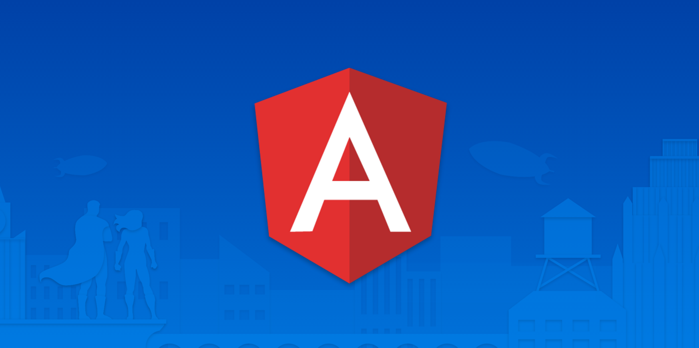

# Máster en Programación FullStack con JavaScript y Node.js
### JS, Node.js, Frontend, Backend, Firebase, Express, Patrones, HTML5_APIs, Asincronía, Websockets, Testing

## Clase 64

### Profesor invitado: Jon Rojí en el Master!

Frontend Team Leader en Sngular, donde comparte su pasión por las arquitecturas web, propiciando historias de amor estricto entre desarrolladores y código. Defensor de lo estándar, crítico con el código del día anterior, enfocado actualmente en sacar el máximo partido a Angular 2 y Polymer y trabajando en proyectos de gamificación multimedia en web, aplicaciones híbridas para móvil y arquitecturas de componentes utilizando también en su día a día otras tecnologías como NodejS, Gulp, Greenshock, Cordova, AWS, HTML5 y distintas librerías gráficas, así como animaciones y gráficos en CSS3.

**Redes Sociales**

- [@jnroji en Twitter](https://twitter.com/jnroji)
- [Github](https://github.com/jroji)
- [Linkedin](https://www.linkedin.com/in/jonroji)

**Cursos en Fictizia**
- [Curso de Angular (v6.x)](https://fictizia.com/formacion/curso-angular-javascript)

### Angular

**Documentación**
- [Web Oficial](https://angular.io/)
- [Features](https://angular.io/features)
- [Documentación](https://angular.io/docs)
- [Resources](https://angular.io/resources)
- [Eventos Mundiales](https://angular.io/events)
- [Angular Blog](https://blog.angular.io/)
- [@angular en Twitter](https://twitter.com/angular?lang=es)
- [Github](https://github.com/angular)

**Ecosistema**
- [TypeScript](https://www.typescriptlang.org/)
- [Ionic](https://ionicframework.com/)

**Recursos**
- [Wikipedia | Angular (framework)](https://es.wikipedia.org/wiki/Angular_(framework))
- [gdi2290/awesome-angular](https://github.com/gdi2290/awesome-angular)
- [brillout/awesome-angular-components](https://github.com/brillout/awesome-angular-components)
- [amcdnl/awesome-angular2](https://github.com/amcdnl/awesome-angular2)
- [Architecture in Angular projects](https://medium.com/@cyrilletuzi/architecture-in-angular-projects-242606567e40)
- [11 Angular Component Libraries You Should Know In 2018](https://blog.bitsrc.io/11-angular-component-libraries-you-should-know-in-2018-e9f9c9d544ff)
- [Version 6 of Angular Now Available](https://blog.angular.io/version-6-of-angular-now-available-cc56b0efa7a4)
- [Build A Real World Beautiful Web APP with Angular 6 — A to Z Ultimate Guide (2018) — PART I](https://medium.com/@hamedbaatour/build-a-real-world-beautiful-web-app-with-angular-6-a-to-z-ultimate-guide-2018-part-i-e121dd1d55e)
- [Angular 2 vs React: The Ultimate Dance Off](https://medium.com/javascript-scene/angular-2-vs-react-the-ultimate-dance-off-60e7dfbc379c)
- [Angular vs. React: Which Is Better for Web Development?](https://codeburst.io/angular-vs-react-which-is-better-for-web-development-e0dd1fefab5b)
- [6 Best Practices & Pro Tips when using Angular CLI](https://medium.com/@tomastrajan/6-best-practices-pro-tips-for-angular-cli-better-developer-experience-7b328bc9db81)
- [Angular... It’s You, Not Me](https://levelup.gitconnected.com/angular-its-you-not-me-9e9232ad3bcd)
- [Why I’m switching from Angular to React and Redux in 2018](https://hackernoon.com/why-im-switching-from-angular-to-react-and-redux-in-2018-cb48be00fda7)
- [Real Time Apps with TypeScript: Integrating Web Sockets, Node & Angular](https://medium.com/dailyjs/real-time-apps-with-typescript-integrating-web-sockets-node-angular-e2b57cbd1ec1)
- [Understanding, creating and subscribing to observables in Angular](https://medium.com/@luukgruijs/understanding-creating-and-subscribing-to-observables-in-angular-426dbf0b04a3)
- [Understanding Angular modules (NgModule) and their scopes](https://medium.com/@cyrilletuzi/understanding-angular-modules-ngmodule-and-their-scopes-81e4ed6f7407)
- [The Past, Present, and Future of the Angular CLI](https://blog.angular.io/the-past-present-and-future-of-the-angular-cli-13cf55e455f8)
- [Managing State in Angular Applications](https://blog.nrwl.io/managing-state-in-angular-applications-22b75ef5625f)
- [Building An Angular 5 Project with Bootstrap 4 and Firebase](https://medium.com/codingthesmartway-com-blog/building-an-angular-5-project-with-bootstrap-4-and-firebase-4504ff7717c1)
- [Using NgRx 4 to Manage State in Angular Applications](https://blog.nrwl.io/using-ngrx-4-to-manage-state-in-angular-applications-64e7a1f84b7b)
- [Angular: Understanding Modules and Services](https://medium.com/@michelestieven/organizing-angular-applications-f0510761d65a)
- [The complete guide to Angular Material Themes](https://medium.com/@tomastrajan/the-complete-guide-to-angular-material-themes-4d165a9d24d1)
- [Anatomy of a large Angular application](https://medium.com/@bojzi/anatomy-of-a-large-angular-application-f098e5e36994)
- [Angular: Why TypeScript?](https://vsavkin.com/writing-angular-2-in-typescript-1fa77c78d8e8)
- [Server Side Rendering (SSR) in Angular 5+ | The simplest and quickest SSR approach](https://itnext.io/server-side-rendering-ssr-in-angular-5-the-simplest-and-quickest-ssr-approach-34cf53224f32)