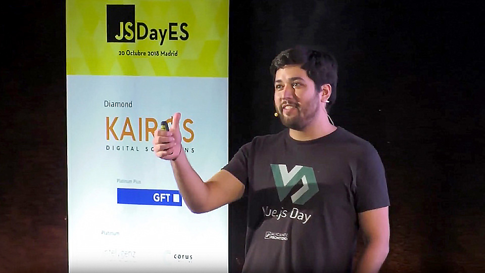
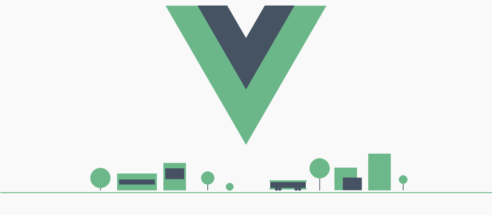

# Máster en Programación FullStack con JavaScript y Node.js
### JS, Node.js, Frontend, Backend, Firebase, Express, Patrones, HTML5_APIs, Asincronía, Websockets, Testing

## Clase 66

### Profesor invitado: Rubén Valseca en el Master!

Trabaja como Full-Stack Developer en StyleSage, una empresa de Nueva York de Big Data en el mundo de la moda. Enamorado de JavaScript, Vue.js y Python lleva varios años trabajando en el ecosistema startup en empresas de producto que van desde una aplicación de alquiler de plazas de garaje hasta sistemas SCADAs de control de parques eólicos. Cofundó el FrontFest en 2016 y coorganiza también VueJS Madrid. Además disfruta compartiendo y hablando en eventos como el JSDay, VueDay, CommitConf, t3chfest, meetups locales y colaborando como voluntario con AdaLab y Django Girls.

**Redes Sociales**

- [@rubnvp en Twitter](https://twitter.com/rubnvp)
- [Github](https://github.com/rubnvp/)
- [Linkedin](https://www.linkedin.com/in/rub%C3%A9n-valseca-parra-6139718a)

**Publicaciones**
- [Blog | El abismo de Null](https://elabismodenull.wordpress.com/)
- [Ebook | Desarrolla aplicaciones con VueJS](https://jdonsan.gitbooks.io/desarrolla-aplicaciones-con-vuejs/content/)
- [Ebook | Desarrolla Progressive Web Apps](https://jdonsan.gitbooks.io/desarrolla-progressive-web-apps/content/)

**Cursos en Fictizia**
- [Curso de Vue.JS + Vuex](https://fictizia.com/formacion/curso-vue-js)

### VUE

**Documentación**
- [Web oficial](https://vuejs.org/)
- [Video | Why Vue.js?](https://vimeo.com/247494684)
- [Guía para developers](https://vuejs.org/v2/guide/)
- [Comparación con otros frameworks](https://vuejs.org/v2/guide/comparison.html)
- [¡Únete a la comunidad!](https://vuejs.org/v2/guide/join.html)
- [Equipo CORE](https://vuejs.org/v2/guide/team.html)
- [VUE en Github](https://github.com/vuejs/vue)

**Recursos**
- [vuejs/awesome-vue](https://github.com/vuejs/awesome-vue)
- [Justineo/vue-awesome](https://github.com/Justineo/vue-awesome)
- [brillout/awesome-vue-refactor](https://github.com/brillout/awesome-vue-refactor)
- [Wikipedia | Vue.js](https://en.wikipedia.org/wiki/Vue.js)
- [De React a Vue, o como hacer lo mismo pero mucho más simple y bonito 😎](https://medium.com/devschile/de-react-a-vue-o-como-hacer-lo-mismo-pero-mucho-m%C3%A1s-simple-y-bonito-453a50cae3df)
- [Debate: VueJS vs. ReactJS](https://hackernoon.com/debate-vuejs-vs-reactjs-9d2a8867b69b)
- [React vs Vue.JS: Which Front-end Framework to Choose in 2018](https://expertise.jetruby.com/react-vs-vue-js-which-front-end-framework-to-choose-in-2018-2a62a1fe76f9)
- [Vue.js Is Good, But Is It Better Than Angular Or React?](https://www.valuecoders.com/blog/technology-and-apps/vue-js-comparison-angular-react/)
- [Vue.Js and React.Js – a Quick Comparison](https://scotch.io/bar-talk/vuejs-and-reactjs-a-quick-comparison)
- [TodoMVC Ejemplo Vuejs](http://todomvc.com/examples/vue/)
- [made with vue.js](https://madewithvuejs.com/vue-awesome)
- [11 Vue.js UI Component Libraries You Should Know In 2018](https://blog.bitsrc.io/11-vue-js-component-libraries-you-should-know-in-2018-3d35ad0ae37f)
- [5 Awesome Boilerplates/Templates For VueJS Projects](https://vuejsdevelopers.com/2018/04/23/vue-boilerplate-template-scaffold/)
- [27 Awesome VueJS Libraries](https://vegibit.com/27-awesome-vuejs-libraries/)
- [Genbeta | Por qué elegir VueJS: 5 razones para considerarlo nuestro próximo framework de referencia](https://www.genbetadev.com/desarrollo-web/por-que-elegir-vuejs-5-razones-para-considerarlo-nuestro-proximo-framework-de-referencia)
- [Carlos Azaustre | Qué es lo que me gusta de Vue.js](https://carlosazaustre.com/que-es-lo-que-me-gusta-de-vue-js/)
- [Vuejs School](https://vueschool.io/)