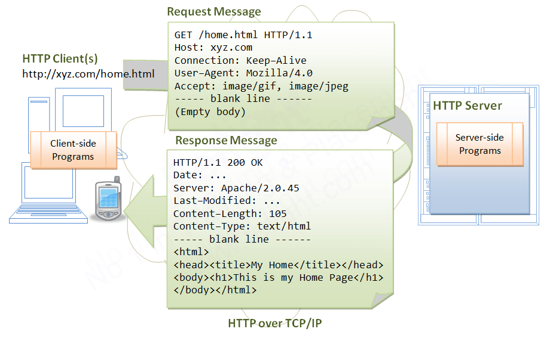
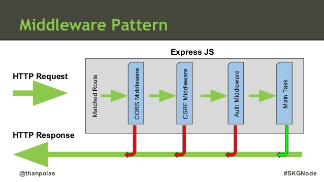

# Máster en Programación FullStack con JavaScript y Node.js
### JS, Node.js, Frontend, Backend, Firebase, Express, Patrones, HTML5_APIs, Asincronía, Websockets, Testing

## Clase 67

### Express


**Influencias / usos**
- Otros frameworks similares:
  - Zend (PHP)
  - Django (Python)
  - Sinatra (Ruby)

- Uso:
  - API JSON
  - Single Pages
  - App tiempo real

**Pros**
- Rutas
- Parámetros
- Formularios y subida de ficheros
- Cookies
- Sesiones
- Templates

**Contras**
- Base de datos / ORM
- Autenticación de usuarios
- Seguridad
- Migraciones
- Deployment
- Organización del código

**Documentación**
- [Web Oficial](http://expressjs.com/es/)
- [Como empezar](http://expressjs.com/es/starter/installing.html)
  - [Intalación](http://expressjs.com/es/starter/installing.html)
  - [Ejemplo Hello world](http://expressjs.com/es/starter/hello-world.html)
  - [Direccionamiento básico](http://expressjs.com/es/starter/basic-routing.html)
  - [Servicio de archivos estáticos en Express](http://expressjs.com/es/starter/static-files.html)
- Guía
  - [Direccionamiento](http://expressjs.com/es/guide/routing.html)
  - [Escritura de middleware para su uso en aplicaciones Express](http://expressjs.com/es/guide/writing-middleware.html)
  - [Utilización del middleware](http://expressjs.com/es/guide/using-middleware.html)
  - [Utilización de motores de plantilla con Express](http://expressjs.com/es/guide/using-template-engines.html)
  - [Manejo de errores](http://expressjs.com/es/guide/error-handling.html)
  - [Depuración de Express](http://expressjs.com/es/guide/debugging.html)
  - [Express detrás de proxies](http://expressjs.com/es/guide/behind-proxies.html)
  - [Integración de la base de datos](http://expressjs.com/es/guide/database-integration.html)
- [API de 4.x](http://expressjs.com/es/4x/api.html)
- Temas Avanzados
  - [Desarrollo de motores de plantilla para Express](http://expressjs.com/es/advanced/developing-template-engines.html)
  - [Gestores de procesos para las aplicaciones Express](http://expressjs.com/es/advanced/pm.html)
  - [Actualizaciones de seguridad](http://expressjs.com/es/advanced/security-updates.html)
  - [Mejores prácticas de producción: seguridad](http://expressjs.com/es/advanced/best-practice-security.html)
  - [Mejores prácticas de producción: rendimiento y fiabilidad](http://expressjs.com/es/advanced/best-practice-performance.html)
- Recursos
  - [Glosario](http://expressjs.com/es/resources/glossary.html)
  - [Middleware de terceros](http://expressjs.com/es/resources/middleware.html)
  - [Comunidad](http://expressjs.com/es/resources/community.html)
  - [Manuales y Blogs](http://expressjs.com/es/resources/books-blogs.html)
- [Preguntas más frecuentes](http://expressjs.com/es/starter/faq.html)


**Recursos**
- [Going out to eat and understanding the basics of Express.js](https://medium.freecodecamp.org/going-out-to-eat-and-understanding-the-basics-of-express-js-f034a029fb66)
- [Introduction to Node & Express](https://medium.com/javascript-scene/introduction-to-node-express-90c431f9e6fd)
- [Build a Weather Website in 30 minutes with Node.js + Express + OpenWeather](https://codeburst.io/build-a-weather-website-in-30-minutes-with-node-js-express-openweather-a317f904897b)
- [Express.js and AWS Lambda — a serverless love story](https://medium.freecodecamp.org/express-js-and-aws-lambda-a-serverless-love-story-7c77ba0eaa35)
- [Simple server side cache for Express.js with Node.js](https://medium.com/the-node-js-collection/simple-server-side-cache-for-express-js-with-node-js-45ff296ca0f0)
- [Using Node.js & Express.js to save data to MongoDB Database](https://codeburst.io/hitchhikers-guide-to-back-end-development-with-examples-3f97c70e0073)
- [Getting off the ground with Express.js](https://medium.freecodecamp.org/getting-off-the-ground-with-expressjs-89ada7ef4e59)
- [Express.js on Cloud Functions for Firebase](https://codeburst.io/express-js-on-cloud-functions-for-firebase-86ed26f9144c)
- [[ Expressjs ] Cracking nuts, put the IP Address to BlackList](https://hackernoon.com/cracking-nut-nodejs-express-block-get-remote-request-client-ip-address-e4cdfa461add)
- [[ Expressjs ] Cracking nuts, override res.send](https://hackernoon.com/nodejs-express-js-manipulating-response-before-going-back-to-user-5e96ad8d84ca)
- [[Express.js] Measuring performance of HTTP Request](https://hackernoon.com/express-js-measuring-performance-of-http-request-nodejs-javascript-react-redux-testing-time-speed-web-f7b7ceb6f586)
- [How to Do Layouts the Right Way in Pug and Express.js](https://medium.com/@micahbales/how-to-do-layouts-right-in-pug-and-express-js-755481dfb067)
- [Using Async Await in Express with Node 9](https://medium.com/@Abazhenov/using-async-await-in-express-with-node-8-b8af872c0016)
- [Building a scalable Node.js Express app](https://medium.com/@zurfyx/building-a-scalable-node-js-express-app-1be1a7134cfd)
- [A crash course on Serverless APIs with Express and MongoDB](https://hackernoon.com/a-crash-course-on-serverless-apis-with-express-and-mongodb-77774f7730fe)
- [Building a Node.js REST API with Express](https://medium.com/@jeffandersen/building-a-node-js-rest-api-with-express-46b0901f29b6)
- [Creating RESTful API with Node.js: Hapi vs. Express](https://medium.com/@cabot_solutions/creating-restful-api-with-node-js-hapi-vs-express-ccb97a776c02)
- [Beautiful Node: Building an API endpoint with Express, Mongoose, Validation and Promises](https://codeburst.io/using-mongoose-validation-with-async-await-c3a9255459e1)
- [Sessionless Authentication using JWTs (with Node + Express + Passport JS)](https://blog.usejournal.com/sessionless-authentication-withe-jwts-with-node-express-passport-js-69b059e4b22c)
- [CRUD in React and Express (MySQL)](https://medium.com/@avanthikameenakshi/crud-react-express-99025f03f06e)
- [Building a Simple CRUD Application with Express and MongoDB](https://medium.freecodecamp.org/building-a-simple-crud-application-with-express-and-mongodb-63f80f3eb1cd)
- [Docker development workflow: Node, Express, Mongo](https://medium.com/@sunnykay/docker-development-workflow-node-express-mongo-4bb3b1f7eb1e)
- [Using Let’s Encrypt with Express](https://medium.com/@yash.kulshrestha/using-lets-encrypt-with-express-e069c7abe625)
- [From Express.js to AWS Lambda: Migrating existing Node.js applications to serverless](https://hackernoon.com/from-express-js-to-aws-lambda-migrating-existing-node-js-applications-to-serverless-7473041ecc56)
- [Server & Authentication Basics: Express, Sessions, Passport, and cURL](https://medium.com/@evangow/server-authentication-basics-express-sessions-passport-and-curl-359b7456003d)
- [THE BEGINNER’S GUIDE: Understanding Node.js & Express.js fundamentals](https://medium.com/@LindaVivah/the-beginners-guide-understanding-node-js-express-js-fundamentals-e15493462be1)
- [Building a Node.js Powered API with Express, Mongoose & MongoDB](https://hackernoon.com/building-a-node-js-powered-api-with-express-mongoose-mongodb-19b14fd4b51e)
- [Creating node api’s became a lot easier, introduction to build-express-api](https://hackernoon.com/creating-node-apis-became-a-lot-easier-introduction-to-build-express-api-a0b07d9c0728)
- [Geeky Theory | Introducción a Express.js](https://geekytheory.com/introduccion-a-express-js)
- [How express.js works - Understanding the internals of the express library ⚙️](https://www.sohamkamani.com/blog/2018/05/30/understanding-how-expressjs-works/)
- [How I added awesome multi-threaded features to Express JS](https://hackernoon.com/how-i-added-awesome-multi-threaded-features-to-express-js-753452a1c10e)
- [Build a Complete MVC Website With ExpressJS](https://code.tutsplus.com/tutorials/build-a-complete-mvc-website-with-expressjs--net-34168)

### Express: Migraciones

**[De Express 3.x a Express 4.x](http://expressjs.com/es/guide/migrating-4.html)**
- [Documentación de la 3.x (desuso)](http://expressjs.com/es/3x/api.html)
- [Cambios](http://expressjs.com/es/guide/migrating-4.html)
- [Nuevas funcionaldiades](https://github.com/expressjs/express/wiki/New-features-in-4.x?_ga=1.226364894.554285759.1461232316)

**[De Express 4.x a Express 5.x (hoy es Alpha)](http://expressjs.com/es/guide/migrating-5.html)**
- [Cambios Previstos](https://github.com/expressjs/express/pull/2237?_ga=1.29731835.554285759.1461232316)

### Express: Refrescando conceptos

**[http/s: peticion, respuesta, codigo de estado y verbos...]()**




**[Partes de una URL](https://nodejs.org/api/url.html)**
```
┌─────────────────────────────────────────────────────────────────────────────────────────────┐
│                                            href                                             │
├──────────┬──┬─────────────────────┬─────────────────────┬───────────────────────────┬───────┤
│ protocol │  │        auth         │        host         │           path            │ hash  │
│          │  │                     ├──────────────┬──────┼──────────┬────────────────┤       │
│          │  │                     │   hostname   │ port │ pathname │     search     │       │
│          │  │                     │              │      │          ├─┬──────────────┤       │
│          │  │                     │              │      │          │ │    query     │       │
"  https:   //    user   :   pass   @ sub.host.com : 8080   /p/a/t/h  ?  query=string   #hash "
│          │  │          │          │   hostname   │ port │          │                │       │
│          │  │          │          ├──────────────┴──────┤          │                │       │
│ protocol │  │ username │ password │        host         │          │                │       │
├──────────┴──┼──────────┴──────────┼─────────────────────┤          │                │       │
│   origin    │                     │       origin        │ pathname │     search     │ hash  │
├─────────────┴─────────────────────┴─────────────────────┴──────────┴────────────────┴───────┤
│                                            href                                             │
└─────────────────────────────────────────────────────────────────────────────────────────────┘
(all spaces in the "" line should be ignored — they are purely for formatting)
```

### Express: Instalación

- Instalación Global:
  ```
  npm install -g express
  ```

- Instalación versiones anteriores:
  ```
  npm install -g express@3.x
  ```

### Express: Hola Mundo

```javascript
var express = require('express');
var app = express();

// C9
var puerto = process.env.PORT || 3000;

app.get('/', function (req, res) {
  res.send('Hello World!');
});

app.listen(puerto, function () {
  console.log('Example app listening on port ' + puerto);
});
```

### Express: Generador de Express

**:warning: IMPORTANTE**

El generador de express sigue un esquema `www/var` que no se corresponde con proyectos reales.
Solo tienes que seguir [estos pasos](http://expressjs.com/es/guide/migrating-4.html#app-gen) para que arranque al estilo Express 3.x


**Instalación global del generador**
```
npm install express-generator -g
```

**Opciones de instalación**
```
express -h
```

**Generar un proyecto**
```
express <nombre_proyecto>
```

**Entramos en la carpeta e instalamos las dependencias**
```
cd <nombre_proyecto> && npm install
```

**Estructura de un Proyecto (MVC)**
```
├── app.js (Nuestra aplicación - módulo)
├── bin (Gestión de la aplicación)
│   └── www
├── package.json (Información y dependencias)
├── public (Nuestros estáticos)
│   ├── images
│   ├── javascripts
│   └── stylesheets
│       └── style.css
├── routes (Nuestros controladores)
│   ├── index.js
│   └── users.js
└── views (Nuestras vistas/plantillas)
    ├── error.jade
    ├── index.jade
    └── layout.jade
```

**Ejecutando la aplicación:**
- Windows
```
set DEBUG=<nombre_proyecto>:* & npm start
```
- MacOS/Linux
```
DEBUG=<nombre_proyecto>:* npm start
```


### Express: Partes Claves
- [express()](http://expressjs.com/es/4x/api.html#express)
- [Application](http://expressjs.com/es/4x/api.html#app)
- [Request](http://expressjs.com/es/4x/api.html#req)
- [Response](http://expressjs.com/es/4x/api.html#res)
- [Router](http://expressjs.com/es/4x/api.html#router)


### Express: Variables locales de Express

**Mecánica: app.set()**
- Nos permite establecer la configuración de Express
- Podemos almacenar datos personalizados de manera global

**Guardando la versión**
```javascript
app.set('version', '1.5.0');
app.get('version'); // 1.5.0
```

**Maneras de Habilitar contenido**
```javascript
app.enable('dia_soleado'); // igual a -> app.set('dia_soleado', true);
app.enabled('dia_soleado'); // igual a -> app.get('dia_soleado') === true;
app.disabled('dia_soleado'); // igual a -> app.get('dia_soleado') === false;
```  

**Definiendo el puerto**
```javascript
app.set('port', process.env.PORT || 3000);
```
**Configuraciones según el entorno**
- Para todos los entornos 
```
NODE_ENV=production node app.js
```
```javascript
app.configure(() => {
  app.set('estado_aplicacion', '*');
});
```
- Solo desarrollo
```
NODE_ENV=development node app.js
```
```javascript
app.configure('development', () => {
  app.set('estado_aplicacion', 'development');
});
```
- Solo producción
```
NODE_ENV=production node app.js
```
```javascript
app.configure('production', () => {
  app.set('estado_aplicacion', 'production');
});
```
- Solo personalizado
```
NODE_ENV=personalizado1 node app.js
```
```javascript
app.configure('personalizado1', () => {
  app.set('estado_aplicacion', 'personalizado1');
});
```

**Motores de Plantillas**
- Variables locales (solo disponibles para las plantillas)
```javascript
// Guardando
app.locals.title = 'My App';
app.locals.email = 'me@myapp.com';

// Usando
app.locals.title // My App
app.locals.email // me@myapp.com
```
- Definiendo el sistema de plantillas que usaremos
```javascript
// npm install jade --save
const express = require('express'),
  jade = require('jade'),
  app = express();
  
app.set('view engine', 'jade');

app.get('/', (req, res) => {
  res.render('index', { title: 'Hey', message: 'Hello there!'});
});
```

**[Comparativa de Motores de plantillas](https://strongloop.com/strongblog/compare-javascript-templates-jade-mustache-dust/)**


### Express: Gestión de métodos HTTP

**app.all(), app.get(), app.post(), app.put(), app.delete(), app.route(), etc...**
```javascript
app.METODO(Ruta, Manejador)
```

**Estructura**
- app *Instanciado de express*
- METODO *[Metodo HTTP](https://www.wikiwand.com/es/Hypertext_Transfer_Protocol) de la Ruta*
  - Soportados: get, post, put, head, delete, options, trace, copy, lock, mkcol, move, purge, propfind, proppatch, unlock, report, mkactivity, checkout, merge, m-search, notify, subscribe, unsubscribe, patch, search y connect.
  - Para todas las rutas usamos *app.all()*
- Ruta *Ruta (url) donde se aplica*
  - Podemos usar
    - Series
    - Patrones de Series (Subtipo de Regex), reducido a los subconjuntos ?, +, *, y ()
    - [Expresiones regulares](https://regex101.com/)
- Manejador *La función que será llamada cuando se alcance la ruta con el método/s correctos/s*
  - Se puede usar funciones individuales
  - Se pueden hacer matrices de funciones
  - Se pueden mezclar matrices y funciones individuales
  - Argumentos:
    - Obj Request de Node.js
    - Obj Response de Node.js
    - next() *Función que dispara el siguiente middleware*

**delimitando a un único método**
```javascript
app.get('/', (req, res, next) => {
  res.send('Solo get como método me vale...');
});
```

**Otra forma de delimitar a un método**
```javascript
app['m-search']('/', (req, res, next) => {
  res.send('Solo m-search como método me vale...');
});
```

**Permitiendo todos los métodos**
```javascript
app.all('/', (req, res, next) => {
  res.send('Cualquier método me vale...');
});
```


### Express: Gestión de Rutas

**Raiz** `http://localhost:8080/`
```javascript
app.get('/', (req, res, next) => {
  res.send('Esto es la Raiz');
});
```

**Básicas** `http://localhost:8080/hola`
```javascript
app.get('/hola', (req, res, next) => {
  res.send('Esto es /hola');
});
```

**Capturando Parámetros** `http://localhost:8080/hola/Eduardo`, `http://localhost:8080/hola/Oscar`...
```javascript
app.get('/hello/:nombre', (req, res) => {
    res.send(`Hola, ${req.params.nombre}!`);
});
```

**Capturando varios parámetros** `http://localhost:8080/desde/Madrid/a/Malga`, `http://localhost:8080/desde/Madrid/a/NYC`...
```javascript
app.get('/desde/:origen/a/:destino', (req, res, next) => {
  res.send(`Quieres ir de ${req.params.origen} a ${req.params.destino}`);
});
```

**Capturando varios parámetros y alguno determiando** `http://localhost:8080/mensaje/1/editar`, `http://localhost:8080/mensaje/500/borrar`...
```javascript
app.get('/mensaje/:id/:accion(editar|borrar)', (req, res, next) => {
  res.send(`Quieres ${req.params.accion} el mensaje numero ${req.params.id}`);
});
```

**Parámetros opcionales** `http://localhost:8080/user/1/editar`, `http://localhost:8080/user/500/borrar`...
```javascript
app.get('/user/:id/:comando?', (req, res, next) => {
  if(req.params.comando){
    res.send(`Tenemos algo! Quieres ${req.params.comando}`);
  } else {
    res.send("Nada de nada...");
  }
});
```

**Más parámetros opcionales** `http://localhost:8080/user/1.pdf`, `http://localhost:8080/user/500.zip`, etc...
```javascript
app.get('/user/:id.:formato?', (req, res, next) => {
  if(req.params.formato){
    res.send(`[${req.params.formato}] Extensión requerida... `);
  } else {
    res.send("Sin Extensión requerida");
  }
});
```

**Tipo fichero** `http://localhost:8080/hola.text`
```javascript
app.get('/hola.text', (req, res) => {
  res.send('Hola');
});
```

**Patrones de serie (`?`)** `http://localhost:8080/acd` o `http://localhost:8080/abcd`
```javascript
app.get('/ab?cd', (req, res) => {
  res.send('ab?cd');
});
```

**Patrones de serie (`+`)** `http://localhost:8080/abcd`, `http://localhost:8080/abbbbbcd`, etc...
```javascript
app.get('/ab+cd', (req, res) => {
  res.send('ab+cd');
});
```

**Patrones de serie (`*`)** `http://localhost:8080/abcd`, `http://localhost:8080/abAALGOOOcd`, etc...
```javascript
app.get('/ab*cd', (req, res) => {
  res.send('ab*cd');
});
```

**Patrones de serie (`()`)** `http://localhost:8080/abe` o `http://localhost:8080/abcd`
```javascript
app.get('/a(bc)d', (req, res) => {
  res.send('a(bc)d');
});
```

**Expresiones regulares** `http://localhost:8080/mcfly`, `http://localhost:8080/dragonfly`, etc...
```javascript
app.get(/.*fly$/, (req, res) => {
  res.send('/.*fly$/');
});
```


### Express: Manejadores de Rutas

**Función individual**
```javascript
app.get('/example/a', (req, res) => {
  res.send('Hola desde A!');
});
```

**Manejadores: Dos funciones individuales**
```javascript
app.get('/example/b', (req, res, next) => {
  console.log('La respuesta se enviará a la siguiente función...');
  next();
}, (req, res) => {
  res.send('Hola desde B!');
});
```

**Manejadores: Matrices**
```javascript
const cb0 = (req, res, next) => {
  console.log('CB0');
  next();
};

const cb1 = (req, res, next) => {
  console.log('CB1');
  next();
};

const cb2 = (req, res) => {
  res.send('Hola desde C!');
};

app.get('/example/c', [cb0, cb1, cb2]);
```

**Manejadores: Matrices y funciones individuales**
```javascript
const cb0 = (req, res, next) => {
  console.log('CB0');
  next();
};

const cb1 = (req, res, next) => {
  console.log('CB1');
  next();
};

app.get('/example/d', [cb0, cb1], (req, res, next) => {
  console.log('La respuesta se enviará a la siguiente función...');
  next();
}, (req, res) => {
  res.send('Hola desde D!');
});
```

### Express: La petición

**Destacado**
- `req.ip` Almacena la IP desde donde se realizó la peticioón
- `req.is` Que tipo de datos nos llegan desde la petición. Booleano
- `req.params` Contenido de la ruta (http://localhost:8080/usuarios/:id)
- `req.query` Contenido de la query (consulta) de la URL
  - simples (http://localhost:8080/peliculas?categoria=Ficcion&director=George+Lucas):
  - Agrupados (http://localhost:8080/peliculas?categoria[tipo]=Corto&director=Yo+Mismo):
- `req.body` Contenido dentro de la propia petición
- [Y muchos más...](http://expressjs.com/es/4x/api.html#req)

**Ejemplo de `req.is`**
```javascript
req.is('json');
req.is('application/*');
req.is('application/json');
```

**Ejemplo de `req.query`**
```javascript
// http://localhost:8080/peliculas?categoria=Ficcion&director=George+Lucas
app.get('/peliculas', (req, res, next) => {
  console.log(req.query.director) // George Lucas
  console.log(req.query.categoria) // Ficcion
});

// http://localhost:8080/peliculas?categoria[tipo]=Corto&director=Yo+Mismo
app.get('/peliculas', (req, res, next) => {
  console.log(req.query.director) // Yo Mismo
  console.log(req.query.categoria.tipo) // Corto
});
```

### Express: La respuesta

**Destacado**
- [`res.download()`](http://expressjs.com/es/4x/api.html#res.download): Solicita un archivo para descargarlo.
- [`res.end()`](http://expressjs.com/es/4x/api.html#res.end): Finaliza el proceso de respuesta.
- [`res.json()`](http://expressjs.com/es/4x/api.html#res.json): Envía una respuesta JSON.
- [`res.jsonp()`](http://expressjs.com/es/4x/api.html#res.jsonp): Envía una respuesta JSON con soporte JSONP.
  - Valores por defecto ajustables en `app.set()`
  - `?callback=` valor por defecto en la petición
  - `res.jsonp({date: newDate()});`
- [`res.redirect()`](http://expressjs.com/es/4x/api.html#res.redirect): Redirecciona una solicitud.
- [`res.render()`](http://expressjs.com/es/4x/api.html#res.render): Renderiza una plantilla a la que le pasa además datos (opcional)
- [`res.send()`](http://expressjs.com/es/4x/api.html#res.send): Envía una respuesta de varios tipos.
  - Muy flexible
  - Código y contenido `res.send(404,'Oops...');`
  - Enviar un JSON `res.send({mensaje: "secreto"});`
  - Solo código (autocompleta el mensaje) `res.send(200);` 
- [`res.sendFile()`](http://expressjs.com/es/4x/api.html#res.sendFile): Envía un archivo para ser visualizado.
- [`res.sendStatus()`](http://expressjs.com/es/4x/api.html#res.sendStatus): Envia un estado HTTP.
- [Y mucho más...](http://expressjs.com/es/4x/api.html#res)

### Express: Middelware

**Middleware: La clave**




**Patrón del middelware**
- Todas las funciones reciben tres parámetros `request`, `response` y `next`
- Es una secuencia de callbacks que se autogestionan
- Si todo sale correctamente, nuestra función debe invocar a la siguiente usando `next()`
- Si algo va mal, debe gestionar la salida con `response`.
- Puede resultar complejo saber cuantas funciones quedan o han pasado.
- Es un esquema de cascada y delegación de resposabildiad muy claro.


**Tipos de Middelware**
  - Middleware de nivel de aplicación
  - Middleware de nivel de direccionador
  - Middleware de manejo de errores
  - Middleware incorporado
  - Middleware de terceros


### Express: Middelware con `app.use()`

**Esto funciona nivel de toda la aplicación**
```javascript
//import express from 'express';
const express = require('express');
const app = express();

function chivato (req, res, next) {
    console.log(`Nueva petición en ${req.url} con el método${req.method}`);
    next(); 
}

app.use(chivato);

app.get('/', (req, res) => {
  res.send('Hola a todos!');
});

app.listen(3000);  
```

### Express: Middelware por niveles

**Middleware Global, a nivel de toda la aplicación**
```javascript
const app = express();

app.use((req, res, next) => {
  console.log('Time:', Date.now());
  next();
});
```

**Middelware de ruta, en este caso `/user/:id`**
```javascript
const app = express();

app.get('/user/:id', (req, res, next) => {
  console.log('ID:', req.params.id);
  next();
}, (req, res, next) => {
  res.send('User Info');
});
```
### Express: manejo de errores

**Hacemos uso de un argumento adiccional, `err`**
```javascript
//import bodyParser from 'body-parser';
//import methodOverride from 'method-override';
const bodyParser = require('body-parser');
const methodOverride = require('method-override');

app.use(gestionErrorServer);

function gestionErrorServer(err, req, res, next) {
  //Soporte para llamdas AJAX (xhr)
  if (req.xhr) {
    res.status(500).send({ error: 'Something failed!' });
  } else {
    res.status(500);
    res.render('error', { error: err });
  }
}
//...
```


### Express: Gestión de estáticos
**Importante**
- Desde la versión 4.x Express no depende de [Connect](https://github.com/senchalabs/connect)
- Todo el middelware que habia en Express 3.x, es sacado del core de express 4.x
- Solamente queda incorporado [express.static](https://github.com/expressjs/serve-static)

**Incluyendo archivos estáticos**
```javascript
app.use(express.static('public'));
```

**Configurando la carpeta pública**
```javascript
const options = {
  dotfiles: 'ignore',
  etag: false,
  extensions: ['htm', 'html'],
  index: false,
  maxAge: '1d',
  redirect: false,
  setHeaders(res, path, stat) {
    res.set('x-timestamp', Date.now());
  }
};

app.use(express.static('public', options));
```

**Usando múltiples directorios estáticos**
```javascript
app.use(express.static('public'));
app.use(express.static('uploads'));
app.use(express.static('files'));
```

### Express: Middelware en la prática

**Habilitando CORS**
```javascript
app.use((req, res, next) => {
  res.header("Access-Control-Allow-Origin", "*");
  res.header('Access-Control-Allow-Methods', 'GET,PUT,POST,DELETE');
  res.header("Access-Control-Allow-Headers", "Origin, X-Requested-With, Content-Type, Accept");
  next();
});
```

**Baneando Navegadores (IE8 y anteriores)**
```javascript
// banear.js
const banned = [ 'MSIE', 'Trident/6.0'];

export default () => (req, res, next) => {
  if (req.headers['user-agent'] !== undefined && req.headers['user-agent'].includes(banned)) {
          res.end('Navegador no compatible');
  } else { 
    next(); 
  } 
};
```


**Redireccionando al usuario en caso de no estar logeados**
```javascript
export default (req, res) => {
  if (req.params.usuario.logged){
    next();
  } else {
    res.redirect('/login');
  }
};
```

**Gestion de errores tipo 4xx y tipo 5xx**
```javascript
// Error 404
app.use((req, res) => {
  res.status(404);
  res.render('404', { title: '404 - No encontrado' });
});

// Error 500 (solo en caso de desarrollo)
app.use('development', (error, req, res, next) => {
  res.status(500);
  res.render('500', {
  title: 'Panico en la sala!!... Tenemos un 500... o.O',
  error
  });
});

// Error 500 (solo en caso producción)
app.use('production', (error, req, res, next) => {
  res.status(500);
  res.render('500', {
  title: 'Oops… ¡Algo salió mal!'
  });
  // Mandamos un email con los datos al equipo.
});
```

### Express: Objeto Router

**Molularidad con app.route()**
```javascript
app.route('/pelicula')
  .get((req, res) => {
    res.send('todas las peliculas...');
  })
  .post((req, res) => {
    res.send('Añadir una pelicula...');
  })
```

**Middleware de nivel Global**
```javascript
const app = express();
const router = express.Router();

router.use((req, res, next) => {
  console.log('Time:', Date.now());
  next();
});
```

**Middelware a nivel de ruta, en este caso /user/:id**
```javascript
const app = express();
const router = express.Router();

router.get('/user/:id', (req, res, next) => {
  console.log('ID:', req.params.id);
  next();
}, (req, res, next) => {
  res.send('User Info');
});
```

### Ejercicios

**1 -** Crea tu primer script de Express

Objetivos
- Crear un proxy para hacer llamadas AJAX `GET` que no tengan CORS Habilitado `/cors?url=...`
- Crear un sistema de estaticos para que `./public` sea accesible
- poner como root (`/`) la ruta `./public/index.html`
- Lanzar todo con el comando `npm start`

```javascript
// npm install express request
var express = require('express');
var request = require('request');
var app = express();
var path = require('path');

// Static files
app.use(express.static('public'));

// viewed at http://localhost:8080
app.get('/', function(req, res) {
    res.sendFile(path.join(__dirname + '/public/index.html'));
});

app.get('/proxy', function (req, res){
    // @Example: localhost:8080/proxy?url=http://airemad.com/api/v1/station/
    
    // CORS
    res.header("Access-Control-Allow-Origin", "*");
    res.header("Access-Control-Allow-Headers", "Origin, X-Requested-With, Content-Type, Accept");
    
    // PIPE Response
    request({  
        url: req.query.url,
        method: "GET"
    }).pipe(res)
});

app.listen(process.env.PORT || 8080);
```
