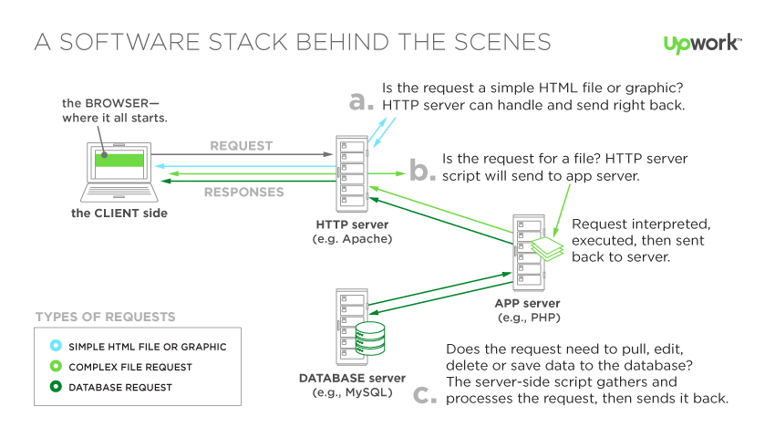
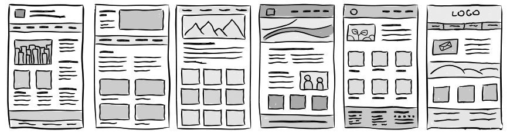
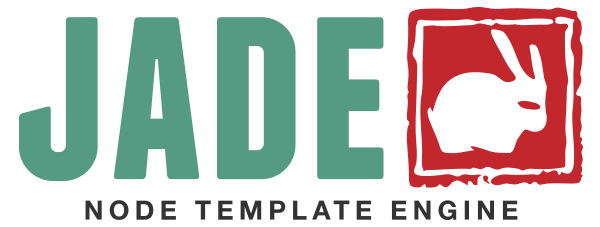

# Máster en Programación FullStack con JavaScript y Node.js
### JS, Node.js, Frontend, Backend, Firebase, Express, Patrones, HTML5_APIs, Asincronía, Websockets, Testing

## Clase 68

### Server Render Clásico



**Claves**
- La lógica de negocio esta en el Backend
- El backend realiza todas las consultas y obtiene toda la información
- De forma dinámica el Backend genera una respuesta con un contenido HTML válido
- El javascript del front se limita a la interacción con el usuario pero no gestiona data como en arquitecturas SPA (Single Page Application)


### Express: ¿Cómo debo estructurar mi aplicación de Express?

- [Listas de rutas](https://github.com/strongloop/express/blob/4.13.1/examples/route-separation/index.js#L32-47)
- [Correlación de rutas](https://github.com/strongloop/express/blob/4.13.1/examples/route-map/index.js#L52-L66)
- [Controladores de estilo MVC](https://github.com/strongloop/express/tree/master/examples/mvc)
- [express-resource](https://github.com/expressjs/express-resource)
- y muchas más...


### CURL


**CURL**
- [Web Oficial](https://curl.haxx.se/)
- [curl Docs | How To Use](https://curl.haxx.se/docs/manpage.html)
- [curl Docs | Manual](https://curl.haxx.se/docs/manual.html)
- [cURL Command Examples](https://www.rosehosting.com/blog/curl-command-examples/)

```bash
curl -I 127.0.0.1:3000 # Solo cabeceras
curl -o fichero https://fictizia.com/ # Guardar salida en un fichero
curl -O https://domain.com/file.zip # Guardar un fichero
curl -o fichero.zip https://domain.com/file.zip # Guardar un fichero con otro nombre
```

**Otras Herramientas**
- [PostMan](https://chrome.google.com/webstore/detail/postman/fhbjgbiflinjbdggehcddcbncdddomop)
- [Insomnia](https://insomnia.rest/)


### Express: Template engines



**Las claves**
- Debemos guardar las plantillas en la carpeta `views`
- Todas las plantillas tienen ficheros con su extensión especifica
- Es necesario definir el `view engine` que se utilizará
- Una vez establecida la propiedad view engine, no tiene que especificar el motor ni cargar el módulo de motor de plantilla en la aplicación
- Utilizaremos `res.render()` para renderizar una plantilla.
- Los motores de plantillas sorportados en express deben seguir [Consolidate.js](https://www.npmjs.com/package/consolidate)

**Motores soportados**
- [ejs](http://ejs.co/)
- [haml](https://github.com/visionmedia/haml.js)
- [mustache](https://github.com/janl/mustache.js)
- [lodash](http://lodash.com/)
- [twig](https://github.com/justjohn/twig.js)
- [Jade](http://jade-lang.com/)
- [Pug](https://pugjs.org/api/getting-started.html)
- [muchos más...](https://www.npmjs.com/package/consolidate#supported-template-engines)

**Ejemplo rápido con PUG**
```js
// npm install express pug

const express = require('express'),
    app = express();

//Middelware
app.set('view engine', 'pug');

//Rutas
app.get('/', (req, res) => {
  res.render('index.pug')
});

// Puerto
app.listen(8080, () => {
  console.log('localhost:8080 up & running!');
});
```

### Jade


**Recursos**
- [NPM | Jade](https://www.npmjs.com/package/jade)
- [Web oficial](http://jade-lang.com/)
- [Docs | API](http://jade-lang.com/api)
- [Docs | command line](http://jade-lang.com/command-line)
- [Docs | Reference](http://jade-lang.com/reference)
- [Learning the Jade Templating Engine Syntax](http://cssdeck.com/labs/learning-the-jade-templating-engine-syntax)
- [Jade Templating Tutorial Codecast - Part 2](http://cssdeck.com/labs/jade-templating-tutorial-codecast-part-2)

### PUG (antes Jade)


**Jade no existe más...**
- [Jade... ya no se llama jade. Ahora se llama PUG](https://github.com/pugjs/pug/issues/2184)


### PUG


**Migración**
- [Cambios de Jade a Pug](https://github.com/pugjs/pug/issues/2305)

**Implementaciones en otros lenguajes**
- [php](https://github.com/kylekatarnls/jade-php)
- [scala](https://scalate.github.io/scalate/documentation/scaml-reference.html)
- [ruby](https://github.com/slim-template/slim)
- [python](https://github.com/SyrusAkbary/pyjade)
- [java](https://github.com/neuland/jade4j)

**Herramientas**
- [Html2Jade](http://html2jade.org/)
- [Pug2html](https://pughtml.com/)

**Recursos**
- [Web Oficial](https://pugjs.org)
- [Docs | Getting Started](https://pugjs.org/api/getting-started.html)
- [Docs | Express Integration](https://pugjs.org/api/express.html)
- [Docs | API Reference](https://pugjs.org/api/reference.html)
- [Docs | Migrating to Pug 2](https://pugjs.org/api/migration-v2.html)
- [Github | Pugjs](https://github.com/pugjs/pug)
- [The Pug Life — A Quick Intro to PugJS](https://medium.com/@andrewtsao/the-pug-life-a-quick-intro-to-pugjs-40b0895bdd5b)
- [A Better Way to Write HTML, PugJS](https://medium.com/@cmpbilge/a-better-way-to-write-html-pugjs-e46e5b03ebd8)
- [Why I Dropped Jade (Pug)](https://medium.com/@robmuh/why-i-dropped-jade-pug-bf440c2269ae)
- [What is Pug.js (Jade) and How can we use it within a Node.js Web Application?](https://codeburst.io/what-is-pug-js-jade-and-how-can-we-use-it-within-a-node-js-web-application-69a092d388eb)

### PUG: Sintaxis


**Lo básico**

```pug
//- http://naltatis.github.io/jade-syntax-docs/#basics
doctype html
html
  head
    title my jade template
  body
    h1 Hello #{name}
```

```js
{"name": "Bob"}
```

```html
<!DOCTYPE html>
<!DOCTYPE html>
<html>
  <head>
    <title>my jade template</title>
  </head>
  <body>
    <h1>Hello Bob</h1>
  </body>
</html>
```


**Comentarios**
```pug
//- http://naltatis.github.io/jade-syntax-docs/#comments
// single line comment
//- invisible single line comment


// block comment
  h1 hello world
//- invisible block comment
  h2 how are you?


<!--[if IE 8]>
script(src='/ie.js')
<![endif]-->
```

```html
<!-- single line comment-->


<!-- block commenth1 hello world
-->


<!--[if IE 8]>
<script src="/ie.js"></script><![endif]-->
```


**Id y Class**
```pug
//- http://naltatis.github.io/jade-syntax-docs/#basics
#content
  .block
    input#bar.foo1.foo2
```

```html
<div id="content">
  <div class="block">
    <input id="bar" class="foo1 foo2"/>
  </div>
</div>
```

**Anidación**
```pug
//- http://naltatis.github.io/jade-syntax-docs/#nesting
//- OPCION 1
ul#books
  li
    a(href="#book-a") Book A
  li
    a(href="#book-b") Book B

//- OPCION 2
ul#books
  li: a(href="#book-a") Book A
  li: a(href="#book-b") Book B
```

```html
<ul id="books">
  <li><a href="#book-a">Book A</a></li>
  <li><a href="#book-b">Book B</a></li>
</ul>
```

**Textos**
```pug
//- http://naltatis.github.io/jade-syntax-docs/#text
//- OPCIÓN 1
p
  | foo bar
  | hello world
  
//- OPCIÓN 2
p.
  foo bar
  hello world
```


```html
<p>
  foo bar
  hello world
</p>
```

**Texto con variables**
```pug
//- http://naltatis.github.io/jade-syntax-docs/#text
h1 foo
h2= book.name
h3 "#{book.name}" for #{book.price} €
```

```js
{"book": {"name": "Hello", "price": 12.99}}
```

```html
<h1>foo</h1>
<h2>Hello</h2>
<h3>"Hello" for 12.99 €</h3>
```

**Variables (desde la plantilla)**
```pug
//- http://naltatis.github.io/jade-syntax-docs/#variables
//- OPCIÓN 1
- var foo = "hello world"
h1= foo

//- OPCIÓN 2
- var foo = book.name + " world"
h1= foo
```

```js
{"book": {"name": "hello"}}
```

```html
<h1>hello world</h1>
```

**Escapado**
```pug
//- http://naltatis.github.io/jade-syntax-docs/#escaping
li Hello <em>World</em>

li= name
li!= name

li Say #{name}
li Say !{name}

```

```js
{"name": "Hello <em>World</em>"}
```

```html
<li>Hello <em>World</em></li>

<li>Hello &lt;em&gt;World&lt;/em&gt;</li>
<li>Hello <em>World</em></li>

<li>Say Hello &lt;em&gt;World&lt;/em&gt;</li>
<li>Say Hello <em>World</em></li>
```

**Atributos**
```pug
//- http://naltatis.github.io/jade-syntax-docs/#attributes
input(type="text", placeholder="your name")

input(type=type, value='Hello #{name}')

input(checked=true, disabled=false)
```

```js
{"type": "text", "name": "Bob"}
```

```html
<input type="text" placeholder="your name"/>

<input type="text" value="Hello Bob"/>

<input checked="checked"/>
```


**Condicionales: if, else, else if y unless**
```pug
//- http://naltatis.github.io/jade-syntax-docs/#if

if name == "Bob"
  h1 Hello Bob
else if name == "Peter"
  h1 Hello Peter
else
  h1 My name is #{name}


unless errors
  p no errors
```

```js
{"name": "Bob", "errors": false}
```

```html
<h1>Hello Bob</h1>

<p>no errors</p>
```

**Case**
```pug
//- http://naltatis.github.io/jade-syntax-docs/#case
case name
  when "Bob"
    p Hi Bob!
  when "Alice"
    p Howdy Alice!
  default
    p Hello #{name}!
```

```js
{"name": "Bob"}
```

```html
<p>Hi Bob!</p>
```

**for y each**
```pug
//- http://naltatis.github.io/jade-syntax-docs/#for
select
  each book, i in books
    option(value=i) Book #{book}


ul
  for book in special_books
    li= special_book
  else
    li sorry, no books!
```

```js
{"books": ["A", "B", "C"], "special_books": []}
```

```html
<select>
  <option value="0">Book A</option>
  <option value="1">Book B</option>
  <option value="2">Book C</option>
</select>

<ul>
  <li>sorry, no books!</li>
</ul>
```

**Mixin**
```pug
//- http://naltatis.github.io/jade-syntax-docs/#mixin

mixin book(name, price)
  li #{name} for #{price} €
  
ul#books
  +book("Book A", 12.99)
  +book("Book B", 5.99)
```

```html
<ul id="books">
  <li>Book A for 12.99 €</li>
  <li>Book B for 5.99 €</li>
</ul>
```

**Código**
```pug
//- https://pugjs.org/language/code.html

- for (var x = 0; x < 3; x++)
  li item

-
  var list = ["Uno", "Dos", "Tres",
          "Cuatro", "Cinco", "Seis"]
each item in list
  li= item

```

```html
<li>item</li>
<li>item</li>
<li>item</li>


<li>Uno</li>
<li>Dos</li>
<li>Tres</li>
<li>Cuatro</li>
<li>Cinco</li>
<li>Seis</li>
```

**Filters**
```pug
//- https://pugjs.org/language/filters.html
//- Filters are rendered at compile time. 
//- $ npm install --save jstransformer-coffee-script jstransformer-markdown-it

:markdown-it(linkify langPrefix='highlight-')
  # Markdown

  Markdown document with http://links.com and

 `var codeBlocks;`

script
  :coffee-script
    console.log 'This is coffee script'
```

```html
<h1>Markdown</h1>
<p>Markdown document with <a href="http://links.com">http://links.com</a> and</p>
<pre><code class="highlight-js">var codeBlocks;
</code></pre>
<script>
  (function() {
    console.log('This is coffee script');

  }).call(this);
</script>
```

**Includes**
```pug
//- https://pugjs.org/language/includes.html

//- index.pug
doctype html
html
  include includes/head.pug
  body
    h1 My Site
    p Welcome to my super lame site.
    include includes/foot.pug

//- includes/head.pug
head
  title My Site
  script(src='/javascripts/jquery.js')
  script(src='/javascripts/app.js')

//- includes/foot.pug
footer#footer
  p Copyright (c) foobar
```

```html
<!DOCTYPE html>
<html>

<head>
  <title>My Site</title>
  <script src="/javascripts/jquery.js"></script>
  <script src="/javascripts/app.js"></script>
</head>

<body>
  <h1>My Site</h1>
  <p>Welcome to my super lame site.</p>
  <footer id="footer">
    <p>Copyright (c) foobar</p>
  </footer>
</body>

</html>
```


### PUG: Migración a Pug 2 (desde Jade o Pug 1.x)


**[Legacy Mixin Call](https://pugjs.org/api/migration-v2.html#legacy-mixin-call)**
```pug
//- old

a(href='#{link}')

a(href='before#{link}after')
```

```pug
//- new

a(href=link)

//- (on Node.js/io.js ≥ 1.0.0)
a(href=`before${link}after`) 
//- (everywhere)
a(href='before' + link + 'after')
```


**[Prefixed each Syntax](https://pugjs.org/api/migration-v2.html#prefixed-each-syntax)**
```pug
//- old

- each a in b
  = a

- for a in b
  = a
```

```pug
//- new

each a in b
  = a

for a in b
  = a
```

**[Más](https://pugjs.org/api/migration-v2.html)**
- [Removed API](https://pugjs.org/api/migration-v2.html#removed-api)
- [Options](https://pugjs.org/api/migration-v2.html#options)


### Pug en la práctica con Express

`server.js`
```js
// npm install express body-parser pug

const express = require('express'),
    bodyParser = require('body-parser'),
    app = express();

//Middelware
app.use(bodyParser.json());
app.use(bodyParser.urlencoded({ extended: true }))
app.set('view engine', 'pug');

//Rutas
app.get('/', (req, res) => {
  res.render('index.pug')
});

app.post('/', (req, res) => {
  res.json(req.body);
});

app.get('/hola', (req, res) => {
  res.send('hola!');
});

app.get('/hola/:usuario', (req, res) => {
  res.send('Hola ' + req.params.usuario + '. Hemos abierto una nueva ruta personalizada!');
});

app.get('/consulta/:usuario', (req, res) => {
  var datos = {
    marca: "Seat",
    modelo: "Ibiza",
    edad: 20,
    ITVPasada: true,
    seguroPasado: true
  };

  res.render('consulta.pug', {
    usuario: req.params.usuario,
    datos: datos
  });
});

// Puerto
app.listen(8080, () => {
  console.log('localhost:8080 up & running!');
});
```


`views/consulta.pug`
```pug
.datos
  h3 Datos: 
  p= "El Coche de "+usuario+" es un "+datos.marca+" "+datos.modelo
    
  h3 Detalles técnicos:
  ul
      li= "ITV en regla: " +datos.ITVPasada 
      li= "seguro en regla: " +datos.seguroPasado
```

`views/index.pug`
```pug
section.container
h1 Manda tu mensaje!

form(method='post', action='/')
  fieldset
    legend Mandame tu mensaje:
    p.contenido
      label Tu mensaje
      input(name='mensaje')
    p.acciones
      input(type='submit', value='Enviar')
```

### Ejercicios

**1 -** Genera un proyecto de Express con pug usando bootstrap y diviendo [el template de Producto](https://getbootstrap.com/docs/4.0/examples/product/) en varios `includes` para renderizar varias vistas `/quienes-somos`, `que-hacemos`, etc...

```js
// Tu solución
```

**2 -** Migra la aplicación de MovieFire para hacer server render con Nodejs y Pug

Claves:
- Puedes usar librerías como `request`, `pug`, `morgan`, `helmet`, `firebase`...
- :warning: reutilizaremos este ejercicio en el futuro con otras bases de datos, asi que intentan aislar y abstraer la conexión a la base de datos ;-)

Plantillas:
- `index.pug` para el listado general de películas
- `details.pug` para los detalles de una película
- `error.pug` para mostrar errores

Rutas:
- `[GET] /` Muestra todas las películas
- `[GET] /create/:name` Crea una pelicula
- `[GET] /film/:id` Muestra los detalles de una película en concreto
- `[POST] /film/:id/delete` Borra una película
- `[POST] /film/:id/update` Actualiza el nombre de una película

Estructura de datos por película:
```json
{
  "details" : {
    "Actors" : "Ralph Fiennes, Michael Gambon, Alan Rickman, Daniel Radcliffe",
    "Awards" : "Nominated for 3 Oscars. Another 45 wins & 91 nominations.",
    "BoxOffice" : "$381,000,185",
    "Country" : "USA, UK",
    "DVD" : "11 Nov 2011",
    "Director" : "David Yates",
    "Genre" : "Adventure, Drama, Fantasy, Mystery",
    "Language" : "English",
    "Metascore" : "87",
    "Plot" : "Harry, Ron, and Hermione search for Voldemort's remaining Horcruxes in their effort to destroy the Dark Lord as the final battle rages on at Hogwarts.",
    "Poster" : "https://m.media-amazon.com/images/M/MV5BMjIyZGU4YzUtNDkzYi00ZDRhLTljYzctYTMxMDQ4M2E0Y2YxXkEyXkFqcGdeQXVyNTIzOTk5ODM@._V1_SX300.jpg",
    "Production" : "Warner Bros. Pictures",
    "Rated" : "PG-13",
    "Ratings" : [ {
      "Source" : "Internet Movie Database",
      "Value" : "8.1/10"
    }, {
      "Source" : "Rotten Tomatoes",
      "Value" : "96%"
    }, {
      "Source" : "Metacritic",
      "Value" : "87/100"
    } ],
    "Released" : "15 Jul 2011",
    "Response" : "True",
    "Runtime" : "130 min",
    "Title" : "Harry Potter and the Deathly Hallows: Part 2",
    "Type" : "movie",
    "Website" : "http://www.HarryPotter.com/",
    "Writer" : "Steve Kloves (screenplay), J.K. Rowling (novel)",
    "Year" : "2011",
    "imdbID" : "tt1201607",
    "imdbRating" : "8.1",
    "imdbVotes" : "673,121"
  },
  "name" : "harry potter"
}
```


```js
// Tu solución
```


**2 -** Mejora MovieFire
Objetivos:
- Unifica la estructura de datos (quita `details`) y normaliza las propiedades (sin capitalización)
- Usa Bootstrap e [includes](https://pugjs.org/language/includes.html) de Pug
- Manten una buena estructura separando rutas y modelos, puedes usar `async/await` para simplificar el trabajo

```js
// Tu solución
```