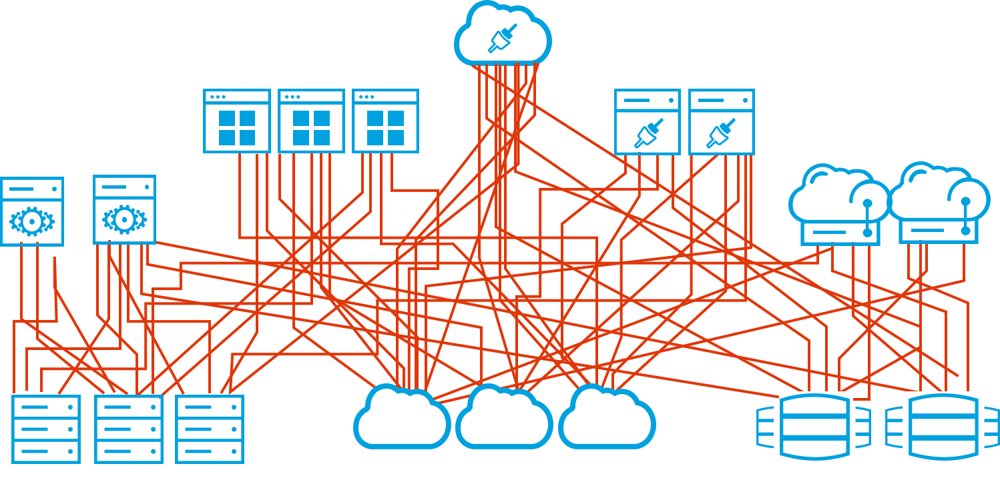
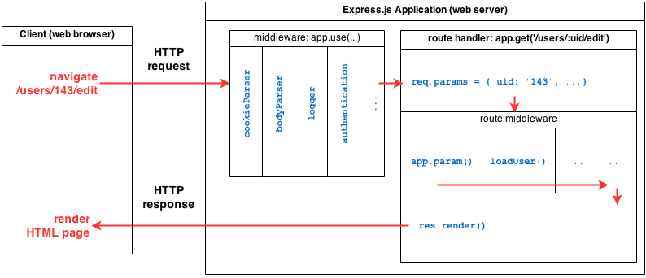

# Máster en Programación FullStack con JavaScript y Node.js
### JS, Node.js, Frontend, Backend, Firebase, Express, Patrones, HTML5_APIs, Asincronía, Websockets, Testing

## Clase 69

### Express: ¿Cómo debo estructurar mi aplicación?



**[Listas de rutas (Routes separation)](https://github.com/expressjs/express/tree/4.13.1/examples/route-separation)**
```js
const express = require('express'),
    logger = require('morgan'),
    cookieParser = require('cookie-parser'),
    bodyParser = require('body-parser'),
    methodOverride = require('method-override'),
    site = require('./site'),
    post = require('./post'),
    user = require('./user'),
    app = express();

// Config
app.set('view engine', 'jade');
app.set('views', __dirname + '/views');

app.use(logger('dev'));
app.use(methodOverride('_method'));
app.use(cookieParser());
app.use(bodyParser.urlencoded({ extended: true }));
app.use(express.static(__dirname + '/public'));

// General
app.get('/', site.index);

// User
app.get('/users', user.list);
app.all('/user/:id/:op?', user.load);
app.get('/user/:id', user.view);
app.get('/user/:id/view', user.view);
app.get('/user/:id/edit', user.edit);
app.put('/user/:id/edit', user.update);

// Posts
app.get('/posts', post.list);

app.listen(8080, () => {
  console.log('Express started on port 8080');
});

```

**[Correlación de rutas (Routes Map)](https://github.com/expressjs/express/tree/4.13.1/examples/route-map)**

```js
const express = require('express'),
    app = express();

app.map = (a, route) => {
  route = route || '';
  for (let key in a) {
    switch (typeof a[key]) {
      // { '/path': { ... }}
      case 'object':
        app.map(a[key], route + key);
        break;
      // get: function(){ ... }
      case 'function':
        console.log('%s %s', key, route);
        app[key](route, a[key]);
        break;
    }
  }
};

const users = {
  list: (req, res) => {
    res.send('user list');
  },

  get: (req, res) => {
    res.send('user ' + req.params.uid);
  },

  delete: (req, res) => {
    res.send('delete users');
  }
};

const pets = {
  list: (req, res) => {
    res.send('user ' + req.params.uid + '\'s pets');
  },

  delete: (req, res) => {
    res.send('delete ' + req.params.uid + '\'s pet ' + req.params.pid);
  }
};

app.map({
  '/users': {
    get: users.list,
    delete: users.delete,
    '/:uid': {
      get: users.get,
      '/pets': {
        get: pets.list,
        '/:pid': {
          delete: pets.delete
        }
      }
    }
  }
});

app.listen(8080, () => {
  console.log('Express started on port 8080');
});
  
```

**[Controladores de estilo MVC](https://github.com/strongloop/express/tree/master/examples/mvc)**


### El ciclo de Petición/Respuesta en Express




### Express: Middelware Oficial (no incorporado) desde Express v4.x

**[serve-favicon](https://github.com/expressjs/serve-favicon)** _favicon serving middleware_
```js
const express = require('express'),
    favicon = require('serve-favicon'),
    path = require('path');

const app = express()
app.use(favicon(path.join(__dirname, 'public', 'favicon.ico')))

// Tu código

app.listen(8080)
```


**[Morgan](https://github.com/expressjs/morgan)** Logger para peticiones HTTP
```js
const express = require('express'),
    fs = require('fs'),
    morgan = require('morgan'),
    path = require('path'),
    app = express();

// Write Stream (modo append)
const accessLogStream = fs.createWriteStream(path.join(__dirname, 'access.log'), { flags: 'a' })

// setup the logger
app.use(morgan('combined', { stream: accessLogStream }))

app.get('/', (req, res) => {
  res.send('hello, world!')
})

app.listen(8080)
```

**[body-parser](https://github.com/expressjs/body-parser)** _Node.js body parsing middleware_
```js
const express = require('express'),
    bodyParser = require('body-parser'),
    app = express();

// parse application/x-www-form-urlencoded
app.use(bodyParser.urlencoded({ extended: false }))

// parse application/json
app.use(bodyParser.json())

app.use(({body}, res) => {
  res.setHeader('Content-Type', 'text/plain')
  res.write('you posted:\n')
  res.end(JSON.stringify(body, null, 2))
})

app.listen(8080);
```

**[csurf](https://github.com/expressjs/csurf)** _CSRF token middleware_
- Se complementa con `cookie-parser` ya que es necesario gestionar cookies
- Incluye [soporte para Ajax](https://github.com/expressjs/csurf#using-ajax)

```js
const cookieParser = require('cookie-parser');
const csrf = require('csurf');
const bodyParser = require('body-parser');
const express = require('express');

// setup route middlewares
const csrfProtection = csrf({ cookie: true });
const parseForm = bodyParser.urlencoded({ extended: false });

// create express app
const app = express();

// parse cookies
// we need this because "cookie" is true in csrfProtection
app.use(cookieParser())

app.get('/form', csrfProtection, (req, res) => {
  // pass the csrfToken to the view
  res.render('send', { csrfToken: req.csrfToken() })
})

app.post('/process', parseForm, csrfProtection, (req, res) => {
  res.send('data is being processed')
})

app.listen(8080);

```

**[cors](https://github.com/expressjs/cors)** _Node.js CORS middleware_

```js
const express = require('express'),
    cors = require('cors'),
    app = express();

/* Solo en caso de quererlo en toda la aplicación
app.use(cors())
*/
app.get('/products/:id', cors(), (req, res, next) => {
  res.json({msg: 'This is CORS-enabled for a Single Route'})
})

app.listen(8080, () => {
  console.log('CORS-enabled web server listening on port 80')
})
```

**[compression](https://github.com/expressjs/compression)** _Node.js compression middleware_
- Soporta [gzip](https://www.wikiwand.com/es/Gzip)
- Soporta [deflate](https://es.wikipedia.org/wiki/Deflaci%C3%B3n_(algoritmo))

```js
const compression = require('compression'),
    express = require('express');

const app = express();

// compress all responses
app.use(compression())

// More code...

app.listen(8080, () => {
  console.log('CORS-enabled web server listening on port 80')
})
```


**[express-session](https://github.com/expressjs/session)** _Simple session middleware for Express_

```js
const express = require('express'),
    parseurl = require('parseurl'),
    session = require('express-session');

const app = express();

app.use(session({
  secret: 'keyboard cat',
  resave: false,
  saveUninitialized: true
}))

app.use((req, res, next) => {
  if (!req.session.views) {
    req.session.views = {}
  }

  // get the url pathname
  const pathname = parseurl(req).pathname;

  // count the views
  req.session.views[pathname] = (req.session.views[pathname] || 0) + 1

  next()
})

app.get('/foo', (req, res, next) => {
  res.send(`you viewed this page ${req.session.views['/foo']} times`)
})

app.get('/bar', (req, res, next) => {
  res.send(`you viewed this page ${req.session.views['/bar']} times`)
})

app.listen(8080, () => {
  console.log('CORS-enabled web server listening on port 80')
})
```


**[multer](https://github.com/expressjs/multer)** Node.js middleware for handling `multipart/form-data`
- Se utiliza principalmente para la gestión de ficheros
- Internamente utiliza [busboy](https://github.com/mscdex/busboy)

```html
<form action="/profile" method="post" enctype="multipart/form-data">
  <input type="file" name="avatar" />
</form>
```

```js
const express = require('express');
const multer  = require('multer');
const upload = multer({ dest: 'uploads/' });

const app = express();

app.post('/profile', upload.single('avatar'), (req, res, next) => {
    /*
        req.file is the `avatar` file
        req.body will hold the text fields, if there were any
    */
})

app.post('/photos/upload', upload.array('photos', 12), (req, res, next) => {
    /*
        req.files is array of `photos` files
        req.body will contain the text fields, if there were any
    */
})

const cpUpload = upload.fields([{ name: 'avatar', maxCount: 1 }, { name: 'gallery', maxCount: 8 }]);
app.post('/cool-profile', cpUpload, (req, res, next) => {
     /*
        req.files is an object (String -> Array) where fieldname is the key, and the value is array of files
        e.g.
            req.files['avatar'][0] -> File
            req.files['gallery'] -> Array
        req.body will contain the text fields, if there were any
    */
})

app.listen(8080, () => {
  console.log('CORS-enabled web server listening on port 80')
})
```

**[cookie-session](https://github.com/expressjs/cookie-session)** _Simple cookie-based session middleware_
- No se peude exceder el maximo de cookies y contenido que permite el browser
- No requiere almacenamiento en base de datos
- Inicializa y parsea los datos de sesión del usuario
- Utilizando cookies como almacenamiento
- Tiene algunas opciones avanzadas

```js
const cookieSession = require('cookie-session'),
    express = require('express'),
    app = express();


// trust first proxy
app.set('trust proxy', 1) 

app.use(cookieSession({
  name: 'session',
  keys: ['key1', 'key2']
}))

// Simple view counter
app.get('/', ({session}, res, next) => {
  // Update views
  session.views = (session.views || 0) + 1

  // Write response
  res.end(`${session.views} views`)
})

app.listen(8080)
```


**[cookie-parser](https://github.com/expressjs/cookie-parser):** _Parse HTTP request cookies_
```js
const express = require('express'),
    cookieParser = require('cookie-parser'),
    app = express();

app.use(cookieParser())

app.get('/', ({cookies, signedCookies}, res) => {
  // Cookies that have not been signed
  console.log('Cookies: ', cookies)

  // Cookies that have been signed
  console.log('Signed Cookies: ', signedCookies)
})

app.listen(8080)

// curl command that sends an HTTP request with two cookies
// curl http://127.0.0.1:8080 --cookie "Cho=Kim;Greet=Hello"
```

**[serve-static](https://github.com/expressjs/serve-static)** _Serve static files_

```js
const express = require('express'),
    serveStatic = require('serve-static'),
    app = express();

app.use(serveStatic('public/ftp', {'index': ['default.html', 'default.htm']}))

app.listen(8080)
```

**[vhost](https://github.com/expressjs/vhost)** _Virtual Domain Hosting_

```js
const express = require("express");
const vhost = require("vhost");

const app = express();

app.use(vhost("api.example.com", require("./apps/api/app")));
app.use(vhost("www.example.com", require("./apps/www/app")));
app.use(vhost('*.*.example.com', function handle (req, res, next) {
  // for match of "foo.bar.example.com:8080" against "*.*.example.com":
  console.dir(req.vhost.host) // => 'foo.bar.example.com:8080'
  console.dir(req.vhost.hostname) // => 'foo.bar.example.com'
  console.dir(req.vhost.length) // => 2
  console.dir(req.vhost[0]) // => 'foo'
  console.dir(req.vhost[1]) // => 'bar'
}))

app.listen(8080);
```


### Express: Middelware de la comunidad


**Destacados**
- [scheduled](https://www.npmjs.com/package/scheduled) *Scheduled job manager for JavaScript, linux cron pattern.*
- [Passport](https://github.com/jaredhanson/passport) *Simple, unobtrusive authentication for Node.js*
- [Helmet](https://github.com/helmetjs/helmet) *Help secure Express apps with various HTTP headers*
- [express-resource](https://github.com/expressjs/express-resource) *Resourceful routing for Express*
- [apollo-server-express](https://github.com/apollographql/apollo-server#readme) 🌍 *GraphQL server for Express, Connect, Hapi, Koa and more*
- [express-rate-limit](https://github.com/nfriedly/express-rate-limit) *Basic rate-limiting middleware for express*
- [express-fileupload](https://github.com/richardgirges/express-fileupload#readme) *Simple express file upload middleware that wraps around busboy*
- [express-status-monitor](https://github.com/RafalWilinski/express-status-monitor#readme) *🚀 Realtime Monitoring solution for Node.js/Express.js apps, inspired by status.github.com*
- [express-useragent](https://github.com/biggora/express-useragent/) *NodeJS user-agent middleware*
- [grant](https://github.com/simov/grant) *OAuth Middleware for Express, Koa and Hapi*
- [Muchos más...](https://github.com/sindresorhus/awesome-nodejs)


### Express: rendimiento y fiabilidad 

**Claves: Lo esencial**
- Utilizar la compresión de gzip
- No utilizar funciones síncronas
- Utilizar el middleware para el servicio de archivos estáticos. Evitar `res.sendFile()` y utilizar en su lugar [serve-static](https://www.npmjs.com/package/serve-static)
- Realizar un registro correcto. Evitar `console` y utilizar en su lugar un [logger](https://strongloop.com/strongblog/compare-node-js-logging-winston-bunyan/)
- Manejar las excepciones correctamente usando `Promise` y `try... catch`
- Asegurarse de que la aplicación se reinicia automáticamente

**Claves: Entorno/Configuración**
- Establecer NODE_ENV en production. `NODE_ENV=production node myapp.js` puede llegar a ser [3x más rápido](https://www.dynatrace.com/news/blog/the-drastic-effects-of-omitting-node_env-in-your-express-js-applications/)
- Asegurarse de que la aplicación se reinicia automáticamente con [PM2](http://pm2.keymetrics.io/)
- Ejecutar la aplicación en un clúster con [PM2](http://pm2.keymetrics.io/) y gestionando el cache con [Redis](https://redis.io/)
- Almacenar en la caché los resultados de la solicitud con [varnish](https://www.varnish-cache.org/) o [Nginx](https://www.nginx.com/)
- Utilizar un [balanceador de carga](https://es.wikipedia.org/wiki/Balanceador_de_carga)
- Utilizar un [proxy inverso](https://es.wikipedia.org/wiki/Proxy_inverso) como [Nginx](https://www.nginx.com/)

**Recursos**
- [Express: Mejores prácticas de producción: rendimiento y fiabilidad](http://expressjs.com/es/advanced/best-practice-performance.html)

### Express: Seguridad

**Claves**
- No utilizar [versiones en desuso o vulnerables de Express](http://expressjs.com/es/advanced/security-updates.html)
- [Utilizar TLS](http://expressjs.com/es/advanced/best-practice-security.html)
- Utilizar [Helmet](https://www.npmjs.com/package/helmet)
- Como mínimo, inhabilitar la cabecera `X-Powered-By`. `app.disable('x-powered-by');`
- Utilizar cookies de forma segura
    - Utiliza [cookie-session](https://www.npmjs.com/package/cookie-session) y  [express-session](https://www.npmjs.com/package/express-session)
    - No utilizar el nombre de cookie de sesión predeterminado
- Asegurarse de que las dependencias sean seguras utiliza [Node Security Platform](https://medium.com/npm-inc/npm-acquires-lift-security-258e257ef639) y [Synk](https://snyk.io/vuln)

**Genéricas**
- Implementa el límite de velocidad para evitar ataques de fuerza bruta contra la autenticación con [express-limiter](https://www.npmjs.com/package/express-limiter)
- Implementa protecciones CSRF con [csurf](https://www.npmjs.com/package/csurf)
- Filtra y sanea siempre la entrada de datos del usuario para evitar ataques XSS
- No pierdas de vista el [OWASP Top 10](https://www.owasp.org/index.php/Top_10-2017_Top_10)
- Evita ataques de inyección de SQL utilizando consultas parametrizadas o sentencias preparadas.
- Usa [sqlmap](http://sqlmap.org/) para detectar vulnerabilidades de inyección de SQL en la aplicación.
- Usa [nmap](https://nmap.org/) y [sslyze](https://github.com/nabla-c0d3/sslyze) para probar la configuración de los cifrados SSL, las claves y la renegociación, así como la validez del certificado.
- Usa [safe-regex](https://www.npmjs.com/package/safe-regex) para evitar ataques de [denegación de servicio de expresiones regulares](https://www.owasp.org/index.php/Regular_expression_Denial_of_Service_-_ReDoS).


**Recursos**
- [Express: Mejores prácticas de producción: seguridad](http://expressjs.com/es/advanced/best-practice-security.html)