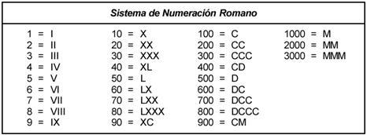

# Máster en Programación FullStack con JavaScript y Node.js
### JS, Node.js, Frontend, Backend, Firebase, Express, Patrones, HTML5_APIs, Asincronía, Websockets, Testing

## Clase 7

### While

- Estructura:
    ```javascript
    /*  --while--
    while (-Condición-) {
        -Instrucciones-
    };
    */
    ```

- Documentación:
    - [While en w3schools](http://www.w3schools.com/js/js_loop_while.asp)
    - [While en MDN](https://developer.mozilla.org/en-US/docs/Web/JavaScript/Reference/Statements/while)

- Bucle infinito:
    Este es un error muy común.

    ```javascript
    while (true) {
        console.log("Este texto se imprime hasta el infinito...");
    };
    ```

- Bucle que no se ejecutará:
    ```javascript
    while (false) {
        console.log("Este texto jamas se imprimirá...");
    };
    ```

- Ejemplo:
    ```javascript
    var control = 1;
    while (control <= 10) {
        console.log(control);
        control++;
    };
    ```


### For

- Estructura:
    ```javascript
    /*  --for--
    for (-Expresión inicial-; -Condición-; -Expresión Actualización-) {
        -Instrucciones-
    };
    */
    ```

- Documentación:
    - [For en w3schools](http://www.w3schools.com/js/js_loop_for.asp)
    - [For en MDN](https://developer.mozilla.org/en-US/docs/Web/JavaScript/Reference/Statements/for)
    - [Dominando el rendimiento](https://web.archive.org/web/20141205235948/https://blogs.oracle.com/greimer/entry/best_way_to_code_a)


- Ejemplo clásico:
    ```javascript
    for (var i = 0; i < 10; i++) {
        console.log(i);
    }
    ```


### Do... While

- Estructura:
    ```javascript
    /* --Do...while--
    do{
       -Instrucciones-
    } while (-Condición-);
    */
    ```

- Documentación:
    - [Do... While en w3schools](http://www.w3schools.com/js/js_loop_while.asp)
    - [Do... While en MDN](https://developer.mozilla.org/en-US/docs/Web/JavaScript/Reference/Statements/do...while)

- Ejemplo:
    ```javascript
    var i = 0;
    do {
       i++;
       console.log(i);
   } while (i < 10);
    ```

- Al menos se ejecutará una vez, aunque la premisa no sea verdadera.

    ```javascript
    do{
       console.warn("me ejecuto")
    } while (false);
    ```

### Break y Continue

- *Continue* nos permite saltar parte del bucle.
```javascript
for (var i = 0; i < 10; i++) {
    
    // Salta el 5 y sigue...
    if (i === 5) { 
    	continue; 
    }
    
    console.log("El valor de i es "+i);
}
```

- *Break* nos permite salir del bucle.
```javascript
for (var i = 0; i < 10; i++) {
    
    // Llega a 5 y sale.
    if (i === 5) { 
    	break; 
    }
    
    console.log("El valor de i es "+i);
}
```

### Usos Avanzados

- Ejemplo usando decrecimiento:
    ```javascript
    for (var i = 10; i > 0; i--) {
        console.log(i);
    }    
    ```

- Ejemplo usando varios contadores:
    ```javascript
    for (var i = 0, x = 1, z = 2, tope = 10; i <= tope; x *= z, i++ ) {
        console.log("i vale "+i+", x vale "+x+", z vale "+z);
    }
    ```

### Ejercicios

Realiza los siguientes ejercicios usando en cada uno los tres tipos de bucles (Do...While, For, While )

**1 -** `Nivel Medio` :spades: Diseña un algoritmo para identificar a los clientes autorizados a entrar a nuestro sistema.
- Características:
	- La palabra clave es "Fictizia mola mucho"
	- Solo existen tres intentos
	- Si se pasan los tres intentos. Se despliega un mensaje informativo.

- Usando *for*
```javascript
	function eureka() {

		var clave = "Fictizia mola mucho";
		var acierto = false;
		var contador = 0
		for (; contador < 3 & acierto === false; contador++) {
			
			var secreto = prompt("Dime el secreto:");

			if (secreto === clave) {
				acierto = true;
				console.info(secreto, "es la clave que esperaba!")
			} else {
				console.warn(secreto, " no es correcto.")
			}
		};


		if(contador >= 3){
			console.warn("Lo siento... pero has agotado los 3 intentos.")
		}


	}
```

- Usando *while* y *break*
```javascript
	function eureka() {

		var clave = "Fictizia mola mucho";

		var contador = 0


		while(contador < 3){
			var secreto = prompt("Dime el secreto:");

			if (secreto === clave) {

				console.info(secreto, "es la clave que esperaba!")
				break; // elimina más intentos
			} else {
				console.warn(secreto, " no es correcto.")
			}

			contador++;
		}

		if(contador >= 3){
			console.warn("Lo siento... pero has agotado los 3 intentos.")
		}


	}
```

- Usando *Do...While*
```javascript
	function eureka() {

		var clave = "Fictizia mola mucho";
		var acierto = false;
		var contador = 0

		do {
		    var secreto = prompt("Dime el secreto:");

			if (secreto === clave) {
				acierto = true;
				console.info(secreto, "es la clave que esperaba!")
			} else {
				console.warn(secreto, " no es correcto.")
			}

			contador++;

		} while (contador < 3 & acierto === false);
		

		if(contador > 3){
			console.warn("Lo siento... pero has agotado los 3 intentos.")
		}
	}
```


**2 -** Diseña un algoritmo que imprima los numeros del 1 al 100.

- Usando *for*
```javascript
	function contadorPositivo() {
		
		console.info("Empieza la cuenta!");

		for (var i = 1; i <= 100; i++) {
			console.log(i)
		};

		console.info("Terminó la cuenta mágica...");

	}
```

- Usando *while*
```javascript
	function contadorPositivo() {
		
		console.info("Empieza la cuenta!");
		
		var i = 1
		while (i <= 100) {
			console.log(i);
			i++;
		};

		console.info("Terminó la cuenta mágica...");

	}
```

- Usando *Do...While*
```javascript
	function contadorPositivo() {
		
		console.info("Empieza la cuenta!");
		
		var i = 1
		do {
			console.log(i);
			i++;
		} while (i <= 100);

		console.info("Terminó la cuenta mágica...");

	}
```


**3 -** Diseña un algoritmo que imprima los numeros del 100 al 0.

- Usando *for*
```javascript
	function contadorNegativo() {
		
		console.info("Empieza la cuenta!");

		for (var i = 100; i >= 0; i--) {
			console.log(i)
		};

		console.info("Terminó la cuenta mágica...");

	}
```

- Usando *while*
```javascript
	function contadorNegativo() {
		
		console.info("Empieza la cuenta!");
		
		var i = 100
		while (i >= 0) {
			console.log(i);
			i--;
		};

		console.info("Terminó la cuenta mágica...");

	}
```

- Usando *Do...While*
```javascript
	function contadorNegativo() {
		
		console.info("Empieza la cuenta!");
		
		var i = 100
		do {
			console.log(i);
			i--;
		} while (i >= 0);

		console.info("Terminó la cuenta mágica...");

	}
```


**4 -** Diseña un algoritmo que imprima los numeros pares entre 0 y 100.

- Usando *for*
```javascript
	// Tu solución
```

- Usando *while*
```javascript
	// Tu solución
```

- Usando *Do...While*
```javascript
	// Tu solución
```

**5 -** Diseña un algoritmo que imprima los números impares entre un número dado por el usuario y los siguientes 50 números.

- Usando *for* (desestructurado)
```javascript
	// Tu solución
```

- Usando *while*
```javascript
	// Tu solución
```

- Usando *Do...While*
```javascript
	// Tu solución
```

**6 -** Diseña un algoritmo que imprima la suma de los 50 primeros numeros pares y el total de números impares partiendo de un número dado por el usuario
- Usando *for*
```javascript
	// Tu solución
```

- Usando *while*
```javascript
	// Tu solución
```

- Usando *Do...While*
```javascript
	// Tu solución
```

**7 -** `Nivel Avanzado` :diamonds: Diseña un algoritmo introducido un numero y pasarlo a número romanos.
- Esperamos que el número sea menor de 50



- Usando *for*
```javascript
	// Tu solución
```

- Usando *while*
```javascript
	// Tu solución
```

- Usando *Do...While*
```javascript
	// Tu solución
```
