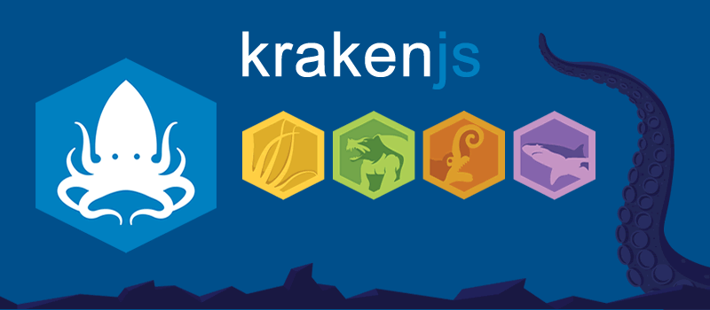
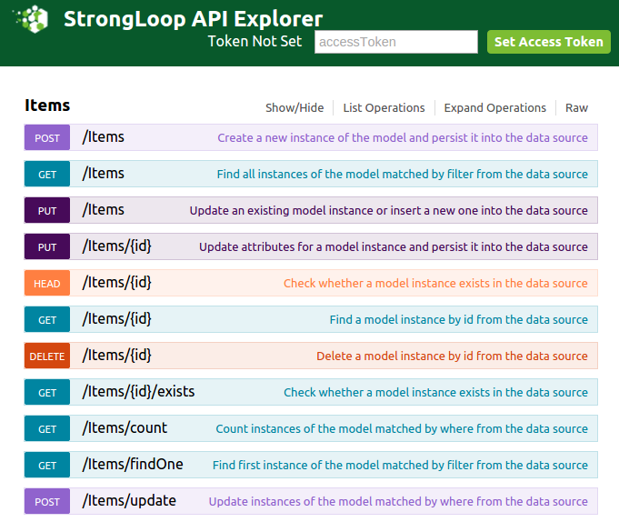
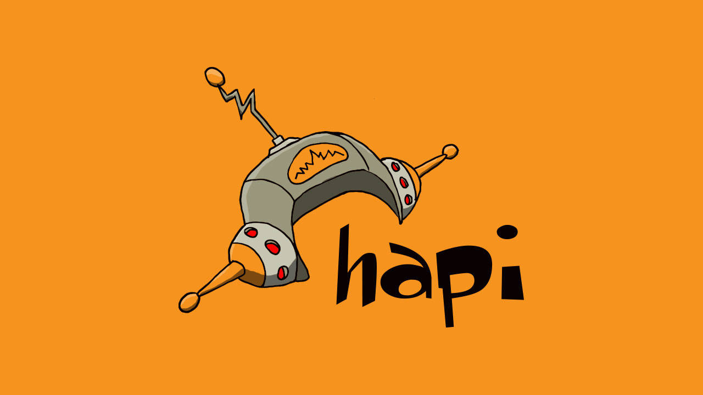
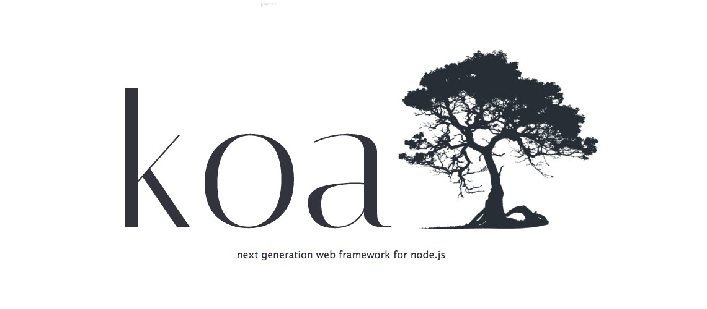
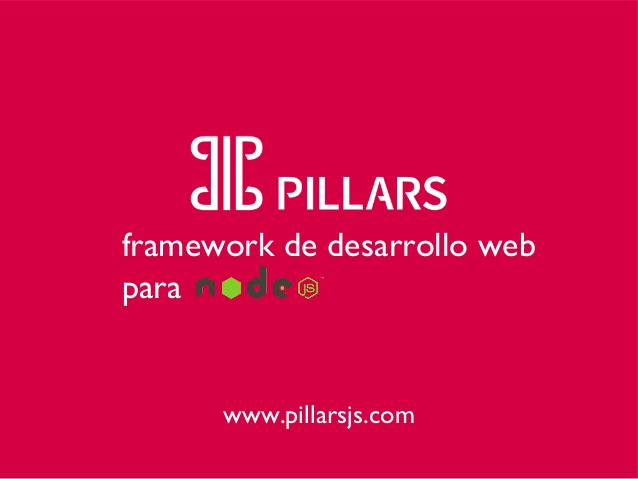

# Máster en Programación FullStack con JavaScript y Node.js
### JS, Node.js, Frontend, Backend, Firebase, Express, Patrones, HTML5_APIs, Asincronía, Websockets, Testing

## Clase 71

### Express

**Hello World**
```js
const express = require('express');
const app = express();

app.get('/', (req, res) => {
  res.send('Hello World!');
});

app.listen(8080, () => {
  console.log('Example app listening on port 8080!');
});
```


**Api sencilla**
```js
// @see: https://strongloop.com/strongblog/compare-express-restify-hapi-loopback/
const express = require('express');
const Item = require('models').Item;
const app = express();
const itemRoute = express.Router();

itemRoute.param('itemId', (req, res, next, id) => {
  Item.findById(req.params.itemId, (err, item) => {
    req.item = item;
    next();
  });
});

// Create new Items
itemRoute.post('/', ({body}, res, next) => {
  const item = new Item(body);
  item.save((err, item) => {
    res.json(item);
  });
});

itemRoute.route('/:itemId')
  // Get Item by Id
  .get(({item}, res, next) => {
    res.json(item);
  })
  // Update an Item with a given Id
  .put(({item, body}, res, next) => {
    item.set(body);
    item.save((err, item) => {
      res.json(item);
    });
  })
  // Delete and Item by Id
  .delete(({item}, res, next) => {
    item.remove(err => {
      res.json({});
    });
  });

app.use('/api/items', itemRoute);
app.listen(8080);
```

### krakenjs


**Claves**
- Es una capa de configuración por encima de Express
- Desarrollado por Paypal
- Soporta Internalización
- Seguridad Out-of-the-box 
- Pensado para gran escala y proyectos tipo enterprise
- Propensión a la configuración
- Pensado para ser escalable
- Incluye dependencias con Dust, LESS, Grunt, Passportjs y Yeoman

**Modulos**
- [Lusca](http://github.com/krakenjs/lusca) *Application security for express apps.*
- [Kappa](https://github.com/krakenjs/kappa) *A hierarchical npm-registry proxy*
- [Makara](http://krakenjs.com/makara.html) *Internationalization support for Kraken with Dust Templating*
- [Adaro](http://krakenjs.com/adaro.html) *Templating using DustJS*

**Hello World**
```js
const express = require('express');
const kraken = require('kraken-js');

const app = express();
app.use(kraken());
app.listen(8080);
```

**Recursos**
- [Web Oficial](http://krakenjs.com/)
- [Github](https://github.com/krakenjs/kraken-js)
- [krakenjs | Getting started](http://krakenjs.com/#getting-started)
- [krakenjs | examples](http://krakenjs.com/index.html#examples)
- [krakenjs | news](http://krakenjs.com/blog.html)
- [La gran contribución de PayPal a Node.js: la suite Kraken](https://felixsanz.com/articulos/la-gran-contribucion-de-paypal-a-nodejs-la-suite-kraken)
- [Kraken js at paypal](https://www.slideshare.net/lennymarkus/node-js-at-paypal)
- [From Java to Node - the PayPal story](http://blog.builtinnode.com/post/from-java-to-node---the-paypal-story#)

### Web frameworks: Strongloop y Loopback


> As Ted explains, “As a newcomer to LoopBack, one of your first challenges will be figuring out what to call the technology you’re using. LoopBack was a standalone entity owned by a company called StrongLoop (which was also the name of its paid service offering), until the company was acquired by IBM® in 2015. Since that time, the LoopBack team released a 3.0 version, and starting with this version it’s consolidating the terms and names under the IBM banner with IBM API Connect™.” [StrongLoop](https://strongloop.com/strongblog/hello-world-getting-started-loopback-api-connect/)

**Claves**
- StrongLoop empezó en 2013 ofreciendo una version enterprise de Nodejs (Open Source) llamada Loopback
- En 2015 IBM adquiere la compañia
- Tiene una curva de aprendizaje muy elevada
- Basado en Express
- Usa una filosofía de convención sobre configuración
- Permite desarrollar API Rest muy rapidamente
- Documentación muy extensa
- Soporta [RPC](https://es.wikipedia.org/wiki/Llamada_a_procedimiento_remoto)

**Arquitectura**


**[Hello World](https://loopback.io/getting-started/)**

**Api sencilla**
```js
// @see: https://strongloop.com/strongblog/compare-express-restify-hapi-loopback/
var loopback = require('loopback');
var app = module.exports = loopback();

var Item = loopback.createModel(
  'Item',
  {
    description: 'string',
    completed: 'boolean'
  }
);

app.model(Item);
app.use('/api', loopback.rest());
app.listen(8080);

// API EXPLORER!
app.start = function() {
    // start the web server
    return app.listen(function() {
        app.emit('started');
        var baseUrl = app.get('url').replace(/\/$/, '');
        console.log('Web server listening at: %s', baseUrl);
        if (app.get('loopback-component-explorer')) {
            var explorerPath = app.get('loopback-component-explorer').mountPath;
            console.log('Browse your REST API at %s%s', baseUrl, explorerPath);
        }
    });
};
```

```
POST /Items
GET /Items
PUT /Items
PUT /Items/{id}
HEAD /Items/{id}
GET /Items/{id}
DELETE /Items/{id}
GET /Items/{id}/exists
GET /Items/count
GET /Items/findOne
POST /Items/update
```




**Recursos**
- [Web Oficial](http://loopback.io/)
- [Loopback | Getting started](https://loopback.io/getting-started/)
- [Loopback | Examples](https://loopback.io/examples/)
- [Loopback | Docs](https://loopback.io/doc/)
- [Loopback | Resources](https://loopback.io/resources/)
- [Loopback | Contributing](https://loopback.io/contributing/)
- [The busy JavaScript developer's guide to LoopBack](https://www.ibm.com/developerworks/library/wa-get-started-with-loopback-neward-1/index.html)
- [Getting Started with Node.js and LoopBack](https://semaphoreci.com/community/tutorials/getting-started-with-node-js-and-loopback)

### Web frameworks: Hapi.js



**Claves**
- El core de Hapi.js es mucho más completo que el de Express
- No se usa middelware, se utilizan plugins
- Creado por Walmart Labs
- Originalmente utilizaba Express internamente, pero ya no

**Hello World**
```js
const Hapi = require('hapi');

// Create a server with a host and port  
const server = Hapi.server({
  host: 'localhost',
  port: 8080
});

// Add the route  
server.route({
  method: 'GET',
  path: '/hello',
  handler: function (request, h) {

    return 'Hello World!';
  }
});

// Start the server  
async function start () {

  try {
    await server.start();
  }
  catch (err) {
    console.log(err);
    process.exit(1);
  }

  console.log('Server running at:', server.info.uri);
};

start();
```

**Api sencilla**
```js
// @see: https://strongloop.com/strongblog/compare-express-restify-hapi-loopback/
const Hapi = require('hapi');
const Item = require('models').Item;
const server = Hapi.createServer('0.0.0.0', 8080);

server.ext('onPreHandler', (req, next) => {
  if (req.params.itemId) {
    Item.findById(req.params.itemId, (err, item) => {
      req.item = item;
      next();
    });
  }
  else {
    next();
  }
});

server.route([
  {
    path: '/api/items/{itemId}',
    method: 'GET',
    config: {
      handler({item}, reply) {
        reply(item);
      }
    }
  },
  {
    path: '/api/items/{itemId}',
    method: 'PUT',
    config: {
      handler({item, body}, reply) {
        item.set(body);
        item.save((err, item) => {
          reply(item).code(204);
        });
      }
    }
  },
  {
    path: '/api/items',
    method: 'POST',
    config: {
      handler({body}, reply) {
        const item = new Item(body);
        item.save((err, item) => {
          reply(item).code(201);
        });
      }
    }
  },
  {
    path: '/api/items/{itemId}',
    method: 'DELETE',
    config: {
      handler({item}, reply) {
        item.remove(err => {
          reply({}).code(204);
        });
      }
    }
  }
]);

server.start();
```

**Recursos**
- [Web Oficial](https://hapijs.com/)
- [Github](https://github.com/hapijs/hapi)
- [@hapijs en Twitter](https://twitter.com/hapijs)
- [Hapi.js | Latest Updates](https://hapijs.com/updates)
- [Hapi.js | Getting started](https://hapijs.com/tutorials)
- [Hapi.js | API](https://hapijs.com/api)
- [Hapi.js | Community](https://hapijs.com/community)
- [Hapi.js | Plugins](https://hapijs.com/plugins)
- [Hapi.js | Resources](https://hapijs.com/resources)
- [Cómo empezar una API RESTful con hapi.js](https://medium.com/noders/c%C3%B3mo-empezar-una-api-restful-con-hapi-js-da9e36610ede)
- [Create a Server in Hapi JS](https://medium.com/@vsvaibhav2016/create-a-server-in-hapi-js-7d0c43add545)
- [Introduction to Hapi.js](https://medium.com/@jsonmez/introduction-to-hapi-js-c128f40bd919)
- [How to set-up a powerful API with Nodejs, GraphQL, MongoDB, Hapi, and Swagger](https://medium.freecodecamp.org/how-to-setup-a-powerful-api-with-nodejs-graphql-mongodb-hapi-and-swagger-e251ac189649)
- [Creating RESTful API with Node.js: Hapi vs. Express](https://medium.com/@cabot_solutions/creating-restful-api-with-node-js-hapi-vs-express-ccb97a776c02)

### Web frameworks: Sails.js


> Build practical, production-ready Node.js apps in a matter of weeks, not months. 
Sails is the most popular MVC framework for Node.js, designed to emulate the familiar MVC pattern of frameworks like Ruby on Rails, but with support for the requirements of modern apps: data-driven APIs with a scalable, service-oriented architecture. [Sailsjs](https://sailsjs.com/)

**Claves**
- Basado y dependiente de Express
- Esta pensado para aplicaciones de gran tamaño
- Tiene una arquitectura MVC configurada de base
- Es necesario conocer Express en profundidad
- Es una abstracción muy grande sobre express
- Cuenta con una herramienta CLI para facilitar el desarrollo
- Cuenta con un ORM propio que simplifica el trabajo con Bases de datos

**Recursos**
- [Web Oficial](https://github.com/balderdashy/sails)
- [Sailsjs | Get Started](https://sailsjs.com/get-started)
- [Sailsjs | Support](https://sailsjs.com/support)
- [Sailsjs | Docs](https://sailsjs.com/documentation/reference)
- [Intro to Sails.js](https://medium.com/@josephdlawson21/intro-to-sails-js-99a2016bf37d)

### Web frameworks: Koa.js


> Expressive HTTP middleware framework for node.js to make web applications and APIs more enjoyable to write. Koa's middleware stack flows in a stack-like manner, allowing you to perform actions downstream then filter and manipulate the response upstream.
>
> Only methods that are common to nearly all HTTP servers are integrated directly into Koa's small ~570 SLOC codebase. This includes things like content negotiation, normalization of node inconsistencies, redirection, and a few others.
>
> Koa is not bundled with any middleware.
> [Koa](https://github.com/koajs/koa)

**Claves**
- No utiliza Express para funcionar
- Esta pensado para remplazar la libreria `http` y `https` de Nodejs
- Utiliza dos tipos de middleware `async function` y `common function`
- `Context` sustituye al clasico `Request` y `Response`, pero se mantiene `next` como en Express
- Sin middleware ni routas
- Sin `callback hell`, usando `try/catch`
- Sistema muy modular y extensible por librerías

**Hello World**
```js
const Koa = require('koa');
const app = new Koa();

app.use(async function(ctx) {
  ctx.body = 'Hello World';
});

app.listen(3000);
```

**Recursos**
- [Web Oficial](http://koajs.com/)
- [Koa | Koa for Express Users](https://github.com/koajs/koa/blob/HEAD/docs/koa-vs-express.md)
- [Koa | Usage Guide](https://github.com/koajs/koa/blob/HEAD/docs/guide.md)
- [Koa | Error Handling](https://github.com/koajs/koa/blob/HEAD/docs/error-handling.md)
- [Koa | API Docs](https://github.com/koajs/koa/blob/HEAD/docs/api/index.md)
- [Koa | FAQ](https://github.com/koajs/koa/blob/HEAD/docs/faq.md)


### Web frameworks: restify


**Claves**
- No depende de Express
- Toma una gestión de rutas muy similar a Express
- Especializado para la gestión de API Rest
- No incluye la gestión de plantillas y renderizado de express

**Hello World**
```js
const restify = require('restify');

const server = restify.createServer();

server.get('/hello', (req, res, cb) => {
  res.send("Hello World!");
  return cb();
});

server.listen(8080, () => { 
  console.log('%s listening at %s', server.name, server.url);
});
```

**Api sencilla**
```js
// @see: https://strongloop.com/strongblog/compare-express-restify-hapi-loopback/
const restify = require('restify');
const Item = require('models').Item;
const app = restify.createServer();

app.use((req, res, next) => {
  if (req.params.itemId) {
    Item.findById(req.params.itemId, (err, item) => {
      req.item = item;
      next();
    });
  }
  else {
    next();
  }
});

app.get('/api/items/:itemId', ({item}, res, next) => {
  res.send(200, item);
});

app.put('/api/items/:itemId', ({item, body}, res, next) => {
  item.set(body);
  item.save((err, item) => {
    res.send(204, item);
  });
});

app.post('/api/items', ({body}, res, next) => {
  const item = new Item(body);
  item.save((err, item) => {
    res.send(201, item);
  });
});

app.delete('/api/items/:itemId', ({item}, res, next) => {
  item.remove(err => {
    res.send(204, {});
  });
});

app.listen(8080);
```

**Recursos**
- [Web Oficial](http://restify.com/)
- [Restify | Docs](http://restify.com/docs/home/)

### Web frameworks: Pillrsjs




- [Web oficial](http://pillarsjs.com/)
- [Github](https://github.com/pillarsjs)
- [NPM](https://www.npmjs.com/package/pillars)
- [Twitter](https://twitter.com/pillarsjs?lang=es)

**Documentación**
- [Primeros pasos](http://pillarsjs.com/started/comenzando)
- [Tutoriales](http://pillarsjs.com/tutorials/nodejs)
- [Referencia](http://pillarsjs.com/reference)

**Presentaciones**
- [Pillars.js framework de desarrollo web para Node.js (2015)](https://es.slideshare.net/cheloq/pillarsjs-framework-de-desarrollo-web-para-nodejs)
- [Pillarjs & GoblinDB, Prototype like a Boss!](https://slides.com/ulisesgascon/pillarjs-goblindb-prototype-like-a-boss#/6)

**Vídeos**
- [34º Betabeers Huelva - Desarrollo en NodeJS con PillarJS](https://www.youtube.com/watch?v=QrjhfRaV7mc)

**Proyectos**
- [AireMAD](http://airemad.com/#/)
- [Vanity.pillarsjs](https://github.com/pillarsjs/vanity/tree/dev)


### Web frameworks: Muchos más...

**Recursos**
- [State of JS | Back-end Frameworks – Worldwide Usage](https://2017.stateofjs.com/2017/back-end/worldwide/)
- [Node.js performance vs Hapi, Express, Restify, Koa & More](https://raygun.com/blog/nodejs-vs-hapi-express-restify-koa/)
- [NPM Trends | express, koa, pillars,kraken, loopback, hapi, sails](https://www.npmtrends.com/express-vs-koa-vs-pillars-vs-kraken-vs-loopback-vs-hapi-vs-sails)
- [NPM Trends | koa, kraken, loopback, hapi, sails](https://www.npmtrends.com/koa-vs-kraken-vs-loopback-vs-hapi-vs-sails)

**Frameworks**
- [Feathers](http://feathersjs.com) *Microservice framework built in the spirit of Express.*
- [Meteor](https://www.meteor.com) *An ultra-simple, database-everywhere, data-on-the-wire, pure-Javascript web framework.*
- [ThinkJS](https://github.com/thinkjs/thinkjs) *Framework with ES2015+ support, WebSockets, REST API.*
- [ActionHero](https://github.com/actionhero/actionhero) *Framework for making reusable & scalable APIs for TCP sockets, WebSockets, and HTTP clients.*
- [MERN](http://mern.io) *Easily build production-ready universal apps with MongoDB, Express, React, and webpack.*
- [Next.js](https://github.com/zeit/next.js) *Minimalistic framework for server-rendered universal JavaScript web apps.*
- [Nuxt.js](https://github.com/nuxt/nuxt.js) *Minimalistic framework for server-rendered Vue.js apps.*
- [seneca](https://github.com/senecajs/seneca) *Toolkit for writing microservices.*
- [AdonisJs](http://adonisjs.com) *A true MVC framework for Node.js built on solid foundations of Dependency Injection and IoC container.*
- [Hemera](https://github.com/hemerajs/hemera) *Write reliable and fault-tolerant microservices with [NATS](https://nats.io).*
- [Micro](https://github.com/zeit/micro) *Minimalistic microservice framework with an async approach.*
- [Moleculer](https://moleculer.services) *Fast & powerful microservices framework.*
- [Fastify](https://github.com/fastify/fastify) *Fast and low overhead web framework.*
- [Nest](https://github.com/nestjs/nest) *Angular-inspired framework for building efficient and scalable server-side apps.*
- [Zeronode](https://github.com/sfast/zeronode) *Minimal building block for reliable and fault-tolerant microservices.*
- [TypeGraphQL](https://github.com/19majkel94/type-graphql) *Modern framework for creating GraphQL APIs with TypeScript, using classes and decorators.*

### Static site generators

- [Wintersmith](https://github.com/jnordberg/wintersmith) *Flexible, minimalistic, multi-platform static site generator.*
- [Assemble](https://github.com/assemble/assemble/) *Static site generator for Node.js, Grunt.js, and Yeoman.*
- [DocPad](https://github.com/docpad/docpad) *Static site generator with dynamic abilities and huge plugin ecosystem.*
- [Phenomic](https://github.com/phenomic/phenomic) *Modern static website generator based on the React and Webpack ecosystem.*
- [docsify](https://github.com/QingWei-Li/docsify) *Markdown documentation site generator with no statically built HTML files.*


### Content management systems

- [KeystoneJS](https://github.com/keystonejs/keystone) *CMS and web application platform built on Express and MongoDB.*
- [ApostropheCMS](https://github.com/apostrophecms/apostrophe) *Content management system with an emphasis on intuitive front end content editing and administration built on Express and MongoDB.*
- [Strapi](https://github.com/strapi/strapi) *Content Management Framework (headless-CMS) to build powerful APIs.*
- [Tipe](https://github.com/tipeio/tipe) *Developer-first content management system with GraphQL and REST API from a schema file.*


### Forum

- [nodeBB](https://github.com/NodeBB/NodeBB) *Forum platform for the modern web.*


### Blogging

- [Ghost](https://github.com/TryGhost/Ghost) *Simple, powerful publishing platform.*
- [Hexo](https://github.com/hexojs/hexo) *Fast, simple and powerful blogging framework.*


### Ejercicios

**1 -** Migra la aplicación de MovieFire para hacer una APIRest con Nodejs

Claves:
- Puedes usar librerías como `request`, `morgan`, `helmet`, `firebase`...
- Puedes dejar un front listo en `/public` y habilitar la ruta `/` para dar soporte
- Manten una buena estructura separando rutas y modelos, puedes usar `async/await` para simplificar el trabajo
- Recuerda normalizar la estructura de datos que nos devuelve la API de OMBD
- :warning: reutilizaremos este ejercicio en el futuro con otras bases de datos, asi que intentan aislar y abstraer la conexión a la base de datos ;-)

Rutas:
- `[GET] /api/movies` retorna un JSON con  todas las películas, array de objetos `[{id, name, title...},{}]`
- `[GET] /api/movies/:id` retorna un JSON con los detalles de una película en concreto, objeto `{}`
- `[POST] /api/movies` Crea una pelicula y retorna un status `200`. Payload `{name: ""}`
- `[PUT] /api/movies` Actualiza el nombre de una película y retorna un status `200`. Payload `{id: "", name: ""}`
- `[DELETE] /api/movies` Borra una película y retorna un status `200`. Payload `{id: ""}`


**[Solución](../OTROS/movie_fire/apirest-firebase)**