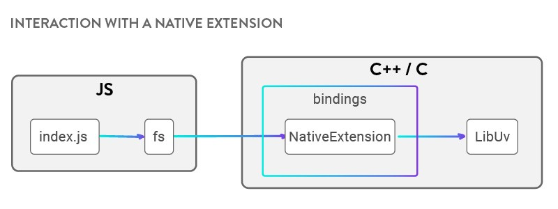

# Máster en Programación FullStack con JavaScript y Node.js
### JS, Node.js, Frontend, Backend, Firebase, Express, Patrones, HTML5_APIs, Asincronía, Websockets, Testing

## Clase 74


### Node.js Best Practices

[](https://github.com/i0natan/nodebestpractices)

**Recursos**
- [i0natan/nodebestpractices](https://github.com/i0natan/nodebestpractices) *The largest Node.JS best practices list (November 2018)*
- [Node.js Best Practices - How to Become a Better Developer in 2017](https://blog.risingstack.com/node-js-best-practices-2017/)
- [25 development practices our NodeJS developers follow](https://www.peerbits.com/blog/development-practices-for-nodejs-developers.html)
- [19 ways to become a better Node.js developer in 2019](https://medium.com/@me_37286/19-ways-to-become-a-better-node-js-developer-in-2019-ffd3a8fbfe38)

### Gestion de errores


**Tipos de error**
- `Explicit exceptions`, cuando usamos `throw`
- `Implicit exceptions`, como cuando no definimos una variable (ReferenceError) 
- El evento `error` de `EventEmitter` que puede terminar con el proceso, aplicable nativamente a Streams, Servers, Requests/Responses, Child processes, etc...
- El argumento `error` en un callback
- El `reject` de una `Promise`

**Claves**
- Utiliza siempre try/catch con Async/Await
- Utiliza siempre catch para gestionar problemas en flujos de promesas
- Utiliza `Error-First Callbacks` para gestionar errores con callbacks
- Usa un logger para tener una trazabilidad real de los errores
- Entender las diferencias entre `Operational errors` y  `programmer errors`.

**Recursos**
- [The Node.js Way - Understanding Error-First Callbacks](http://fredkschott.com/post/2014/03/understanding-error-first-callbacks-in-node-js/)
- [Node.js Best Practices | Error Handling Practices](https://github.com/i0natan/nodebestpractices#2-error-handling-practices)
- [Building Robust Node Applications: Error Handling](https://strongloop.com/strongblog/robust-node-applications-error-handling/)
- [Joyent | Production Practices](https://www.joyent.com/node-js/production/design/errors)
- [How to prevent your Node.js process from crashing](https://medium.com/dailyjs/how-to-prevent-your-node-js-process-from-crashing-5d40247b8ab2)

### [Debugging Node.js](https://www.youtube.com/watch?v=Xb_0awoShR8)


```bash
node --inspect <your_file>.js     # Normal
node --inspect-brk <your_file>.js # Con breakpoints
# Abrir about:inspect en Chrome
```


**Librerías de Logging**

- [pino](https://github.com/pinojs/pino) *Extremely fast logger inspired by Bunyan.*
- [winston](https://github.com/winstonjs/winston) *Multi-transport async logging library.*
- [console-log-level](https://github.com/watson/console-log-level) *The most simple logger imaginable with support for log levels and custom prefixes.*
- [storyboard](https://github.com/guigrpa/storyboard) *End-to-end, hierarchical, real-time, colorful logs and stories.*
- [signale](https://github.com/klauscfhq/signale) *Hackable console logger with beautiful output.*


**Librerías de Debugging / Profiling**

- [ndb](https://github.com/GoogleChromeLabs/ndb) *Improved debugging experience, enabled by Chrome DevTools.*
- [ironNode](https://github.com/s-a/iron-node) *Node.js debugger supporting ES2015 out of the box.*
- [node-inspector](https://github.com/node-inspector/node-inspector) *Debugger based on Blink Developer Tools.*
- [debug](https://github.com/visionmedia/debug) *Tiny debugging utility.*
- [why-is-node-running](https://github.com/mafintosh/why-is-node-running) *Node.js is running but you don't know why?*
- [njsTrace](https://github.com/valyouw/njstrace) *Instrument and trace your code, see all function calls, arguments, return values, as well as the time spent in each function.*
- [vstream](https://github.com/joyent/node-vstream) *Instrumentable streams mix-ins to inspect a pipeline of streams.*
- [stackman](https://github.com/watson/stackman) *Enhance an error stacktrace with code excerpts and other goodies.*
- [locus](https://github.com/alidavut/locus) *Starts a REPL at runtime that has access to all variables.*
- [0x](https://github.com/davidmarkclements/0x) *Flamegraph profiling.*
- [ctrace](https://github.com/automation-stack/ctrace) *Well-formatted and improved trace system calls and signals.*
- [leakage](https://github.com/andywer/leakage) *Write memory leak tests.*
- [llnode](https://github.com/nodejs/llnode) *Post-mortem analysis tool which allows you to inspect objects and get insights from a crashed Node.js process.*


**Recursos**
- [Debugging Node.js with Google Chrome](https://medium.com/the-node-js-collection/debugging-node-js-with-google-chrome-4965b5f910f4)
- [Node | Debugging Guide](https://nodejs.org/en/docs/guides/debugging-getting-started/)
- [Node Summit | Debugging in 2017 with Node.js](https://www.youtube.com/watch?v=Xb_0awoShR8)
- [Step-by-step guide to debugging NodeJS applications](https://medium.com/@fay_jai/step-by-step-guide-to-debugging-nodejs-applications-9d3c5131f937)
- [How to Debug Node.js with the Best Tools Available](https://blog.risingstack.com/how-to-debug-nodej-js-with-the-best-tools-available/)
- [Debugging Node.js con Node Inspector](https://www.genbeta.com/desarrollo/debugging-node-js-con-node-inspector)

### Aplicaciones isomórficas o universales

```js
// Esto es univeral
function saludar () {
	console.log('Hola Mundo!');
}

// Esto NO es universal
document.body.innerText = "Hola Mundo!"
```

**Claves**
- El código universal debe poder funcionar en cliente y servidor
- Cosas problematicas en cliente
  -  DOM (`document`, `window`)
  -  HTML5 Apis (localstorage, geolocation, etc..)
  -  Ajax (`XMLHttpRequest`, `fecth`)
  -  Librerias de terceros (`Jquery`, etc...)
- Cosas problematicas en Node
  - Librerías de sistema (`http`, `process`, etc...)
  - Librerias de terceros (`Express`)

**Patrones**

Backbone...
```js
(function(){
  // The top-level namespace. All public Backbone classes and modules will
  // be attached to this. Exported for both CommonJS and the browser.
  var Backbone;
  if (typeof exports !== 'undefined') {
    Backbone = exports;
  } else {
    Backbone = this.Backbone = {};
  }

  // ...
})();
```

Axel Rauschmayer...
```js
"use strict";
(function(exports) {
    // Código de Nodejs
}(typeof exports === "undefined" ? (this.moduleName = {}) : exports));
```

**[UMD](https://github.com/umdjs/umd)**
> UMD (Universal Module Definition) patterns for JavaScript modules that work everywhere.

- [Módulo compatible con Node y AMD](https://github.com/umdjs/umd/blob/master/templates/nodeAdapter.js)
- [Módulo compatible con CommonJS y AMD](https://github.com/umdjs/umd/blob/master/templates/commonjsAdapter.js)
- [Plugin de Jquery que funciona con CommonJS, AMD o globals (navegador)](https://github.com/umdjs/umd/blob/master/templates/jqueryPlugin.js)
- [Módulo compatible con CommonJS, AMD o globals (navegador)](https://github.com/umdjs/umd/blob/master/templates/commonjsStrict.js)
- [Módulo compatible con AMD y globals (navegador)](https://github.com/umdjs/umd/blob/master/templates/amdWeb.js)
 
**Build tools**
- [docpad-plugin-umd](https://github.com/docpad/docpad-plugin-umd) *Wrap specified JavaScript documents in the Universal Module Definition (UMD) allowing them to run in AMD, Require.js, CommonJS/Node.js and Vanilla environments automatically*
- [grunt-umd](https://github.com/bebraw/grunt-umd) *Surrounds code with the universal module definition (MIT)*
- [gulp-umd](https://github.com/eduardolundgren/gulp-umd) *Gulp plugin for build JavaScript files as Universal Module Definition, aka UMD*
- [grunt-urequire](https://github.com/aearly/grunt-urequire) *Grunt wrapper for uRequire*
- [generator-umd](https://github.com/ruyadorno/generator-umd) *An Yeoman Generator to create a basic UMD structure*

**Librerias isomórficas como ejemplo**
- [underscore](https://underscorejs.org/)
- [lodash](https://lodash.com/)
- [momentjs](https://momentjs.com/)
- [mathjs](http://mathjs.org/)

**Recursos**
- [How to write and unit-test universal JavaScript modules (browser, Node.js)](http://2ality.com/2011/08/universal-modules.html)
- [Isomorphic (Universal) JavaScript](https://medium.com/commencis/isomorphic-universal-javascript-496dc8c4341a)
- [Universal JS module loader](https://devhints.io/umdjs)
- [A 10 minute primer to JavaScript modules, module formats, module loaders and module bundlers](https://www.jvandemo.com/a-10-minute-primer-to-javascript-modules-module-formats-module-loaders-and-module-bundlers/)
- [How to write and build JS libraries in 2018](https://medium.com/@kelin2025/so-you-wanna-use-es6-modules-714f48b3a953)
- [Isomorphic ES Modules](https://medium.com/samsung-internet-dev/isomorphic-es-modules-151f0d9a919b)
- [Writing JS libraries less than 1TB size](https://medium.com/@kelin2025/writing-js-libraries-less-than-1tb-size-6342da0c006a)


### Process


**[Códigos de salida en Node.js](https://nodejs.org/dist/latest-v4.x/docs/api/process.html#process_exit_codes)**
- 1 - *Uncaught Fatal Exception - No ha podido ser capturada*
- 2 - **Unused (reserved by Bash for builtin misuse)**
- 3 - *Internal JavaScript Parse Error *
- 4 - *Internal JavaScript Evaluation Failure *
- 5 - *Fatal Error - There was a fatal unrecoverable error in V8.*
- 6 - *Non-function Internal Exception Handler*
- 7 - *Internal Exception Handler Run-Time Failure*
- 8 - **Unused**
- 9 - *Invalid Argument*
- 10 - *Internal JavaScript Run-Time Failure *
- 12 - *Invalid Debug Argument*
- 128 - *Signal Exits - El sistema operativo acaba con Node.*


**process.argv:**
```javascript
console.log(process.argv)
/*
1. ubicacion de node (bin)
2. ubicación del script (location)
3. [Otros parametros]
*/
```

**Detalles del sistema**
```javascript
process.argv[2] = process.argv[2] || "Node.js funcionando desde C9.io";

console.log("===================================");
console.log("Id: " + process.pid);
console.log("Título: " + process.title);
console.log("Ruta: " + process.execPath);
console.log("Directorio Actual: " + process.cwd());
console.log("Node Versión: " + process.version);
console.log("Plataforma: " + process.platform);
console.log("Arquitectura: " + process.arch);
console.log("Tiempo activo: " + process.uptime());
console.log("Argumentos: ");
process.argv.forEach((val, index, array) => {
      console.log(`${index}: ${val}`);
});
console.log("===================================");
```

**console.log("Hola"):**
```javascript
process.stdout.write("Hola")
```


**Captura de errores inesperados**
- Es interesante almacenar estos errores o enviarlos por email.
- Estos errores se escapan del sistema convencional de errores.
```javascript
process.on('uncaughtException',  err => {
	console.error(error.stack);
});
```


**Ejecucción de tareas antes de la finalización del proceso**
```javascript
process.on('exit',  err => {
	// Limpiar cache.. y cosas similares...
});
```

**Captura de [señales en entronos UNIX](https://www.wikiwand.com/en/Unix_signal)**

```javascript
// SIGINT -> Control-C

process.stdin.resume(); // Evitamos que se cierre Node.js

process.on('SIGINT', () => {
  console.log('Llegó SIGINT. Control-C... Saliendo...');
  process.exit(0);
});
```


### Variables del Entorno


> Las variables de entorno son una lista de ajustes que guardan varios estados de una sesión. Cuando se inicia una sesión ya sea en el entrono gráfico o en una terminal, se leen las variables de entorno. 


**Conocer todas las variables disponibles en el entorno**

```bash
# Windows
env

# UNIX
SET
```

**Guardar nuevas variables en el entorno de forma permanente**

```bash
# Windows
SET ALGO='mi secreto'

# UNIX
export ALGO='mi secreto'
```


**Recuperar las variables con Node.js**

```bash
export ALGO='mi secreto'node <fichero>.js
```

```javascript
const datoRecuperado = process.env.ALGO;
console.log(datoRecuperado); // mi secreto
```

**Creando variables del entorno limitadas a Node.js y temporales (SOLO UNIX)**
	
```bash
NODE_ENV=production node app.js
```

```javascript
if(process.env.NODE_ENV === "production"){
	console.log("Entramos en modo producción");
} else if (process.env.NODE_ENV === "development"){
	console.log("Entramos en modo desarrollo");
} else {
	console.log("Entramos en modo desconocido. ¡Revisa las variables del entorno!");
}
```	
	
**Librerías**
- [dotenv](https://github.com/motdotla/dotenv) *Loads environment variables from .env for nodejs projects.*
- [cross-env](https://github.com/kentcdodds/cross-env) *Set environment variables cross-platform.*


**Recursos**
- [Working with Environment Variables in Node.js](https://www.twilio.com/blog/2017/08/working-with-environment-variables-in-node-js.html)
- [process.env: What it is and why/when/how to use it effectively](https://codeburst.io/process-env-what-it-is-and-why-when-how-to-use-it-effectively-505d0b2831e7)
- [Environment Variables in Node.js](https://medium.com/@maxbeatty/environment-variables-in-node-js-28e951631801)
- [Here’s how you can actually use Node environment variables](https://medium.freecodecamp.org/heres-how-you-can-actually-use-node-environment-variables-8fdf98f53a0a)
- [Using dotenv package to create environment variables](https://medium.com/@thejasonfile/using-dotenv-package-to-create-environment-variables-33da4ac4ea8f)
- [Configuration settings in Node with dotenv](https://medium.com/@jonjam/configuration)
- [Managing Configurations in Node.JS apps with dotenv and convict](https://medium.com/@sherryhsu/managing-configurations-in-node-js-apps-with-dotenv-and-convict-d74070d37373)


### Creando ejecutables


> En informática, un ejecutable o archivo ejecutable, es tradicionalmente un archivo binario, cuyo contenido se interpreta por el ordenador como un programa.
> 
> Generalmente, contiene instrucciones en código máquina de un procesador en concreto, pero también puede contener bytecode que requiera un intérprete para ejecutarlo. Además, suele contener llamadas a funciones específicas de un sistema operativo (llamadas al sistema).
> 
> Dependiendo del tipo de instrucciones de que se traten, hablaremos de ejecutables portables (se pueden ejecutar en varias plataformas) y no portables (destinado a una plataforma concreta).
> [Wikipedia](https://es.wikipedia.org/wiki/Ejecutable)


**Claves**
- Solo para entornos UNIX
- Necesitamos *shebang*
- Necesitamos hacer el script ejecutable

**Añadir el `shebang`**
```javascript
#!/usr/bin/env node
console.log('Soy un script!');
```

**Hacer el script ejecutable**
```bash
chmod +x mi_escript_archivo.js
```

**Ejecutando el script**
```bash
./mi_escript_archivo.js <parámetro>
```

**Ejemplo**
```javascript
#!/usr/bin/env node
console.log("hola");
process.exit(1); //Opcional
```

**Arrancar Scripts al incio del sistema con Librerias**
- [node-upstarter](https://github.com/carlos8f/node-upstarter) *Easily create upstart services for your node apps*
- [diable](https://github.com/IonicaBizau/diable) 😈 *Daemonize the things out.*
- [daemonize-process](https://github.com/silverwind/daemonize-process#readme) *Daemonize the current Node.js process*
- [daemonix](https://github.com/BlueRival/daemonix) *A utility for creating daemons out of NodeJS applications.*


### Buffer


> Los buffer son conjuntos de datos en crudo, datos binarios, que podemos tratar en NodeJS para realizar diversos tipos de acciones. Los implementa Node a través de una clase específica llamada Buffer, que era necesaria porque Javascript tradicionalmente no era capaz de trabajar con tipos de datos binarios.
> 
> Los buffer son similares a arrays de enteros, en los que tenemos bytes que corresponden con datos en crudo de posiciones de memoria fuera de la pila de V8. Aunque desde Javascript ES6 con los TypedArray ya es posible trabajar con un buffer de datos binarios, NodeJS mantiene su clase Buffer que realiza un tratamiento de la información más optimizado para sus casos de uso.
> [Desarrollo Web](https://desarrolloweb.com/articulos/buffer-en-nodejs.html)

**Claves**
- Nos ofrece la posibilidad de almacenar datos sin procesar
- Una vez iniciados no puede modificarse el tamaño
- Permite realizar transformaciones y operaciones en crudo (binarios)
- Los buffers están muy presentes en Nodejs, pero son de muy bajo nivel
- El tamaño máximo es de 1GB
- La representacion por defecto es en [bytes](https://es.wikipedia.org/wiki/Byte)
  - 1 byte es igual a 8 bits
  - El byte almacena valores de 0 a 255, en su versión hezadecimal de 00 a FF
- `new Buffer()` se deprecó a favor de `Buffer.from()` y `Buffer.alloc()`


**Ejemplos**
```javascript
const buf1 = Buffer.alloc(5);
console.log(buf1); // <Buffer 00 00 00 00 00>
const buf2 = Buffer.from('Fictizia');
console.log(buf2) // <Buffer 46 69 63 74 69 7a 69 61>
console.log("buf2 valor real:", buf2.toString()); // Fictizia

```

**Recursos**
- [Do you want a better understanding of Buffer in Node.js? Check this out](https://medium.freecodecamp.org/do-you-want-a-better-understanding-of-buffer-in-node-js-check-this-out-2e29de2968e8)
- [Buffer en NodeJS](https://desarrolloweb.com/articulos/buffer-en-nodejs.html)
- [Nodejs Docs | Buffer](https://nodejs.org/api/buffer.html)
- [An Overview of Buffers in Node.js](http://thecodebarbarian.com/an-overview-of-buffers-in-node-js)


### Streams


Los streams son collecciones/flujos de datos — algo parecido a los `Arrays` o los `Strings`.
La diferencia es que los datos del stream pueden no estar siempre disponibles, y pueden "contener" más datos que el límite de la memoria.

Una de las propiedades más importantes es el **encadenamiento**, podemos modificar los datos iniciales como si fuésemos encadenando comando de bash:

```bash
$ echo "Hola" | grep "o"
```

**Claves**
- Gestionamos el *flujo de datos*
- Muy usados por librerías y modulos
- Capa de abstracción para operaciones con datos
- Lógica de tuberias (cadena de procesos)
- Gestiona el *buffer* por si mismo

**Ejemplos de streams en Node.js**:


#### Tipos de streams

- `Readable` (lectura): Es una abstracción de un conjunto de datos de entrada, por ejemplo `fs.createReadStream()`.
- `Writable` (escritura): Es una abstracción del destino en el que será escrito, por ejemplo `fs.createWriteStream()`.
- `Duplex` (lectura y escritura): Por ejemplo un socket TCP.
- `Transform`: Un stream que a parte de leer y escribir va transformando los datos a medida que van llegando, por ejemplo `zlib.createGzip()`.

> Todos los streams son instancias de `EventEmitter`, emiten eventos a medida que leen y escriben datos.
> Sin embargo, podemos consumir y encadenar streams de una manera sencilla utilizando la función `pipe()`.

#### La función `pipe()`

```javascript
readableSrc
  .pipe(transformStream1)
  .pipe(transformStream2)
  .pipe(finalWrtitableDest)
```

La función `pipe()` devuelve la salida del stream anterior:

```javascript
a.pipe(b).pipe(c).pipe(d)

// Es equivalente a:
a.pipe(b);
b.pipe(c);
c.pipe(d);

// En Linux, es equivalente a:
$ a | b | c | d
```

#### Eventos

Los eventos más importantes de un stream de lectura son:

- `data`: Cada vez que se procesa un trozo del dato.
- `end`: Cuando ya se han emitido la totalidad de los datos.

Los eventos más importantes de un stream de escritura son:
- `drain`: Cuando el stream está disponible para recibir más datos.
- `finish`: Cuando ya se han liberado todos los datos del stream (se vacía).

```javascript
// readable.pipe(writable)

readable.on('data', (chunk) => {
  writable.write(chunk);
});

readable.on('end', () => {
  writable.end();
});
```


#### Ejemplos

**Implementando un stream de lectura y uno de escritura**

```js
const { Readable, Writable } = require('stream');

const inStream = new Readable({
  read(size) {
    this.push(String.fromCharCode(this.currentCharCode++));

    if (this.currentCharCode > 90) {
      this.push(null);
    }
  }
});

const outStream = new Writable({
  write(chunk, encoding, callback) {
    console.log(chunk.toString())
    callback();
  }
});

inStream.currentCharCode = 65;

inStream.pipe(outStream);
```


**Streams multimédia**
```javascript
const http = require('http'),
    fs = require('fs');

http.createServer((req, res) => {
  const cancion = 'cancion.mp3';
  const stat = fs.statSync(cancion);

  res.writeHead(200, {
    'Content-Type': 'audio/mpeg',
    'Content-Length': stat.size
  });

  const readableStream = fs.createReadStream(cancion);
  readableStream.pipe(res);

}).listen(process.env.PORT);
```

**Streams y ficheros**
```javascript
const fs = require('fs');

const lectura = fs.createReadStream('archivo1.txt');
const escritura = fs.createWriteStream('otroArchivo.txt');

lectura.pipe(escritura);
```

**Recursos**
- [Node.js Streams: Everything you need to know](https://medium.freecodecamp.org/node-js-streams-everything-you-need-to-know-c9141306be93)
- [A Brief History of Node Streams](https://medium.com/the-node-js-collection/a-brief-history-of-node-streams-pt-1-3401db451f21)
- [NODE.JS STREAMS](https://flaviocopes.com/nodejs-streams/)
- [El manejo de streams en NodeJS](https://elabismodenull.wordpress.com/2017/03/28/el-manejo-de-streams-en-nodejs/)
- [Events and Streams in Node.js](https://codeburst.io/basics-of-events-streams-and-pipe-in-node-js-b84578c2f1be)
- [awesome-nodejs-streams](https://github.com/thejmazz/awesome-nodejs-streams)
- [Stream and Buffer Concepts in Node.js](https://medium.com/tensult/stream-and-buffer-concepts-in-node-js-87d565e151a0)
- [Node.js streams cheatsheet](https://devhints.io/nodejs-stream)

### Child Process


**Claves**
- Ideal para tareas pesadas, inestables o muy lentas
- Nos permite usar comandos del sistema.
- Podemos lanzar aplicaciones basadas en otros lenguajes o sistemas.
- `stdout` suele referirse a la salida de datos del proceso hijo (sin errores)
- `stderr` es la referencia a la salida de datos con errores
- En ocasiones lanzamos procesos que tiene `stderr` y `stdout` cambiado

**Métodos esenciales**
- `child_process.exec()` genera un shell y ejecuta un comando dentro de ese shell, pasando el `stdout` y el `stderr` al callback cuando se completa. Internamente utiliza `buffer` [Doc](https://nodejs.org/api/child_process.html#child_process_child_process_exec_command_options_callback)
- `child_process.execSync()` una versión síncrona y bloqueante de `child_process.exec()` [Doc](https://nodejs.org/api/child_process.html#child_process_child_process_execsync_command_options)
- `child_process.execFile()` similar a `child_process.exec()`, excepto que genera el comando directamente sin generar primero un shell de forma predeterminada [Doc](https://nodejs.org/api/child_process.html#child_process_child_process_execfile_file_args_options_callback)
- `child_process.execFileSync()` una versión síncrona y bloqueante de `child_process.execFile()` [Doc](https://nodejs.org/api/child_process.html#child_process_child_process_execfilesync_file_args_options)
- `child_process.spawn()` genera un shell y ejecuta un comando devolviendo un `stream` y que debemos gestionar por eventos [Doc](https://nodejs.org/api/child_process.html#child_process_child_process_spawn_command_args_options)
- `child_process.spawnSync()` una versión síncrona y bloqueante de `child_process.spawn()` [Doc](https://nodejs.org/api/child_process.html#child_process_child_process_spawnsync_command_args_options)
- `child_process.fork()` Es similar a `child_process.spawn()` solo que nos permite enviar mensajes al proceso hijo [Doc](https://nodejs.org/api/child_process.html#child_process_child_process_fork_modulepath_args_options)


**Relación**


**Librerías**
- [execa](https://github.com/sindresorhus/execa#readme) *A better `child_process`*
- [opn](https://github.com/sindresorhus/opn#readme) *A better node-open. Opens stuff like websites, files, executables. Cross-platform.*
- [node-worker-farm](https://github.com/rvagg/node-worker-farm) *Distribute processing tasks to child processes with an über-simple API and baked-in durability & custom concurrency options.*
- [spawnd](https://github.com/smooth-code/jest-puppeteer/tree/master/packages/spawnd) *Spawn a process inter-dependent with parent process.*


**Recursos**
- [Node.js Child Processes: Everything you need to know](https://medium.freecodecamp.org/node-js-child-processes-everything-you-need-to-know-e69498fe970a)
- [Understanding execFile, spawn, exec, and fork in Node.js](https://dzone.com/articles/understanding-execfile-spawn-exec-and-fork-in-node)
- [Node.js: managing child processes](http://krasimirtsonev.com/blog/article/Nodejs-managing-child-processes-starting-stopping-exec-spawn)
- [Getting to know Node’s child_process module](https://medium.com/the-guild/getting-to-know-nodes-child-process-module-8ed63038f3fa)
- [Nodejs Doc | exec](https://nodejs.org/api/child_process.html#child_process_child_process_exec_command_options_callback)
- [Nodejs Doc | execFile](https://nodejs.org/api/child_process.html#child_process_child_process_execfile_file_args_options_callback)
- [Nodejs Doc | fork](https://nodejs.org/api/child_process.html#child_process_child_process_fork_modulepath_args_options)
- [Nodejs Doc | execSync](https://nodejs.org/api/child_process.html#child_process_child_process_execsync_command_options)
- [Nodejs Doc | execFileSync](https://nodejs.org/api/child_process.html#child_process_child_process_execfilesync_file_args_options)
- [Nodejs Doc | spawnSync](https://nodejs.org/api/child_process.html#child_process_child_process_spawnsync_command_args_options)
- [Nodejs Doc | spawn](https://nodejs.org/api/child_process.html#child_process_child_process_spawn_command_args_options)

### Child Process: Hola Mundo

**Proceso hijo que tiene un fin**
```bash
cat texto.txt
````

```javascript
const  {exec} = require('child_process');

// cat solo funciona en UNIX
exec('cat texto.txt', (err, stdout, stderr) => {
  if(!err){  
      console.log('El contenido de nuestro archivo', stdout)
  } else {
      console.log('Error: '+err)
  }
})
```

**Proceso hijo que nunca termina**
```bash
ping fictizia.com
```

```javascript
const {spawn} = require('child_process'),
  ping = spawn('ping', ['fictizia.com']);

ping.stdout.setEncoding('utf8');
ping.stdout.on('data', console.log);
```

### Child Process: `ChildProcess`

**Claves**
- Las instancias de `ChildProcess` con `EventEmitters` que representan a los procesos hijos.
- Se generan con los métodos `child_process.spawn()`, `child_process.exec()`, `child_process.execFile()` y `child_process.fork()`
- Podemos suscribirnos a eventos:
  - `close` se emite cuando el proceso hijo ha terminado por si mismo.
  - `disconnect` se emite cuando el padre o el hijo ejecutan el método `disconnect()`.
  - `error` se emite cuando se produce algún error (no puede lanzar, no puede cerrar el proceso, etc...).
  - `exit` se emite cuando el proceso hijo ha salido por si mismo.
  - `message` se emite cuando un proceso hijo utiliza el método `send()`.
- Podemos suscribirnos al evento `data` de todos los stdio (standard input-output):
  - `child.stdin` input
  - `child.stdout` output
  - `child.stderr`error

**Ejemplo**
```bash
ls -lh /usr
```

```javascript
const { spawn } = require('child_process');
const ls = spawn('ls', ['-lh', '/usr']);

ls.stdout.on('data', (data) => {
  console.log(`stdout: ${data}`);
});

ls.stderr.on('data', (data) => {
  console.log(`stderr: ${data}`);
});

ls.on('close', (code) => {
  console.log(`child process exited with code ${code}`);
});
```


### Child Process: `child_process.spawn()` y `child_process.spawnSync()`

**Claves**
- Es una instancia de `ChildProcess` que contiene una API basada en `eventEmitter`
- No genera una terminal en si misma, por lo que es más eficiente que `process.exec()`
- Es la mejor opción para gestionar procesos muy largos y bloqueantes o que contengan una salida de datos muy grande
- Muy útil cuando tenemos proceso que no terminan como escucha de puertos, ping, etc...

**Estructura: [`child_process.spawn(command[, args][, options])`](https://nodejs.org/api/child_process.html#child_process_child_process_spawn_command_args_options)**
- `command` (string) Comando por ejecutar
- `args` (string[]) Lista de argumentos
- `options` Podemos pasar un objeto de configuración que cuenta con multiples opciones
  - `cwd` (string) Definir el directorio de trabajo.
  - `env` (Object) Variables de entorno (clave-valor).
  - `argv0` (string) Permite especificar el `argv[0]` que se envia al proceso hijo.
  - `stdio` (Array|string) Opciones para la comunicacion padre-hijo con el stream [`options.stdio`](https://nodejs.org/api/child_process.html#child_process_options_stdio).
  - `detached` (boolean) Permite que el hijo se ejecute de forma independiente al padre. Cambia según la plataforma [`options.detached`](https://nodejs.org/api/child_process.html#child_process_options_detached).
  - `uid` (number) Define el UID del proceso. [Doc](http://man7.org/linux/man-pages/man2/setuid.2.html).
  - `gid` (number) Define el GID del proceso. [Doc](http://man7.org/linux/man-pages/man2/setgid.2.html).
  - `shell` (boolean|string) si es true, ejecuta el comando dentro de una shell. `/bin/sh` (UNIX) o `process.env.ComSpec` (Windows). Se puede definir otra shell distinta
  - `windowsVerbatimArguments` (boolean) No se citan ni se escapan argumentos en Windows. No aplicable a platformas. Default: false.
  - `windowsHide` (boolean) Oculta la ventana de subproceso que se genera en Windows normalmente. No aplicable a platformas. Default: false.
- Retorna ([`ChildProcess`](#child-process-childprocess))

**Estructura: [`child_process.spawnSync(command[, args][, options])`](https://nodejs.org/api/child_process.html#child_process_child_process_spawnsync_command_args_options)**
- `command` (string) Comando por ejecutar
- `args` (string[]) Lista de argumentos
- `options` Podemos pasar un objeto de configuración que cuenta con multiples opciones
  - `cwd` (string) Definir el directorio de trabajo.
  - `env` (Object) Variables de entorno (clave-valor).
  - `argv0` (string) Permite especificar el `argv[0]` que se envia al proceso hijo.
  - `stdio` (Array|string) Opciones para la comunicacion padre-hijo con el stream [`options.stdio`](https://nodejs.org/api/child_process.html#child_process_options_stdio).
  - `uid` (number) Define el UID del proceso. [Doc](http://man7.org/linux/man-pages/man2/setuid.2.html).
  - `gid` (number) Define el GID del proceso. [Doc](http://man7.org/linux/man-pages/man2/setgid.2.html).
  - `shell` (boolean|string) si es true, ejecuta el comando dentro de una shell. `/bin/sh` (UNIX) o `process.env.ComSpec` (Windows). Se puede definir otra shell distinta
  - `windowsVerbatimArguments` (boolean) No se citan ni se escapan argumentos en Windows. No aplicable a platformas. Default: false.
  - `windowsHide` (boolean) Oculta la ventana de subproceso que se genera en Windows normalmente. No aplicable a platformas. Default: false.
  - `input` (string|Buffer|TypedArray|DataView) valor que sobreescribe `stdio[0]`
  - `process.env.ComSpec` (string) Solo para Windows. Permite especificar otra shell.
  - `encoding` (string) codificación de entrada y salida. Default: `buffer`
  - `maxBuffer` (number) Define la longitud máxima en datos permitido para `stdout` o `stderr`. Default: 200 * 1024.
  - `killSignal` (string|integer) El valor d ela señal que se aplique cuando el proceso hijo muera.
  - `timeout` (number) Tiempo en ms que el proceso correrá como máximo. Default: `undefined`
- Returns (Object)
  - `pid` (number) Pid del proceso hijo.
  - `output` (Array) Los distintos outputs del proceso hijo.
  - `stdout` (Buffer|string) contenido del `output[1]`.
  - `stderr` (Buffer|string) contenido del `output[2]`.
  - `status` (number) El código de salida del proceso hijo.
  - `signal` (string) La señal usada para matar al proceso hijo.
  - `error` (Error) El objeto de error si algo fue mal o se alcanzo el fin del tiempo de ejecución.
  

**Usando `child_process.spawn()`**
```bash
ping fictizia
```

```javascript
const {spawn} = require('child_process'),
  ping = spawn('ping', ['fictizia.com']);

ping.stdout.setEncoding('utf8');
ping.stdout.on('data', console.log);
```

**Usando `child_process.spawnSync()`**
```bash
ls -lh /usr
grep local
```

```javascript
const { spawnSync } = require('child_process');

console.log('[Empieza] ls');
const ls = spawnSync('ls', ['-lh', '/usr']);
console.log('[Termina] ls');

console.log('[Empieza] grep');
const grep = spawnSync('grep', ['local'], {
    input: ls.stdout
});
console.log('[Termina]  grep');

process.on('exit', function() {
    console.log(`[GREP] ${grep.stdout.toString()}`);
});
```

**Gestión de errores**
```bash
bad_command
```

```javascript
const { spawn } = require('child_process');
const subprocess = spawn('bad_command');

subprocess.on('error', (err) => {
  console.log('Failed to start subprocess.');
});
```

### Child Process: `child_process.exec()` y `child_process.execSync()`

**Claves**
- Es menos eficiente que `process.spawn` ya que generamos una subshell nueva
- Es una buena opción si el buffer de datos que generamos es pequeño y tulizamos sintaxis de shell
- Es peligroso porque puede generar inyecciones de comandos

**Estructura: [`child_process.exec(command[, options][, callback])`](https://nodejs.org/api/child_process.html#child_process_child_process_exec_command_options_callback)**
- `command` (string) Comando por ejecutar
- `options` Podemos pasar un objeto de configuración que cuenta con multiples opciones
  - `cwd` (string) Definir el directorio de trabajo.
  - `env` (Object) Variables de entorno (clave-valor).
  - `uid` (number) Define el UID del proceso. [Doc](http://man7.org/linux/man-pages/man2/setuid.2.html).
  - `gid` (number) Define el GID del proceso. [Doc](http://man7.org/linux/man-pages/man2/setgid.2.html).
  - `shell` (boolean|string) si es true, ejecuta el comando dentro de una shell. `/bin/sh` (UNIX) o `process.env.ComSpec` (Windows). Se puede definir otra shell distinta
  - `process.env.ComSpec` (string) Solo para Windows. Permite especificar otra shell.
  - `encoding` (string) codificación de entrada y salida. Default: `buffer`
  - `maxBuffer` (number) Define la longitud máxima en datos permitido para `stdout` o `stderr`. Default: 200 * 1024.
  - `killSignal` (string|integer) El valor d ela señal que se aplique cuando el proceso hijo muera.
  - `timeout` (number) Tiempo en ms que el proceso correrá como máximo. Default: `undefined`
  - `windowsHide` (boolean) Oculta la ventana de subproceso que se genera en Windows normalmente. No aplicable a platformas. Default: false.
- `callback` (Function) callback que se ejecuta cuando el proceso termina
  - `error` (Error) En caso de contener algun error
  - `stdout` (string|Buffer) output de salida
  - `stderr` (string|Buffer) output de error
- Retorna ([`ChildProcess`](#child-process-childprocess))


**Estructura: [`child_process.execSync(command[, options])`](https://nodejs.org/api/child_process.html#child_process_child_process_execsync_command_options)**
- `command` (string) Comando por ejecutar
- `options` Podemos pasar un objeto de configuración que cuenta con multiples opciones
  - `cwd` (string) Definir el directorio de trabajo.
  - `input` (string|Buffer|TypedArray|DataView) valor que sobreescribe `stdio[0]`
  - `stdio` (Array|string) Opciones para la comunicacion padre-hijo con el stream [`options.stdio`](https://nodejs.org/api/child_process.html#child_process_options_stdio).
  - `shell` (boolean|string) si es true, ejecuta el comando dentro de una shell. `/bin/sh` (UNIX) o `process.env.ComSpec` (Windows). Se puede definir otra shell distinta
  - `env` (Object) Variables de entorno (clave-valor).
  - `process.env.ComSpec` (string) Solo para Windows. Permite especificar otra shell.
  - `uid` (number) Define el UID del proceso. [Doc](http://man7.org/linux/man-pages/man2/setuid.2.html).
  - `gid` (number) Define el GID del proceso. [Doc](http://man7.org/linux/man-pages/man2/setgid.2.html).
  - `windowsHide` (boolean) Oculta la ventana de subproceso que se genera en Windows normalmente. No aplicable a platformas. Default: false.
  - `encoding` (string) codificación de entrada y salida. Default: `buffer`
  - `maxBuffer` (number) Define la longitud máxima en datos permitido para `stdout` o `stderr`. Default: 200 * 1024.
  - `killSignal` (string|integer) El valor d ela señal que se aplique cuando el proceso hijo muera.
  - `timeout` (number) Tiempo en ms que el proceso correrá como máximo. Default: `undefined`
- Returns (Buffer|string) contenido del `stdout`


**Usando `child_process.exec()`**
```bash
cat texto.txt
```

```javascript
const  {exec} = require('child_process');

// cat solo funciona en UNIX
exec('cat texto.txt', (err, stdout, stderr) => {
  if(!err){  
      console.log('El contenido de nuestro archivo', stdout)
  } else {
      console.log('Error: '+err)
  }
})
```

**Usando `child_process.execSync()`**
```bash
cat texto.txt
```

```javascript
const {execSync} = require('child_process');
const cmd = 'cat texto.txt';

// cat solo funciona en UNIX
console.log(`contenido: ${execSync(cmd)}`) 
//contenido: holaaaa
```

### Child Process: `child_process.execfile()` y `child_process.execfileSync()`

**Claves**
- Es similar a `child_process.exec()` pero no genera una shell durante la ejecucción. Es la mejor opción cuando queremos ejecutar ficheros `.bat` o `.cmd`
- Es ideal para lanzar una aplicación y recoger el output

**Estructura: [`child_process.execFile(file[, args][, options][, callback])`](https://nodejs.org/api/child_process.html#child_process_child_process_execfile_file_args_options_callback)**
- `file` (string) nombre o ruta del fichero
- `args` (string[]) Lista de argumentos
- `options` Podemos pasar un objeto de configuración que cuenta con multiples opciones
  - `cwd` (string) Definir el directorio de trabajo.
  - `env` (Object) Variables de entorno (clave-valor).
  - `encoding` (string) codificación de entrada y salida. Default: `buffer`
  - `timeout` (number) Tiempo en ms que el proceso correrá como máximo. Default: `undefined`
  - `maxBuffer` (number) Define la longitud máxima en datos permitido para `stdout` o `stderr`. Default: 200 * 1024.
  - `killSignal` (string|integer) El valor d ela señal que se aplique cuando el proceso hijo muera.
  - `windowsVerbatimArguments` (boolean) No se citan ni se escapan argumentos en Windows. No aplicable a platformas. Default: false.
  - `uid` (number) Define el UID del proceso. [Doc](http://man7.org/linux/man-pages/man2/setuid.2.html).
  - `gid` (number) Define el GID del proceso. [Doc](http://man7.org/linux/man-pages/man2/setgid.2.html).
  - `shell` (boolean|string) si es true, ejecuta el comando dentro de una shell. `/bin/sh` (UNIX) o `process.env.ComSpec` (Windows). Se puede definir otra shell distinta
  - `windowsHide` (boolean) Oculta la ventana de subproceso que se genera en Windows normalmente. No aplicable a platformas. Default: false.
- `callback` (Function) callback que se ejecuta cuando el proceso termina
  - `error` (Error) En caso de contener algun error
  - `stdout` (string|Buffer) output de salida
  - `stderr` (string|Buffer) output de error
- Retorna ([`ChildProcess`](#child-process-childprocess))


**Estructura: [`child_process.execFileSync(file[, args][, options])`](https://nodejs.org/api/child_process.html#child_process_child_process_execfilesync_file_args_options)**
- `file` (string) nombre o ruta del fichero
- `args` (string[]) Lista de argumentos
- `options` Podemos pasar un objeto de configuración que cuenta con multiples opciones
  - `cwd` (string) Definir el directorio de trabajo.
  - `input` (string|Buffer|TypedArray|DataView) valor que sobreescribe `stdio[0]`
  - `stdio` (Array|string) Opciones para la comunicacion padre-hijo con el stream [`options.stdio`](https://nodejs.org/api/child_process.html#child_process_options_stdio).
  - `shell` (boolean|string) si es true, ejecuta el comando dentro de una shell. `/bin/sh` (UNIX) o `process.env.ComSpec` (Windows). Se puede definir otra shell distinta
  - `env` (Object) Variables de entorno (clave-valor).
  - `uid` (number) Define el UID del proceso. [Doc](http://man7.org/linux/man-pages/man2/setuid.2.html).
  - `gid` (number) Define el GID del proceso. [Doc](http://man7.org/linux/man-pages/man2/setgid.2.html).
  - `windowsHide` (boolean) Oculta la ventana de subproceso que se genera en Windows normalmente. No aplicable a platformas. Default: false.
  - `encoding` (string) codificación de entrada y salida. Default: `buffer`
  - `maxBuffer` (number) Define la longitud máxima en datos permitido para `stdout` o `stderr`. Default: 200 * 1024.
  - `killSignal` (string|integer) El valor d ela señal que se aplique cuando el proceso hijo muera.
  - `timeout` (number) Tiempo en ms que el proceso correrá como máximo. Default: `undefined`
- Returns (Buffer|string) contenido del `stdout`

**Usando `child_process.execFile()`**

```bash
node --version
```

```javascript
const { execFile } = require('child_process');

execFile('node', ['--version'], (error, stdout, stderr) => {
  if (error) {
    throw error;
  }
  console.log(stdout);
});
```

**Usando `child_process.execFileSync()`**
```bash
node --version
```

```javascript
const { execFileSync } = require('child_process');
const child = execFileSync('node', ['--version'])
console.log(`stdout: ${child}`);
```

### Child Process: `child_process.fork()`

**Claves**
- Es una variantes de `child_process.spawn()`
- Nos permite enviar información al proceso hijo usando métodos especiales

**Estructura: [`child_process.fork(modulePath[, args][, options])`](https://nodejs.org/api/child_process.html#child_process_child_process_fork_modulepath_args_options)**
- `modulePath` (string) Módulo por ejecutar
- `args` (string[]) Lista de argumentos
- `options` Podemos pasar un objeto de configuración que cuenta con multiples opciones
  - `cwd` (string) Definir el directorio de trabajo.
  - `env` (Object) Variables de entorno (clave-valor).
  - `stdio` (Array|string) Opciones para la comunicacion padre-hijo con el stream [`options.stdio`](https://nodejs.org/api/child_process.html#child_process_options_stdio).
  - `detached` (boolean) Permite que el hijo se ejecute de forma independiente al padre. Cambia según la plataforma [`options.detached`](https://nodejs.org/api/child_process.html#child_process_options_detached).
  - `uid` (number) Define el UID del proceso. [Doc](http://man7.org/linux/man-pages/man2/setuid.2.html).
  - `gid` (number) Define el GID del proceso. [Doc](http://man7.org/linux/man-pages/man2/setgid.2.html).
  - `shell` (boolean|string) si es true, ejecuta el comando dentro de una shell. `/bin/sh` (UNIX) o `process.env.ComSpec` (Windows). Se puede definir otra shell distinta
  - `windowsVerbatimArguments` (boolean) No se citan ni se escapan argumentos en Windows. No aplicable a platformas. Default: false.
  - `execPath` (string) Executable used to create the child process.
  - `execArgv` (string[]) List of string arguments passed to the executable. Default: process.execArgv.
  - `silent` (boolean) Si es true, `stdin`, `stdout` y `stderr` del hijo se pipearán al padre. De ser false se heredan del padre. Default: false.
- Retorna ([`ChildProcess`](#child-process-childprocess))


**Ejemplo**
`padre.js`
```javascript
const { fork } = require('child_process');

const hijo = fork('hijo.js');

hijo.on('message', (msg) => {
  console.log('[hijo] hora:', msg);
});

hijo.send({ data: 'Hola!' });
```

`hijo.js`
```javascript
process.on('message', (msg) => {
  console.log('[padre]', msg);
});

setInterval(() => {
  process.send({ tiempo: new Date().getTime()});
}, 1000);
```

### Child Process: Conceptos Avanzados

**Generando `pipes` manualmente con `child_process.spawn()`**
```bash
ps ax | grep ssh
```

```javascript
const { spawn } = require('child_process');
const ps = spawn('ps', ['ax']);
const grep = spawn('grep', ['ssh']);

ps.stdout.on('data', (data) => {
  grep.stdin.write(data);
});

ps.stderr.on('data', (data) => {
  console.log(`ps stderr: ${data}`);
});

ps.on('close', (code) => {
  if (code !== 0) {
    console.log(`ps process exited with code ${code}`);
  }
  grep.stdin.end();
});

grep.stdout.on('data', (data) => {
  console.log(data.toString());
});

grep.stderr.on('data', (data) => {
  console.log(`grep stderr: ${data}`);
});

grep.on('close', (code) => {
  if (code !== 0) {
    console.log(`grep process exited with code ${code}`);
  }
});
```

**Manejando hijos**
```javascript
const { spawn }  = require('child_process');

if(process.argv[2] === 'hijo'){
  console.log('Estoy dentro del proceso hijo');
} else {
  const hijo = spawn(process.execPath, [__filename, 'hijo'])
  hijo.stdout.pipe(process.stdout)
}
```

**Manejando hijos y herencia**
```javascript
const { spawn } = require('child_process');

if(process.argv[2] === 'hijo'){
  console.log('Estoy dentro del proceso hijo');
} else {
  const hijo = spawn(process.execPath, [__filename, 'hijo'], {
    stdio: 'inherit'
  })
}

```

**Manejando hijos y contexto común**
```javascript
const { spawn } = require('child_process');

let contador = 1;

if(process.argv[2] === 'hijo'){
  console.log('hijo', contador);
  contador++;
  console.log('pero.. además el hijo.. suma otra! y son', contador);
} else {
  const hijo = spawn(process.execPath, [__filename, 'hijo'], {
    stdio: 'inherit'
  });
  console.log('padre', contador);
}
```

### Cluster


> A single instance of Node.js runs in a single thread. To take advantage of multi-core systems, the user will sometimes want to launch a cluster of Node.js processes to handle the load.
> 
> The cluster module allows easy creation of child processes that all share server ports.
> [Nodejs](https://nodejs.org/api/cluster.html)

**Sin usar Cluster**
```javascript
const http = require('http');
const url = require('url');

const server = http.createServer().listen(process.env.PORT);

server.on('request', (req, res) => {
    const pathname = url.parse(req.url).pathname;
    if (pathname === '/matame') {
        res.writeHead(200, {
            'Content-Type': 'text/plain'
        });
        res.end(`Has matado el monohilo. PID: ${process.pid}`);
        process.exit(0);
    } else {
        res.writeHead(200, {
            'Content-Type': 'text/plain'
        });
        res.end(`Hola desde el monohilo. PID: ${process.pid}`);
    }
});

console.log(`Servidor escuchando por el puerto ${process.env.PORT}`);
```

**Usando Cluster**
- El proceso hijo que cae se vuelve a levantar.
- El proceso padre se mantiene "separado"

```javascript
const cluster = require('cluster'); // nproc
const http = require('http');
const url = require('url');
const cpus = require('os').cpus().length;

if (cluster.isMaster) {
    console.log('Proceso maestro con PID:', process.pid);

    for (let i = 0; i < cpus; i++) {
        cluster.fork();
    }

    cluster.on('exit', worker => {
        console.log(`hijo con PID ${worker.process.pid} muerto`);
        cluster.fork();
    });

} else {
    console.log('Arrancado hijo con PID:', process.pid);

    const server = http.createServer().listen(process.env.PORT);

    server.on('request', (req, res) => {
        const pathname = url.parse(req.url).pathname;
        if (pathname === '/matame') {
            res.writeHead(200, {
                'Content-Type': 'text/plain'
            });
            res.end(`Has matado al proceso hijo ${process.pid}`);
            process.exit(0);
        } else {
            res.writeHead(200, {
                'Content-Type': 'text/plain'
            });
            res.end(`Hola desde ${process.pid}`);
        }
    });
}
```

**Recursos**
- [Scaling Node.js Applications](https://medium.freecodecamp.org/scaling-node-js-applications-8492bd8afadc)
- [Taking Advantage of Multi-Processor Environments in Node.js](http://blog.carbonfive.com/2014/02/28/taking-advantage-of-multi-processor-environments-in-node-js/#tldr)
- [Modo cluster para node.js](http://pinchito.es/2013/modo-cluster.html)
- [How to Create a Node.js Cluster for Speeding Up Your Apps](https://www.sitepoint.com/how-to-create-a-node-js-cluster-for-speeding-up-your-apps/)
- [How to scale your Node.js server using clustering](https://medium.freecodecamp.org/how-to-scale-your-node-js-server-using-clustering-c8d43c656e8f)
- [Clustering in NodeJs — Performance Optimization](https://medium.com/tech-tajawal/clustering-in-nodejs-utilizing-multiple-processor-cores-75d78aeb0f4f)
- [Understanding the NodeJS cluster module](http://www.acuriousanimal.com/2017/08/12/understanding-the-nodejs-cluster-module.html)

**Librerias:**
- [luster](https://github.com/nodules/luster)
- [cluster-map](https://www.npmjs.com/package/cluster-map)
- [PM2](https://www.npmjs.com/package/pm2)

### Embed C/C++


> **I’m a JavaScript developer, why would I ever want to mess with C++?**
> 
> First: direct access to existing (legacy) C/C++ libraries. Instead of calling these as external applications in “execute command” style, get your hands directly on the existing source code and pass the results back to Node.js in a form that is comprehensible for your JavaScript runtime. This way you can also get an access to low-level API of the operating system.
> 
> Second: performance. In many situations, a well-written native code might prove faster and more performant than the JavaScript equivalent.
> [Marcin Baraniecki](https://medium.com/@marcinbaraniecki/extending-node-js-with-native-c-modules-63294a91ce4)

**Meme Time**


**Esquema**




**Funcionamiento**
- Inicializas el proyeto: `npm init`
- Instalas dependencias: `npm install nan node-gyp --save`
- Añades el compilador a los `scripts` del `package.json`: `"compile": “node-gyp rebuild”`
- Generas el fichero `bindings.gyp` que define el proceso de compilación
  ```gyp
  {
    "targets": [
      {
        "include_dirs": [
          "<!(node -e \"require('nan')\")"
        ],
        "target_name": "addon",
        "sources": [ "main.cpp" ]
      }
    ]
  }
  ```
- `npm run compile` genera la compilación de C++ en `/build`
- Nota: Debes tener instalado `make`, `g++`, `python 2.7`, etc... `node-gyp` te avisa durante la instalación si alguna faltara.
- Nota: [Repo de ejemplo](https://github.com/belfz/node-cpp-addons)

**[Ejemplo Simple](https://medium.com/@marcinbaraniecki/extending-node-js-with-native-c-modules-63294a91ce4)**

`main.cpp`
```c++
#include <nan.h>

// NAN_METHOD is a Nan macro enabling convenient way of creating native node functions.
// It takes a method's name as a param. By C++ convention, I used the Capital cased name.
NAN_METHOD(Hello) {
    // Create an instance of V8's String type
    auto message = Nan::New("Hello from C++!").ToLocalChecked();
    // 'info' is a macro's "implicit" parameter - it's a bridge object between C++ and JavaScript runtimes
    // You would use info to both extract the parameters passed to a function as well as set the return value.
    info.GetReturnValue().Set(message);
}

// Module initialization logic
NAN_MODULE_INIT(Initialize) {
    // Export the `Hello` function (equivalent to `export function Hello (...)` in JS)
    NAN_EXPORT(target, Hello);
}

// Create the module called "addon" and initialize it with `Initialize` function (created with NAN_MODULE_INIT macro)
NODE_MODULE(addon, Initialize);
```

`main.js`
```js
// note that the compiled addon is placed under following path
const {Hello} = require('./build/Release/addon');

// `Hello` function returns a string, so we have to console.log it!
console.log(Hello());
```

**[Ejemplo real](https://medium.com/@marcinbaraniecki/extending-node-js-with-native-c-modules-63294a91ce4)**

`isPrime.js`
```js

module.exports = (number) => {
  if (typeof number !== 'number') {
    throw new TypeError('argument must be a number!');
  }

  if (number < 2) {
    return false;
  }

  for (let i = 2; i < number; i++) {
    if (number % i === 0) {
      return false;
    }
  }

  return true;
};
```

`main.cpp`
```c++
#include <nan.h>

NAN_METHOD(IsPrime) {
    if (!info[0]->IsNumber()) {
        Nan::ThrowTypeError("argument must be a number!");
        return;
    }
    
    int number = (int) info[0]->NumberValue();
    
    if (number < 2) {
        info.GetReturnValue().Set(Nan::False());
        return;
    }
    
    for (int i = 2; i < number; i++) {
        if (number % i == 0) {
            info.GetReturnValue().Set(Nan::False());
            return;
        }
    }
    
    info.GetReturnValue().Set(Nan::True());
}

NAN_MODULE_INIT(Initialize) {
    NAN_EXPORT(target, IsPrime);
}

NODE_MODULE(addon, Initialize);
```

`main.js`
```js
const {IsPrime} = require('./build/Release/addon'); // native c++
const isPrime = require('./isPrime'); // js

const number = 654188429; // thirty-fifth million first prime number (see https://primes.utm.edu/lists/small/millions/)
const NATIVE = 'native';
const JS = 'js';

console.time(NATIVE);
console.log(`${NATIVE}: checking whether ${number} is prime... ${IsPrime(number)}`);
console.timeEnd(NATIVE); //2161.723ms
console.log('');
console.time(JS);
console.log(`${JS}: checking whether ${number} is prime... ${isPrime(number)}`);
console.timeEnd(JS); // 3090.118ms
```

```bash
npm run compile
npm start
```

**Opciones Core**
- [C++ Addons](https://nodejs.org/api/addons.html)
- [N-API](https://nodejs.org/api/n-api.html)

**Librerías**
- [node-gyp](https://github.com/nodejs/node-gyp)
- [node-bindings](https://github.com/TooTallNate/node-bindings) *Helper module for loading your native module's .node file*
- [node-gyp](https://github.com/nodejs/node-gyp) *Node.js native addon build tool* 
- [nan](https://github.com/nodejs/nan) *Native Abstractions for Node.js*

**Recursos**
- [How to call C/C++ code from Node.js](https://medium.com/@tarkus/how-to-call-c-c-code-from-node-js-86a773033892)
- [Extending Node.js with native C++ modules](https://medium.com/@marcinbaraniecki/extending-node-js-with-native-c-modules-63294a91ce4)
- [JavaScript ♥ C++: Modern Ways to Use C++ in JavaScript Projects](https://medium.com/netscape/javascript-c-modern-ways-to-use-c-in-javascript-projects-a19003c5a9ff)
- [NodeJS Advanced — How to create a native add-on using C++](https://medium.com/the-guild/nodejs-advanced-how-to-create-a-native-add-on-using-c-588b4f2248cc)
- [Writing cross-platform C++ is easier in Node.js than it is outside of Node.js](https://hackernoon.com/writing-cross-platform-c-is-easier-in-node-js-than-it-is-outside-of-node-js-a5c214f0cf10)
- [Native Extensions for Node.js](https://medium.com/the-node-js-collection/native-extensions-for-node-js-767e221b3d26)
- [N-API: Next generation APIs for Node.js native addons available across all LTS release lines](https://medium.com/the-node-js-collection/n-api-next-generation-apis-for-node-js-native-addons-available-across-all-lts-release-lines-4f35b781f00e)