# Máster en Programación FullStack con JavaScript y Node.js
### JS, Node.js, Frontend, Backend, Firebase, Express, Patrones, HTML5_APIs, Asincronía, Websockets, Testing

## Clase 75

### Hackers

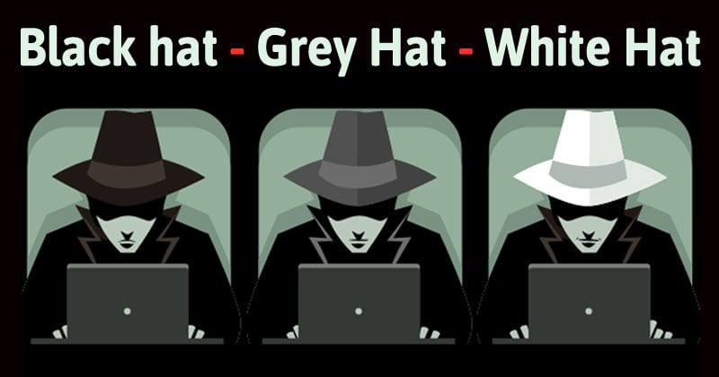
> Un hacker o jáquer es alguien que descubre las debilidades de un computador o de una red informática, aunque el término puede aplicarse también a alguien con un conocimiento avanzado de computadoras y de redes informáticas. Los hackers pueden estar motivados por una multitud de razones, incluyendo fines de lucro, protesta o por el desafío. La subcultura que se ha desarrollado en torno a los hackers a menudo se refiere a la cultura underground de computadoras, pero ahora es una comunidad abierta. Aunque existen otros usos de la palabra «hacker» que no están relacionados con la seguridad informática, rara vez se utilizan en el contexto general. Están sujetos a la antigua controversia de la definición de hacker sobre el verdadero significado del término. En esta controversia, el término hacker es reclamado por los programadores, quienes argumentan que alguien que irrumpe en las computadoras se denomina «cracker», sin hacer diferenciación entre los delincuentes informáticos —sombreros negros— y los expertos en seguridad informática —sombreros blancos—. Algunos hackers de sombrero blanco afirman que ellos también merecen el título de hackers, y que solo los de sombrero negro deben ser llamados crackers. [Wikipedia](https://es.wikipedia.org/wiki/Hacker_(seguridad_inform%C3%A1tica))

### Vivir en la ignorancia

**¿Recuerdas esto?**

- [Sony Pictures Entertainment](https://en.wikipedia.org/wiki/Sony_Pictures_hack)
- [WannaCry](https://es.wikipedia.org/wiki/WannaCry)
- [Bangladesh Bank Heist](https://en.wikipedia.org/wiki/Bangladesh_Bank_robbery)
- [Playstation Network](https://www.businessinsider.com/playstation-network-allegedly-hacked-ourmine-2017-8?IR=T)
- [Stuxnet](https://es.wikipedia.org/wiki/Stuxnet)
- [y mucho más....](https://informationisbeautiful.net/visualizations/worlds-biggest-data-breaches-hacks/)

**¿Te suena esto?**

- [Tengo cámaras de vigilancia por seguridad](https://www.insecam.org/en/byrating/)
- [Suelo comprar por Internet](https://shiptracker.shodan.io/)
- [Uso una pulsera inteligente para medirme cuando hago deporte para mantenerme activo](https://www.zdnet.com/article/fitness-app-polar-exposed-locations-of-spies-and-military-personnel/)
- [Comparto información con mi equipo en Trello para organizarnos mejor](https://medium.freecodecamp.org/discovering-the-hidden-mine-of-credentials-and-sensitive-information-8e5ccfef2724)
- [Me interesa saber más sobre mi genética para estar más sano y analicé mi ADN](https://motherboard.vice.com/en_us/article/vbqyvx/myheritage-hacked-data-breach-92-million)

### Cyberwar Times

**¿Por que este escenario?**
- Conectamos todos y todo a internet
- Las distancias se acortan y es menos costoso operar digitalmente
- La información es la mayor moneda de cambio de este siglo
- Los sistemas son muy complejos y dejan mucho margen para los atacantes
- Mejoras en equipos (costes bajos), mejor conectividad (mayor capacidad), mejor tecnologia (big data, IoT, IA)
- La ciberseguridad es una industria en si misma
- La seguridad no es siempre la prioridad

**¿Quien participa?**

- Jugadores Activos:
    - Hackers (White hat, Grey hat y Black Hat)
    - Crackers y ciberdelincuentes (Intereses economicos)
    - Terroristas (Intereses políticos)
    - Mercenarios (Intereses en Datos/patentes/información)
    - Hacktivistas (Intereses políticos)
    - Gobiernos/agencias estatales/APTs (defensa/espionaje)
    - Corporaciones y empresas (defensa/información)
    - Lobbis y Grupos de Poder (Intereses políticos)
    - Lobos Solitarios: Individuos e insiders (Venganza/información/Diversión/Curiosidad)

- Elementos Pasivos (Daño Colateral):
    - Cualquier usuario de Internet
    - Cualquier dispositivo/maquina/sistema conectado

**¿Motivación de los ataques?**

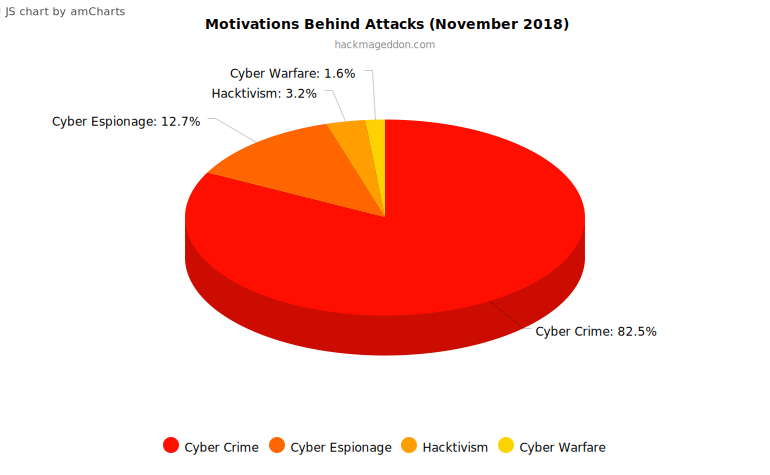

**¿Qué ataques son populares?**

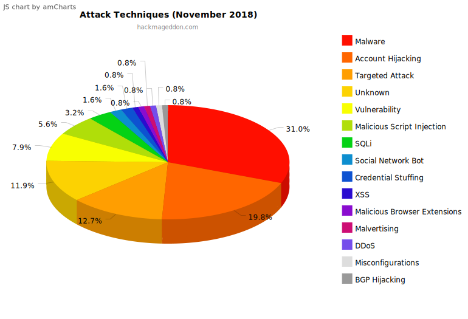

**¿A quienes atacan?**

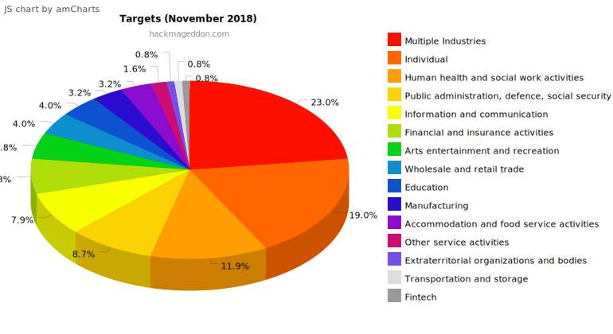

**¿Cuando pasa esto?**
- [threatbutt.com (Genérico/Malware)](https://threatbutt.com/map/)
- [digitalattackmap.com (DDOS)](http://www.digitalattackmap.com/)
- [norsecorp.com (Genérico)](http://map.norsecorp.com/#/)
- [threatmetrix.com (Fraude)](https://www.threatmetrix.com/web-fraud-map/)
- [kaspersky.com (Genérico)](https://cybermap.kaspersky.com/)
- [malwaretech.com (Malware)](https://intel.malwaretech.com/)
- [akamai.com (DDOS)](https://www.akamai.com/us/en/solutions/intelligent-platform/visualizing-akamai/real-time-web-monitor.jsp)
- [fireeye.com (Genérico)](https://www.fireeye.com/cyber-map/threat-map.html)

### Seguridad en la red

**Lo típico...**
- Ataques DDoS
- Man-In-The-Middle/sniffing/otros
- Malware (Ransomware, Virus, Troyanos, etc...)
- Keyloggers
- Ataques Web (Inyecciones, robos de sesión, phising, etc..)
- Ingeniería Social
- Adware (publicidad no deseada)
- Spyware
- Rootkits
- y muchos más...

**¿Qué papel juego?**
- Ataque personalizado: *Soy el objetivo final de forma especifica.*
- Ataque por contexto: *Formo parte del objetivo final (mi empresa), pero no yo mismo de forma especifica*
- Ataque por Utilidad especifica: *Puedo ser la puerta de acceso a un objetivo específico (proveedor, amigo, etc...)*
- Ataque automático: *Soy vulnerable y formo parte junto a otros usuarios de un lote de objetivos sin más personalización*

**Claves**
- Casi todos los sistemas funcionan 24/7
- Es difícil saber cuando alguien entró sin permiso en el sistema o si llegó a marcharse
- En ocasiones es complicado saber que hicieron los atacantes dentro del sistema
- Casi siempre estamos en un escenario reactivo, donde seremos atacados primero
- Hay que aprender como funciona el atacante que evoluciona para cerrar defensas
- Los atacantes son "usuarios" porque no podemos verles directamente

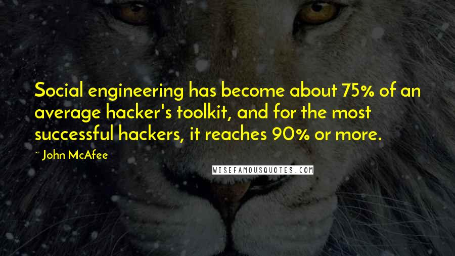

### Seguridad en la red: Cyber Kill Chain (CKC)

**Cyber Kill Chain (Vista rápida)**

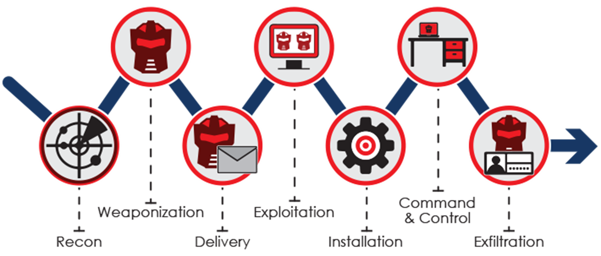

**Cyber Kill Chain (Vista detalle)**

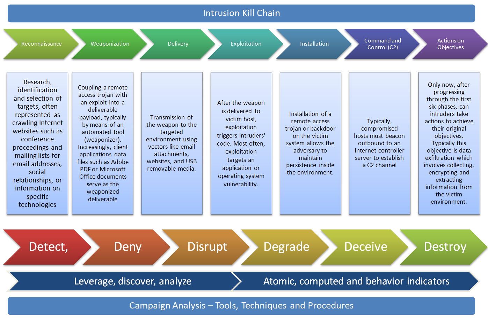

**¿Qué hacen dentro del sistema?**
- Preparar escenarios para próximos ataques (backdoors, botnets...) y antiforenses
- Destruir/inutilizar/Sabotear infraestructura (copias de seguridad, conexiones, LDAPs, etc...)
- Montorización activa o pasiva del sistema (resplado de datos, cambios, etc...)
- Modificación/Destrucción de la información
- Robo/Suplantación de identidad
- Secuestro de información (randsomware)
- Infraestructura para otros ataques (almacenamiento, distribución, Botnets)

**¿Cómo me asaltan (como empleado)?**
- SPAM: Genérico o personalizado, el plan es llevarte a una web fraudulenta o descargar un fichero
- Phising: Web de apariencia real con fines oscuros
- Man In the middle: Modificación de datos en tu red (wifis falseados o publicos, etc...)
- Ingeniería social remota: Llamadas falsas, chats, etc...
- Ingeniería social Física (con sigilo): Ordenador sin usuario con la sesión abierta, puerto USB no protegido...
- Física y violentamente: secuestros, extorsiones (reales o generadas), etc...

**¿Cómo me defiendo (como empleado)?**
- Aprende más sobre ciberseguridad
- Usa contraseñas seguras y jamas las repitas
- Usar webs HTTPS y no HTTP
- Usar al menos 2 factores de autenticación (2FA/MFA)
- Usa sistemas seguros (oficiales) y mantenlos actualizados
- La encriptación es tu mejor amiga
- Usa cuentas de correo distintas y evita la centralización (RRSS, Banca, etc...)
- Cuidado con el Login social y los permisos
- Permisos de la APPs
- Cuidado con el software que instalas en tus equipos
- El Open Source es tu mejor aliado
- Vigila periféricos (webcam, micros, etc...) inutilizalos o bloquealos cuando no los uses

**¿Qué herramientas usan?**
- [Shodan](https://www.shodan.io/)
- [Censys](https://censys.io/)
- [Kali](https://www.kali.org/)

**Más info...**
- [Insecam](https://www.insecam.org/en/byrating/)
- [Ship Tracker](https://shiptracker.shodan.io/)
- [Internet Exposure Dashboard](https://exposure.shodan.io/)
- [ICS Radar](https://ics-radar.shodan.io/)
- [Imágenes de dispositivos](https://twitter.com/shodanhq/status/630890154584989697)
- [The Crazy Things A Savvy Shodan Searcher Can Find Exposed On The Internet](https://www.forbes.com/sites/kashmirhill/2013/09/05/the-crazy-things-a-savvy-shodan-searcher-can-find-exposed-on-the-internet/#53df85c53c7e)
- [Fitness app Polar exposed locations of spies and military personnel](https://www.zdnet.com/article/fitness-app-polar-exposed-locations-of-spies-and-military-personnel/)
- [How I used a simple Google query to mine passwords from dozens of public Trello boards](https://medium.freecodecamp.org/discovering-the-hidden-mine-of-credentials-and-sensitive-information-8e5ccfef2724)
- [Hacked: 92 Million Account Details for DNA Testing Service MyHeritage](https://motherboard.vice.com/en_us/article/vbqyvx/myheritage-hacked-data-breach-92-million)

### ¡Under Attack!

### Recuerdas [Helmet](https://www.npmjs.com/package/helmet)?

- [Content Security Policy](https://helmetjs.github.io/docs/csp/)
- [X-Permitted-Cross-Domain-Policies](https://helmetjs.github.io/docs/crossdomain/)
- [DNS Prefetch Control](https://helmetjs.github.io/docs/dns-prefetch-control/)
- [Expect-CT](https://helmetjs.github.io/docs/expect-ct/)
- [Feature-Policy](https://helmetjs.github.io/docs/feature-policy/)
- [Frameguard](https://helmetjs.github.io/docs/frameguard/)
- [Hide Powered-By](https://helmetjs.github.io/docs/hide-powered-by/)
- [HTTP Public Key Pinning](https://helmetjs.github.io/docs/hpkp/)
- [Strict-Transport-Security (HSTS)](https://helmetjs.github.io/docs/hsts/)
- [X-Download-Options (IE No Open)](https://helmetjs.github.io/docs/ienoopen/)
- [No Cache](https://helmetjs.github.io/docs/nocache/)
- [Don't Sniff Mimetype](https://helmetjs.github.io/docs/dont-sniff-mimetype/)
- [Referrer Policy](https://helmetjs.github.io/docs/referrer-policy/)
- [X-XSS-Protection (XSS Filter)](https://helmetjs.github.io/docs/xss-filter/)

### Bounty programs

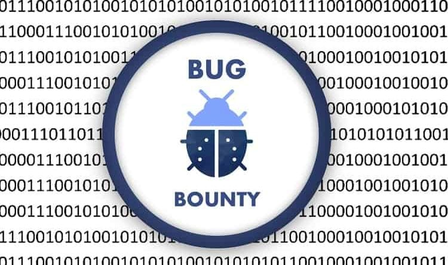

**Algunos clave**
- [Intel](https://security-center.intel.com/BugBountyProgram.aspx)
- [Yahoo](https://safety.yahoo.com/Security/REPORTING-ISSUES.html)
- [Dropbox](https://www.dropbox.com/help/security/report-vulnerability)
- [Apple](https://support.apple.com/en-au/HT201220)
- [Facebook](https://www.facebook.com/whitehat/)
- [Google](https://www.google.com/about/appsecurity/reward-program/)
- [Mozilla](https://www.mozilla.org/en-US/security/bug-bounty/)
- [Microsoft](https://technet.microsoft.com/en-us/library/dn425036.aspx)
- [OpenSSL](https://www.openssl.org/news/vulnerabilities.html)
- [Apache](https://www.apache.org/security/)
- [Twitter](https://support.twitter.com/articles/477159)
- [Paypal](https://www.paypal.com/us/webapps/mpp/security-tools/reporting-security-issues)
- [GitHub](https://bounty.github.com/)
- [Starbucks](https://www.starbucks.com/whitehat)
- [LinkedIn](https://security.linkedin.com/posts/2015/private-bug-bounty-program)
- [N26](https://n26.com/es-es/bug-bounty-program)

### OWASP Top 10 - 2017

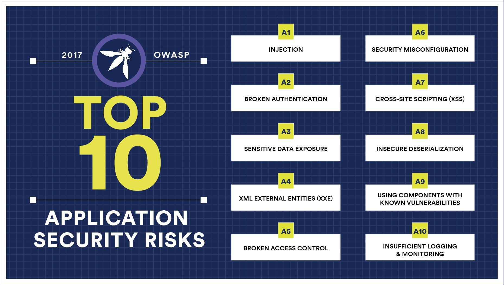

**A1:2017-Injection** 
> Injection flaws, such as SQL, NoSQL, OS, and LDAP injection, occur when untrusted data is sent to an interpreter as part of a command or query. The attacker’s hostile data can trick the interpreter into executing unintended commands or accessing data without proper authorization.

**A2:2017-Broken Authentication**
> Application functions related to authentication and session management are often implemented incorrectly, allowing attackers to compromise passwords, keys, or session tokens, or to exploit other implementation flaws to assume other users’ identities temporarily or permanently.

**A3:2017-Sensitive Data Exposure**
> Many web applications and APIs do not properly protect sensitive data, such as financial, healthcare, and PII. Attackers may steal or modify such weakly protected data to conduct credit card fraud, identity theft, or other crimes. Sensitive data may be compromised without extra protection, such as encryption at rest or in transit, and requires special precautions when exchanged with the browser.

**A4:2017-XML External Entities (XXE)**
> Many older or poorly configured XML processors evaluate external entity references within XML documents. External entities can be used to disclose internal files using the file URI handler, internal file shares, internal port scanning, remote code execution, and denial of service attacks.

**A5:2017-Broken Access Control**
> Restrictions on what authenticated users are allowed to do are often not properly enforced. Attackers can exploit these flaws to access unauthorized functionality and/or data, such as access other users' accounts, view sensitive files, modify other users’ data, change access rights, etc.

**A6:2017-Security Misconfiguration**
> Security misconfiguration is the most commonly seen issue. This is commonly a result of insecure default configurations, incomplete or ad hoc configurations, open cloud storage, misconfigured HTTP headers, and verbose error messages containing sensitive information. Not only must all operating systems, frameworks, libraries, and applications be securely configured, but they must be patched and upgraded in a timely fashion.

**A7:2017-Cross-Site Scripting (XSS)**
> XSS flaws occur whenever an application includes untrusted data in a new web page without proper validation or escaping, or updates an existing web page with user-supplied data using a browser API that can create HTML or JavaScript. XSS allows attackers to execute scripts in the victim’s browser which can hijack user sessions, deface web sites, or redirect the user to malicious sites.

**A8:2017-Insecure Deserialization**
> Insecure deserialization often leads to remote code execution. Even if deserialization flaws do not result in remote code execution, they can be used to perform attacks, including replay attacks, injection attacks, and privilege escalation attacks. 

**A9:2017-Using Components with Known Vulnerabilities**
> Components, such as libraries, frameworks, and other software modules, run with the same privileges as the application. If a vulnerable component is exploited, such an attack can facilitate serious data loss or server takeover. Applications and APIs using components with known vulnerabilities may undermine application defenses and enable various attacks and impacts. 

**A10:2017-Insufficient Logging & Monitoring**
> Insufficient logging and monitoring, coupled with missing or ineffective integration with incident response, allows attackers to further attack systems, maintain persistence, pivot to more systems, and tamper, extract, or destroy data. Most breach studies show time to detect a breach is over 200 days, typically detected by external parties rather than internal processes or monitoring. 

**Recursos**
- [Ebook | OWASP Top 10 - 2017](https://www.owasp.org/images/7/72/OWASP_Top_10-2017_%28en%29.pdf.pdf)

### SANS TOP 25

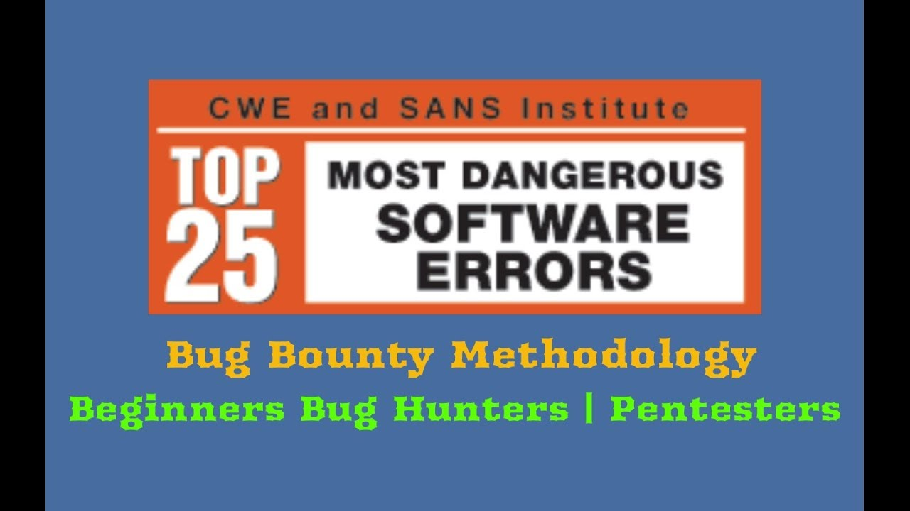

**Insecure Interaction Between Components**
> These weaknesses are related to insecure ways in which data is sent and received between separate components, modules, programs, processes, threads, or systems.

- [CWE-89](http://cwe.mitre.org/top25/index.html#CWE-89) Improper Neutralization of Special Elements used in an SQL Command ('SQL Injection')
- [CWE-78](http://cwe.mitre.org/top25/index.html#CWE-78) Improper Neutralization of Special Elements used in an OS Command ('OS Command Injection')
- [CWE-79](http://cwe.mitre.org/top25/index.html#CWE-79) Improper Neutralization of Input During Web Page Generation ('Cross-site Scripting')
- [CWE-434](http://cwe.mitre.org/top25/index.html#CWE-434) Unrestricted Upload of File with Dangerous Type
- [CWE-352](http://cwe.mitre.org/top25/index.html#CWE-352) Cross-Site Request Forgery (CSRF)
- [CWE-601](http://cwe.mitre.org/top25/index.html#CWE-601) URL Redirection to Untrusted Site ('Open Redirect')

**Risky Resource Management**
> The weaknesses in this category are related to ways in which software does not properly manage the creation, usage, transfer, or destruction of important system resources.

- [CWE-120](http://cwe.mitre.org/top25/index.html#CWE-120) Buffer Copy without Checking Size of Input ('Classic Buffer Overflow')
- [CWE-22](http://cwe.mitre.org/top25/index.html#CWE-22) Improper Limitation of a Pathname to a Restricted Directory ('Path Traversal')
- [CWE-494](http://cwe.mitre.org/top25/index.html#CWE-494) Download of Code Without Integrity Check
- [CWE-829](http://cwe.mitre.org/top25/index.html#CWE-829) Inclusion of Functionality from Untrusted Control Sphere
- [CWE-676](http://cwe.mitre.org/top25/index.html#CWE-676) Use of Potentially Dangerous Function
- [CWE-131](http://cwe.mitre.org/top25/index.html#CWE-131) Incorrect Calculation of Buffer Size
- [CWE-134](http://cwe.mitre.org/top25/index.html#CWE-134) Uncontrolled Format String
- [CWE-190](http://cwe.mitre.org/top25/index.html#CWE-190) Integer Overflow or Wraparound

**Porous Defenses**
> The weaknesses in this category are related to defensive techniques that are often misused, abused, or just plain ignored.

- [CWE-306](http://cwe.mitre.org/top25/index.html#CWE-306) Missing Authentication for Critical Function
- [CWE-862](http://cwe.mitre.org/top25/index.html#CWE-862) Missing Authorization
- [CWE-798](http://cwe.mitre.org/top25/index.html#CWE-798) Use of Hard-coded Credentials
- [CWE-311](http://cwe.mitre.org/top25/index.html#CWE-311) Missing Encryption of Sensitive Data
- [CWE-807](http://cwe.mitre.org/top25/index.html#CWE-807) Reliance on Untrusted Inputs in a Security Decision
- [CWE-250](http://cwe.mitre.org/top25/index.html#CWE-250) Execution with Unnecessary Privileges
- [CWE-863](http://cwe.mitre.org/top25/index.html#CWE-863) Incorrect Authorization
- [CWE-732](http://cwe.mitre.org/top25/index.html#CWE-732) Incorrect Permission Assignment for Critical Resource
- [CWE-327](http://cwe.mitre.org/top25/index.html#CWE-327) Use of a Broken or Risky Cryptographic Algorithm
- [CWE-307](http://cwe.mitre.org/top25/index.html#CWE-307) Improper Restriction of Excessive Authentication Attempts
- [CWE-759](http://cwe.mitre.org/top25/index.html#CWE-759) Use of a One-Way Hash without a Salt

### Plataformas de aprendizaje: Hackerone

**[Como funciona? | HackerOne - How It Works](https://www.youtube.com/watch?v=1T6GSa0qPNk)**

**Recursos**
- [Web ofcial](https://www.hackerone.com/)
- [About Hackerone](https://www.hackerone.com/about)
- [Welcome to HackerOne!](https://hackerone.com/sign_up)
- [hacktivity](https://hackerone.com/hacktivity)
- [start-hacking](https://www.hackerone.com/start-hacking)
- [Hacker101](https://www.hackerone.com/hacker101)
- [leaderboard](https://hackerone.com/leaderboard/all-time)
- [Events](https://www.hackerone.com/events)
- [Directory](https://hackerone.com/directory?query=type%3Ahackerone&sort=resolved_reports_closed%3Adescending&page=1)
- [The Internet Bug Bounty](https://www.hackerone.com/internet-bug-bounty)
- [Vulnerability Disclosure Guidelines](https://www.hackerone.com/disclosure-guidelines)
- [Disclosure Assistance](https://hackerone.com/disclosure-assistance)

### Plataformas de aprendizaje: Hack the box

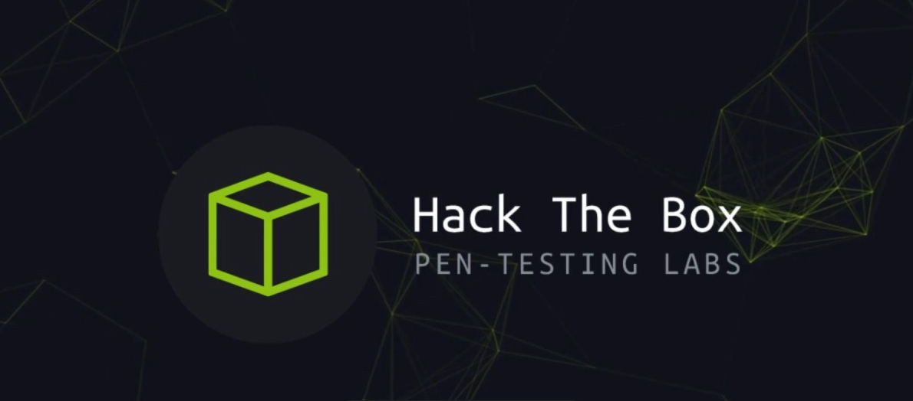

**HTB Write-ups**
- [Hackplayers/hackthebox-writeups](https://github.com/Hackplayers/hackthebox-writeups)
- [fwhibbit | HTB – WriteUp – Curling](https://www.fwhibbit.es/htb-writeup-curling)
- [fwhibbit | HTB Write-up -Stratosphere](https://www.fwhibbit.es/htb-write-up-stratosphere)
- [fwhibbit | HTB Write-up – Poison](https://www.fwhibbit.es/htb-write-up-poison)
- [fwhibbit | HTB Write-up – Haircut](https://www.fwhibbit.es/htb-write-up-haircut)
- [fwhibbit | HTB Write-up – Popcorn](https://www.fwhibbit.es/htb-write-up-popcorn)
- [fwhibbit | HTB Write-up – Celestial](https://www.fwhibbit.es/htb-write-up-celestial)
- [fwhibbit | HTB write-up – Jerry](https://www.fwhibbit.es/htb-write-up-jerry)
- [fwhibbit | HTB Write-up – Olympus](https://www.fwhibbit.es/htb-write-up-olympus-por-1r0dm48o)
- [Waldo Write-up (HTB)](https://medium.com/ctf-writeups/waldo-write-up-htb-dfbaaaa91282)
- [Hack The Box — Access Write-up](https://medium.com/ctf-writeups/hack-the-box-access-write-up-33ab4cb7d9b3)
- [Secnotes Write-up (HTB)](https://medium.com/ctf-writeups/secnotes-write-up-htb-9d78224d4de3)
- [Bounty Write-up (HTB)](https://medium.com/ctf-writeups/bounty-write-up-htb-9b01c934dfd2)

**Recursos**
- [Web oficial](https://www.hackthebox.eu)
- [Hack The Box | Video Promo](https://www.youtube.com/watch?v=CxtMMgqfXY8)
 

### Plataformas de aprendizaje: OWASP Juice Shop Tool Project

> OWASP Juice Shop is probably the most modern and sophisticated insecure web application! It can be used in security trainings, awareness demos, CTFs and as a guinea pig for security tools! Juice Shop encompasses vulnerabilities from the entire OWASP Top Ten along with many other security flaws found in real-world applications!

**Arquitectura**

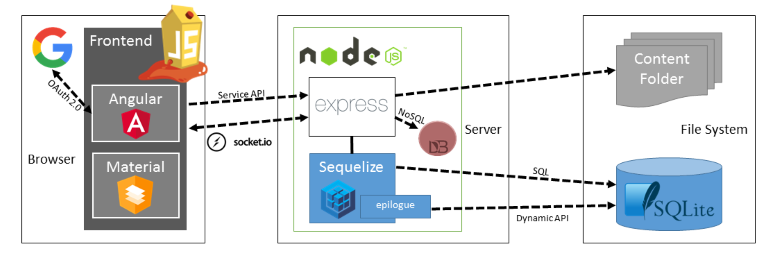

**Recursos**
- [bkimminich/juice-shop](https://github.com/bkimminich/juice-shop)
- [bkimminich/juice-shop-ctf](https://github.com/bkimminich/juice-shop-ctf)
- [BeNeLux Day 2018: Juice Shop: OWASP's Most Broken Flagship - Björn Kimminich](https://www.youtube.com/watch?v=Lu0-kDdtVf4)
- [Ebook | Pwning OWASP Juice Shop](https://leanpub.com/juice-shop)

### Plataformas de aprendizaje: Atenea del CCN-CERT

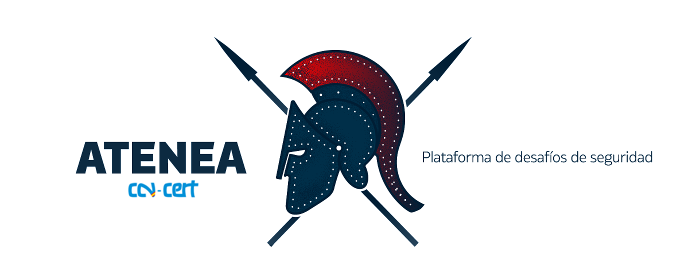

**Recursos**
- [Atenea Web Oficial](https://atenea.ccn-cert.cni.es/home)
- [ccn-cert | Centro Criptográfico Nacional](https://www.ccn-cert.cni.es/)

### INCIBE. Insitituto Nacional de Ciberseguridad

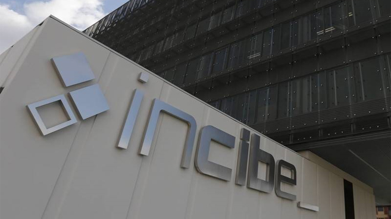

**Recursos**
- [Web oficial](https://www.incibe.es/)
- [Protege tu empresa](https://www.incibe.es/protege-tu-empresa)
- [Avisos de seguridad](https://www.incibe.es/protege-tu-empresa/avisos-seguridad)
- [Kit de concienciación](https://www.incibe.es/protege-tu-empresa/kit-concienciacion)
- [Catálogo de empresas y soluciones de ciberseguridad](https://www.incibe.es/protege-tu-empresa/catalogo-de-ciberseguridad)
- [Guías](https://www.incibe.es/protege-tu-empresa/guias)
- [Evento | Cybercamp](https://cybercamp.es/)

### Ejercicios

**1 -** https://www.hackthebox.eu/ consigue una invitación para jugar en esta liga
