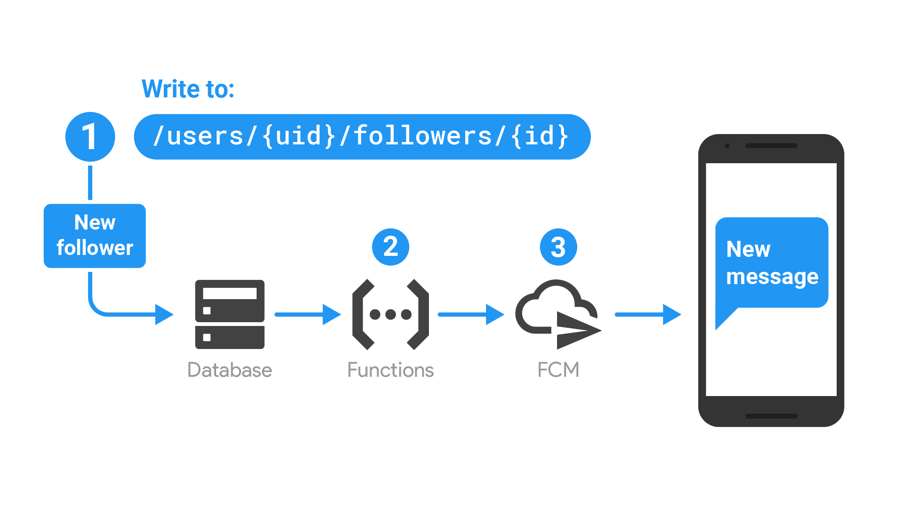
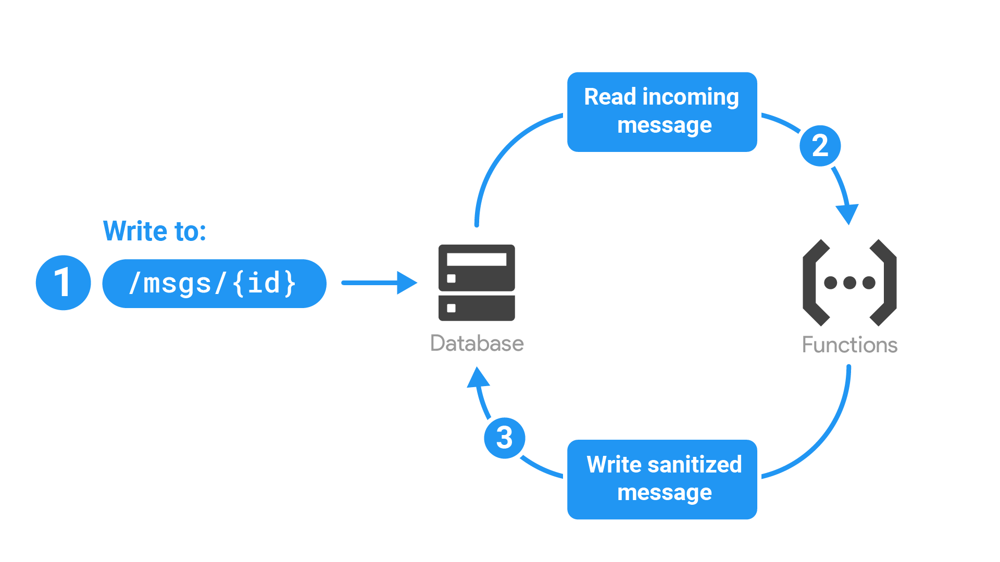
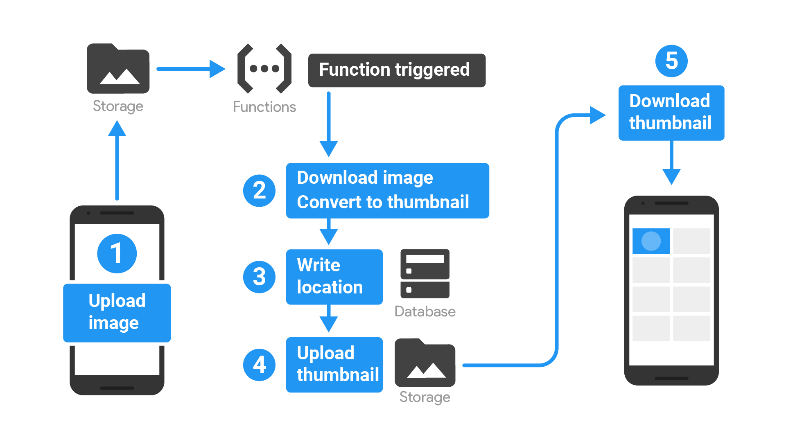
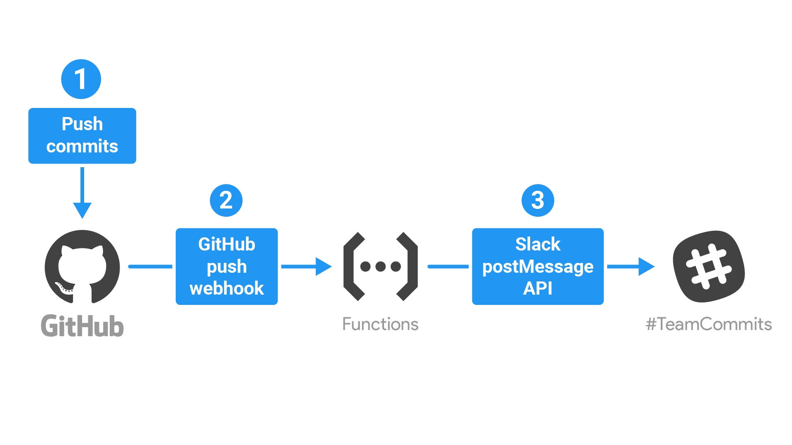

# Máster en Programación FullStack con JavaScript y Node.js
### JS, Node.js, Frontend, Backend, Firebase, Express, Patrones, HTML5_APIs, Asincronía, Websockets, Testing

## Clase 77

### Firebase Cloud Functions


#### ¿Cómo Funciona?

> Después de escribir y de implementar una función, los servidores de Google comienzan a administrarla de inmediato. Para ello, detectan eventos y ejecutan la función cuando se activa. A medida que la carga aumenta o disminuye, la respuesta de Google es escalar con rapidez la cantidad de instancias de servidor virtual necesarias para ejecutar la función.

**Ciclo de vida de una función**

1. El programador escribe código para una nueva función, selecciona un proveedor de eventos (como Realtime Database) y define las condiciones según las cuales debe ejecutarse la función.
2. El programador implementa la función y Firebase la conecta al proveedor de eventos seleccionado.
3. Cuando el proveedor de eventos genera un evento que coincide con las condiciones de la función, se invoca el código.
4. Si la función está ocupada con muchos eventos, Google crea más instancias para controlar el trabajo con más rapidez. Si la función está inactiva, las instancias se borran.
5. Cuando el programador actualiza la función mediante la implementación del código actualizado, todas las instancias de la versión antigua se borran y se reemplazan por instancias nuevas.
6. Cuando un programador borra la función, se borran todas las instancias y se quita la conexión entre la función y el proveedor de eventos.

**TL:DR;**

- Configura Cloud Functions
- Escribe funciones
- Implementa y supervisa

### Ejemplos


**Notifica a los usuarios cuando ocurre algo interesante**



**Ejecuta limpieza y mantenimiento de Realtime Database**



**Ejecuta tareas intensivas en la nube en lugar de en la app**



**Realizar integraciones con API y servicios de terceros**




### Arrancando el proyecto

**Dependencias**
```bash
npm install firebase-functions@latest firebase-admin@latest --save
npm install -g firebase-tools
```

**Puesta en marcha**
1. Ejecuta `firebase login` para acceder a través del navegador y autenticar la herramienta de Firebase.
_Nota: `firebase login --no-localhost` en C9.io_
2. Ve al directorio de tu proyecto de Firebase.
3. Ejecuta `firebase init functions`.

### Restricciones importantes

> Los proyectos de Firebase en el plan Spark solo pueden realizar solicitudes de salida a las API de Google. Las solicitudes a API de terceros generan un error. Para obtener más información acerca de cómo cambiar tu proyecto a un plan superior. 

_[Consulta Precios](https://firebase.google.com/pricing/?hl=es-419)_.


### Estrcutura del proyecto

```
myproject
 +- .firebaserc    # Hidden file that helps you quickly switch between
 |                 # projects with `firebase use`
 |
 +- firebase.json  # Describes properties for your project
 |
 +- functions/     # Directory containing all your functions code
      |
      +- .eslintrc.json  # Optional file containing rules for JavaScript linting.
      |
      +- package.json  # npm package file describing your Cloud Functions code
      |
      +- index.js      # main source file for your Cloud Functions code
      |
      +- node_modules/ # directory where your dependencies (declared in
                       # package.json) are installed
```

### Composición del `index.js`

```javascript
// The Cloud Functions for Firebase SDK to create Cloud Functions and setup triggers.
const functions = require('firebase-functions');

// The Firebase Admin SDK to access the Firebase Realtime Database.
const admin = require('firebase-admin');
admin.initializeApp(functions.config().firebase);

//...
```

#### Activadores

- [Cloud Firestore](https://firebase.google.com/docs/functions/firestore-events?hl=es-419)
- [Realtime Database](https://firebase.google.com/docs/functions/database-events?hl=es-419)
- [Firebase Authentication](https://firebase.google.com/docs/functions/auth-events?hl=es-419)
- [Google Analytics para Firebase](https://firebase.google.com/docs/functions/analytics-events?hl=es-419)
- [Crashlytics](https://firebase.google.com/docs/functions/crashlytics-events?hl=es-419)
- [Cloud Storage](https://firebase.google.com/docs/functions/gcp-storage-events?hl=es-419)
- [Pub/Sub de Cloud](https://firebase.google.com/docs/functions/pubsub-events?hl=es-419)
- [Activadores HTTP](https://firebase.google.com/docs/functions/http-events?hl=es-419)


### Ejemplos sencillos

**Hello World disparado por eventos en base de datos**
```javascript
const functions = require('firebase-functions');
const admin = require('firebase-admin');
admin.initializeApp(functions.config().firebase);

// Always change the value of "/hello" to "world!"
exports.hello = functions.database.ref('/hello').onWrite(event => {
  // set() returns a promise. We keep the function alive by returning it.
  return event.data.ref.set('world!').then(() => {
    console.log('Write succeeded!');
  });
});
```


**Aquí se muestra la versión completa de functions/index.js, que contiene las funciones addMessage() y makeUppercase().**

*Estas funciones te permiten pasarle un parámetro a un extremo HTTP que escribe un valor en Realtime Database, para luego transformarlo mediante el uso de mayúsculas en todos los caracteres de la string.*

```javascript
// The Cloud Functions for Firebase SDK to create Cloud Functions and setup triggers.
const functions = require('firebase-functions');

// The Firebase Admin SDK to access the Firebase Realtime Database.
const admin = require('firebase-admin');
admin.initializeApp(functions.config().firebase);

// Take the text parameter passed to this HTTP endpoint and insert it into the
// Realtime Database under the path /messages/:pushId/original
exports.addMessage = functions.https.onRequest((req, res) => {
  // Grab the text parameter.
  const original = req.query.text;
  // Push the new message into the Realtime Database using the Firebase Admin SDK.
  admin.database().ref('/messages').push({original: original}).then(snapshot => {
    // Redirect with 303 SEE OTHER to the URL of the pushed object in the Firebase console.
    res.redirect(303, snapshot.ref);
  });
});

// Listens for new messages added to /messages/:pushId/original and creates an
// uppercase version of the message to /messages/:pushId/uppercase
exports.makeUppercase = functions.database.ref('/messages/{pushId}/original')
    .onWrite(event => {
      // Grab the current value of what was written to the Realtime Database.
      const original = event.data.val();
      console.log('Uppercasing', event.params.pushId, original);
      const uppercase = original.toUpperCase();
      // You must return a Promise when performing asynchronous tasks inside a Functions such as
      // writing to the Firebase Realtime Database.
      // Setting an "uppercase" sibling in the Realtime Database returns a Promise.
      return event.data.ref.parent.child('uppercase').set(uppercase);
    });
```

### [Ejemplos para reutilizar](https://github.com/firebase/functions-samples)

 1. [**Quickstarts**](https://github.com/firebase/functions-samples/blob/master/README.md#quickstarts) are minimal examples for each types of triggers.
 2. [**Development Environment Samples and Boilerplates**](https://github.com/firebase/functions-samples/blob/master/README.md#environment) illustrates how to get started with
different, commonly used JavaScript development patterns such as Typescript, React SSR, ES2017 etc...
 3. [**Image Processing**](https://github.com/firebase/functions-samples/blob/master/README.md#image) shows a few ways where you can process and transform images using Cloud Functions such as generating thumbnails, converting images extracting metadata...
 4. [**Firebase Realtime Database Data Consistency**](https://github.com/firebase/functions-samples/blob/master/README.md#rtdb) show how to implement automatic data consistency such as keeping a count of children, having a max amount of node childs, cleaning up old data etc... for your Realtime Database.
 5. [**Other common usecases**](https://github.com/firebase/functions-samples/blob/master/README.md#other) a set of other common usecases for Cloud Functions.

### Despliegue y pruebas

- [Primeros pasos: Cómo escribir y también implementar tus primeras funciones](https://firebase.google.com/docs/functions/get-started?hl=es-419)
- [Ejecuta funciones de manera local](https://firebase.google.com/docs/functions/local-emulator?hl=es-419)

### Recursos

- [Google Codelab: firebase-cloud-functions](https://codelabs.developers.google.com/codelabs/firebase-cloud-functions/#0)
- [Navidades con Firebase](https://www.youtube.com/watch?v=hgEl7g_tMgk&list=PLUdlARNXMVkmmBGGnr1ky-RQJ65XW6BE4)
- [Lecciones sobre Cloud Functions (serie de videos)](https://firebase.google.com/docs/functions/video-series?hl=es-419)
- [Referencia de la API](https://firebase.google.com/docs/reference/functions/?hl=es-419)


