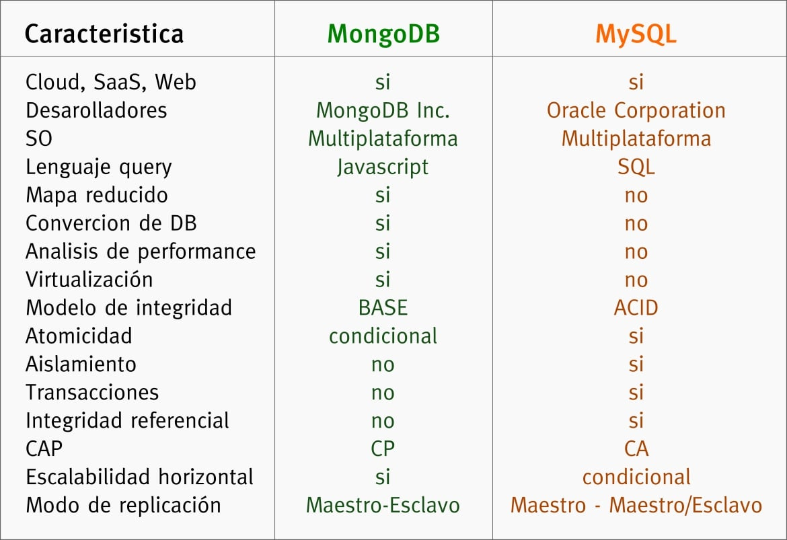
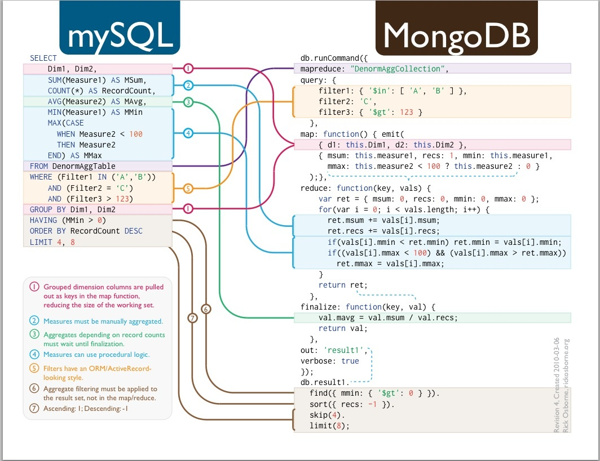
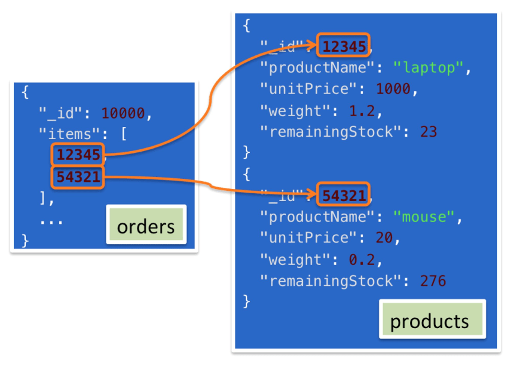
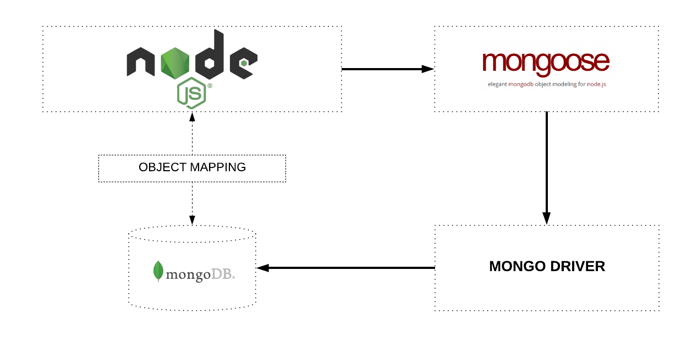
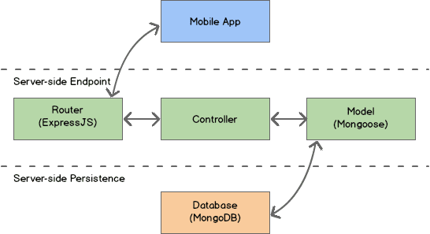

# Máster en Programación FullStack con JavaScript y Node.js
### JS, Node.js, Frontend, Backend, Firebase, Express, Patrones, HTML5_APIs, Asincronía, Websockets, Testing


## Clase 83


### MongoDB


**Licencias**
> MongoDB offers both an Enterprise and Community version of its powerful non-relational database. MongoDB Enterprise is available as part of the MongoDB Enterprise Advanced subscription, which features the most comprehensive support for MongoDB and the best SLA, in addition to Ops Manager, Compass, and the Connector for BI. [MongoDB](https://www.mongodb.com/download-center/community)

**Detalles**
- [MongoDB pincha en hueso: nadie acepta su nueva licencia](https://www.muylinux.com/2019/01/17/mongodb-rechazo-nueva-licencia/)
- [Red Hat elimina a MongoDB de RHEL 8 y Fedora debido a su licencia SSPL](https://www.linuxadictos.com/red-hat-elimina-a-mongodb-de-rhel-8-y-fedora-debido-a-su-licencia-sspl.html)


**Claves**
- Flexibildiad gracias a los esquemas
- Olvidate de las relaciones entre elementos de una manera clasica
- Esta pensado desde Nodejs y para Nodejs
- Postgres y SQL estan mas maduras y avanzadas, pero para muchos proyectos mongoDB puede ser ideal
- El modelo de licencia y precio es necesario analizarlo
- MongoDB esta mayormente escrito en C++, JS, python...
- Es muy facil implementarlo para aplicaciones sencillas
- Es muy flexible y puede evolucionar bien con herramienta grande como un CMS
- Las migraciones por cambios en el esquema son extremadamente sencillas
- No tienes que pensar mucho en los esquemas/arquitecturas
- No esta pensado para analiticas/big data
- Funcioan muy bien para CMS/Ecommerces...
- Mongodb puede funcionar sin esquemas, pero no es recomendado. No quieres perder la consistencia
- Necesitas un driver para conectar Nodejs a la base de datos
- Mongodb tiene su propio protocolo `mongodb://`, por lo general `27017` es el puerto por defecto
- Tener esquemas no hace que sea reacional, solo que mantengas la consistencia
- Por cada documento que almacenes en la base de datos se crea un `_id` basada en una conversión del objeto
- No es una solución adecuada para aplicaciones con transacciones complejas

**MongoDB Enterprise**

- In-memory Storage Engine
- Encrypted Storage Engine (Encriptación)
- Advanced Security (LDAP, Kerbero, auditoria...)

**Recursos**
- [w3School | Node.js MongoDB](https://www.w3schools.com/nodejs/nodejs_mongodb.asp)
- [Node.js MongoDB Tutorial with Examples](https://www.guru99.com/node-js-mongodb.html)
- [MongoDB | Doc](https://docs.mongodb.com/)
- [MongoDB | What is MongoDB?](https://www.mongodb.com/what-is-mongodb)
- [Learn MongoDB from MongoDB](https://university.mongodb.com/?_ga=2.109174149.1499384364.1547993054-746999495.1547993054)
- [MongoDB | Blog](https://www.mongodb.com/blog)


### MongoDB: [Instalación](https://docs.mongodb.com/manual/installation/#mongodb-community-edition)

**[MongoDB Community Edition](https://docs.mongodb.com/manual/installation/#mongodb-community-edition)**
- [Linux](https://docs.mongodb.com/manual/administration/install-on-linux/)
- [MacOS](https://docs.mongodb.com/manual/tutorial/install-mongodb-on-os-x/)
- [Windows](https://docs.mongodb.com/manual/tutorial/install-mongodb-on-windows/)
- C9.io
    - [How To Setting Up MongoDB](https://community.c9.io/t/setting-up-mongodb/1717) 
    - [Script](https://github.com/OSWeekends/c9scripts/blob/master/mongoscriptc9.sh)

**[MongoDB Enterprise](https://docs.mongodb.com/manual/installation/#mongodb-enterprise)**
- [Linux](https://docs.mongodb.com/manual/administration/install-enterprise-linux/)
- [MacOS](https://docs.mongodb.com/manual/tutorial/install-mongodb-enterprise-on-os-x/)
- [Windows](https://docs.mongodb.com/manual/tutorial/install-mongodb-enterprise-on-windows/)
- [Docker](https://docs.mongodb.com/manual/tutorial/install-mongodb-enterprise-with-docker/)

### MongoDB: shell and GUI

**Lanzar la shell**
```bash
# Debes tener Mongo lanzado, recomendado hacer un demonio 
mongod

# Debes poder acceder desde otra terminal
mongo
```

**Comandos útiles**
- `show dbs` Muestra las bases de datos actuales
- `use <nombre-db>` Cambia a la base de datos <nombre-db>
- `show collections` Muestra las coleciones en esa base de datos
- `db.help()` Muesta la ayuda para ver todos los comandos
- `db.createCollection('<nombre-collection>')` Genera una nueva colección

**MongoDB Compass (Community Edition)**


- [Instalación](https://docs.mongodb.com/compass/master/install/)
- [Descargas](https://www.mongodb.com/download-center/compass?jmp=docs)

### MongoDB: Diferencias con SQL


**Resumen rápido**




**Nueva forma de trabajar**




**Asociaciones**




**Recursos**
- [How to Do Join Operations and Create Links between Mongodb Collection](https://scotch.io/@ossaijad/how-to-do-join-operations-and-create-links-between-mongodb-collection)


### Mongoose


**Claves**
- Es un ORM
- Las queries de Mongoose no son promosesas y es necesario usar `exec()`, [detalles](https://stackoverflow.com/a/31550321)


**Relación de Mongoose con MongoDB**




**Relación Mongoose con Express**




**Instalar Mongoose**
```js
$ npm install mongoose
```

**conectar con la base de datos**

Con Promesas
```js
const connect = () => {
   return  mongoose.connect('mongodb://localhost:27017/test', { useNewUrlParser: true });
}

connect()
    .then(data => console.log("CONNECTED--->", data))
    .catch(err => console.warn("ERROR!--->", err))
```

Con eventos
```js
const mongoose = require('mongoose');
mongoose.connect('mongodb://localhost/test');
var db = mongoose.connection;
db.on('error', console.error.bind(console, 'connection error:'));
db.once('open', () => {
  // we're connected!
});
```

**Crear un [esquema](https://mongoosejs.com/docs/guide.html)**
```js
const kittySchema = new mongoose.Schema({
  name: String
});
```

**Crear un [modelo](https://mongoosejs.com/docs/models.html)**
- Los modelos estan siempre en minusculas y se encargan automaticamente e generar las colecciones añadiendo una `s` al nombre de modelo. Asi Modelo `film` será la colección `films`
```js
const Kitten = mongoose.model('Kitten', kittySchema);

const silence = new Kitten({ name: 'Silence' });
console.log(silence.name); // 'Silence'
```

**Añadir métodos a los documentos**
```js
kittySchema.methods.speak = function () {
  const greeting = this.name
    ? `Meow name is ${this.name}`
    : "I don't have a name";
  console.log(greeting);
}

const Kitten = mongoose.model('Kitten', kittySchema);
const fluffy = new Kitten({ name: 'fluffy' });
fluffy.speak(); // "Meow name is fluffy"
```

**[Guardar datos](https://mongoosejs.com/docs/api.html#model_Model-save)**
```js
fluffy.save((err, fluffy) => {
    err ? console.error(err) : fluffy.speak();
});
```

**Recuperar los datos**

```js
Kitten.find((err, kittens) => {
    err? console.error(err) : console.log(kittens)
})
```


**[Hagamos Queries](https://mongoosejs.com/docs/queries.html)**

```js
Kitten.find({ name: /^fluff/ }, (err, kittens) => {
    err? console.error(err) : console.log(kittens)
});
```

**[Hagamos queries más complejas](https://mongoosejs.com/docs/queries.html)**
```js
Person.
  find({
    occupation: /host/,
    'name.last': 'Ghost',
    age: { $gt: 17, $lt: 66 },
    likes: { $in: ['vaporizing', 'talking'] }
  }).
  limit(10).
  sort({ occupation: -1 }).
  select({ name: 1, occupation: 1 }).
  exec(callback);

// Using query builder
Person.
  find({ occupation: /host/ }).
  where('name.last').equals('Ghost').
  where('age').gt(17).lt(66).
  where('likes').in(['vaporizing', 'talking']).
  limit(10).
  sort('-occupation').
  select('name occupation').
  exec(callback);
```


**Recursos**
- [Web oficial](https://mongoosejs.com/)
- [Plugins](http://plugins.mongoosejs.io/)
- [Documentación](https://mongoosejs.com/docs/guide.html)
- [Getting Started](https://mongoosejs.com/docs/index.html)
- [Mongoose js query cheatsheet](https://www.techcress.com/mongoose-js-query-cheatsheet/)
- [Quickstart Mongoose Guide that will get you up to speed in no time](https://blog.cloudboost.io/everything-you-need-to-know-about-mongoose-63fcf8564d52)
- [Mongoose Getting Started](http://mongoosejs.com/docs/)
- [Una introducción a Mongoose para MongoDB y Node.js](https://code.tutsplus.com/es/articles/an-introduction-to-mongoose-for-mongodb-and-nodejs--cms-29527)
- [MDN | Express Tutorial Part 3: Using a Database (with Mongoose)](https://developer.mozilla.org/en-US/docs/Learn/Server-side/Express_Nodejs/mongoose)
- [Guia express & mongoose para Node.js](http://www.nodehispano.com/2012/06/guia-express-mongoose-para-node-js-parte-i-nodejs/)
- [Building a Node.js Powered API with Express, Mongoose & MongoDB](https://getstream.io/blog/building-a-node-js-powered-api-with-express-mongoose-mongodb/)
- [Introducing Mongoose to Your Node.js and Restify API](https://medium.com/@nparsons08/introducing-mongoose-to-your-node-js-and-restify-api-9c16a93c8d87)
- [Introduction to Mongoose for MongoDB](https://medium.freecodecamp.org/introduction-to-mongoose-for-mongodb-d2a7aa593c57)
- [How to Use Mongoose for MongoDB and NodeJS](http://www.bmc.com/blogs/how-to-use-mongoose-for-mongodb-and-nodejs/)
- [Simple example - Node.js, Restify, MongoDb and Mongoose](https://cdnjs.com/libraries/backbone.js/tutorials/nodejs-restify-mongodb-mongoose)


**Documentación**
- [Guides | Schemas](https://mongoosejs.com/docs/guide.html)
- [Guides | SchemaTypes](https://mongoosejs.com/docs/schematypes.html)
- [Guides | Connections](https://mongoosejs.com/docs/connections.html)
- [Guides | Models](https://mongoosejs.com/docs/models.html)
- [Guides | Documents](https://mongoosejs.com/docs/documents.html)
- [Guides | Subdocuments](https://mongoosejs.com/docs/subdocs.html)
- [Guides | Queries](https://mongoosejs.com/docs/queries.html)
- [Guides | Validation](https://mongoosejs.com/docs/validation.html)
- [Guides | Middleware](https://mongoosejs.com/docs/middleware.html)
- [Guides | Populate](https://mongoosejs.com/docs/populate.html)
- [Guides | Discriminators](https://mongoosejs.com/docs/discriminators.html)
- [Guides | Plugins](https://mongoosejs.com/docs/plugins.html)


### Mongoose: Queries y operadores

- `$or`, `$gt`, `$lte`, etc...

### Mongoose: Temas avanzados (Virtual, Hooks, Indexes...)

**Virtuals**
- Nos permite virtualizar un campo
- Podemos manejarlo al estilo getters y setters
- Trabajaremos con `this` con lo que deberiamos evitar el uso de arrow functions
```js
var virtual = schema.virtual('fullname');
virtual.get(function () {
  return this.name.first + ' ' + this.name.last;
});
```

**Hooks**


> Middleware (also called pre and post hooks) are functions which are passed control during execution of asynchronous functions. Middleware is specified on the schema level and is useful for writing plugins. Mongoose has 4 types of middleware: document middleware, model middleware, aggregate middleware, and query middleware. Document middleware is supported for the following document functions. [mongoosejs](https://mongoosejs.com/docs/middleware.html)

- Nos suscribimos a cambios que pasan en las colecciones y modelos
- Podemos sucribirnos en distintos momentos del ciclo de vida.
- Podemos hacer una gestión sincrona o asincrona.
- Para la gestión de las funciones asincronas usaremos `next` (segundo parámetro) como en Express.
- Funciona como un middleware
- Trabajaremos con `this` con lo que deberiamos evitar el uso de arrow functions

```js
schema.pre('save', function() {
  return doStuff().
    then(() => doMoreStuff());
});

// Or, in Node.js >= 7.6.0:
schema.pre('save', async function() {
  await doStuff();
  await doMoreStuff();
});
```

**[Indexes](https://mongoosejs.com/docs/guide.html#indexes)**
- Se pueden hacer sobre un campo o multiples campos
- Los esquemas pueden ser a multiples niveles
```js
  var animalSchema = new Schema({
    name: String,
    type: String,
    tags: { type: [String], index: true } // field level
  });

  animalSchema.index({ name: 1, type: -1 }); // schema level
```

### En resumen


**¡Al ataque!**
- [Mongoose | Getting Started](https://mongoosejs.com/docs/index.html)
- [Mongoose | Guide](https://mongoosejs.com/docs/guide.html)
- [madhums/node-express-mongoose-demo](https://github.com/madhums/node-express-mongoose-demo)
- [dreamerslab/express-todo-example](https://github.com/dreamerslab/express-todo-example)

### mLab


**Claves**
- Cloud Automation
- Backup & Recovery
- Monitoring & Analytics Tools
- Advanced Security
- Easy-to-use Data Browser
- Best-in-Class Database Support

**Recursos**

- [Sitio Web](https://www.mlab.com/)
- [mlab | Precios](https://www.mlab.com/plans/pricing/)
- [mlab | Documentación](https://docs.mlab.com/)
- [mlab | News](https://mlab.com/news/)
- [mlab | Customer Case Studies](https://mlab.com/case-studies/)
- [mlab | Blog](https://blog.mlab.com/)
- [How to setup Express.js & MongoDB](https://medium.com/@romeroricky/how-to-setup-express-js-mongodb-cb3be7fab4b5)
- [Heroku’s handshake with mlab](https://hackernoon.com/herokus-handshake-with-mlab-7fea651fa8c2)
- [Deploy Your Own REST API in 30 Mins Using mLab and Heroku](https://www.sitepoint.com/deploy-rest-api-in-30-mins-mlab-heroku/)


### Otros
- [waterline](https://www.npmjs.com/package/waterline) *An adapter-based ORM for Node.js with support for mysql, mongo, postgres, nedb, redis, and more*
- [prisma.io](https://www.prisma.io/) *Prisma replaces traditional ORMs*
- [hasura.io](https://hasura.io/) *Instant Realtime GraphQL on Postgres*
- [MongoDB Stitch](https://www.mongodb.com/cloud/stitch?lang=es-es) *Plataforma Serverless de MongoDB*
- [node-orm2](https://github.com/dresende/node-orm2) *Object Relational Mapping*