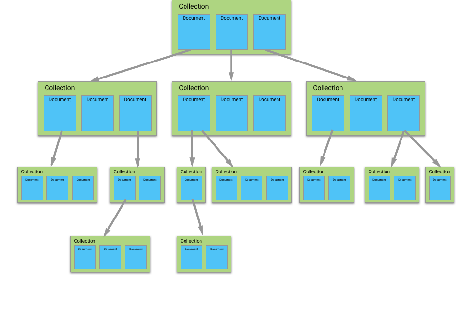
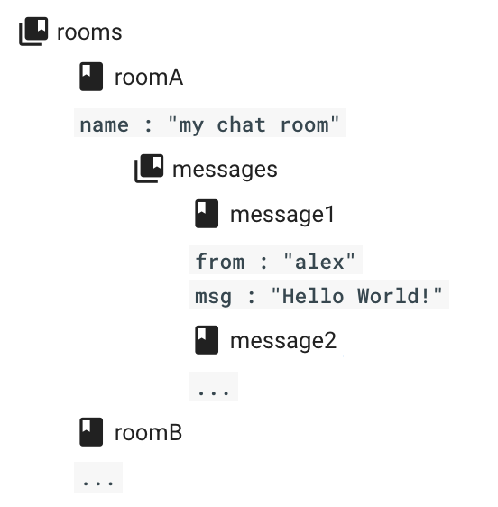

# Máster en Programación FullStack con JavaScript y Node.js
### JS, Node.js, Frontend, Backend, Firebase, Express, Patrones, HTML5_APIs, Asincronía, Websockets, Testing

## Clase 85

### Cloud Firestore


> Usa nuestra base de datos NoSQL flexible, escalable y en la nube a fin de almacenar y sincronizar datos para la programación en el lado del cliente y del servidor. [Cloud Firestore](https://firebase.google.com/docs/firestore/?utm_campaign=featureoverview_education_firestore_en_10-03-17&utm_source=Firebase&utm_medium=yt-desc)

**Estrategia de desarrollo**
- Integra los SDK de Cloud Firestore
- Protege los datos
- Agrega datos
- Obtén datos

**Recursos**
- [Guía](https://firebase.google.com/docs/firestore/?hl=es-419)
- [Introducing Cloud Firestore](https://www.youtube.com/watch?v=QcsAb2RR52c)
- [Getting Started With Cloud Firestore on the Web - Firecasts](https://www.youtube.com/watch?v=2Vf1D-rUMwE)
- [Survival guide: how to migrate from the Firebase Realtime Database to Cloud Firestore](https://medium.freecodecamp.org/rtdb-to-firestore-fd8da8149877)
- [What's the Difference Between Cloud Firestore & Firebase Realtime Database? #AskFirebase](https://www.youtube.com/watch?v=KeIx-mArUck)
- [What is FireStore and Real Time database Vs FireStore](https://www.youtube.com/watch?v=GMJu2aC4AhQ)
- [Primeros pasos con Cloud Firestore](https://firebase.google.com/docs/firestore/quickstart?hl=es-419)
- [yomete/firestore-demo](https://github.com/yomete/firestore-demo)
- [Google Cloud Firestore: Node.js Server SDK](https://cloud.google.com/nodejs/docs/reference/firestore/0.19.x/)
- [Cómo habilitar datos sin conexión](https://firebase.google.com/docs/firestore/manage-data/enable-offline)
- [Full Stack Vue.js with Firestore](https://medium.com/vue-mastery/full-stack-vue-js-with-firestore-62e2fe2ec1f3)


### Cloud Firestore: Claves


**Flexibilidad**
> El modelo de datos de Cloud Firestore admite estructuras de datos flexibles y jerárquicas. Almacena tus datos en documentos, organizados en colecciones. Los documentos pueden contener objetos anidados complejos, además de subcolecciones.

**Consultas expresivas**
> En Cloud Firestore, puedes usar consultas para recuperar documentos individuales específicos o para recuperar todos los documentos de una colección que coinciden con los parámetros de la consulta. Tus consultas pueden incluir varios filtros en cadena y combinar los filtros con criterios de orden. También se indexan de forma predeterminada, por lo que el rendimiento de las consultas es proporcional al tamaño de tu conjunto de resultados, no del conjunto de datos.

**Actualizaciones en tiempo real**
> Al igual que Realtime Database, Cloud Firestore usa la sincronización de datos para actualizar los datos de cualquier dispositivo conectado. Sin embargo, también está diseñado para ejecutar consultas de recuperación únicas y sencillas de manera eficiente.


**Asistencia sin conexión**
> Cloud Firestore almacena en caché datos que usa tu app de forma activa, por lo que la app puede escribir, leer, escuchar y consultar datos, aunque el dispositivo se encuentre sin conexión. Cuando el dispositivo vuelve a estar en línea, Cloud Firestore sincroniza todos los cambios locales de vuelta a Cloud Firestore.


**Diseñado para ajustarse a escala**
> Cloud Firestore te ofrece lo mejor de la poderosa infraestructura de Google Cloud Platform: replicación automática de datos multirregión, garantías de coherencia sólida, operaciones atómicas por lotes y asistencia real sobre transacciones. Diseñamos Cloud Firestore para controlar las cargas de trabajo de las bases de datos más complejas de las apps más grandes del mundo.


### Cloud Firestore: Los datos

**Terminología**


**Las colecciones**




### Cloud Firestore: Lo Básico para Browser

**Agrega Cloud Firestore al proyecto**

```html
<script src="https://www.gstatic.com/firebasejs/4.12.1/firebase.js"></script>
<script src="https://www.gstatic.com/firebasejs/4.12.1/firebase-firestore.js"></script>
```

**Inicializa Cloud Firestore**
```js
firebase.initializeApp({
  apiKey: '### FIREBASE API KEY ###',
  authDomain: '### FIREBASE AUTH DOMAIN ###',
  projectId: '### CLOUD FIRESTORE PROJECT ID ###'
});

// Initialize Cloud Firestore through Firebase
var db = firebase.firestore();
```

**Agrega datos**
```js
db.collection("users").add({
    first: "Ada",
    last: "Lovelace",
    born: 1815
})
.then(function(docRef) {
    console.log("Document written with ID: ", docRef.id);
})
.catch(function(error) {
    console.error("Error adding document: ", error);
});
```

**Lee datos**
```js
db.collection("users").get().then((querySnapshot) => {
    querySnapshot.forEach((doc) => {
        console.log(`${doc.id} => ${doc.data()}`);
    });
});
```


### Cloud Firestore: Lo Básico para Nodejs

**Agrega Cloud Firestore al proyecto**

```bash
npm install firebase@4.12.1 --save
```

```js
const firebase = require("firebase");
require("firebase/firestore"); // Required for side-effects
```


**Inicializar en Cloud Functions**
```js
const admin = require('firebase-admin');
const functions = require('firebase-functions');

admin.initializeApp(functions.config().firebase);

var db = admin.firestore();
```

**Inicializar en Google Cloud Platform**
```js
const admin = require('firebase-admin');

admin.initializeApp({
  credential: admin.credential.applicationDefault()
});

var db = admin.firestore();
```

**Inicializar en tu propio servidor**

- Necesario generar una clave privada nueva [`IAM y administración > Cuentas de servicio`](https://console.cloud.google.com/iam-admin/serviceaccounts)

```js
const admin = require('firebase-admin');

var serviceAccount = require('path/to/serviceAccountKey.json');

admin.initializeApp({
  credential: admin.credential.cert(serviceAccount)
});

var db = admin.firestore();
```

**Agrega datos**
```js
var docRef = db.collection('users').doc('alovelace');

var setAda = docRef.set({
  first: 'Ada',
  last: 'Lovelace',
  born: 1815
});
```

**Lee datos**
```js
db.collection('users').get()
    .then((snapshot) => {
      snapshot.forEach((doc) => {
        console.log(doc.id, '=>', doc.data());
      });
    })
    .catch((err) => {
      console.log('Error getting documents', err);
    });
```

### Cloud Firestore: Agregar y administrar datos

**Claves**
- Cada documento contiene un conjunto de pares clave-valor.
- Todos los documentos se deben almacenar en colecciones. 
- Los documentos pueden contener subcolecciones y objetos anidados, y ambos pueden incluir campos primitivos como strings o tipos de objetos complejos como listas.
- Las colecciones y los documentos se crean de manera implícita
- El tamaño máximo de un documento es 1 MB
- Las colecciones son como las tablas de SQL
- Los documentos son como las filas de una tabla de SQL
- Los objetos complejos anidados en un documento se llaman mapas.
- Cloud Firestore admite diversos tipos de datos para los valores: booleanos, números, strings, puntos geográficos, BLOB binarios y marcas de tiempo.Además, puedes usar arreglos u objetos anidados, llamados mapas, para estructurar datos dentro de un documento.
- Cuando se crea el primer documento de una colección, esta pasa a existir. Si borras todos los documentos de una colección, esta deja de existir.

**Referencias a colecciones**
```js
var usersCollectionRef = db.collection('users');
```

**Referencias a documentos**
```js
var alovelaceDocumentRef = db.collection('users').doc('alovelace');
var alovelaceDocumentRef = db.doc('users/alovelace');
```

**Datos jerárquicos (Subcolecciones)**



- Puedes anidar datos hasta 100 niveles de profundidad.
- Cuando borras un documento que tiene subcolecciones asociadas, las subcolecciones no se borran. Se puede seguir accediendo a ellas mediante una referencia


```js
var messageRef = db.collection('rooms').doc('roomA')
                .collection('messages').doc('message1');
```


**Estructuras de datos**
- [Datos anidados en documentos](https://firebase.google.com/docs/firestore/manage-data/structure-data) *Puedes anidar objetos complejos como matrices (mapas) dentro de los documentos.*
- [Subcolecciones](https://firebase.google.com/docs/firestore/manage-data/structure-data) *Puedes crear colecciones dentro de los documentos cuando tengas datos que podrían expandirse con el tiempo.*
- [Colecciones de nivel de raíz](https://firebase.google.com/docs/firestore/manage-data/structure-data) *Crea colecciones de nivel de raíz de tu base de datos para organizar los conjuntos de datos dispares.*


**[Tipos de datos](https://firebase.google.com/docs/firestore/manage-data/data-types)**
- `Matriz`. Ordenación por elementos y, si los elementos son iguales, por longitud de matriz `[1, 2, 3] < [1, 2, 3, 1] < [2].`
- `Booleano`
- `Bytes` Hasta 1,048,487 bytes (de 1 MiB a 89 bytes). Las consultas solo consideran los primeros 1,500 bytes.
- `Fecha y hora` La precisión máxima es de microsegundos; cualquier precisión adicional se redondea hacia abajo.
- `Número de coma flotante` Precisión doble de 64 bits, IEEE 754.
- `Punto geográfico` Por latitud, luego por longitud
- `Entero` 64 bits, firmado
- `Mapa` Representa un objeto incorporado en un documento.
- `Nulo`
- `Referencia` Por ejemplo `projects/[PROJECT_ID]/databases/[DATABASE_ID]/documents/[DOCUMENT_PATH]`
- `String de texto` Hasta 1,048,487 bytes (de 1 MiB a 89 bytes). Las consultas solo consideran los primeros 1,500 bytes de la representación UTF-8.

### Cloud Firestore: Agregar datos

**Claves**
- Cloud Firestore admite operaciones atómicas para la lectura y la escritura de datos. En un conjunto de operaciones atómicas, todas las operaciones se aplican de manera correcta o no se aplica ninguna de ellas.
- [Transacciones](https://firebase.google.com/docs/firestore/manage-data/transactions#transactions) *conjunto de operaciones de lectura y de escritura en uno o más documentos*
- [Escrituras en lotes](https://firebase.google.com/docs/firestore/manage-data/transactions#batched-writes) *conjunto de operaciones de escritura en uno o más documentos*
- Cada transacción o escritura en lote puede escribir en un máximo de 500 documentos.
- Cloud Firestore siempre almacena los números como dobles, independientemente del tipo de número que uses en tu código.

**`set()`** _Para crear o sobrescribir un solo documento_
```js
// Add a new document in collection "cities"
db.collection("cities").doc("LA").set({
    name: "Los Angeles",
    state: "CA",
    country: "USA"
})
.then(function() {
    console.log("Document successfully written!");
})
.catch(function(error) {
    console.error("Error writing document: ", error);
});
```

```js
/*
Si el documento no existe, se creará. 
Si el documento existe, su contenido se sobrescribirá con los datos proporcionados, 
a menos que especifiques que los datos se deberían combinar en el documento existente, 
de la siguiente manera:
*/
var cityRef = db.collection('cities').doc('BJ');

var setWithMerge = cityRef.set({
    capital: true
}, { merge: true });
```

**`add()`** _Es como `set()` pero no necesitas especificar el ID, que se genera automáticamente_
```js
const data = {
    name: "Tokyo",
    country: "Japan"
};

// con set()
db.collection("cities").doc("new-city-id").set(data);


// con add()
db.collection("cities").add(data)
.then(function(docRef) {
    console.log("Document written with ID: ", docRef.id);
})
.catch(function(error) {
    console.error("Error adding document: ", error);
});
```

**`update()`** _Actualiza algunos campos de un documento sin sobrescribir todo el documento_
```js
var washingtonRef = db.collection("cities").doc("DC");

// Set the "capital" field of the city 'DC'
return washingtonRef.update({
    capital: true
})
.then(function() {
    console.log("Document successfully updated!");
})
.catch(function(error) {
    // The document probably doesn't exist.
    console.error("Error updating document: ", error);
});
```


```js
/* 
-- Actualiza los campos en objetos anidados --
*/

// Create an initial document to update.
var frankDocRef = db.collection("users").doc("frank");
frankDocRef.set({
    name: "Frank",
    favorites: { food: "Pizza", color: "Blue", subject: "recess" },
    age: 12
});

// To update age and favorite color:
db.collection("users").doc("frank").update({
    "age": 13,
    "favorites.color": "Red"
})
.then(function() {
    console.log("Document successfully updated!");
});
```


```js
/* 
-- Actualiza el timestamp por consulta --
*/
var docRef = db.collection('objects').doc('some-id');

// Update the timestamp field with the value from the server
var updateTimestamp = docRef.update({
    timestamp: firebase.firestore.FieldValue.serverTimestamp()
});
```

### Cloud Firestore: Borrar Datos


**`delete()`** _Para borrar un documento_

```js
db.collection("cities").doc("DC").delete().then(function() {
    console.log("Document successfully deleted!");
}).catch(function(error) {
    console.error("Error removing document: ", error);
});
```

**`FieldValue.delete()`** _Para borrar campos específicos de un documento_
```js
var cityRef = db.collection('cities').doc('BJ');

// Remove the 'capital' field from the document
var removeCapital = cityRef.update({
    capital: firebase.firestore.FieldValue.delete()
});
```

**Borrar Colecciones**

> :warning: Para borrar por completo una colección o subcolección en Cloud Firestore, recupera todos los documentos de la colección o subcolección y bórralos. Si tienes colecciones más grandes, te recomendamos borrar los documentos en grupos pequeños para evitar errores de memoria insuficiente. Repite el proceso hasta que borres toda la colección o subcolección.

> :warning: Para borrar una colección, se debe coordinar una cantidad ilimitada de solicitudes de eliminación individuales. Si necesitas borrar colecciones completas, hazlo únicamente desde un entorno de servidor de confianza. Si bien es posible borrar una colección desde un cliente web o para dispositivos móviles, tiene efectos negativos en el rendimiento y en la seguridad.


### Cloud Firestore: Recuperar datos

**`get()`** _Recupera los datos_

```js
/*
-- cómo recuperar los contenidos de un documento --
*/
var docRef = db.collection("cities").doc("SF");

docRef.get().then(function(doc) {
    if (doc.exists) {
        console.log("Document data:", doc.data());
    } else {
        // doc.data() will be undefined in this case
        console.log("No such document!");
    }
}).catch(function(error) {
    console.log("Error getting document:", error);
});

/*
Si no hay un documento en la ubicación a la que hace referencia docRef, 
el document resultante estará vacío y si se llama a exists se mostrará false.
*/
```

```js
/*
-- Obtén todos los documentos de una colección --
*/
db.collection("cities").get().then(function(querySnapshot) {
    querySnapshot.forEach(function(doc) {
        // doc.data() is never undefined for query doc snapshots
        console.log(doc.id, " => ", doc.data());
    });
});
```

**`onSnapshot()`** _Mantenerse escuchando cambios_
```js
db.collection("cities").doc("SF")
    .onSnapshot(function(doc) {
        console.log("Current data: ", doc.data());
    });
```

```js
/*
-- Escucha varios documentos en una colección --
*/
db.collection("cities").where("state", "==", "CA")
    .onSnapshot(function(querySnapshot) {
        var cities = [];
        querySnapshot.forEach(function(doc) {
            cities.push(doc.data().name);
        });
        console.log("Current cities in CA: ", cities.join(", "));
    });
```

```js
/*
-- Desvincula un agente de escucha --
*/
var unsubscribe = db.collection("cities")
    .onSnapshot(function () {});
// ...
// Stop listening to changes
unsubscribe();
```


### Cloud Firestore: Queries y ordenación

**Limitaciones de las consultas**
- Consultas con filtros de rango en diferentes campos: `citiesRef.where("state", ">=", "CA").where("population", ">", 100000)`
- Consultas únicas que se ejecutan en varias colecciones o subcolecciones. Cada consulta se ejecuta en una sola colección de documentos [Doc: selección de una estructura de datos](https://firebase.google.com/docs/firestore/manage-data/structure-data)
- Consultas de miembros individuales de un arreglo. [Doc: Cómo trabajar con arreglos, listas y conjuntos.](https://firebase.google.com/docs/firestore/solutions/arrays)
- Consultas con el operador lógico OR. En este caso, deberías crear una consulta independiente para cada condición de `OR` y combinar los resultados de la consulta en tu app.
- Consultas con una cláusula `!=`. La solución para `where("age", "!=", "30")` es `where("age", ">", 30)` y `where("age", "<", "30")` 
- Filtro de rango y primer orderBy en campos distintos `citiesRef.where("population", ">", 100000).orderBy("country")`

**`where()`** _hacer una consulta que busque todos los documentos que cumplan una condición determinada_

- Usa tres parámetros: un campo para filtrar, una operación de comparación y un valor.
- La comparación puede ser `<`, `<=`, `==`, `>` o `>=`

```js
db.collection("cities").where("capital", "==", true)
    .get()
    .then(function(querySnapshot) {
        querySnapshot.forEach(function(doc) {
            // doc.data() is never undefined for query doc snapshots
            console.log(doc.id, " => ", doc.data());
        });
    })
    .catch(function(error) {
        console.log("Error getting documents: ", error);
    });
```

```js
citiesRef.where("state", "==", "CA")
citiesRef.where("population", "<", 100000)
citiesRef.where("name", ">=", "San Francisco")
```

**`orderBy()`** _Define el orden en el que se presentan los datos_
```js
/*
-- ordenar por estado y, dentro de cada estado, por población de manera descendente --
*/
citiesRef.orderBy("state").orderBy("population", "desc")
```


**`limit()`** _limita la cantidad de documentos que se recuperan._
```js
//las últimas 3 ciudades en orden ascendente
citiesRef.orderBy("name").limit(3)

//las últimas 3 ciudades en orden descendente
citiesRef.orderBy("name", "desc").limit(3) 
```

**:muscle: Combinación**
```js
citiesRef.where("population", ">", 100000).orderBy("population").limit(2)
```

### Cloud Firestore: Paginación

**Claves**
- Usar `startAt()` o `startAfter()` para definir el punto de inicio de una consulta
- El método `startAfter()` lo excluye

**Ejemplo simple**
```js
var first = db.collection("cities")
        .orderBy("population")
        .limit(25);

return first.get().then(function (documentSnapshots) {
  // Get the last visible document
  var lastVisible = documentSnapshots.docs[documentSnapshots.docs.length-1];
  console.log("last", lastVisible);

  // Construct a new query starting at this document,
  // get the next 25 cities.
  var next = db.collection("cities")
          .orderBy("population")
          .startAfter(lastVisible)
          .limit(25);
});
```


### Cloud Firestore: Índices

> Los índices son un factor importante del rendimiento de las bases de datos. Al igual que el índice de un libro que indica en qué página se encuentra cada tema, el índice de una base de datos se encarga de ordenar todos los elementos en su ubicación respectiva. Cuando envías una consulta a una base de datos, esta puede usar el índice para buscar rápidamente los elementos que solicitaste

**Claves**
- Existen dos tipos de índices: los [de campo único](https://firebase.google.com/docs/firestore/query-data/index-overview#single-field_indexes) y los [compuestos](https://firebase.google.com/docs/firestore/query-data/index-overview#composite_indexes).
- Crea automáticamente los índices necesarios para las consultas más básicas.
-  A medida que usas y pruebas tu app, Cloud Firestore te ayudará a identificar y [crear los índices adicionales](https://firebase.google.com/docs/firestore/query-data/indexing) necesarios.


### Cloud Firestore: Otros
- [Cuotas y límites](https://firebase.google.com/docs/firestore/quotas)
- [¿Cómo es la facturación de Cloud Firestore?](https://firebase.google.com/docs/firestore/pricing)
- [Cálculos de tamaño de almacenamiento](https://firebase.google.com/docs/firestore/storage-size)
- [Ubicaciones de la base de datos en Cloud Firestore](https://firebase.google.com/docs/firestore/locations)
- [Cómo comenzar con las reglas de seguridad de Cloud Firestore](https://firebase.google.com/docs/firestore/security/get-started)
- [Structuring Security Rules](https://firebase.google.com/docs/firestore/security/rules-structure)
- [Condiciones de escritura de reglas de seguridad](https://firebase.google.com/docs/firestore/security/rules-conditions)
- [Habilitar datos sin conexión](https://firebase.google.com/docs/firestore/manage-data/enable-offline)
- [Extender Cloud Firestore con Cloud Functions](https://firebase.google.com/docs/firestore/extend-with-functions)


**Importante**
- [Cómo elegir tu base de datos: Cloud Firestore o Realtime Database](https://firebase.google.com/docs/firestore/rtdb-vs-firestore)
- [Usa Cloud Firestore con Firebase Realtime Database](https://firebase.google.com/docs/firestore/firestore-for-rtdb)


**Ejemplo**

[Friendly Eats](https://firebase.google.com/docs/firestore/client/samples-web)
> Esta app de ejemplo demuestra la compilación de un servicio simple de recomendación de restaurantes con Cloud Firestore. Permite demostrar funciones como las consultas compuestas, las transacciones del cliente, las subcolecciones y la persistencia sin conexión.

### Ejercicios

**1 -** Ejercicio de server render con MovieFire (Firestore)
```js
// Tu solución
```

**2 -** Ejercicio de APIRest con MovieFire (Firestore)
```js
// Tu solución
```