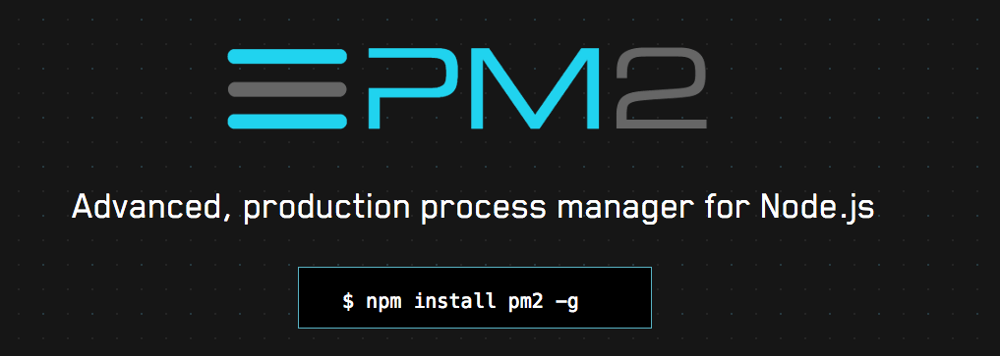

# Máster en Programación FullStack con JavaScript y Node.js
### JS, Node.js, Frontend, Backend, Firebase, Express, Patrones, HTML5_APIs, Asincronía, Websockets, Testing

## Clase 88


### node-inspector 

**Características** 
- Instalación global.
- Utilizar `debugger;` para lanzar las herrameintas de depuración del navegador.
```
node-debug server.js
```

### nodemon


**Características** 
- [Documentación](https://github.com/remy/nodemon#nodemon)
- Relanza la aplicación por cada cambio que realizemos
```
npm install -g nodemon
```  
```
nodemon server.js
```

### forever

**Características** 
- Relanza la aplicación cuando deja de funcionar
- Opciones adiccionales
- Muy popular
- [Docuemntación](https://github.com/foreverjs/forever)
```
forever start/stop server.js
```

### PM2



**Características**
- Pensada para producción
- Muchas opciones de configuración
- Monitorización activa de muchos detalles clave de la aplicación
- [Documentación](http://pm2.keymetrics.io/)

### Super Features


### PM2: Comandos

**Arrancar**
```
pm2 start/stop server.js
```

**Parar un proceso**
```
pm2 stop app
```

**Lanzar el proceso de nuevo**
```
pm2 start app
```

**Listar procesos**
```
pm2 ls
```

**Borrar un proceso**
```
pm2 delete app
```

**Arrancar otros Lenguajes**
```
pm2 start echo.py
```

**Reinciar procesos**
```
pm2 restart app
```

**Monitorizar**
```
pm2 monit
```

**Mostrar todos los logs**
```
pm2 logs
```

**Borrar logs**
```
pm2 flush
```

### PM2: Avanzado

- [Load-Balancing (cluster mode)](https://pm2.io/doc/en/runtime/guide/load-balancing/)
- [Environment Variables in Node.js](https://pm2.io/doc/en/runtime/best-practices/environment-variables/)
- [Add PM2 as a module](https://pm2.io/doc/en/runtime/integration/elastic-beanstalk/#add-pm2-as-a-module)
- [Using PM2 with Docker](https://pm2.io/doc/en/runtime/integration/docker/)
- [CLI reference](https://pm2.io/doc/en/runtime/reference/pm2-cli/)
- [Programmatic](https://pm2.io/doc/en/runtime/reference/pm2-programmatic/)
- [PM2 Plus](https://pm2.io/doc/en/plus/quick-start/)


### dotenv


> Dotenv is a zero-dependency module that loads environment variables from a .env file into process.env. Storing configuration in the environment separate from code is based on The Twelve-Factor App methodology.

**Instalación**
```bash
npm install dotenv
```

**Uso en ficheros, es necesario inicializar lo antes posible**
```js
require('dotenv').config()

const db = require('db')
db.connect({
  host: process.env.DB_HOST,
  username: process.env.DB_USER,
  password: process.env.DB_PASS
})
```

**Fichero `.env` en la raiz**
```bash
DB_HOST=localhost
DB_USER=root
DB_PASS=s1mpl3
```


### Gestión de versiones
- [tj/n](https://github.com/tj/n) *Node.js version management*
- [creationix/nvm](https://github.com/creationix/nvm) *Node Version Manager - Simple bash script to manage multiple active node.js versions*

