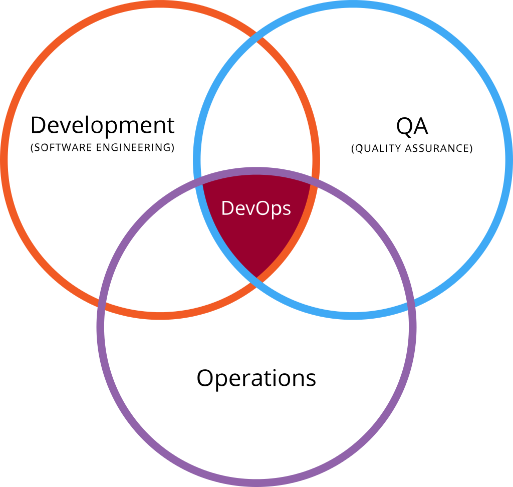
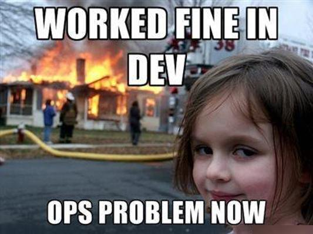
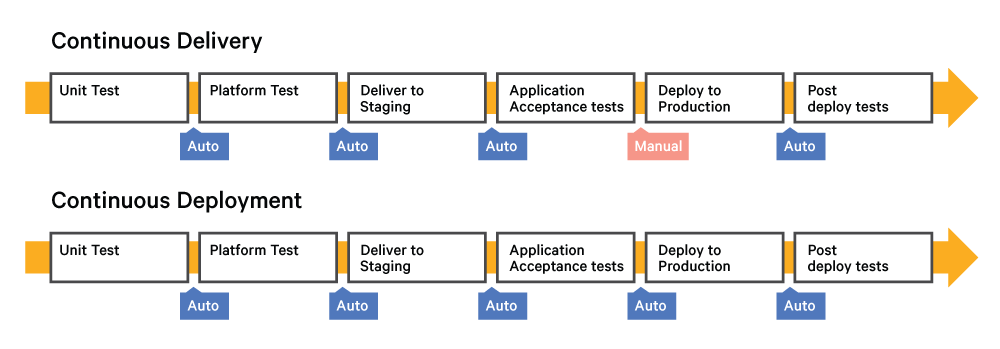
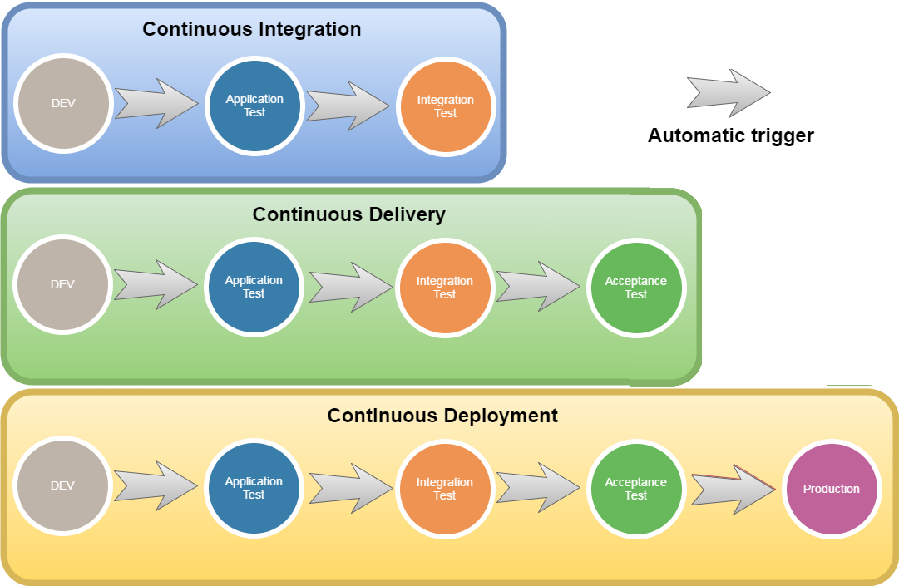
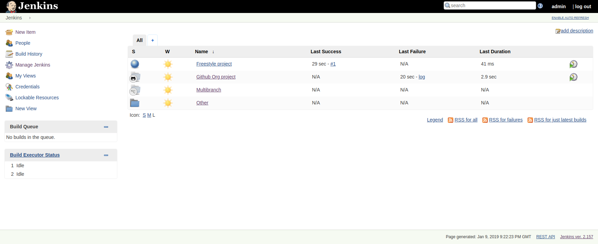
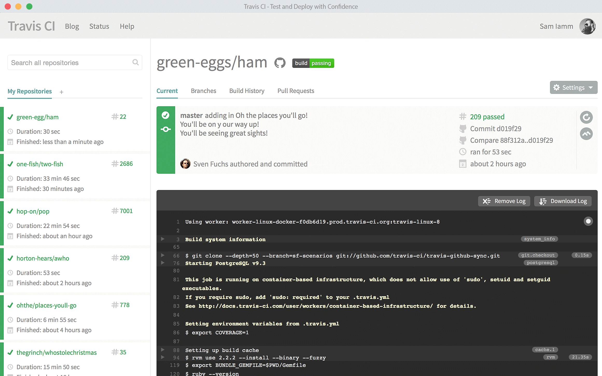
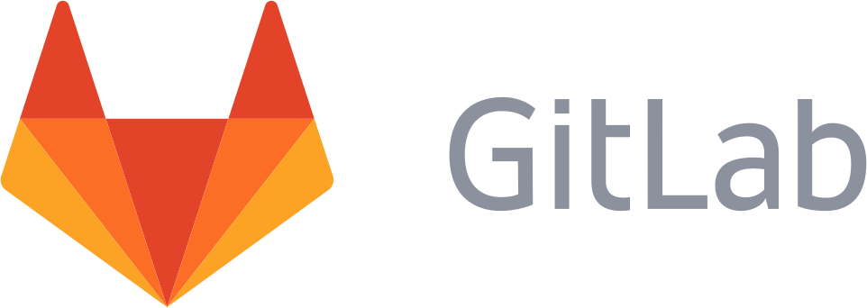
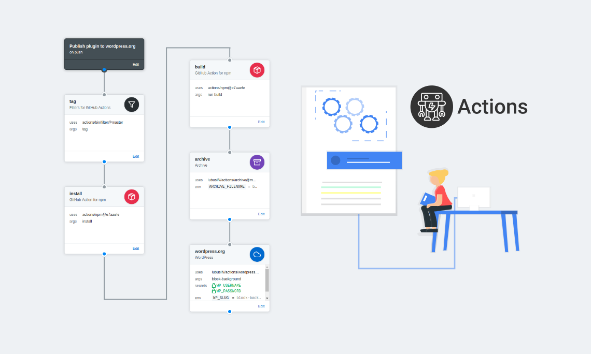

# Máster en Programación FullStack con JavaScript y Node.js
### JS, Node.js, Frontend, Backend, Firebase, Express, Patrones, HTML5_APIs, Asincronía, Websockets, Testing

## Clase 94

### DevOps

> DevOps (acrónimo inglés de development -desarrollo- y operations -operaciones-) es una práctica de ingeniería de software que tiene como objetivo unificar el desarrollo de software (Dev) y la operación del software (Ops). La principal característica del movimiento DevOps es defender enérgicamente la automatización y el monitoreo en todos los pasos de la construcción del software, desde la integración, las pruebas, la liberación hasta la implementación y la administración de la infraestructura. DevOps apunta a ciclos de desarrollo más cortos, mayor frecuencia de implementación, lanzamientos más confiables, en estrecha alineación con los objetivos comerciales. [Wikipedia](https://es.wikipedia.org/wiki/DevOps)

**Recursos**
- [Wikipedia | DevOps](https://es.wikipedia.org/wiki/DevOps)
- [Paradigma | Qué es DevOps (y sobre todo qué no es DevOps)](https://www.paradigmadigital.com/techbiz/que-es-devops-y-sobre-todo-que-no-es-devops/)
- [Vayamos al grano, ¿qué es eso de DevOps?](http://www.javiergarzas.com/2014/12/devops-en-10-min.html)
- [DevOps: cómo romper la barrera entre Desarrollo y Operaciones](https://es.atlassian.com/devops)

### DevOps: La unión

### DevOps: Fundamentos y herramientas

- **Código:** _desarrollo y revisión de código, herramientas de administración de código fuente, fusión de código_
- **Construcción:** _herramientas de integración continua, estado de compilación_
- **Prueba:** _herramientas de prueba continuas que brindan retroalimentación sobre los riesgos comerciales_
- **Paquete:** _repositorio de artefactos, distribución previa a la implementación de la aplicación_
- **Lanzamiento:** _gestión de cambios, aprobaciones de versiones, automatización de versiones_
- **Configurar:** _configuración y gestión de la infraestructura, Infraestructura como código_
- **Monitor:** _monitoreo del rendimiento de las aplicaciones, experiencia del usuario final_

### continuous integration CI (integración continua)

> La integración continua (continuous integration en inglés) es un modelo informático propuesto inicialmente por Martin Fowler que consiste en hacer integraciones automáticas de un proyecto lo más a menudo posible para así poder detectar fallos cuanto antes. Entendemos por integración la compilación y ejecución de pruebas de todo un proyecto.
> 
> El proceso suele ser: cada cierto tiempo (horas), descargarse las fuentes desde el control de versiones (por ejemplo CVS, Git, Subversion, Mercurial o Microsoft Visual SourceSafe) compilarlo, ejecutar pruebas y generar informes.
> [Wikipedia](https://es.wikipedia.org/wiki/Integraci%C3%B3n_continua)

**¿Cómo funciona?**

**Ventajas**

- Todo se hace de forma continua.
- Se acaba el drama del deploy
- Disponemos de un entorno de pruebas
- Todo se testea constantemente
- La calidad del proyecto siempre es una prioridad

**Recursos**
- [Wikipedia | Integración continua](https://es.wikipedia.org/wiki/Integraci%C3%B3n_continua)
- [Github | ligurio/awesome-ci](https://github.com/ligurio/awesome-ci)
- [AWS | ¿Qué es la integración continua?](https://aws.amazon.com/es/devops/continuous-integration/)
- [Aprende a implantar integración continua desde cero (I): ¿Por qué integración continua?](https://www.javiergarzas.com/2014/08/implantar-integracion-continua.html)
- [Evita hacer el trabajo que una máquina puede hacer por ti. ¡Automatiza el desarrollo de software!](https://blog.pandorafms.org/es/integracion-continua/)
- [Que es la integración continua y por que debrías usarla](https://medium.com/@ajamaica/que-es-la-integraci%C3%B3n-continua-y-por-que-debr%C3%ADas-usarla-aea591f2a7d9)

### CD - Continuous delivery (Entrega continua (EC))

> Entrega continua (EC) es un enfoque de la ingeniería del software en que los equipos de desarrollo producen software en ciclos cortos, asegurando que el software puede ser liberado en cualquier momento, de forma confiable. Apunta a la construcción, prueba, y liberación del software de forma más rápida y más frecuente. Este enfoque ayuda en la reducción del costo, tiempo, y riesgo de la liberación de versiones a través de la liberación de versiones más incrementales a aplicaciones en producción. Un proceso directo y repetible de liberación es importante para una entrega continua. [Wikipedia](https://es.wikipedia.org/wiki/Entrega_continua)

**Etapas**
- Automatización de la compilación e integración continua
- Automatización de pruebas
- Automatización de implementación

**Ventajas**
- Automatización de publicación de software
- Mayor independencia y productividad
- EReducción de bugs y mejoras para la detección de fallas
- Actualizaciones más frecuentes

**Ciclo**

**Continuous Delivery vs Continuous Deployment**

**Recursos**
- [Wikipedia](https://es.wikipedia.org/wiki/Entrega_continua)
- [AWS | ¿Qué es la entrega continua?](https://aws.amazon.com/es/devops/continuous-delivery/)
- [continuousdelivery.com](https://continuousdelivery.com/)
- [¿DevOps? ¿Continuous Delivery? ¿Continuous Deployment? ¿Integración Continua? Aclarando términos](http://www.javiergarzas.com/2016/01/devops-continuous-delivery-continuous-deployment-integracion-continua-aclarando-terminos.html)
- [Atlassian | Continuous integration vs. continuous delivery vs. continuous deployment](https://www.atlassian.com/continuous-delivery/ci-vs-ci-vs-cd)
- [Atlassian | Entrega continua](https://es.atlassian.com/continuous-delivery)
- [CI/CD with Less Fluff & More Awesome](https://medium.com/donna-legal/ci-cd-with-less-fluff-more-awesome-28af61288a03)
- [Github | ciandcd/awesome-ciandcd](https://github.com/ciandcd/awesome-ciandcd)
- [Continuous Delivery + DevOps = Awesome](https://es.slideshare.net/nicolefv/nf-final-agileindia2016)

### En resumen

### Herramientas: Jenkins

> Jenkins es un servidor de automatización open source escrito en Java. Está basado en el proyecto Hudson y es, dependiendo de la visión, un fork del proyecto o simplemente un cambio de nombre.
> 
> Jenkins ayuda en la automatización de parte del proceso de desarrollo de software mediante integración continua y facilita ciertos aspectos de la entrega continua. Soporta herramientas de control de versiones como CVS, Subversion, Git, Mercurial, Perforce y Clearcase y puede ejecutar proyectos basados en Apache Ant y Apache Maven, así como scripts de shell y programas batch de Windows. El desarrollador principal es Kohsuke Kawaguchi. Publicado bajo licencia MIT, Jenkins es software libre.
> [Wikipedia](https://es.wikipedia.org/wiki/Jenkins)

**Captura**

**Recursos**
- [Wikipedia | Jenkins](https://es.wikipedia.org/wiki/Jenkins)
- [Web oficial](https://jenkins.io/)
- [Jenkins | Doc](https://jenkins.io/doc/)
- [Jenkins | Plugins](https://plugins.jenkins.io/)
- [Jenkins | Community](https://jenkins.io/participate/)
- [Jenkins | Blog](https://jenkins.io/node/)
- [¿Qué es Jenkins? Explicado en menos de 10 min para quienes no lo conocen de nada](https://www.javiergarzas.com/2014/05/jenkins-en-menos-de-10-min.html)
- [Github | jenkinsci/jenkins](https://github.com/jenkinsci/jenkins)

### Herramientas: Travis

**Captura**

**Recursos**
- [Travis Web site](https://travis-ci.org/)
- [Travis | Pricing](https://travis-ci.com/plans)
- [Travis | Blog](https://blog.travis-ci.com/)
- [Travis | Docs](https://docs.travis-ci.com/)
- [Idera acquires Travis CI](https://techcrunch.com/2019/01/23/idera-acquires-travis-ci/?guccounter=1&guce_referrer_us=aHR0cHM6Ly93d3cuZ29vZ2xlLmVzLw&guce_referrer_cs=7Sk-cPOKvOG-q4Z4XKl84A)
- [Travis CI, sistema distribuido de integración continua libre integrado con Github](https://www.genbeta.com/desarrollo/travis-ci-sistema-distribuido-de-integracion-continua-libre-integrado-con-github)
- [Travis CI: La “Integración Continua” de forma simple](https://gnumanager.wordpress.com/2016/03/17/travis-ci/)

### Herramientas: Gitlab CI

**Captura**

**Pipeline**

**Recursos**
- [Web site oficial](https://about.gitlab.com/product/continuous-integration/)
- [Getting started with GitLab CI/CD](https://docs.gitlab.com/ee/ci/quick_start/)
- [GitLab Continuous Integration (GitLab CI/CD)](https://docs.gitlab.com/ee/ci/)
- [Primeros pasos con GitLab CI](https://www.adictosaltrabajo.com/2018/04/10/primeros-pasos-con-gitlab-ci/)
- [Demo: CI/CD with GitLab](https://www.youtube.com/watch?v=1iXFbchozdY)
- [Using GitLab CI/CD pipelines with GitHub repositories](https://www.youtube.com/watch?v=qgl3F2j-1cI)
- [How To Set Up Continuous Integration Pipelines with GitLab CI on Ubuntu 16.04](https://www.digitalocean.com/community/tutorials/how-to-set-up-continuous-integration-pipelines-with-gitlab-ci-on-ubuntu-16-04)
- [Beginner-Friendly Introduction to GitLab CI/CD](https://dev.to/zurihunter/beginner-friendly-introduction-to-gitlabcicd-4p5a)

### Herramientas: Netlify

**Recursos**
- [Web oficial](https://www.netlify.com/)
- [Netlify | Features](https://www.netlify.com/features/)
- [Netlify | Pricing](https://www.netlify.com/pricing/)
- [Netlify | Docs](https://www.netlify.com/docs/)
- [Netlify | Blog](https://www.netlify.com/blog/)
- [Más allá del área local con Netlify](https://octuweb.com/mas-alla-del-area-local-con-netlify/)
- [Github | netlify](https://github.com/netlify)
- [Hugo | Host on Netlify](https://gohugo.io/hosting-and-deployment/hosting-on-netlify/)
- [Gatsby | Hosting on Netlify](https://www.gatsbyjs.org/docs/hosting-on-netlify/)
- [netlifycms](https://www.netlifycms.org/docs/intro/)
- [Wikipedia | Netlify](https://en.wikipedia.org/wiki/Netlify)
- [The Beginner’s Guide to Netlify Continuous Deployment from Github for React Apps](https://hackernoon.com/netlify-continuous-deployment-github-react-lambdaschool-67f3ae658d31)
- [Gridsome | Deploy to Netlify](https://gridsome.org/docs/deploy-to-netlify/)
- [Zapier | Netlify Integrations](https://zapier.com/apps/netlify/integrations)

### Herramientas: Github Actions!

**Concepto**

**Recursos**
- [About GitHub Actions](https://help.github.com/en/articles/about-github-actions)
- [Github | sdras/awesome-actions](https://github.com/sdras/awesome-actions)
- [Github | GitHub Actions (ORG)](https://github.com/actions)
- [GitHub Actions: built by you, run by us](https://github.blog/2018-10-17-action-demos/)
- [CSS-tricks | Introducing GitHub Actions](https://css-tricks.com/introducing-github-actions/)
- [Github | Creating a new GitHub Action](https://developer.github.com/actions/creating-github-actions/creating-a-new-action/)

### Otras Herramientas

- [WeDeploy](https://wedeploy.com/)
- [CircleCI](https://circleci.com/)
- [Codeship](https://codeship.com/)