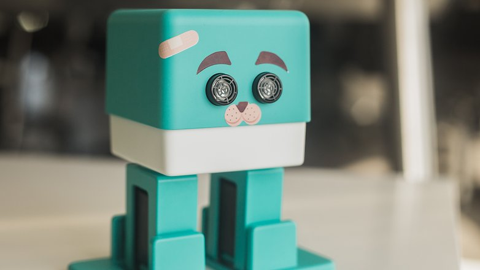
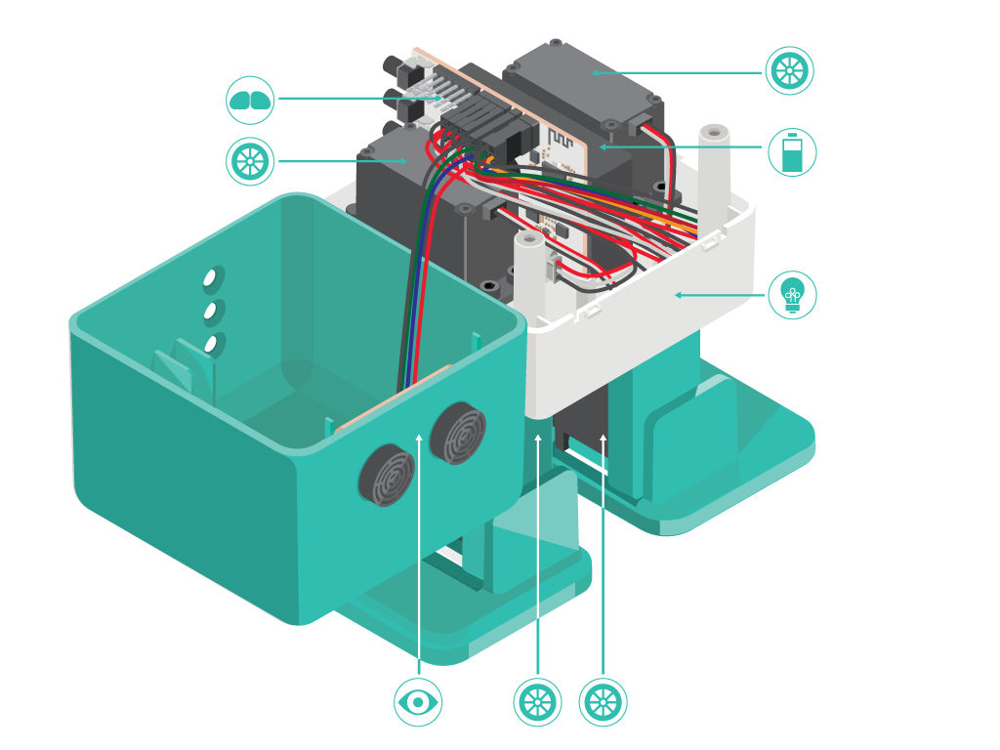
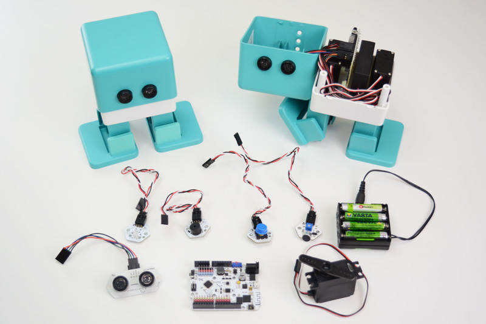
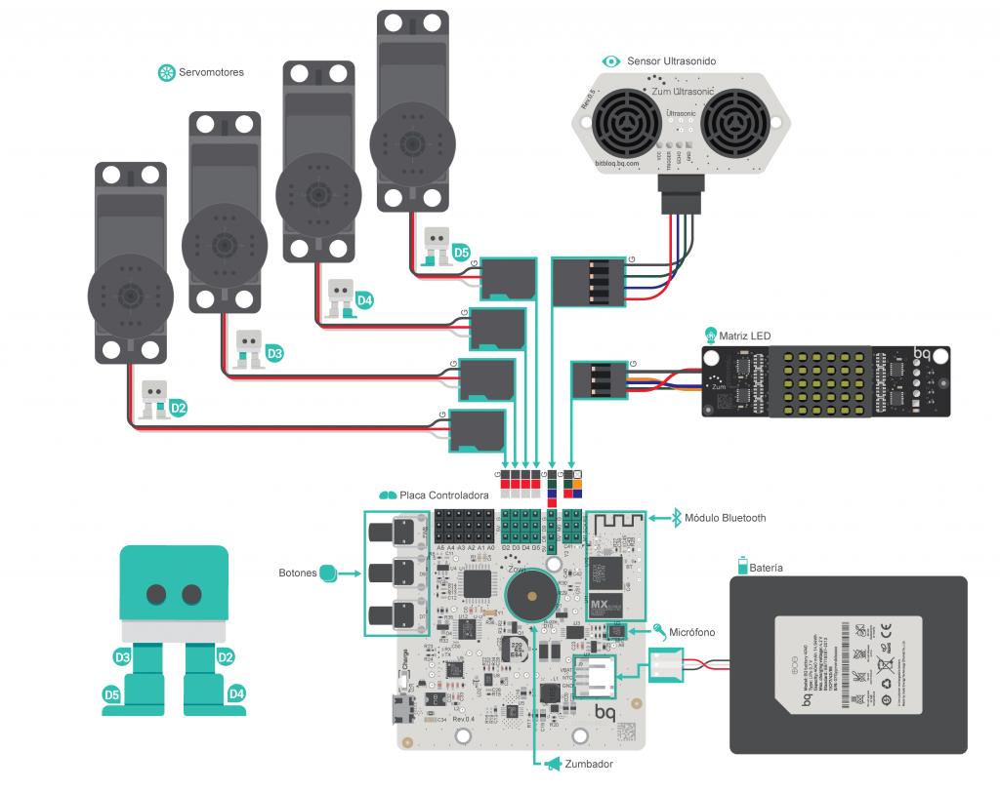

# Máster en Programación FullStack con JavaScript y Node.js
### JS, Node.js, Frontend, Backend, Firebase, Express, Patrones, HTML5_APIs, Asincronía, Websockets, Testing

## Coding Saturday!

### Zowi

**Componentes**

**Hardware**

**Electrónica**

**Recursos**
- [Youtube | Conoce a Zowi, el robot de Clan](https://www.youtube.com/watch?v=CbLtYJfmbLY)
- [Youtube | This robot can dance like Michael Jackson, and we can't stop watching](https://www.youtube.com/watch?v=W0rwOPqyjmk)
- [Youtube | Zowi bailando iGhostbusters!](https://www.youtube.com/watch?v=Ljv3kXbDUAE)
- [Zowi | Web oficial](http://zowi.bq.com/)
- [Zowi | Padres y Profesores](http://zowi.bq.com/es/padres-profesores/)
- [Zowi | Hospital](http://zowi.bq.com/es/hospital-robots/)
- [Zowi | Descargables](http://zowi.bq.com/es/category/descargables/)
- [Zowi | Aprende a programar](http://zowi.bq.com/es/category/bitbloq/)
- [Zowi | Proyectos](http://zowi.bq.com/es/category/proyectos/)
- [DIWO | Zowi](http://diwo.bq.com/product/zowi/)
- [Diwo | Zowi, introducción a los robots bípedos](http://diwo.bq.com/zowi-introduccion-a-los-robots-bipedos/)

### Reto: ¡Hagamos Zowiki¡

**Objetvos**
- Controlar Zowi desde Nodejs
- Tengamos una interfaz web en realtime!
- Montemos una API para controlar cosas
- Mucha ingeniría inversa (Python, C++, Arduino, etc...)

**Recursos**
- [Zowi Telegram](http://diwo.bq.com/zowi-telegram-bot/)
- [Zowi Telegram | ZowiBot.zip](http://diwo.bq.com/wp-content/uploads/2016/01/ZowiBot.zip)
- [Zowi | Firmware: ZOWI_BASE_v2.ino](https://github.com/bq/zowiLibs/blob/master/code%20.ino/ZOWI_BASE_v2/ZOWI_BASE_v2.ino)
- [Ulises Gascon | Beyond Arduino](https://cyber-nomads.slides.com/ulisesgascon/beyond-arduino-osw#/)